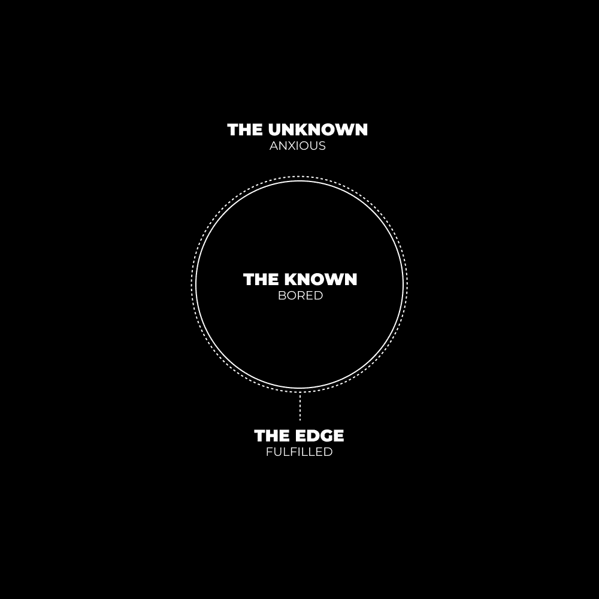
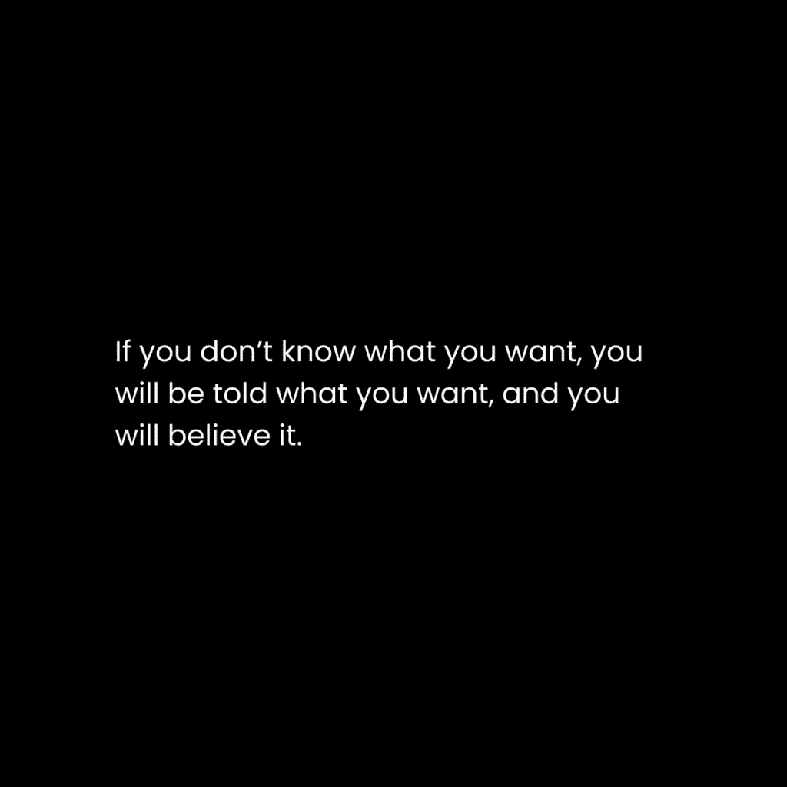
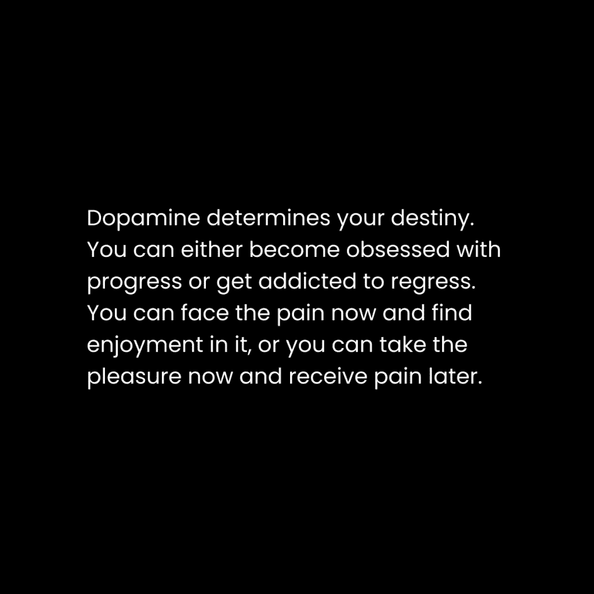

# 如何在7天内重置你的生活：概述与核心概念

在本节课中，我们将学习如何通过一个为期七天的系统性过程，重置你的生活状态，摆脱迷茫和低效，重新找回专注、清晰和前进的动力。我们将从理解大脑运作的比喻开始，逐步介绍具体的行动步骤。

## 你的大脑是一台运行生命游戏的超级计算机

我想让你把你的大脑想象成一台超级计算机。你处理信息的能力取决于多个因素，但其中最关键的是你的“随机存取存储器”，即你的专注力。

人类每秒可以处理10-50比特的信息。一生中总共能处理约1250亿比特信息。这可以被视为你的**生活潜力**。

大多数人同时运行多个高需求的“程序”，这些程序正在消耗他们有限的创造性能量。例如：

*   关于过去错误的思考
*   关于未来压力的思考
*   逃避现实的欲望
*   打破习惯的内在冲动
*   混杂的待办任务清单
*   未完成的“开放循环”

这个列表可以一直列下去。现代人的注意力默认是分散的。我们不是活在当下，专注于对未来的愿景，而是生活在由分散的注意力创造的虚假现实中，这导致了压力和混乱。

单一的关注力创造清晰。分散的关注力创造紧张。紧张让压力悄悄溜进来。**压力是创造力的敌人**。

### 如何赢得生活游戏

上一节我们介绍了大脑的“内存”概念，本节中我们来看看如何优化它，以赢得“生活游戏”。

让我们继续使用计算机的比喻。你的大脑是现实的消化系统。

*   如果你“摄入”过多信息，你会感到焦虑。
*   如果你“摄入”过少信息，你会感到无聊。

为了最大化生活享受，你需要最大化处于“心流”边缘状态的时间。你通过尽可能多的经历中找到**乐趣**（而非短暂的快乐）来赢得生活游戏。你的经历就是当下。

“赢得”生活游戏不是一个结果，而是一个过程。你要么现在就赢了，要么你通过逃离当下而输掉了。

这类似于健身。促进肌肉生长的最佳营养摄入量略高于维持量。吃得太多会困倦，吃得太少则没有能量。

在心智建设过程中，你必须同时学习和创造。通过日常实践消化你的经验。如果你不知道下一步该去哪里，那是因为你没有接触到在未知中充当指引的信息。

在生活中，你必须进入未知领域来滋养你的心智。这个过程遵循一个循环：

1.  **好奇心**：暴露自己于新信息和经验中。
2.  **热情**：用这些信息创造有价值的东西来消化它们。
3.  **精通**：当这种经验成为你的一部分时，通过实践来扩展你的思维。
4.  **联系**：通过将这种价值传承给他人来超越那个生活阶段。

**这就是美好生活的秘诀：** 通过追求自我生成的目标，获得经验，创造、扩展并超越。

### 创造你自己的游戏（或现实）

每个人都玩过一款能让他们完全沉浸其中的游戏。他们进入了心流状态，忘记了时间。

当你开始一款游戏时，会有一个教程阶段，介绍规则、目标和所需技能。游戏是一个目标层级：如何获胜，如何达成每个子目标，以及如何提升角色。

随着你进步，你必须学习、失败、练习、变得更好。在生活中，情况没有不同。

因此，要沉浸于自己的生活游戏中，你必须首先**创造它**。

## 如何在7天内重置你的生活：2：七日重置行动指南

上一节我们探讨了“生活游戏”的核心理念，本节中我们将具体介绍一个为期七天的重置过程。这个过程适用于当生活变得混乱，例行公事崩溃，你感到迷失方向的时候。

以下是你在7天内重置生活的具体步骤：

### 第一步：注意你的感受

首先，你需要建立清晰的自我认知。拿出笔记本，花10分钟具体写下：

*   你每天都在做什么。
*   你在早晨、下午和晚上的感受。

这个练习对于识别那些无意识消耗你时间和能量的“寄生虫”至关重要。

### 第二步：明确你想要什么

你无法绝对确定未来，但可以为自己设定方向。避免错误本身可能就是一个错误，因为错误是你在黑暗中的光明。

从一个“最小可行愿景”开始。具体化并写下：

*   你希望你的生活是什么样子？
*   你希望你的思想是什么样子？
*   你希望你的身体是什么样子？

然后，将这个愿景分解为年度和月度目标。目标不是为了成就，而是为了清晰。它们是你学习技能和抓住机会的筛选器。你的日常体验必须通过你的愿景来感知，就像你在玩一个试图赢得的游戏。

### 第三步：优先排序，去除干扰，并重构日程

你没有得到预期结果的原因通常是：时间紧迫、能量不足，或者你停止了那些能带来结果的事情。

回顾你写下的日常活动，问自己：你能改变什么？

*   **优先排序**：优先处理那些能直接带来结果的事情。
*   **去除干扰**：剔除那些悄悄潜入你日程且不配占据时间的事情。
*   **重构日程**：重新组织具体的任务和义务，以腾出更多时间。

将你混乱的思维结构写在纸上，并重新组织它。

### 第四步：建立美好生活的基石习惯

现在你有了方向（目标）和认识到阻碍（反目标）。接下来，你需要培养两个核心习惯来弥合差距：

1.  **学习**：每天花30分钟为你的技能和知识获取新信息。
2.  **创造**：每天花30分钟，围绕你的愿景构建一个项目，消化信息并锻炼“心理肌肉”。

这两种活动都能产生高价值的“多巴胺”。从每天总共1小时开始，最好安排在早晨干扰最小的时候。如果无法做到，请回到第三步，重新理清你的优先级。

### 第五步：制定一周计划

你之所以陷入混乱，是因为“熵”——系统倾向于无序。如果不主动整理，你的生活和思维会变得混乱，并可能养成坏习惯。

通过明确性来对抗熵。花10分钟，写下接下来一周你要做的每一件事。这包括：

*   你的早晨例行公事
*   你的专注工作时间块
*   其他任务和会议
*   你的晚间例行公事

最困难的部分不是执行计划，而是在面对可能威胁旧习惯的负面想法时保持专注。正念是你新计划的朋友。

你需要不断尝试和调整。如果例行公事不顺畅，就回到笔记本，写下第二天要做什么。这就是为你生活创建系统的方法：规划、执行、识别问题、尝试解决方案、重复，直到接近你理想的未来。

如果你将这种“心理整理”变成常规实践，它会变得越来越高效。不知不觉中，新技能将变得自然而然，你会对自己的进步感到惊讶。

## 总结

本节课中，我们一起学习了如何通过一个七天的系统过程来重置生活。我们从理解大脑像一台需要管理的超级计算机开始，引入了“生活游戏”和“生活潜力”的概念。核心在于通过**好奇心、热情、精通、联系**的循环来创造和赢得自己的游戏。

具体的重置步骤包括：**觉察感受、明确愿景、优先排序、建立学习与创造的习惯，以及制定周计划并坚持迭代**。这个过程的关键不是追求完美，而是通过持续的自我观察、清晰的目标设定和系统化的行动，从混乱中重建秩序，重新掌握生活的主动权，并朝着自己定义的“美好生活”稳步前进。