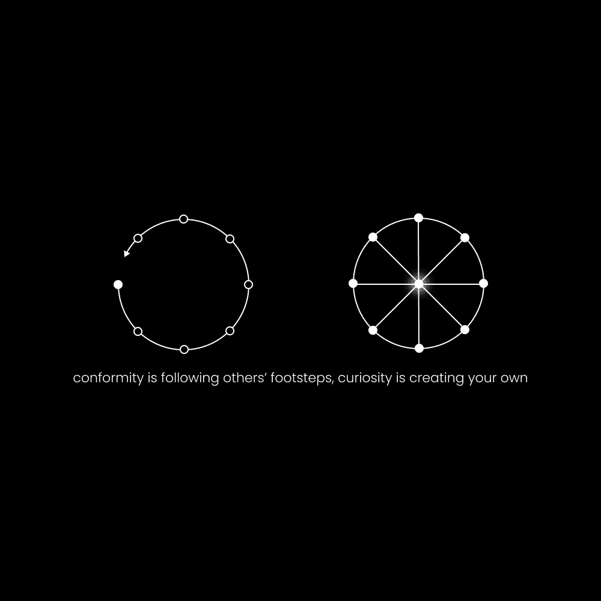

# 合成器：数字时代的好奇心职业路径

在本节课中，我们将学习一种名为“合成器”的新型数字职业路径。这条路径专为那些充满好奇心、热爱跨学科学习并渴望自我提升的人设计。我们将探讨其核心理念、所需技能、日常习惯以及如何将其货币化。

## 概述：好奇心是指引未知的指南针

上周，我们的技术创始人兼Kortex产品负责人马修·奥获得了一个重要洞见。他指出，好奇心是我们在未知领域中的指南针。历史上所有做出伟大工作的人，都是那些开辟自己道路而非追随他人足迹的人。

社会为我们预设了已知的路径，例如上学、找工作并在65岁退休。心灵虽然渴望秩序，但长期停留在这种被赋予的、确定的秩序中，反而会导致精神上的危险和不可避免的平庸。宇宙的本质是动态演化的，试图冻结时间、停留在同一章节中，只会导致情感动荡。

相反，追求好奇心的人正在收集创意素材，以在他们生活中创造一个不断进化的新秩序。查尔斯·达尔文、埃隆·马斯克、爱因斯坦等伟人，都是通过综合他们在好奇心道路上发现的跨学科知识来实现突破的。他们被嘲笑，因为他们看到了别人看不到的东西，那些信息源于独特的个人探索。

因此，**好奇心**是合成器的核心驱动力。它引导我们进行独特的探索，将分散的见解连接起来，形成全新的、有价值的综合。

## 什么是合成器？

上一节我们介绍了好奇心作为驱动力的重要性，本节中我们来看看“合成器”的具体定义。

合成器是一个以好奇心为指南针，选择独特路径，将不同领域的想法联系起来以实现自我设定目标的人。他们将自己的综合分析分享给志同道合的人，以帮助他人实现类似目标。

以下是合成器的几个关键特征：
*   **现实探索者**：他们理解现实是一个相互关联的整体，而非割裂的学科。他们为复杂的、有利可图的问题创造整体解决方案。
*   **价值创造者**：这是一种在社交媒体上专注于教育和启发，而非单纯娱乐的创作者类型。
*   **想法DJ**：他们像DJ混合音乐一样，混合与重组各种想法。
*   **去中心化媒体公司**：在当今时代，每个人都可以成为自己的媒体公司，通过做热爱的事情谋生，无需依赖传统的中介机构（如出版商、唱片公司或雇主）。

合成器的道路允许你基于自己的技能、受众规模和创造力来获得收入，潜力无限。

## 合成器的世界观

要踏上合成器的道路，仅仅了解定义是不够的，还需要内化相应的思维方式。本节我们将探讨支撑合成器身份的核心价值观和信仰。

你可以通过持续接触新信息并付诸实践来逐渐改变自己。请尝试将以下列表中的价值观与你阅读的内容、浏览的信息以及关于未来的对话联系起来：

*   **金钱是工具**：金钱是构建你想要事物的工具，其本身并非目的。
*   **创造职业**：你生活在一个可以创造自己职业，而非被分配职业的时代。
*   **个人责任**：在去中心化的经济中，个人责任决定了你生活的结果。
*   **罕见目标**：你不会用平均的目标得到平均的结果。你会用罕见的目标得到罕见的结果。
*   **好奇心与技艺**：好奇心、现实探索以及对一项技艺的最终痴迷是你通往伟大的关键。
*   **终身学习**：自我教育是一个基石习惯，你必须每天践行，无论学习什么主题。
*   **持续进化**：人类注定要扩展、超越和创造。不断的自我提升和进化是必然的。
*   **构建生活**：有一种方法可以用技术和互联网构建你想要的生活。如果没有，就创造它。

通过重复和思维训练，你可以将这种世界观内化。一旦做到，成功将变得难以避免。你的思维应成为一个帮助你实现目标的系统。

## 合成器所需的技能

拥有了正确的世界观后，我们需要掌握具体的技能来将想法变为现实。正如纳瓦尔所说：“学会销售，学会构建，如果你两者都能做到，你将无所不能。”

我们可以将所需技能分为三大类：

**1. 永恒的技能**
这些技能关乎人性和价值交换。它们是传播和实现你想法的边界。
*   **写作**：有影响力的写作，基于说服、营销、销售和人性的理解。
*   **演讲**：有效的口头沟通。
*   **营销**：推广想法和价值。
*   **销售**：完成价值交换。

**公式：影响力 = 价值 × 传播**

**2. 技术技能**
这些是利用现代工具构建事物的能力。技术的发展使个人能力空前强大。
*   网页设计与开发（或使用无代码工具）
*   图形设计与视频编辑
*   电子邮件营销与自动化
*   社交媒体内容创作与运营
*   产品托管与基础运维
*   使用各类SaaS工具（如日程安排、项目管理）

**3. 个人兴趣**
这是你技能施展的方向和独特性的来源。它源于对你生活中真实问题的深刻认识。
*   例如，如果你深刻认识到健康问题阻碍了你的潜力，你自然会对健身、营养学产生兴趣。
*   通过在这个领域的实践和探索，你会形成独特的见解和方法。
*   然后，你可以利用永恒技能和技术技能，将你的经验和解决方案产品化，并传授给他人。

**核心循环**：用**个人兴趣**指引方向，用**技术技能**进行构建，用**永恒技能**进行销售和传播。

## 合成器的核心习惯

技能提供了“做什么”的蓝图，而习惯则决定了“如何持续地做”。要成为合成器，你必须采用合成器的生活方式。

你的身份由世界观和习惯共同塑造。世界观影响认知，认知影响选择，选择重复成为习惯。因此，要塑造新身份，需从引入新习惯开始。

合成器的日常可以简化为两个核心的时间模块，你可以从较小的投入开始，随着成果积累而增加：

**习惯 1：生产力模块**
用于构建、创造和维护你的项目。
*   **时长**：30-90分钟。
*   **内容**：
    *   进行深度专注的工作。
    *   撰写用于建立读者群的内容。
    *   为你的读者构建能提供价值的产品（数字课程、电子书、软件等）。
*   **目标**：留出时间建立一个可能盈利的项目，以最终替代现有收入来源。

**习惯 2：创意模块**
用于捕捉灵感、建立连接，为创作提供燃料。
*   **时长**：30-90分钟。
*   **内容**：
    *   **去散步/脱离环境**：远离干扰，收听播客、阅读书籍或观看与你愿景相关的视频。
    *   **寻找灵感**：主动收集吸引你的新想法。
    *   **沉思**：让大脑进入默认模式网络，进行内部连接，形成新颖的视角和关联。

生产力和创意模块是合成器每日必须践行的两件事，它们共同推动项目从构思走向实现。

## 合成器的主要杠杆：写作 🖋️

在所有技能中，**写作**是合成器最强有力的单一杠杆。越早接受“你是一名作家”这一身份，你就越能精通它。

写作远不止于创作文章或书籍。它体现在：
*   发送电子邮件
*   撰写社交媒体内容
*   编写视频脚本
*   设计广告文案
*   发送商务私信
*   厘清思路以提升口头表达

这里指的是**有影响力的写作**，它基于说服、营销、销售以及对人性心理的理解。

优秀的写作是将文字转化为价值的艺术。你不能随意书写，而应围绕读者的心理基础展开：
1.  **燃烧的问题**：指出或暗示读者想要解决的痛点。
2.  **可取的目标**：描绘一个他们渴望实现的、理想的状态（最好与你自己的愿景一致）。
3.  **跨越差距的路径**：基于你的个人经验，提供一个实现该目标的系统或方法。

**写作是将想法综合成形的过程，没有写作，你的想法无法精进，结果也无法提升。**

## 合成器的盈利路径 💰

掌握了核心技能和习惯后，我们来看看如何将合成器的工作转化为收入。作为作家、创作者或合成器，你的盈利途径是多元且低成本的。

以下是几种主要的货币化方式：
*   **出版书籍**：通过传统出版或自出版销售电子书或纸质书。
*   **销售数字产品**：如在线课程、模板、电子指南、软件工具。
*   **销售实体产品**：例如专业计划本、周边商品等（此路径涉及库存和物流成本）。
*   **提供服务**：提供一对一或小组的辅导、教练或咨询服务。
*   **自由职业**：利用你的写作、设计、营销等技能为客户提供服务。

关键在于：**首先建立你的读者群（受众），然后为他们构建任何他们需要且你愿意提供的产品。** 在创作者经济中，几乎任何兴趣领域都有盈利的可能。

一旦你通过上述方式建立了稳定的现金流和忠实的受众，你就可以像运营一家公司一样，构建更复杂、规模更大的业务。

## 总结与行动号召

在本节课中，我们一起学习了“合成器”这一数字职业路径。我们从**好奇心是指南针**这一核心理念出发，定义了合成器作为**现实探索者和价值创造者**的角色。我们探讨了支撑这一身份的**世界观**，并拆解了所需的**永恒技能、技术技能和个人兴趣**。

我们了解到，通过践行**生产力与创意模块**这两个核心习惯，可以逐步塑造合成器的身份。其中，**写作**被强调为最关键的执行杠杆。最后，我们看到了多种将综合能力**货币化**的可行路径。

这条道路是为那些厌倦默认路径、渴望通过跨学科学习和创造来构建有意义职业生涯的人准备的。它要求你拥抱不确定性，以好奇心导航，并持续将洞察综合成对他人有价值的产出。

如果你想在结构化指导下，在90天内系统性地踏上这条道路，可以考虑申请加入 **[Kortex大学](https://university.kortex.co)** 的项目。

感谢阅读。现在，是时候开始你的探索与综合之旅了。