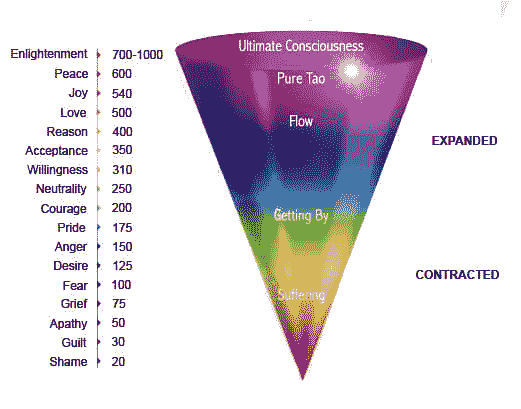

# 赚钱是精神性的：破除“高尚的失败者”的迷思 💡

在本节课中，我们将要学习一种关于金钱、商业和道德的全新视角。我们将探讨为何将赚钱视为不道德是一种幻觉，以及这种观念如何阻碍你为世界创造真正的价值。

在当今世界，最糟糕的事情之一就是陷入“高尚的失败者”的思维模式。许多聪明人讨厌在线业务、营销和销售，因为他们认为这些活动“低于”自己的身份。他们陷入了一种自认为“更高尚”的视角，这种视角妖魔化了那些“卑鄙的销售员”。实际上，这是一个错觉。这种“更高尚”的视角充满了误解、缺乏同理心甚至仇恨。与那些被他们鄙视的“销售员”相比，这种视角的意识水平可能相当，甚至更低。

这与政治或宗教争论类似：当人们固守自己的意识形态进行狭隘争论时，根本无法发现情况的整体真相。

上一节我们介绍了“高尚的失败者”这一迷思，本节中我们来看看这个被忽视的整体真相是什么。

## 整体真相：你的不作为，正在助长不道德

如果你不去创办企业，提供能够改善人类的信息、教育和商品，那么不道德的企业就会在没有竞争的情况下占据顶端，从而使人类境况变得更糟。不道德的企业之所以充斥市场，部分原因在于你的意识或智慧并没有你想象的那么高。你没有开始一项业务来提升集体意识，这本身就是对邪恶的一种直接贡献。

通过仅仅妖魔化金钱和作为社会生命线的商业，你最终很可能是在为一个在你看来不道德的雇主工作。你因为幻觉性的**假设**和条件反射，认为赚钱是不道德的，所以不去创业。但你却可能为一家使人口生病、向世界投掷炸弹、并使员工陷入机器人般常规的公司工作，这种常规让他们不敢实现自己的潜力。

人们常常批评新兴的创作者教育企业是“骗局”和“诈骗”，然而，这些企业解决的恰恰是那些能够提升人类基准意识的真实问题。那些在健康、财富、关系和幸福领域销售教育、课程和指导的人，正在从根本上推动积极的行为改变。如果人类的强大程度取决于最薄弱的环节，而99%的人遭受着相同的生存问题，那么教育就是允许**个人**解决自身问题（而非提供暂时缓解）的关键。

回到主要论点：**不采取行动，你就是在让那些意识水平、智力可能比你更低的人，拥有比你更多的关注、影响力和金钱。** 金钱会产生涟漪效应，使他们能够更广泛地传播他们的信息，雇佣员工（这些员工可能在不自觉地贡献不道德的行为），并增加他们在社会中的关注度。唯一能阻止人们关注一件事的方法，就是给他们提供更有说服力的东西来关注。

这个问题并不像“只是开始创业赚钱”那么简单。一切都是相互联系的。你或许在不知不觉中，让整个宇宙的天平向邪恶倾斜，因为你没有成为一个有意识的商业主，去影响你的客户、员工、读者、经济以及其他无限的事物。

## 重新定义“精神性”

*   精神是理解你在整个宇宙中的部分。
*   精神不是脱离那个整体去森林生活，让宇宙陷入混乱。
*   当你通过投入努力和能量来推动人类进步和进化，试图逆转熵时，你就能感受到精神性。

> 幸福是——力量增加的感觉——阻力正在被克服。——尼采

如果你憎恨金钱，难道不是在憎恨你的生活吗？你现在周围的一切，从手中的电话到驾驶的道路，从坐的桌子到维持生命的食物，都是商业产品，源于那些为文明进步做出贡献并因此赚钱的人。你正淹没在一个由源于生存需求的金钱所驱动的世界中。

---

# 赚钱是精神性的：第2章：金钱——无法回避的生存基石 💰

上一章我们探讨了关于商业的道德迷思，本章我们将深入审视金钱在现代生存中不可忽视的核心地位。

“最好的赚钱方式是教别人如何赚钱。”我经常看到人们这么说。有些人视之为智慧，有些人则用它来拆解任何商业建议，以此逃避面对现实。当金钱统治人们的生活时，有些人将这句话视为坏事。这是阻碍他们达到个人发展下一个层次的一件事。**它几乎决定了一个人采取的每一个行动，即使是那些最“精神性”的人，因为金钱与现代生存紧密相连。**

以下是几个思考角度：

*   **你为什么每天工作8小时，持续45年？** 因为你需要支付账单并养家糊口。
*   **你为什么像修道士一样隐居森林？** 因为你想消除对金钱的需求以追求个人发展。（认为每个人都该如此，比任由社会腐烂更愚蠢。“万物一体”的理念，直到你真正需要对世界的健康负责时，你却选择了退出）。
*   **你为什么去健身房、吃健康食品？** 为了健康，是的。但也为了提升感知地位，吸引更好的机会，促进职业生涯，赚更多的钱。
*   **我为什么在打字？** 为了帮助你，是的。但任何行动背后都不止一个原因。写作是我的事业。我为此获得报酬，并带来了许多其他好处。
*   **你为什么在读这篇文章？** 为了获得新视角，是的。但这将打开你的思维，减少围绕赚钱的局限信念。

几乎你采取的每一个行动，都有金钱作为一个附加的理由。金钱深深植根于现代生存之中。看看马斯洛的需求层次理论，在现代世界，每个阶段都需要金钱。你生活的财务领域就像其他任何领域一样，如同视频游戏中的技能树。你需要在所有领域播种，花园才能繁荣。

*   为了健康，你需要金钱。
*   为了获得满意的关系，你需要解决摧毁99%关系的那个问题……金钱。
*   为了快乐（更确切地说，为了享受生活），你需要朝着有意义的目标前进。你需要建设。建设需要资源。资源需要金钱。

当你忽视对金钱的需求时，你限制了在心理、身体甚至精神实践上的发展空间。精神实践？是的。如果你与物质世界的生命之源（金钱）关系不佳，那么你的精神发展就会受到阻碍。你无法获得那些能让你为人类精神进化做出贡献的资源。

无论是关于关系、健康、健身，还是学习数字艺术等新技能的建议，最终都在“教人们如何赚钱”和提升他们的职业生涯。你在学校花费12到24年，很大程度上是为了提高赚钱能力。社会的生命之源是什么？是经济。

你没有意识到，在新经济中赚钱的唯一方式，是从那些**创造**了在该经济中赚钱的职位和机会的人那里吗？就算你不理解，也不意味着它没用。你没有意识到，在旧经济中赚钱的唯一方式，是从创造了那些职位的机构和结构那里吗？

一切都在进化。放下你十年前认为有效的东西。学校教授的是过时且不那么赚钱的方式，因为随着互联网的出现，更有利可图的赚钱方式诞生了。通过把一切都视为骗局，你可能会推迟你的发展数年，甚至一生。这是我们正在经历的进化阶段，你正在错过即将成为新常态的东西。

---

# 赚钱是精神性的：第3章：整合你的“阴暗面”技能 🔮

上一章我们确立了金钱的基础性地位，本章我们来看看那些常被视为“不道德”、但实则至关重要的技能。

最成功的人，往往是那些研究过所谓“不道德”策略，并以道德方式运用它们的人。

以下是这些核心技能的列表：

*   **销售**
*   **营销**
*   **说服**
*   **催眠**
*   **影响力**
*   **博弈**

他们的工作、业务和对崇高目标的追求，正是他们整合自身“阴影”的方式。当你放大视角去看清原则时，你会发现它们本质上是同一件事。所有这些“不道德”的技能，只是理解人性、心理学和宇宙模式（如讲故事）的工具。

> 音乐是流动的建筑；建筑是冻结的音乐。——歌德

每个人都有阴暗面，就像地毯的丑陋背面或歌曲中的低音部分。宇宙是创造与毁灭、统一与分裂、出生与死亡的平衡。建筑物被摧毁，以便新的建筑物可以建造。你的旧我死去，以便你的理想自我新生。

你并不纯粹是“好”的。当“好”是相对的，并且没有“恶”就不会存在“好”时，你不可能做到纯粹的好。那些试图压制而非整合自身阴暗面的人，其阴暗面会在无意识中以某种方式显现。通常，那些声称自己从不操纵他人的人，恰恰是最具操纵性的，只是他们没有意识到。

获得一份销售工作或开始一项营销业务，是整合你阴影的绝佳方式。你被赋予了选择：用这些技能行善还是作恶。你可以亲眼看到结果，以及它对你和你的客户产生的影响。精神大师并非“全好”，他们只是学会了整合“不良”部分，不让自己的生命之歌变成一首沮丧的曲子。你的故事中会有低谷，但当你放大视野，整首乐曲会如何发展？

思考你技能栈的一个好方法，是把它看作一个共同基金。如果一支股票下跌，共同基金仍然可以上涨。如果一项技能被视为“不道德”，那可能正是让你的业务变得盈利、道德且有影响力的关键解锁点。

---

# 赚钱是精神性的：第4章：超越、扩展与创造——人类的使命 🚀

上一节我们讨论了整合必要技能的重要性，本节我们将视野提升到人类进化的层面，看看商业和创造如何与之相连。

世界正在变得“疯狂”。由于技术、科学和计算能力的进步，作为一个物种，我们正在超越物质限制。我们正在通过技术实现意识的统一。这没有金钱可能吗？

当大多数人认为社交媒体对人类是净负面时，我完全不同意。社交媒体是我们记录集体意识的地方。我们分享思想、观点、想法、创作和身份。我们正在将思想上传到互联网。不仅是创作者，所有内容都是集体意识的一部分。社交媒体消除了我们沟通的界限。

人们整天盯着屏幕，仿佛有一种原始的吸引力，想要与每一个心灵合为一体。你的整个身份已经出现在屏幕上了，但屏幕仍然构成了一道障碍。想象一个你可以向他人直接发送思想信号的世界。想象一个你阅读我的文章时，信息直接进入大脑而无需阅读的世界。想象一个你观看我的视频时，我仿佛就在你身边的世界。

未来并不遥远。如果虚拟活动能像实体活动一样真实，但信息流动是瞬间的，体验也完全不同，会怎样？另一个问题：你可以触手可及地拥有整个世界的知识。这让你感觉如何？你有能力学习、扩展自我意识，并创办一家能为世界提供价值的公司。

当被问及长大后想成为什么时，最高票选项是“YouTube网红”。当大多数人认为这是幻想时，我认为这是自然的，而且在未来可能是唯一的选择。也许不一定是“YouTube网红”，而是像一个用心灵进行创造的存在。大多数人将追求影响力和关注度视为“虚荣”，但很少有人意识到，行为背后的动机不能简化为单一的“为什么”。总有一些更深层次的无意识力量在推动我们。

随着你扩展和超越到新的心态层次，你行动背后的推理会变得更加全面。

**你的心态决定了你的价值观。** 你并非选择坐下来思考金钱、社交媒体和技能获取。你会根据心理结构的构成做出自动决定。对许多人来说，他们被灌输了一些“听起来很好”的意识形态、信仰体系和商业模式，并开始捍卫这些信念，认为这是最好且唯一的。

当你退后一步，进入未知领域，通过解决能提升你心态水平的问题来取得进步时，你就能看清金钱的真实面目：一张可以极大地造福自己和他人的纸。

---

# 赚钱是精神性的：第5章：为何你尚未成功——核心障碍与黄金法则 🎯

在了解了心态、金钱和技能的重要性后，本章我们将直面阻碍你成功的具体原因，并给出清晰的行动法则。

你之所以不成功，并不是因为你声称想帮助他人却不去学习必要的技能。你之所以不成功，是因为你过于专注于“艺术”本身，当市场看不到你提供的价值时（因为你无法通过营销和销售来阐述它），你就去责怪市场。

以下是阻碍成功的几个关键点：

*   你“专注于你的技艺”，而不是让你的技艺出现在潜在客户面前。你的网站、设计、作品，除非被人看到，否则毫无意义。你在延迟获得反馈。没有反馈，你就无法使其变得有价值。你的第一次迭代不会是有价值的。
*   你对商业的理解不完整。商业是通过创造能够提升集体意识的产品来参与人类进步的方式。
*   你把这些观点当作个人攻击，关闭了潜能，让条件反射控制了你。
*   你没有创造出市场愿意为之付费的有价值的东西。人们不想要你自我意识想要的东西，他们想要的是自然（或市场）需求的东西。
*   你沉溺于那些自认为高贵的信念中。你将自我锁定在一个阻止个人成长的范式里。你开始被动应对，而非主动创造。

> 自我发展是通往创业的“入门药”，因为你意识到，提升他人是提升自己的下一个层次。

要成为成功的人，有一条黄金法则：**向他人提供价值。**

这意味着两件事：

1.  **你必须培养你的价值。** 你必须扩展思维，识别问题，获取解决问题的技能，并在现实中取得实际进步。（你不能整天坐着学习理论，必须实践。）
2.  **你必须分配你的价值。** 你需要一个载体——也就是一个企业——来分配市场*想要*购买的产品或服务。如果他们不想要，那么它就不像你想象的那样有价值。

换句话说，你需要**自我发展**和**他人发展**，即**个人成长**和**商业成长**。商业是你以规模向他人提供价值的方式。

## 如何在现代世界培养和分配价值？

答案是：**社交媒体**（以及未来的虚拟现实）。社交媒体是你的公立学校、公共简历和公共作品集。它包含了美好生活的神圣三合一：**学习、建设和销售**。

*   **你通过学习新知识来培养你的价值。**
*   **你通过建立新项目来巩固你的价值。**
*   **你通过出售那些项目来分配你的价值。**

所有这些都会导向更宝贵的技能组合和更高级的心态。

---

## 总结 📝

在本节课中，我们一起学习了：

1.  **破除“高尚的失败者”迷思**：妖魔化商业和赚钱是一种错觉，你的不作为可能正在助长不道德的行为。
2.  **正视金钱的基石作用**：金钱是现代生存不可回避的核心，关联着健康、关系、快乐乃至精神发展。
3.  **整合“不道德”的技能**：销售、营销、说服等技能是理解人性和世界的工具，以道德的方式掌握并运用它们，是整合自身阴影、实现成功的关键。
4.  **明确人类的使命**：作为人类，我们要超越、扩展和创造。技术和商业是推动意识进化、实现集体统一的重要力量。
5.  **找到成功的黄金法则**：成功在于向他人提供价值，这需要你同时进行自我发展（培养价值）和商业发展（分配价值）。社交媒体是现代世界实现这一点的核心工具。

这封信主要是关于心态的，旨在帮助你打破限制性信念，提供一个更有利于未来发展的世界观。真正的精神性，在于理解你与整体的联系，并通过有意识的创造和价值的提供，积极参与到人类进步的洪流之中。