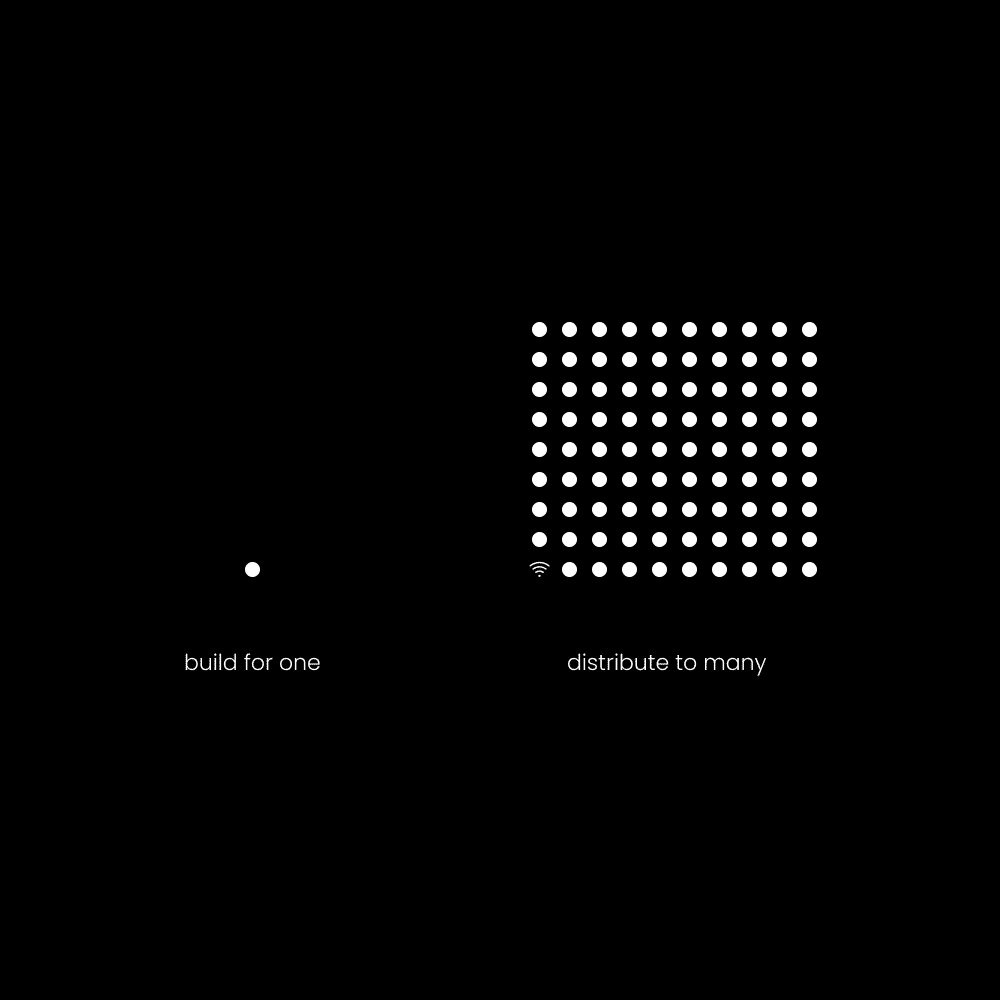

# 微型教育企业：未来趋势与零成本启动 🚀

在本节课中，我们将探讨为何微型教育企业是未来的商业趋势，以及如何利用你已有的知识，以近乎零成本的方式启动一个高利润的业务。我们将深入理解个人品牌、受众建设以及知识变现的核心逻辑。

## 建立受众是本世纪最伟大的技能 🏆

上一节我们概述了微型教育企业的潜力，本节中我们来看看其成功的基石：建立受众。个人品牌是数字时代的核心资产，它并非短暂潮流，而是占据快速扩张的数字空间的必要化身。每个人都有自己的个人品牌，但只有少数人能将其转化为有价值的贡献。

### 实现“自有”分发渠道

我与许多资深企业家的交流都反复印证了“自有”分发渠道的重要性。营销环境已发生巨变，个人品牌日益成为必需品。当然，这并不完全排除其他分发方式：

以下是几种主要的分发类型：

1.  **手动** - 例如冷邮件、冷电话或冷私信活动。
2.  **购买** - 例如购买 Facebook 或 Google 广告。
3.  **借用** - 例如付费赞助播客、YouTube 频道或新闻通讯。
4.  **自有** - 例如建立受众、新闻通讯、社区或产品购买者名单。

前三者对于业务测试、初创企业主和控制结果形式非常有效。而“自有”分发是一场长期游戏，需要耐心积累。假设我花两年时间建立了一个10万人的受众，如果我一个月内每天（以明智的方式）推广产品，我将至少获得一百万次曝光。通过私信或广告达到同等曝光量，则需要耗费大量时间或金钱。更重要的是，自有分发具有累积效应，其价值随时间增长。

### 受众建设是高价值技能的集合

要成为一名优秀的受众建设者，你需要掌握的远不止“建设受众”这一项技能。这适用于大多数能产生卓越结果的能力。受众建设是当今最具盈利能力的技能集合：

以下是构建受众所需的核心技能栈：

+   平面设计
+   内容写作
+   营销文案
+   市场营销与销售
+   人性洞察
+   心理学
+   自我认知
+   网络营销

它需要跨学科的学习和专业技能。受众建设本质上是一种**生活方式**，即捕捉、整理、连接、创造并以能促进行为积极改变的方式，分发有价值的信息、资源和产品。

### 快速学习、构建与分发的技巧

你必须养成学习、构建和分发的习惯，并将其融入日常生活。如果你能花8小时为别人的梦想工作，就能花1小时投资自己的梦想。

**有目的地学习：**
学习营销、销售、写作和社交媒体的原则。在研究感兴趣领域的同时，建立你的个人品牌以实践所学。当有新想法时，记录下来并发布。

**为自己构建：**
追求个人目标并记录过程。将笔记、日志、成功与失败系统化保存。从你的旅程中提炼知识，创造独特的路径并公开分享，这被称为“公开构建”。

**分发有目的的产品：**
产品是权威的催化剂。创建一个你自身需要或曾经需要的产品，无论是知识课程、工具还是其他。向过去的自己销售，你就不必担心竞争。

## 通过教育创造客户 🧑‍🏫

上一节我们探讨了建立受众的技能，本节我们将了解如何利用教育来主动塑造和创造你的客户群体。我不同意大多数商业大师的观点，即“为现有饥饿市场打造产品”。虽然有效，但这种方法可能导致厌倦客户、缺乏自主性和灵活性。

### 人类是学习机器

一个“饥饿的市场”之所以存在，是因为社会条件、学习和教育塑造了特定群体的身份与渴望。当你通过教育来创造身份，并用你的叙事引导人们时，他们就会渴望那些能帮助他们实现目标的产品。

### 意识层次

“意识层次”是一个改变游戏规则的营销概念，由 Eugene Schwartz 在《突破性广告》中推广。它描述了客户对问题认知的五个阶段：

以下是五个意识层次：

+   **无意识** – 对问题毫无察觉。
+   **问题意识** – 意识到存在问题。
+   **解决方案意识** – 意识到存在解决问题的方案。
+   **产品意识** – 意识到你的特定产品是解决方案。
+   **最意识** – 完全意识到问题对其生活质量的深远影响。

作为教育品牌，你的工作是触及所有层次：让受众意识到问题，提供解决方案的线索，并最终推广你的产品作为最佳解决路径。人们上社交媒体通常不是为了解决问题，因此提供结构化的产品具有巨大价值。

### 长短内容的平衡

内容主要有两种形式，对于建立信任都至关重要：

以下是两种主要的内容形式及其作用：

+   **长内容** – 如播客、视频、文章、新闻通讯。用于保持深度关注、细分受众并通过专业知识建立信任。
+   **短内容** – 如推文、短视频。用于吸引注意力、建立广泛受众并将其引导至更深度的价值源。

建议初学者从一条长内容渠道和一条短内容渠道开始。对于长内容，推荐从**新闻通讯**起步，因为它可以私下练习、建立内容库并深化连接。对于短内容，推荐**X（原Twitter）** 这类写作平台，因为它允许你测试想法、将思维货币化，并可将文案复用为视频脚本。

## 你大脑中有价值10万美元的知识被锁住 💎

上一节我们学会了如何通过教育引导客户，本节我们来看看如何将你头脑中的知识打包成高价值产品。首先，需要驳斥对信息产品的常见质疑：它们“不真实”、“无形”。如果你的思维是存在的核心，而信息塑造了你的生活，那么信息产品就是你能提供的最佳产品之一。

我相信每个企业都应有一个教育**基础**，一个能大规模传播积极行为改变的信息产品。这类产品利润率常超过95%，是经济趋势所向。

### 如何应对市场饱和

为你过去的自己或现在的自己打造产品，一个能加速实现有意义目标的过程。你的营销应围绕人类行为的普遍原则展开：

以下是三个核心的营销原则：

+   **目的** – 推动向更美好未来前进的强烈理由。
+   **路径** – 为行动提供清晰步骤的过程或系统。
+   **优先级** – 他们意识层面最紧迫的问题。

围绕你热爱的领域创建教育产品。**你就是细分市场，你就是客户画像**。创作能引起自己共鸣的内容。掌握这一点可能需要时间，但这与学习任何新技能一样，都是一个试错的过程。

---

本节课中我们一起学习了微型教育企业的核心框架：**建立个人品牌与自有受众**是基础，**通过教育内容主动创造客户需求**是关键，而**将个人知识打包成高利润信息产品**是实现变现的路径。记住，启动这一切的核心资源——知识与分享能力——你已经拥有。现在，开始行动，将你大脑中被囚禁的财富释放出来。