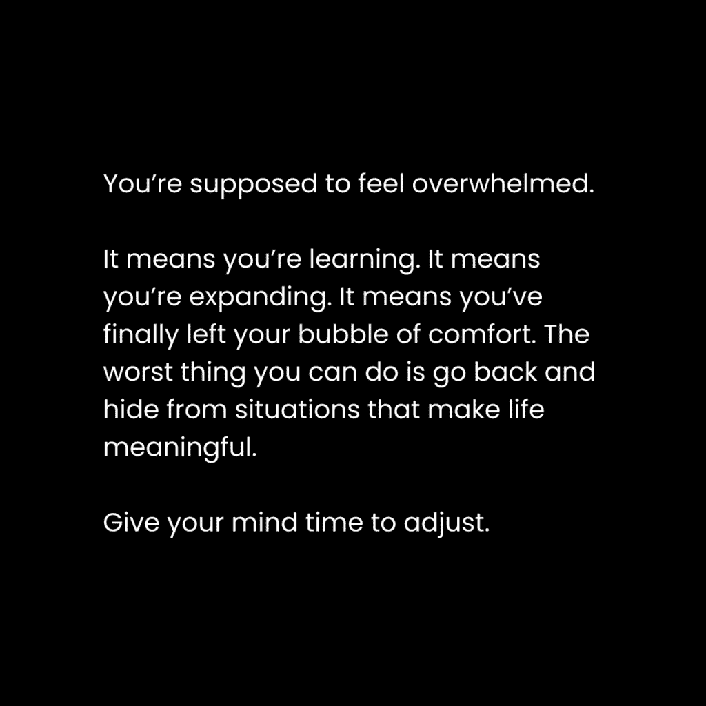
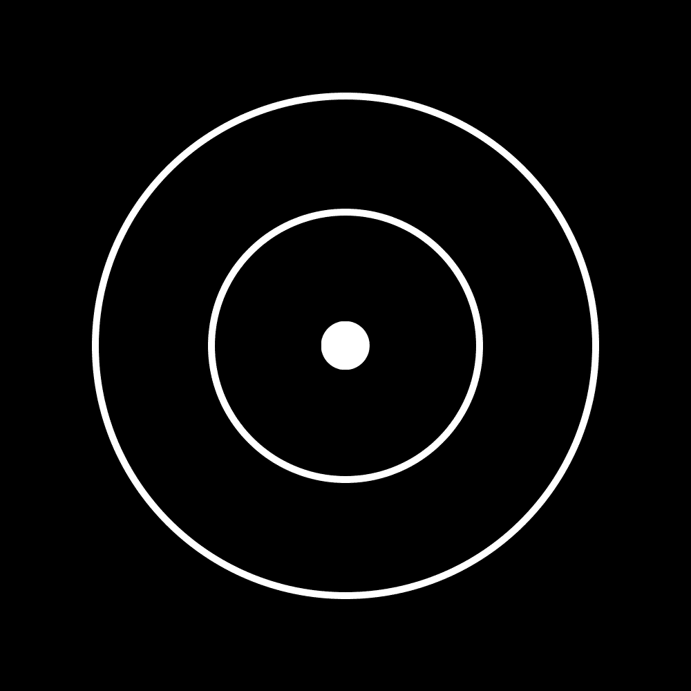
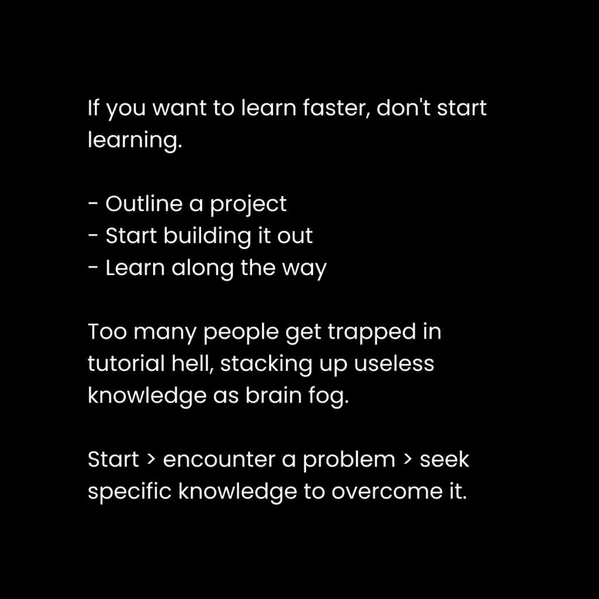

# 快速学习技能：如何应对学习初期的不知所措感

在本节课中，我们将探讨一个普遍的学习障碍——初期感到的不知所措，并理解这其实是加速学习过程的关键信号。我们将学习如何正确看待并利用这种感受，为后续的高效学习打下基础。

## 概述：为何“不知所措”是好事

人们通常认为在学习新事物时不应该感到不知所措。这种想法会阻碍成长。实际上，初期的不适感是心智正在吸收新信息、进行模式识别预备的自然标志。只有坚持度过这个阶段，才能迎来“顿悟”时刻。

---

## 现实新陈代谢：避免心智肥胖 🧠

上一节我们介绍了“不知所措”的积极意义，本节中我们来看看导致这种感觉的深层原因——“现实新陈代谢”过慢，以及如何避免“心智肥胖”。

你感到不知所措，是因为你无法快速消化接触到的新现实。这种无法处理的感觉会消耗你的注意力，让你只关注负面的自我对话。

这个过程可以与健身增肌进行类比：
*   **健身增肌** = **增加食物摄入** + **抗阻力训练** + **充足休息**
*   **构建知识** = **增加信息摄入** + **挑战性概念** + **休息消化**

所有你现在擅长的事情，都曾经过这个“不知所措”的学习阶段。区别在于，你已经接受了那些挑战，并将其内化为自身能力的一部分。未经训练的心智会在不适的第一时间退缩，让你错失成长的机会。

### 在能力边缘取得平衡

心智健康需要消费与创造的平衡：
*   **消费 > 创造**：导致“心智肥胖”，信息过载。
*   **创造 > 消费**：导致“心智瘦弱”，灵感枯竭。
*   **消费 ≈ 创造**：实现最佳信息流，带来兴奋感、满足感和感激感。

建议记录下这些积极时刻（例如使用笔记工具），积累“信号笔记”。这些记录可以作为数据，帮助你训练心智更频繁地进入这些高效状态，从而提升生活质量的稳定性。

---

## 通用思维：解决大多数问题的方法 🔭

理解了“现实新陈代谢”的概念后，我们可能会问：当陷入消极情绪时，具体该如何跳出来？本节介绍“通用思维”这一强大工具。

你感觉不好的根源，往往是未来的“理想自我”不认可你现在的行为。解决大多数问题的方法是：**放大视角**。

大多数人陷入焦虑和压力时，视野会变得狭隘，只关注“糟糕的歌词”（局部问题），而看不到“整首好歌”（全局背景）。这阻碍了学习和解决问题。

你可以通过一个简单的三步习惯来训练自己放大视角：

当你感到不知所措时，暂停，然后依次思考以下三个视角：
1.  **你的当前视角**：客观盘点你的现状。
2.  **你理想自我的视角**：你所能成为的最高版本的自己，在此刻会怎么做？
3.  **宇宙的视角**：超越所有个人限制，从最宏大的尺度看，当前的担忧是否仍有意义？

这三个视角构成了一个有效的思维框架。当你足够远地放大视野，就能发现新的潜力、联系和创意。

通用思维就是从这种广阔视角中，注意到不同领域间通用模式的心态。例如，你可以发现健身、心智训练和商业建设都遵循相似原则：**渐进式超负荷**、**紧张状态下的时间**和**适当营养**。在通用层面思考，能帮助你与事物发展的自然流动共处，并做出推动指数级增长的决策。

---

## 如何实践10倍速学习法 🚀

前面我们探讨了学习的心态和宏观思维，本节我们将把这些理念转化为具体的、可操作的步骤，实现加速学习。

当你掌握了“如何学习”的方法，你就能在6个月内达成别人可能需要5年的成果。以下是结合了上述所有理念的实践步骤。

### 1. 创建一个清晰催化剂：启动学习项目

学习产生巨大飞跃的时刻，通常发生在我将学习目标作为一个“真实项目”来对待的时候。

一个有效的学习项目应包含以下要素：
*   **大纲**：一个可以随时填充想法的框架。
*   **里程碑**：提供明确方向和下一步行动。
*   **真实截止日期**：制造紧迫感，促使行动。
*   **实践与反馈**：通过试错将失败转化为经验。

这种方法创造了进入“心流状态”的完美环境。具体操作如下：
1.  确定你想学习的内容。
2.  设计一个最终会公开发布的真实项目（例如，学习Photoshop，项目可以是制作一套海报）。
3.  为项目创建一个大纲（初期可以是一个杂乱的想法列表）。

项目就像一个“经验锚点”，让你在生活中遇到的相关信息都有了归属，从而极大地提升学习敏感度和动力。

### 2. 在构建中学习：实践中掌握基础

如果你没有在动手构建，你就不是在有效学习。脱离实践的知识堆积只会形成“脑雾”。

开始构建时，你只需要学习最基础的知识。**基础能解决80%的问题**。高级策略留待以后钻研。

具体步骤：
1.  购买入门课程或观看概述视频，掌握基础知识。
2.  立即开始动手做你的项目。
3.  遇到具体问题时，再回头查阅资料或搜索特定解决方案。

记住：**学习就是解决问题，而不是囤积知识**。

### 3. 教你所学的：巩固与内化

教学是巩固理解的最佳方式。它强迫你梳理知识结构并准确表达。

以下是教学的方式：
*   公开写作并接受反馈。
*   向朋友讲解你正在制作的东西。
*   以教导自己的方式做学习笔记。

关于“冒名顶替综合征”的应对方法：保持诚实。不要夸大经验，从“学习者”和“分享者”的角度进行教学。例如：“我用23小时读完了《XX书》，以下是改变我思维的要点”。就像营销一样，不要承诺你无法交付的结果。

### 4. 扩展到新的思维层面：沉浸与适应

即使遵循了上述步骤，你仍可能感到不知所措。这是好事，意味着你的大脑正处于模式识别的临界点。

此时需要：
*   **投身于未知**：沉浸在该领域的文化和信息中。
*   **调整心态**：通过重复接触，熟悉成功者的语言和思维。
*   **在不适中坚持**：成长的阵痛期最忌放弃。

实用方法：
*   **阅读书籍**：用6小时获取他人10年的经验精华。
*   **观看讲座或长视频**：深度内容效率远高于碎片信息。
*   **跟随新的人群**：改变你的信息源，融入目标领域。

建议购买三本书：一本畅销书（了解主流观点）、一本技术书（掌握核心方法）、一本历史书（理解发展脉络）。然后深入钻研。

### 5. 建立联系以巩固理解：实现融会贯通

当你精通一个领域后，掌握其他领域的速度会大大加快，因为底层原理是相通的。

当你对某个主题有了稳固理解后，可以：
*   **退后一层**：例如，从“Photoshop”退到“平面设计”，再退到“创意工作”。
*   **注意信号**：随时记录下大脑产生的重要联系和洞见。
*   **构建更好的项目**：在新的认知层面上，启动更有挑战性的新项目。

知识的积累是层叠的。例如，从网页设计，可以扩展到市场营销、内容创作，甚至哲学思考。这也是开创个人事业的路径：从一个核心领域开始学习、构建和教学，然后逐步扩展。

---

## 总结

本节课我们一起学习了如何将学习初期的“不知所措”感转化为加速成长的动力。我们理解了“现实新陈代谢”和“通用思维”这两个核心概念，并掌握了实现10倍速学习的五个实践步骤：
1.  **通过真实项目启动学习**。
2.  **在动手构建中掌握基础**。
3.  **通过教学来巩固和内化知识**。
4.  **沉浸到新领域中以扩展思维层面**。
5.  **建立跨领域联系以实现融会贯通**。

现在，就去开始学习、动手构建，并享受这个成长的过程吧。