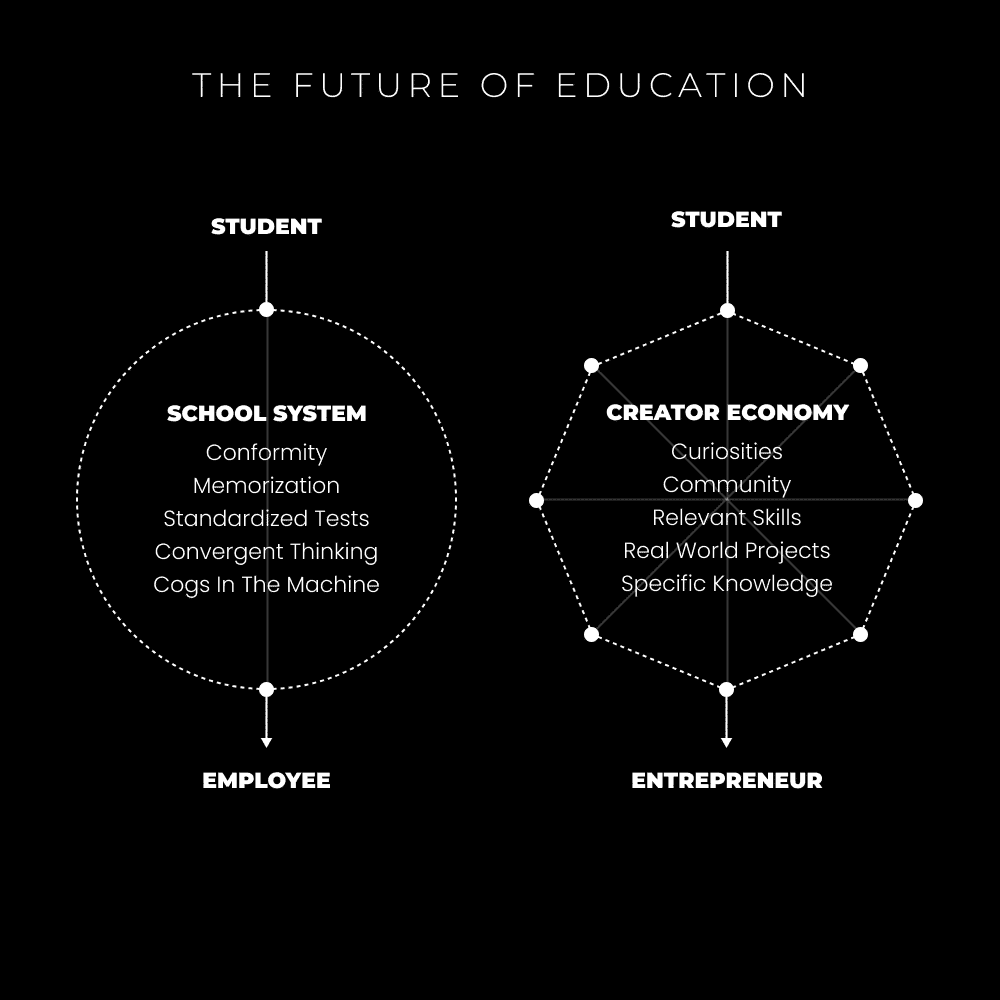
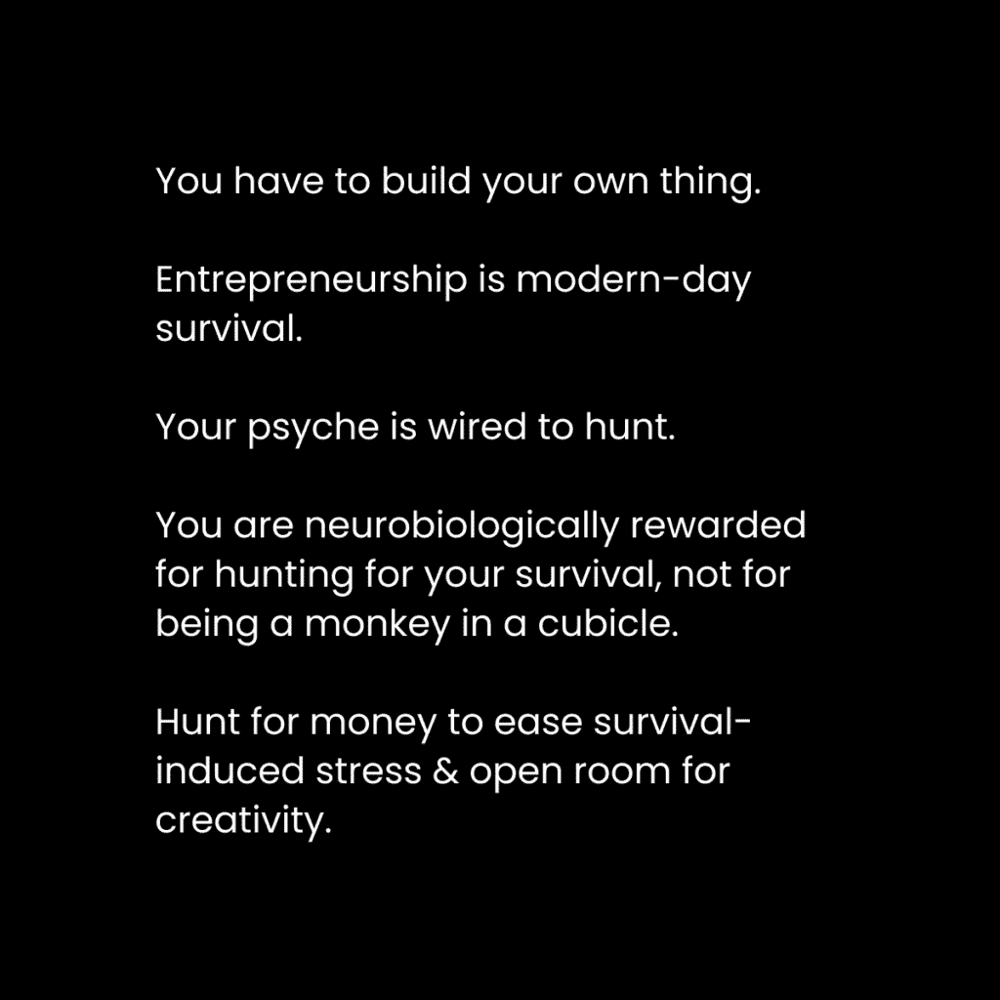

# 创作者经济：创作者经济的未来（我的大胆预测）

> 原文链接：[`thedankoe.com/letters/the-future-of-the-creator-economy-my-bold-prediction/`](https://thedankoe.com/letters/the-future-of-the-creator-economy-my-bold-prediction/)

在本教程中，我们将探讨创作者经济的未来发展趋势。我们将分析过去十年互联网营销的演变，并预测一种更注重真实性、深度和整体性的新范式。我们将学习核心概念，如“整体综合者”，并了解如何通过建立个人哲学和提供全面解决方案来构建可持续的创作者事业。

---

复杂的销售漏斗、使用倒计时计时器的促销、夸张的保证和炫耀大数字、租用兰博基尼和游艇进行付费拍照来推广产品。这些是十年前互联网营销的常见景象。

虽然并非所有做法都是坏的，但许多人似乎都在小心翼翼地扭曲事实来谋生。例如，有人建议“开设一家代理机构，你可以快速赚到10万美元”，但这可能意味着你要学习一项讨厌的技能并与讨厌的人共事。又或者，“开设一家直邮商店，直接从中国发货”，这可能是在销售无用的产品，为网络上的廉价多巴胺狂欢推波助澜。

更普遍的是，许多教导暗示你应该“针对这个细分市场，永远不要突破。永远不要进化。永远不要将你的兴趣融入工作中。总是从你的客户那里榨取尽可能多的钱。”这些方法可能有效，但它们往往缺乏灵魂和可持续性。

你订阅这类内容，是因为你想创造更好的生活。有一种方法可以在享受生活的同时谋生，随着创作者经济的发展，这种方法正变得越来越可行。

## 市场成熟度与信任转移 🧠

上一节我们回顾了旧式营销的局限。本节中，我们来看看市场环境的变化。整个市场的成熟度正在普遍提高。正如人们逐渐失去对传统教育系统的信任一样，大众空间也正在失去对过去十年中那些可疑营销策略的信任。

### 1) 现实并非分割的

互联网营销行业曾遵循与学校系统相似的路径。常见的建议是尽可能地进行市场细分，因为“财富在细分市场中”。这有一定益处，但也是一个片面的真理。单纯为了定位而细分市场，可能会违背初衷。

市场营销的本质是提供独特的解决方案，实现变革。你通过一套能取得成果的系统，帮助人们从A点（现状）移动到B点（理想状态）。在学校里，学科被分割成化学、生物、商业等独立部门。这种结构忽视了生活的相互联系性，而这种联系本可以让你学得更快。

就像海洋分裂成雨滴，最终又会汇入海洋一样，互联网营销空间也在遵循相同的进化模式。它曾被分割成专门的领域，现在正重新整合，市场对整体、统一的解决方案需求日益增长。

### 2) 具有共同目标的社区的全面解决方案

拿破仑·希尔提出了“智囊团”的概念，指的是一群被共同目标或理念吸引在一起的人。当一个社区联合起来实现同一个目标时，他们实现目标的速度可以比任何个人快十倍。

在创作者经济中，个人会吸引一群与其目标、声音和个性产生共鸣的人。然后，这些创作者提供与实现该目标相关的多种技能和兴趣的教育。例如，一个以“工作更少，赚更多，享受生活”为目标的创作者，其教学内容会综合心灵、身体、精神和商业等各个方面。

市场需要更少的肤浅承诺，更多的解决方案来实现有意义的目标。大多数现代商业模式缺乏这种深度。

### 3) 清晰度至上

过去十年的互联网营销依赖于复杂性。产品和服务可能提供简单的解决方案，但营销方式却故意复杂化，以增加产品的感知价值。

现在，人们想要清晰、简单、直接的解决方案，并且希望从他们最能理解和学习的角度来接受教育。有些人偏好务实的方法，有些人则偏好哲学性的阐述。通过依靠你最擅长的表达方式，你可以吸引那些有共同目标、并能从你这里最好地学习的人。

这引出了一个核心观点：**“你就是你的细分市场”**。你的独特视角和组合兴趣，构成了你不可替代的定位。

## 整体综合者的崛起与需求 🚀

基于上述哲学，创作者经济不会变得饱和，原因如下：

**1) 你的社区在进化**
人类和社区不会固守一个目标。一旦实现了一个目标，就会转向下一个。如果你不将自己限制在某个特定标签或细分市场，你和你的社区就能共同进化。

**2) 你的产品在进化**
创作者最初可能专注于一项技能（如网页设计），但随着个人成长和兴趣变化，产品和服务也会随之进化，从而有效地“降低”原有市场的饱和度。

**3) 独特的兴趣网络**
当你深入探索自己真正的兴趣组合时，你的品牌就不再是分割的。谈论健身、商业和科技的人，与谈论健身、商业和灵性的人，是截然不同的。

**4) 大型创作者拥有丰富的资源**
许多大型创作者会减少内容产出频率，去追求新目标（如组建家庭、创业）。这为新创作者提供了进入市场、获得关注、建立网络和资源的机会，而无需面对过于激烈的“巨头”竞争。

### 对深度的需求

我们已经达到了创作者经济的一个临界点。内容平台为了增长，充斥着基础、浅薄和重复的思想。这带来了一个问题：为什么要过度系统化想法？为什么要从业务中剥离灵魂？为什么要把增长和收入置于一切之上？为什么要限制你作为个体最突出的特质——你的创造力？

该领域的整体意识水平正在上升。市场将要求创作者超越陈词滥调和老套的逐步建议。这只能通过优先考虑深度、独特视角和整体综合来实现。

### 什么是整体综合者？

让我们来定义“整体综合者”：
> 那些追求自己愿景的人，用他们获得的独特技能和兴趣开辟自己的道路。他们不将这些技能或兴趣视为独立的部分，而是一个相互关联的整体，这是他们生活中必要的方面（而不是为了快速赚钱的临时部分）。他们的生活工作是在这条路上提炼、教育和传播他们的个人经验。

简而言之，整体综合者是以有说服力和教育性的方式，记录他们追求美好生活过程的人。这样，你可以吸引与你的声音产生共鸣的社区，帮助他们实现共同目标，而不将自己限制在现实的某个分割方面。

以下是整体综合者模式的三个核心组成部分：
*   **你的品牌是你的故事** – 无论经验如何，你现在所处的位置。
*   **你的内容是你的学校** – 帮助你达到当前位置的东西。
*   **你的产品是地图** – 一个帮助人们以更少的试错达到你所在位置的整体系统。

互联网赋予了你前所未有的自我教育能力。主动改善生活，追求好奇心，并分享你的发现。

## 一种新的生活方式 🌱

创造者哲学不是一种商业模式，而是一种生活方式。其核心是：**提升自己 > 提升那些想要被帮助的人**。

以下是你可以开始行动的步骤：

### 1) 掌握你的生存

当你需要依赖他人时，你很难保持真实。地球上的每一个人都必须实现自我，以便以最好的方式为人类做出贡献。

**自我实现**：*实现成为一切可能成为的人的欲望。实现你的潜能*。

创业是现代社会的生存方式。我们寻找资源（金钱）来满足需求，并*创造*我们喜欢的工作。企业允许你消除、委托或自动化你不喜欢的部分。

我的建议如下：
*   解决你生活中的基本生理需求问题。
*   提升你的健康、财务和社交关系。
*   通过自我提升来发现你的兴趣。

这需要时间，但不会阻碍你创造独立的收入来源。95%的人的问题围绕健康、财富、关系和幸福。如果你能在生活中解决这些问题并记录过程，你就可以为你所获得的知识收费。人们最好向比他们领先一步的人学习，而不是领先十步的人。

### 2) 创造你自己的哲学

关于如何赚钱、如何处理人际关系，有太多肤浅的建议。我们需要更多追求真理的个人，那些理解逐步建议外表光鲜但内里空洞的人。

我们需要更多人攻击问题的根源，这通常是形而上学、精神或认识论层面的。世界急需深度，而这只能通过开辟自己的道路来实现。

哲学基于经验。你必须设想一个理想的未来，全心全意地追求它，犯错误，并纠正你的行为。我们不是来这里重复别人几十年前就得到的结果。

例如，我理想的未来是每天工作4小时，在空闲时间做自己想做的事，并帮助他人实现更好的生活方式。我的哲学受到我共鸣的思想家启发，并通过阅读心理学、哲学、现代工作与休息方面的书籍，以及亲身经验来不断完善。

### 3) 将其转变为你的“公立学校”

我坚信，学校教育的未来将在线上完成，以创作者为教师，每个学生都可以加入与他们兴趣、价值观和首选学习方法最相符的“学校”。

让你一生的使命是创建知识库，并在线上的“品牌”或“学校”中分享，其背后的哲学能吸引正确的人。

你的“公立学校”是数字资产：
*   **吸引**：通过 Twitter、Instagram、LinkedIn 吸引广泛受众。
*   **教育**：通过 YouTube、播客、博客或通讯来教育和培养受众。
*   **变现**：提供一系列产品，从低成本课程、会员资格到高成本定制辅导。

### 4) 创建一个全面解决方案

我与许多创作者合作，发现一个主要问题是不知道卖什么，或如何使产品与众不同。

你可以遵循以下框架：
**1) 确定一个理想的目标**
你生命中的一个宏大目标是什么？你正在努力实现或已经实现了什么？关键不在于目标本身，而在于它为你创造的生活方式。
**2) 确定你的起点**
是什么让你想要改变？你的“燃点”问题是什么？在实现目标前，你的生活是怎样的？市场营销关乎转变，即从A点（起点）到B点（目标）。
**3) 制定一个独特的路径**
现在，概述从A点到B点所需的模块、章节或步骤。你正处于可以回顾过去并帮助他人避免你所犯错误的阶段。就像在为一本书拟定大纲。

### 5) 拓展新的机遇

当你作为创作者开始成长和进化时，会达到新的发展阶段，并带来新的机遇。可能是全职做播客、写书或开发软件。最困难的部分是在市场上站稳脚跟的第一年左右。之后，你的想法和名字已经触及了很多人，基础就牢固了。

---

## 总结

在本节课中，我们一起学习了创作者经济的未来趋势。我们探讨了从过去复杂、分割的营销方式，向注重真实性、深度和整体性的“整体综合者”模式转变。关键要点包括：市场成熟度提高，对清晰、全面解决方案的需求增长；通过创造个人哲学和提供独特价值来建立事业；以及将个人成长与帮助他人相结合，作为一种可持续的生活方式。记住，核心在于**提升自己，并以你的独特路径为地图，帮助他人到达他们想去的地方**。