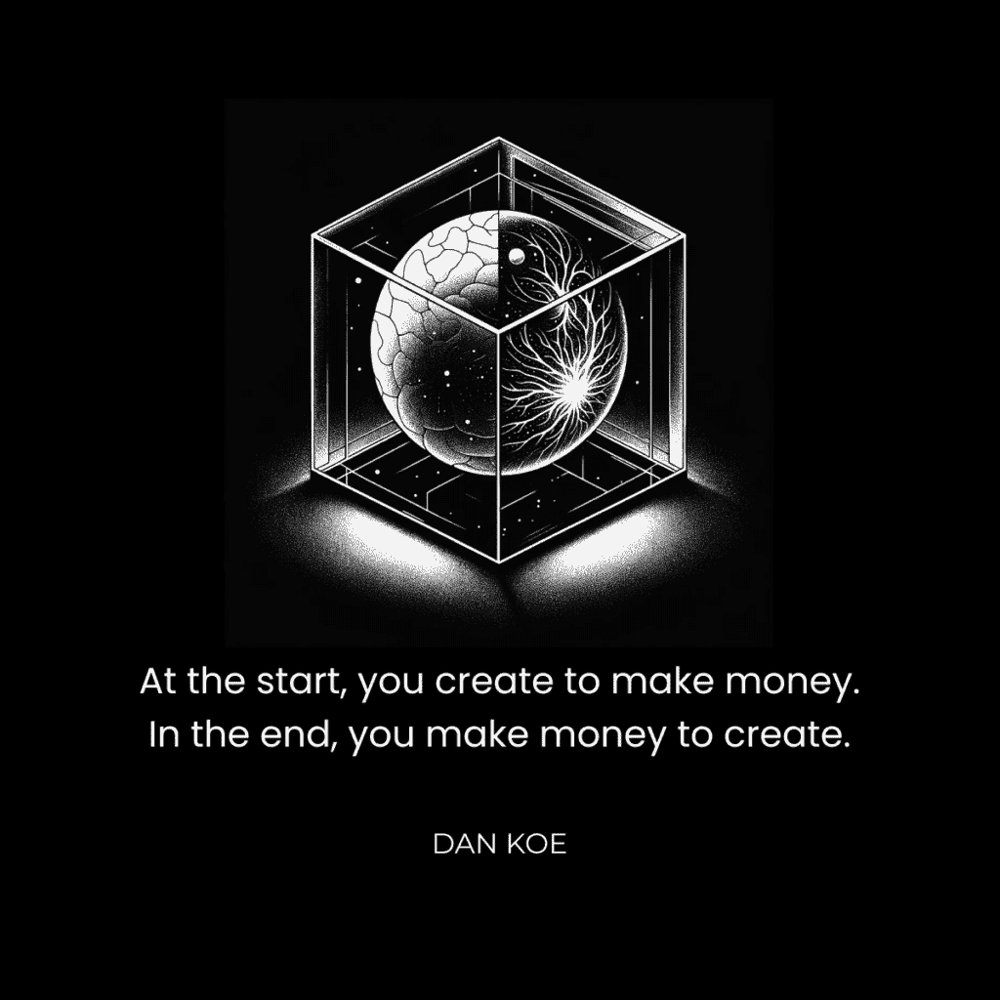
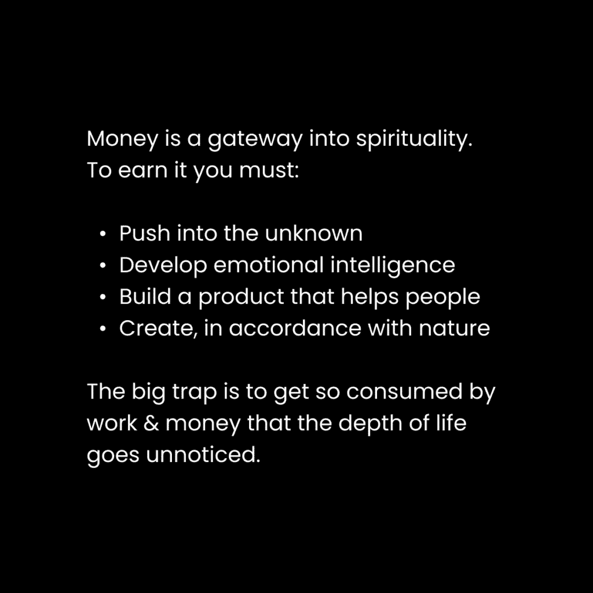
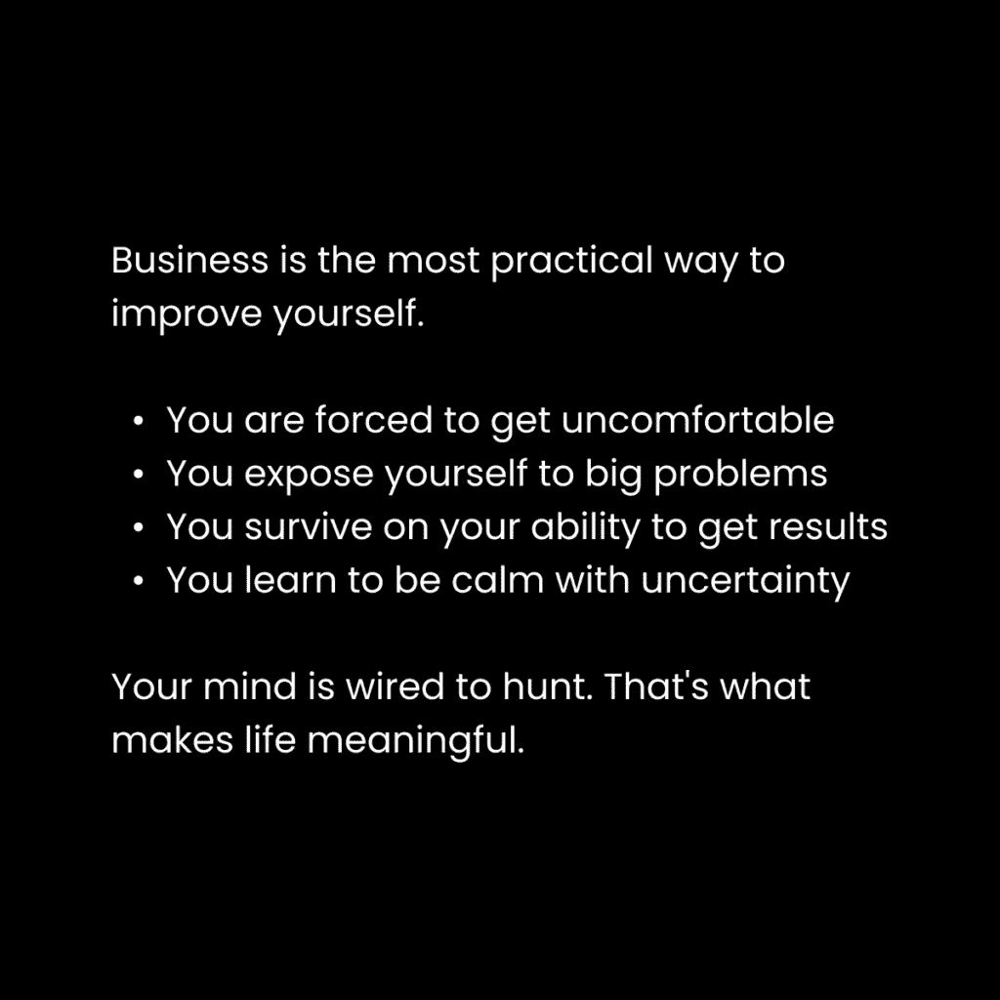

# 个人成长与财富：二十多岁时的财富义务 💰

在本节课中，我们将探讨一个核心观点：在二十多岁时追求财富不仅是一种经济行为，更是一种精神上的义务。我们将分析金钱作为个人成长工具的角色，以及如何通过创业和创造者哲学来实现有意义的生活。

---

我总是认为渴望金钱是件坏事。
一种无意识的羞耻感将赚钱与邪恶联系在一起。这种观念通常来自那些在生活中贡献不多的人。
我过去没有意识到，金钱可以成为精神成长的载体。

**开启这封信的核心思想：**
**不要为想要赚钱而感到内疚。**
金钱是满足基本需求的工具，是生存的必需品。许多人拒绝承认对金钱的需求（而非欲望），从而将自己困在狭隘的生存状态中。
金钱是解决问题的工具。
问题在于你思想和潜能的局限。当你解决一个真实问题并传递解决方案时，你就在为人类的进化做出贡献。
创业是你能做的最具精神性的事情之一。
你在二十多岁时有精神上的义务变得富有，因为在当今世界，金钱是个人发展的障碍。如果基本需求未得到满足，也没有有意义的工作来集中你的注意力，就很难达到更高的意识层次。
没有金钱，你可能会陷入默认的生活方式：上学、做一份讨厌的工作、与一个不在乎的配偶结婚，然后在某天醒来时疑惑时间都去哪儿了。

## 商业作为精神成长的载体 🧘

上一节我们讨论了金钱与精神成长的关系，本节中我们来看看商业如何具体成为这种成长的载体。

> 你正被吸引到你最高的版本，而你核心的深处能感知到它。外部的进化召唤需要你雕琢内在，打破由你的条件作用形成的心理结构。——《专注的艺术》

最大的问题在于：
大多数人拒绝追求物质目标，因为他们看不到物质之外的东西。
一个人可能冲动地购买一辆豪车，但这不一定就是物质主义的追求。
他们可以发展到对汽车本身深度着迷。他们可以研究其部件，将其变成一种职业，并利用它作为进入心流状态的门户。
**经验是：表面的追求可以孕育出形而上的意义。**
一个人可以为了追求地位和金钱而开始创业，但同样的生意可以让他们接触到经营所需的深层技能、客户成果以及内心世界的运作方式。他们爱上了这个揭示现实的“裂缝”，而这个“裂缝”教会了他们关于现实本身的知识。
追求金钱几乎总是从表面开始。
这并不意味着它是坏事。
它可能是让你接触到深度的唯一方式。
就像举重一样。你开始是为了虚荣，但留下来是为了疗愈。

当你找到以下三者的交汇点时，生活将变得有意义且富足：
*   能让你生存的事物
*   你每天喜欢做的事情
*   能帮助他人进步的事物

是的，赚钱伴随着“不好”的部分。
就像歌曲中存在“不好”的歌词一样。
欢迎来到生活。你永远无法摆脱“不好”。你只是学会放大视野，培养一个强大的未来愿景，并确保总体叙事创造的是天堂，而非地狱。
大多数人从未达到这个阶段，因为他们无法在激情被培养出来之前坚持追求一个目标。
你一开始并不充满激情。
你根据投入目标的能量多少而变得充满激情。
所有追求起初都是物质主义的，直到形成哲学上的掌控感。然后，它便成为你进入未知、扩展和发展的工具。就像一段关系，你最初被对方的外表所吸引，然后才被引向他们存在的深度。
在生活的所有领域，外表和深度同样重要。问题在于人们从未深入探索。他们像分心的多巴胺成瘾者一样在表面跳来跳去。
他们的心灵反复播放熟悉的过去和已知的未来。
他们重复着同样的经历，却从未解决他们头脑中免费存在的问题。必须解决这些问题，才能超越他们当前的心灵和处境。
最终，你必须踢开那些心理的根基，让新的根基占据其位。
每一个外部问题都需要一个内部问题来解决。
如果你不去追求一个可能看似肤浅的目标来逆转熵增，你的心灵、客户的心灵乃至宇宙本身都会陷入混乱。
你没有达到你想要的地方，是因为你还没有解决能解锁你心灵下一层次的问题。

## 金钱是一种精神能量 – 去中心化的新经济 🌐

上一节我们探讨了商业的精神性，本节我们将从更宏观的“精神视角”来理解金钱和经济趋势。

大多数人并不理解什么是精神。
他们被精神性吸引，是因为它承诺减轻痛苦，但他们误解了它，并沉迷于一个新的身份——长发和嬉皮士服装，以感到与众不同（可能还更高尚）。
精神是你与比你更宏大事物的连接。
精神是与你所归属的整体合而为一。
体育可以是精神的，因为你与团队是一体的。这被称为“团队精神”。
工作可以是精神的，因为你与你的工作影响是一体的。“心流状态”常被描述为一种精神体验。
精神是消解构成你自我的那些界限。
商业为你提供了一个精神上的理由。
它让你面临新的问题，这些问题需要新的视角来导航。
大多数人仍停留在10年前的位置。他们不需要在精神上阅读更多，他们需要挑战自己，这样他们才会被迫发展到需要精神性才能进入下一阶段。
转向精神视角可以让你理解金钱是一种能量，它通过解决问题来推动增长、扩张和进化。
“转向精神视角”就是放大视角，观察现实。
当你这样做时，你会注意到自然规律的模式：
*   统一与分裂
*   创造与毁灭
*   集中化与去中心化

正如上面所说，下面也是如此。
现实是终极的心理模型。这种精神视角是富人和成功人士的“秘密”。他们将自然规律应用于日常行动。他们观察市场，理解其方向，并据此做出明智决策。
很多人尚未注意到的一个大趋势是从公司到个人的转变。
以下是相关数据：
*   自由职业者占劳动力总数的46.6%（较2020年的36%大幅增长）。
*   预计到2028年，创作者经济将从2500亿美元增长到4800亿美元。人们常以为自己来得太晚，而实际上它才刚刚开始。
*   经济青睐有利可图的商业模式。像创作者这样的技术赋能企业，可以通过数字产品和服务实现95%的利润率运营——这导致该领域新平台和工具的更多发展。
*   大公司正在要求其领导者积极参与社交媒体以维护品牌声誉。公司营销在减少，人性化营销在增加。

公司开始选择承包商和创作者作为工人和营销人员。
我们在Kortex的团队由承包商和创作者驱动。我们没有雇员。我们通过创作者的受众生成流量，并为团队提供灵活的工作日和合同工作。
从精神视角来看，将真实的自我转化为企业并不困难。

## 创造者哲学——这不仅仅是一个光鲜的互联网工作，而是一种生活方式。🚀

上一节我们从宏观趋势分析了个人经济，本节我们将深入探讨作为其核心的“创造者哲学”及其行动步骤。

创造者哲学不是一种商业模式，而是一种生活方式。
提升自己，帮助那些想要被帮助的人。
解决你自己的问题，出售解决方案。
掌控自己，进而影响世界。
以下是你可以开始采取行动的几个步骤：

### 1) 掌握生存之道（解决你自己的问题）

当你需要从别人那里获取某些东西时，你无法保持真实。
金钱是消除那些使你失去真实性的依赖的工具。
地球上的每个个体都必须自我实现，以便以最佳方式为人类做出贡献。而且，人类的强大程度取决于其最薄弱的环节。一家企业让你遇到真正的难题，解决它们，并传承那些能扩展他人思维的产品。
虽然这可以通过完美的职业道路实现，但这不在我的帮助范围内，也不是你能完全控制的事情。
创业是现代生存之道。
我们寻找资源（在现代意义上就是金钱）来满足需求，并*创造*我们喜欢的工作。如果我们不喜欢某些部分，企业允许你消除、委托或自动化那部分工作。
我的建议与我所有信件中的一致：
*   解决你生活中的表面问题
*   在多维度上变得强健（心智、身体、金钱、关系）
*   通过改进和建设，发现你更深层的兴趣和痴迷
*   利用互联网上的内容和产品，记录你的旅程和解决方案

95%的人的问题都围绕着健康、财富、关系和幸福。
如果你能在自己的生活中解决这些问题并记录解决方案，你就可以为所获得的知识收费。
我们在上一封信[《作为一人企业，每天工作2-4小时，从零到一百万》](https://thedankoe.com/letters/zero-to-1-million-as-a-one-person-business-while-working-2-4-hours-per-day/)中讨论过这一点。
个人最好向比他们领先一步的人学习，而不是领先十步的人。

### 2) 创造你自己的哲学

关于如何赚钱、如何获得性、以及可以应用于心理健康的各类急救包的肤浅建议已经够多了。
我们需要更多追求真理的个体。
那些理解到，规定的、按部就班的建议外表光鲜但内在空洞的人。
我们需要更多的人去攻击问题的根源，这通常是形而上学、精神或认识论层面的。
世界急需深度，而这只能通过打造自己的道路来实现。
哲学基于经验。
深度是通过实验和痴迷创造的。
你必须尝试不同的技能和兴趣，直到找到那个让你的事业变得神圣的。那个让你无法停止深入挖掘的。在网上（集体意识中）记录你的旅程，让每个人都能从中学习。
你必须设定一个理想未来的目标，全心全意地追求它，犯错误，[记录你的教训](https://kortex.co)，并使用可持续的解决方案纠正你的行为。
你的哲学是为美好生活提出的世界观和生活方式。
人们需要学习哪些技能、信念和习惯？
对于我自己的“工作少，赚钱多，享受生活”的哲学——人们需要营销、销售、写作、互补的可销售技能、成长心态、对形而上学的研究、日常运动、日常写作、日常问题解决和日常休息。我的所有内容都围绕这个主题展开。
这就是我在[《2小时作家》](https://2hourwriter.com)和[《数字经济学》](https://digitaleconomics.school)中教授的内容。
这并不适用于每个人。这正是关键所在。
你的工作是吸引像你一样的人，让其他人去吸引像他们一样的人。

### 3) 将其转变为你的“公立学校”

> 我坚信，学校教育的未来将在网上进行，创作者作为教师，每个学生都可以加入与他们兴趣、价值观和首选学习方法最相符的“学校”。——《专注的艺术》

*一个教育体系不应该主宰某人超过12年的生活。*
学生应该在几年后超越一个基于创作者的“学校”，继续前进，最终能够开设自己的学校——前提是其他学校都秉持批判性思维和个人经验的根本原则。
将创建知识库并在线上以你的品牌或学校分享它作为你一生的使命，同时有一个能吸引正确人群的基础哲学。
你的“公立学校”就是数字房地产。
利用 Twitter、Instagram 和 LinkedIn 吸引广泛受众。
利用 YouTube、播客、博客或通讯来教育和培养受众。
提供一系列产品，从低成本课程到会员资格，再到高成本的定制辅导。
这是我致力于教授的内容，因为我看到了这个领域的机遇。
最终，你将获得资源来启动你想要的企业，以进一步传播你的信息。
我们在[Kortex大学](https://university.kortex.co)引导你，让你在90天内开启你的数字职业生涯。

## 全面的综合者——有意义的职业生涯 🧩

在创造者哲学下，创作者经济不会饱和，原因如下：

**1) 你的社区会进化**
当你不将自己局限于某个特定标签、利基或现实中的隔间时，唯一的选项就是进化。
人类和社区不会固守一个目标。
一旦实现了一个目标，你就会继续前进，去实现下一个自动显现的目标。

**2) 你的产品会进化**
我最初是一名网页设计师，我的产品和服务核心围绕于此。
随着我个人和业务的成长，我转向了不同的技能和兴趣。
我的产品也遵循了同样的模式，我有效地在我的网页设计市场下达到了饱和。

**3) 独特的兴趣网络**
当你专注于构成你哲学的、真正的兴趣组合时，你的品牌就不再被分割。
一个谈论健身、商业和科技的人，与一个谈论健身、商业和灵性的人截然不同。

**4) 大型创作者拥有丰富的资源**
经常可以看到，大型创作者在所有平台上的产出都在减少。
观察一个拥有超过100万订阅者的YouTuber。
大约50%的情况下，你会发现他们几乎不发布内容，或者完全停止了。
对于X（前Twitter）创作者也是如此。大型账户通常减少到每周只发布几次。
这为新创作者提供了进入市场、吸引关注以及在没有太多“大玩家”竞争的情况下建立网络和资源的机会。
大玩家们则继续追求新目标，比如组建家庭，或利用他们现在拥有的杠杆建立独立的公司。

**对深度的需求**
我们已经到达了创作者经济的一个临界点。
内容平台充斥着为了增长而存在的基本、肤浅和重复的思想。
这不一定不好，并且仍然有助于账户增长，但我的问题是……为什么？
*   为什么要过度系统化思想？
*   为什么要从你的商业中剥离灵魂？
*   为什么将增长、收入和浅层影响置于一切之上？
*   为什么要限制你作为个体唯一可以区别于他人的东西：你的创造力？

该领域的整体意识水平正在上升。
市场将要求创作者超越陈词滥调以及老套的、按部就班的自我帮助建议。
这只能在优先考虑深度、视角和整体综合的情况下实现。

**整体综合者**
让我们定义一下什么是“整体综合者”：
*一个追求自己愿景，并利用所获得的独特技能和兴趣开辟自己道路的人。他们不将这些技能或兴趣视为独立的部分，而是一个相互关联的整体，这是他们生活中必要的方面（而不是为了快速赚钱的临时拼凑）。他们一生的使命是在这条道路上提炼、教育和传播他们的个人经验。*

简而言之，一个以有说服力和教育性的方式记录他们追求美好生活的人，就是一个整体综合者。
这样，你可以吸引与你的声音产生共鸣的社区，帮助他们实现共同目标，而不要将自己限制在现实的一个细分领域。
*   **你的品牌是你的哲学** – 如何过好生活？
*   **你的内容是你的学校** – 他们需要哪些技能和心态？
*   **你的产品是地图** – 一个帮助人们以更少的试错到达你所在位置的整体系统

在更实际的意义上，以下是如何开始：

**1) 确定一个理想的目标**
你生活中是否有一个正在努力实现或已经实现的大目标？
你是否健康？你是否掌握了一项技能（如写作）？你是否理解了现实的本质？那是什么？无论你认为它多么渺小或不重要，你取得了什么成就？
这里的关键是：
不要专注于目标本身，而是专注于它为你创造的生活方式。

**2) 确定你的起点**
是什么让你想要改变？
你生活中的燃点问题是什么？
在达到目标之前，你的生活是什么样的？
市场营销关乎转变。
你正在帮助他人从A点（你的起点）走向B点（理想目标）。

**3) 概述一条独特的路径**
现在，概述从A点到B点所需的模块、章节或步骤。
你现在处于一个可以回顾过去并帮助他人避免你所犯错误的人生阶段。
就像你在为一本书拟定大纲。
用人们需要知道、学习和做的*所有*事情来填补空白，以达到目标。考虑技能组合和心态。
互联网赋予了你自我教育的力量，其速度比以往任何人都快。
承担起改善你生活的责任，追求你的好奇心，并分享你的发现。
你还能做些什么更好的事呢？

在你着手创办一家价值十亿美元的技术公司之前，考虑从唯一重要的事情开始：
*提升每个人为了进化都必须提升的东西：人类体验的质量。*
当更多的人掌握自己的生活时，他们可以将自己思维的创造力结合起来，共同解决全球问题。
到那时，你就会知道该做什么了。
你将成为一个追求新途径并使市场饱和度降低的大创造者。

---

**本节课总结：**
在本节课中，我们一起学习了将二十多岁的财富追求重新定义为一种精神和个人成长的义务。我们探讨了金钱作为解决问题和推动进化的工具，分析了商业和创造者哲学如何成为深度生活的载体。我们了解了从宏观精神视角看待经济趋势的重要性，并制定了成为“整体综合者”的具体行动步骤：解决自身问题、创建个人哲学、并将其转化为教育他人的“学校”。最终，我们认识到，通过真实地记录和分享对美好生活的追求，我们不仅能实现个人富足，还能为提升整体人类体验做出贡献。