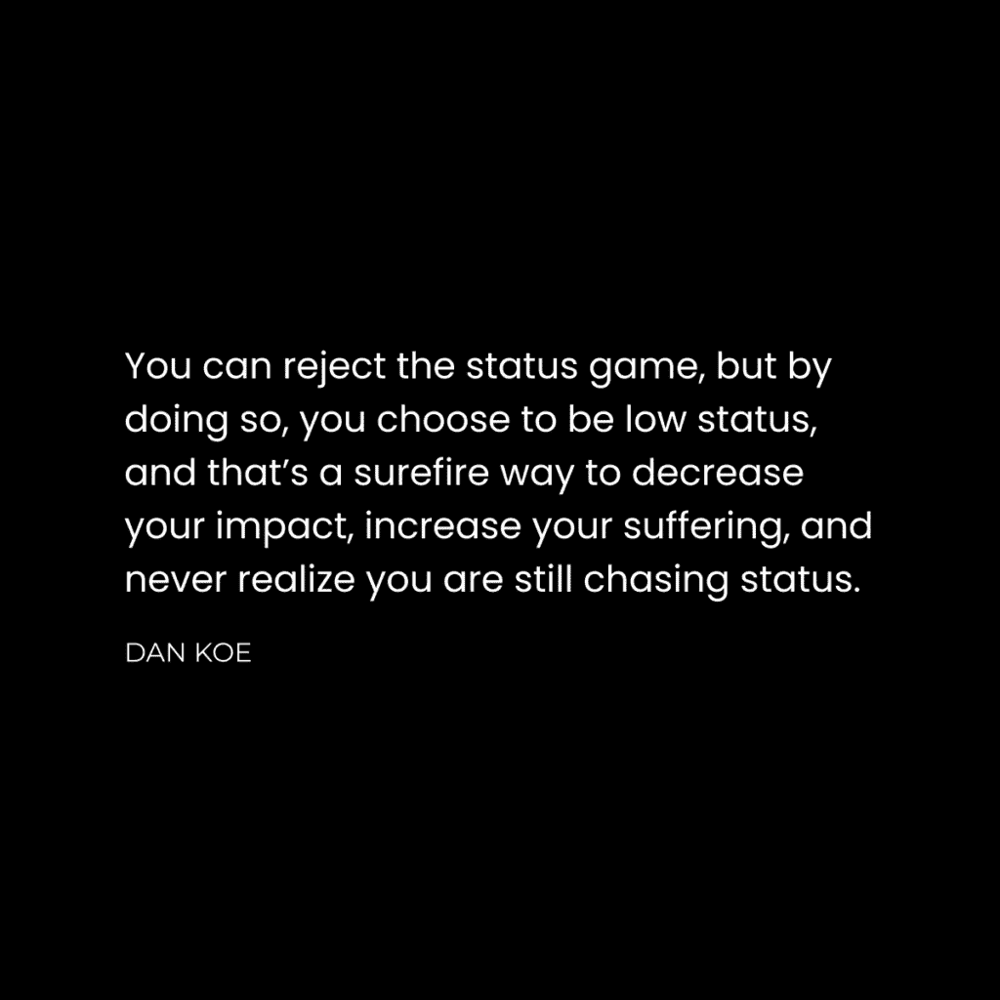

# 价值方程：如何快速成为顶尖 1% 的个人 🚀

在本节课中，我们将学习一个核心框架——价值方程。这个框架将帮助你理解如何通过创造价值来提升个人地位、改善生活并影响他人。我们将从理解“地位”这一基本驱动力开始，逐步拆解构成价值的宏观与微观要素，并最终探讨如何将这套思维应用于实践，塑造顶尖人士的生活方式。

## 追求地位是人类天性

你在追求地位。这是人类本性中一个不可改变的原则。认为追求地位不高尚，这本身仍是在参与地位游戏。消灭欲望的企图本身也是一种欲望。这并非坏事，而是自然现象。接受这一点，你才能开始从中获益。

人们会根据你的相对地位来评判你。不接受这一点，就意味着接受一个可能被不公平对待且对世界影响甚微的生活。你在社交圈、工作、甚至宗教组织中都有一定的地位。初次见面时，人们就会为你分配一个地位。虽然你无法完全控制这一点，但你可以通过自我定位来增加被视为高地位的机会。

人们会根据这个地位决定是否与你交往、雇佣你、支付你报酬或提供帮助。我们崇拜的许多领袖，无论有意无意，都在参与地位游戏。地位是我们物种生存的一部分。当你有意识地运用它时，你可以影响世界并最小化负面影响；如果无意识，你可能会在不知情中进行操纵。

因此，如果你想以足够大的规模为人类做出贡献，地位是**重要的**。它不是一个静态或邪恶的构造，而是有高低层次之分，但没有人从一开始就处于顶端。

## 价值方程：如何让任何事物变得有价值 💎

上一节我们探讨了地位的重要性，本节中我们来看看提升地位的核心方法：创造价值。外观先于深度。物质表现往往是通往更深层价值的起点。通过同时提升外观（感知价值）和深度（实际价值），你就在掌握人生的游戏。

在我看来，地位就是你人生游戏中的经验值。当你理解如何创造价值时，你可以改变生活、帮助他人、清晰沟通，并处理各种事务。我即将教给你的框架，就是关于如何创造问题的解决方案。这是人类行为、商业和沟通的基础。

价值可以体现为真理、故事、进步、转变，或是逆转熵（即对抗混乱）。它是我们心理中寻求意义的信号。我们的大脑中漂浮着许多想法，当它们被正确连接时，你就会感受到清晰，一切变得有意义。

每当你未能实现某个结果（如赚钱、改善健康），通常是因为你缺少了使一切清晰的一个或多个要素。以下是构成清晰路径的三个核心宏观要素：

*   **问题** – 一个未被解决就会造成痛苦的限制或挑战。
*   **目标** – 一个有影响力的最终结果，能让接收者超越问题。
*   **过程** – 一个创造性的系统，用于培养知识、技能和意识，以弥合问题与解决方案之间的差距。

如果你想改善生活，就必须识别问题，将思想导向目标，并尝试各种解决方案，直到找到实现目标的路径。如果你想赚钱，就必须帮助他人识别问题，将他们的注意力引向目标，并给予他们采取行动的清晰度。这个结构适用于写作、营销、产品构建等任何领域。

然而，仅有宏观视角还不够。价值最终归结为**视角**和**感知**。如果人们没有意识到问题，或不相信目标可实现，他们将无法感知你提供的价值。因此，我们需要价值微观营养素来塑造感知。

以下是用于塑造读者感知的六个微观要素：

*   **概念** – 以一种吸引人且易于记忆的方式包装和命名你的价值。*示例：4小时工作日*。
*   **证据** – 通过个人或他人的成果，让人们相信这是可能的。*示例：我帮助约翰减少了工作量并增加了收入*。
*   **风险逆转** – 减少感知到的不确定性、摩擦和达成目标的难度。*示例：你每天只需10分钟即可开始*。
*   **痛点** – 放大问题，说明它如何深刻影响生活，而不仅仅是表面现象。*示例：你没有时间陪伴家人，没有时间追求其他目标*。
*   **好处** – 增强解决问题的欲望，如果能重复获得这些好处，可以维持动力。*示例：选择你工作的时间、内容和伙伴*。
*   **意识** – 意识到问题、并准备好接受解决方案的人群规模。人们通常处于以下五个意识层级中的某一级：
    1.  未意识到问题。
    2.  意识到问题。
    3.  意识到有解决方案。
    4.  意识到特定产品。
    5.  最有意识（准备行动）。

你的沟通策略需要针对不同意识层级的人进行调整，引导他们最终意识到你的价值是他们所需的目标。

## 1% 的生活方式 🏆

前面我们介绍了价值方程的宏观与微观要素，本节我们将探讨如何将这些要素融入日常生活，塑造顶尖人士的生活方式。

所有高价值个体都拥有一种共同的生活方式：他们每天都在逆转熵、追求目标、解决问题。他们不断假设、测试并创造解决方案，然后分发给他人。这种生活方式要求持续地学习、构建和传播价值。

价值就是逆转熵，而熵是趋向混乱的过程。通过创建系统来解决问题、实现目标，你就在逆转熵，这就是价值方程。有一种职业永远不会过时：按照自然规律获得收入。即，通过解决一系列无止境的问题来逆转熵，将解决方案转化为潜在利润，并将你创造的价值分发给他人。

无论经济如何变化，无论技术如何取代工作，担忧本身也是他人正经历的问题，而你可以为此提供解决方案。没有人会给你时间，你必须自己去争取。

你可以从以下步骤开始实践这种生活方式：

1.  **争取时间**：每天早晨在分心之前，抽出1小时专注于创造。
2.  **解决自身问题**：先解决你生活中能产生有利解决方案的问题。
3.  **建立受众**：通过写作和分享内容来传播你的价值。
4.  **产品化解决方案**：将你的解决方案转化为产品，并不断迭代。
5.  **超越生存**：通过创业移除收入上限，而不仅仅依赖工资生存。
6.  **享受成果**：最终，享受你创造出的自由时间。

---

本节课中，我们一起学习了价值方程的核心框架。我们认识到地位是自然的追求，而提升地位的关键在于创造价值。价值由宏观的**问题、目标、过程**和微观的**概念、证据、风险逆转、痛点、好处、意识**共同构成。最后，我们探讨了如何将这套思维融入日常，通过持续解决问题、逆转熵，来塑造顶尖的1%人士的生活方式。掌握这个方程，你就能清晰地创造价值，并以此改变自己的生活与世界。