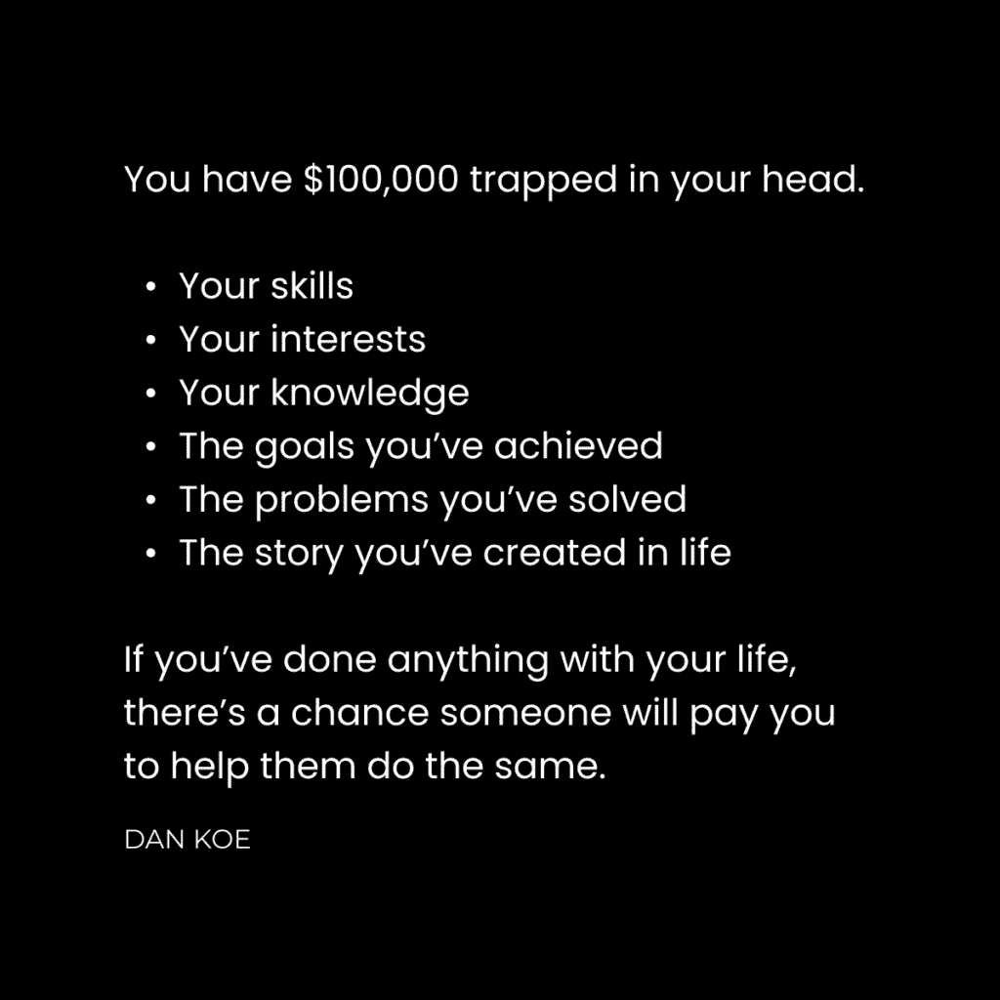

# 数字杠杆：掌控你的收入与生活

在本节课中，我们将探讨如何通过创造产品来掌控自己的收入和生活，摆脱传统雇佣模式的束缚，并利用互联网时代的数字杠杆实现个人自由。

## 概述

你被教导去上学、找工作、存钱直到退休。你被训练去服从权威，学习不关心的事物，为不关心的人工作，以期最终过上自己想要的生活。然而，这种生活可能永远不会到来。你被编程为社会中的一行代码，为他人销售产品，为别人的梦想而奋斗。

好消息是，时代正在改变。工作的去中心化已经开始，机会比以往任何时候都多。远程工作成为常态。自2020年以来，自由职业者比例从36%增长到46.6%。创作者经济预计到2028年将从2500亿美元增长到4800亿美元。互联网将力量归还给了个人。

## 数字杠杆的力量 🚀

上一节我们介绍了传统路径的局限性，本节中我们来看看数字杠杆如何为你提供新的可能性。

社交媒体为任何人从事热爱的事业创造了条件。不相信这一点的人往往是纯粹的消费者。每个人既是创造者也是消费者。你发短信、进行对话、产生想法，每天都在创造。你也购买产品、消费内容，每天都在消费。

你必须消费以创造，但若不保持平衡，大脑会充满压力和焦虑，让你看不到自己的潜力。社交媒体是当前注意力的集中地。这个地点可能改变，但原则不变：**若想掌控生活，你必须创造并分发有价值的产品到注意力集中的地方。你必须贡献多于索取。**

现在，注意力集中在社交媒体上。拒绝参与这个新游戏是愚蠢的。其美妙之处在于：

以下是利用数字杠杆的优势：
*   你不需要启动资金。
*   你不需要很多经验。
*   你不需要很多关注者。
*   你不需要担心市场饱和。
*   你不必过度担忧利润率、运营成本或供应链。

技术已发展到你可以以 **90%以上** 的利润率和每天 **2-4小时** 的工作时间经营一个单人业务。

## 建立你的分销渠道 📢

上一节我们了解了数字杠杆的优势，本节中我们来看看如何建立自己的受众，即分销渠道。

你需要一个受众。目前，受众集中在社交媒体上。大多数人将社交媒体视为手机上的愚蠢应用，却未意识到这是经济、商业、学习和生活的巨大组成部分。

我们的祖先在部落中拥有小众受众。随着印刷机、广播和电视的发展，获取受众的方式发生了巨变。核心要点是：**你需要一群人了解你做什么以及如何帮助他们。** 这是成为自己生活CEO的唯一方式。

你不需要挨家挨户推销或发送数千封冷邮件。你仍然需要为作品建立分销渠道。现在，你可以在X（原Twitter）等应用上发布内容，让大号转发，一天内就能获得数百关注者。

大多数人认为自己无法建立受众，是因为他们没有花时间学习写作和说服这些核心技能。他们认为自己做不到以下事情：

以下是建立受众的关键步骤：
*   通过模仿有效的方法来撰写有影响力的帖子。（所有人都是从模仿开始的。）
*   向一个大号发送私信，提供价值（知识或金钱）以建立联系。
*   说服他们用你想要的（如转发）交换你提供的价值。
*   或者，撰写关于某人的帖子，希望他们转发以增加其社会证明。（例如，[这个案例](https://x.com/hosun_chung/status/1772277469648720274)带来了近700名新关注者。）
*   让成千上万人看到你的帖子，其中部分人会关注你。
*   重复此过程，直到你拥有一个渴望付费的受众。
*   推出产品并获得自由。

随着技能练习，看到结果所需的时间会减少。起初可能困难，但投入时间最终会减少到每天1-2小时的写作和自我推广。

许多人陷入“奴隶教育”，学习特定职业技能以执行特定任务，并拒绝学习任何能提升潜力的东西。若想掌控未来，你必须通过写作和说服力来建立受众——这些是自人类在岩石上刻符号以来就存在的自由技能。

## 打造你的产品 🛠️

上一节我们探讨了如何建立受众，本节中我们来看看如何将你的知识和技能转化为产品。

你可以成为自由职业者、教练或开设代理机构。但这些服务型企业可能无法实现你创业的终极目标：**完全掌控你的时间**。服务型企业可以作为起点，但存在陷阱。

过去，我建议人们从服务起步，再过渡到产品。许多人成功了，但更多人失败了。他们误以为可以快速学会技能，用糟糕的结果欺骗客户来替代收入。

如果你有正确的心态，可以从服务开始赚钱。但若你丝毫没有发展自己，最好玩长期游戏。

以下是打造产品的长期策略：
*   提升自己。
*   在公共场合记录你的旅程。
*   将你的进步过程打包成一个产品。
*   帮助他人实现你设定的目标。

对于追求完全时间自由的人来说，产品是最高杠杆的游戏。**产品在你睡觉时也能自我满足并进行销售。** 这就是为什么我们从建立受众开始：
*   你保持长期心态。
*   你出于正确的理由进入。
*   你为自己设定了几十年的成功。
*   你通过产品帮助更多人取得成果。
*   你的内容不再感觉受限和狭隘。
*   你通过内容发现受众的需求（基于互动数据）。
*   你可以利用这些信息确保产品成功。

你头脑中困着价值10万美元的想法。如何提取它？首先，理解人们购买产品的原因：**他们想要一种转变，希望在生活中某个领域获得轻微或显著的改善。** 他们希望通过技能获取、生产力和自我提升来提高市场价值。他们想赚更多钱、节省时间、提高生活质量。

因此，我们从永恒的市场需求入手：**健康、财富、关系和幸福**。这是我们为任何产品定位的方式。

现在，遵循以下步骤来开发产品：

以下是开发产品的具体步骤：
*   将自己变成你的理想客户画像。
*   列出你的兴趣。
*   列出你的目标。
*   列出你面临的问题。
*   列出克服这些问题并实现目标的具体方法。

现在，你有了品牌信息、几十个内容想法和一个有利可图的产品起点。潜在想法可以涉及营养、训练、心理健康、灵性、技能获取、生产力、心理学或任何你能学习并受益的领域。

如果你在生活中尚未取得太多成就，那么取得成就就是第一步。是的，你必须走出舒适区，培养某种形式的价值。

如果你已经实现了一个目标，你就已经成功了。**将实现该目标所需的一切打包成数字产品。** 例如：一门课程、辅导服务、小组、研讨会、模板、清单、系统、教程、项目、跟踪器，或任何你看到其他品牌销售的东西。

你可以销售实体产品或服务，但最终目标应该是销售一个高利润的数字产品，它需要最少的维护，并能在你睡觉时销售。毕竟，我们都想要自由，但你需要有受众才能实现。

如果市场上已有类似产品，那也没关系。不要假设每个人都了解它。用你能找到的最独特的品牌——**你自己的品牌**——来销售它，并率先向人们介绍这个产品的重要性。它会卖出去的。

向你的过去、现在和未来的自己写信，以吸引受众。创建一个比你之前用过的更好的产品。创建一个你想要但不存在的产品。创建一个解决你生活中问题的产品。

通过说明产品如何影响你的生活来推广它。**个人经历是你与他人区别开来的东西，无人可以复制。**

大多数企业失败是因为它们试图解决自己没有经历过的问题。不要成为其中之一。

## 模仿，然后创新 🔄

上一节我们详细介绍了产品打造过程，本节中我们来看看如何通过模仿与创新来加速你的成功。

你是一个跟风者。你头脑中的每一个想法要么是观察所得，要么是从外部学习而来。你通过自我反思所做出的发现，也正因如此才成为可能。认为不应该模仿他人是愚蠢的，尤其是当他们所做之事有效时。**模仿是我们生存的方式。**

每个人既是模仿者，也是创新者。创新者创造并测试新想法。模仿者实践这些想法，并将其传播给全人类。显然，你不会直接复制粘贴，那样会成为局外人。你需要长远思考。

如果你不知道写什么或创造什么，你必须沉浸在你所敬佩的人的创作中。最好找到多个来源，直到你的大脑信息过载。**创造力的本质就是紧张后的释放导致突破。**

以下是实践模仿与创新的方法：
*   创建一个你喜欢的写作或内容数据库。
*   基于有效的方法练习写作，但加入你自己的想法。
*   购买与你想要创建的产品类似的数字产品。研究其结构并填补空白。

当我创建教授网页设计技能的数字产品时，我先勾勒了产品大纲。但我不得不购买其他课程，以发现我遗漏的部分。只有这样，我才能完成产品并确保其质量。其余的都来自迭代。

你必须发布一些糟糕的写作和产品。你必须愿意看起来像个新手。你必须获得反馈，以了解你的创作是否有价值。只有这样，你才能改进，否则你不知道如何改进。

## 总结

在本节课中，我们一起学习了如何通过数字杠杆掌控生活。我们从概述传统路径的陷阱开始，探讨了数字杠杆的优势和建立受众（分销渠道）的方法。接着，我们深入研究了如何将个人知识和旅程转化为高利润的数字产品。最后，我们强调了通过模仿有效模式并加入个人创新来加速成功的重要性。

核心路径可以总结为：**写作以建立受众 -> 推出产品以赢得自由**。现在，开始行动，享受你创造的自由。