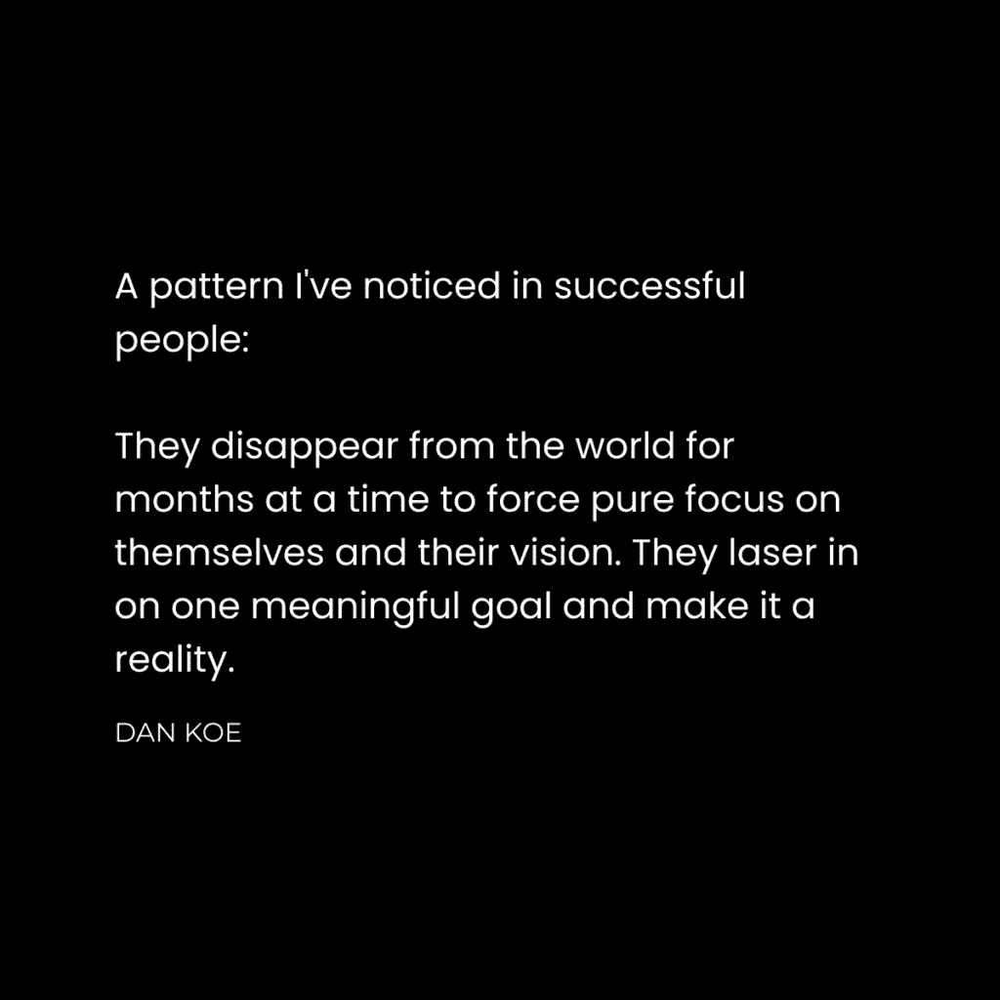
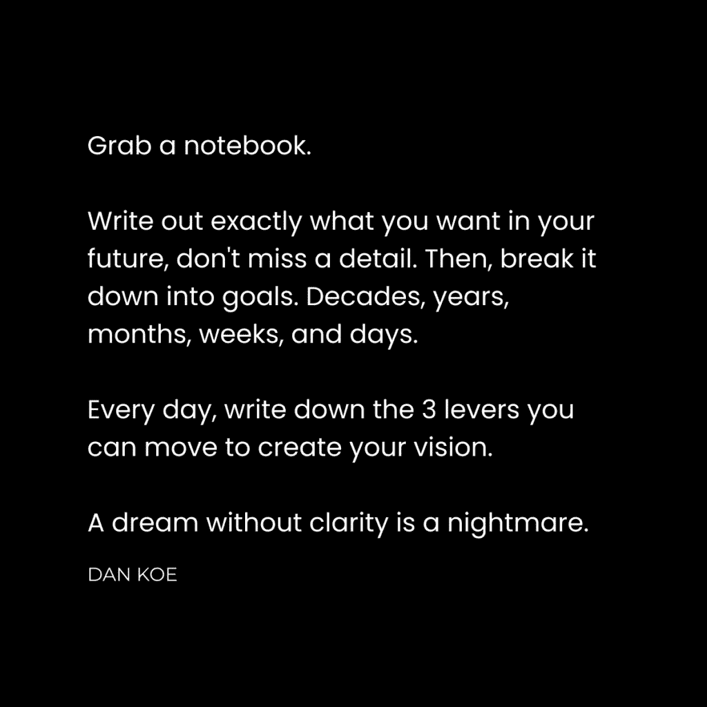
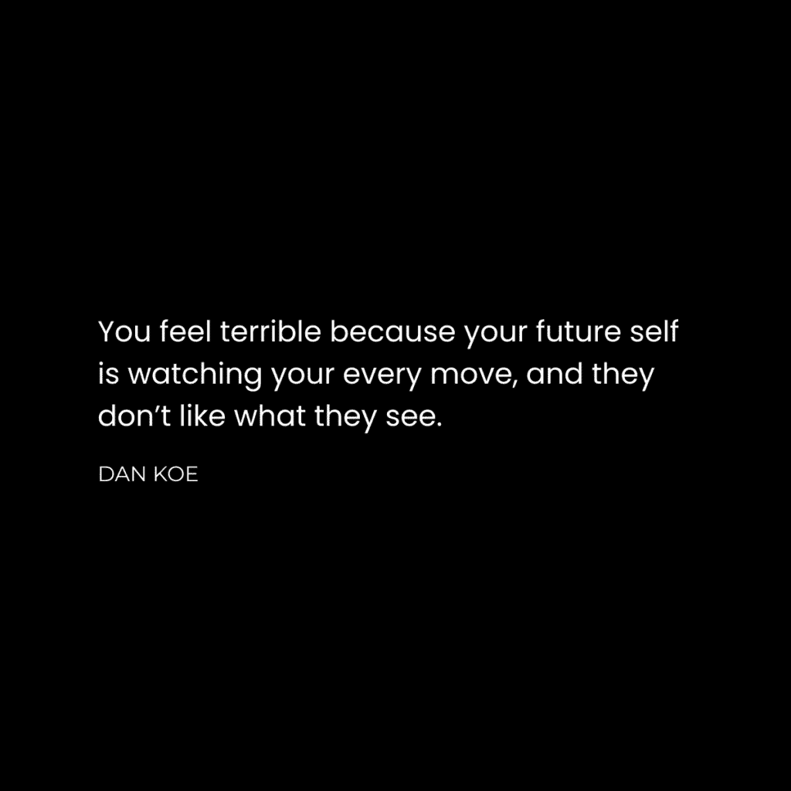

# 个人成长：消失并重现，焕然一新（改变生活的12条法则）

在本节课中，我们将学习一个系统性的个人成长框架。这个框架包含12条核心法则，旨在帮助你明确目标、制定计划并采取有效行动，从而彻底改变你的生活轨迹。我们将从理解问题根源开始，逐步构建一个从愿景到执行的完整体系。

## 概述：问题的核心

人们常说“我不知道自己想要什么”。这句话的真实含义是“我不想做得到我想要的东西所需要付出的工作”。

你并非不知道自己想要什么。你知道自己不想要什么，这意味着你知道自己想要什么。你只是在逃避实现目标所需付出的代价。

观察社会并明确自己不想要什么非常简单。例如：

*   一份讨厌的工作。
*   一个讨厌的身体。
*   一段讨厌的伴侣关系。
*   一个讨厌自己、充满纷扰的内心。

从这些“不想要”中，可以轻易推导出“必须做”的事情：

*   成为一名企业家，并接受可能的多次失败。
*   获取影响力，以摆脱不愿做的工作。
*   坚持健身并关注营养。
*   让上述努力在各个生活领域创造更多机会。
*   通过承担递增的责任来创造平静的内心。随着你变得强大，重担会感觉更轻。

某种形式的这条道路是每个人注定要走的。你的心理渴望成就与超越。你存在的深度想要这些东西，但你的自我被它自以为想要的事物分散了注意力。

这就是问题所在：你缺乏集中思想的方法。你没有一个比生活中分散注意力的事物更有分量的未来计划。你难以维持长期视野，陷入了永无止境的、制造短期压力的工作中。

如果拥有一个能决定你全部成功的单一框架，感觉会如何？一个在你感到迷失时可以随时参考的框架？这就是我们接下来要探讨的内容。

## 创造的12条法则

你需要一个计划。因为如果你没有，社会就有，并且他们已经为你规划了几十年。

从出生那天起，你就被社会分配了目标。这些目标持续塑造着你看待世界的方式。你学会了实现这些目标所需的技能，注册了与之匹配的机会。你经历的一切，都通过引导你头脑中形成的、有意识或无意识的目标系统的视角来体验。

如果我们想建立有意义、富足且有影响力的生活，就必须追求理想的未来，创造一个值得讲述的故事，并将这条道路传递给准备好接受它的人。

在经历了十年创造与失败的循环后，我总结出一个宏观框架，它能帮助你在所做的任何事上取得成功。这些模式可见于营销、销售、人类行为、巅峰表现、心理学、故事、游戏、价值创造与分配的结构、成功的产品设计，以及任何涉及创造和分配价值的过程。

你可以将此框架作为生活的指路明灯，同时我也鼓励你思考如何将其应用于你的业务、人际关系和日常对话中。

上一节我们探讨了缺乏计划的普遍问题，本节中我们来看看构成个人成长系统的第一个核心概念：反愿景。

### **1. 反愿景**

我们从反愿景开始。它是你存在的祸根，也是你将培养的世界观的第一极。它是一种积极的恐惧机制，能推动你采取行动。

你的反愿景是你不希望生活的未来。开始记录你不想重复的经历。

以下是记录反愿景时需要关注的几个方面：

*   你不愿意学习的材料。
*   你不愿意完成的工作。
*   你不希望发生的争论。

你无法立刻摆脱它们。你应该将它们识别为需要解决的问题。

理解了什么是你不想要的之后，我们需要一个积极的指引。接下来，让我们看看与之对应的概念：愿景。

### **2. 愿景**

如果你没有愿景，你就会迷失。你无法创造结果，因此注定过着机械的生活，追求确定性的结局。

在你生活的任何领域，每一个决定都必须经过你的愿景过滤。这是为你行动赋予意义并最小化干扰的方法。

写下你希望从生活中获得的确切东西。不要遗漏任何细节，但要明白这是一个迭代的过程。

你不可能一开始就做对，也可能永远做不到完美。这不是重点。花30分钟生成一个“最小可行愿景”。经常回顾它，随着你的愿望因经历和失败而不可避免地改变，进行添加、删除和改进。

有了清晰的愿景，我们需要一条通往它的道路。这就是使命的作用。

### **3. 使命**

你的使命是你生活中最重要的事情。它是连接你“所做”和“所不想要”之间的桥梁，是你正在奋斗的、通往愿景的道路。

任何与你的使命不一致的东西都应被视为干扰。

你的使命会随着对新信念、新机会和新知识的认识而发展。你的使命需要信念。除非你迈出第一步，否则你看不见下一步。一旦你迈出第一步，第二步可能与你想象的一切都不同。

明确了道路，我们还需要设定行路的标准。这引出了下一个法则：标准。

### **4. 标准**

你之所以没有达到想要的位置，是因为你对现状感到满意。

你不是屈服于处境，而是接受它，以便能够前进。

标准是从你的环境中吸收的。

以下是影响你标准的主要环境因素：

*   你交往的朋友。
*   你阅读的书籍。
*   你消费的媒体。
*   抚养你的父母。
*   那些“无所不知”的老师。

可能是时候做出改变，并坐下来思考其后果了。

设定了行为标准，我们需要将宏大的愿景转化为具体可执行的目标。这就是目标法则。

### **5. 目标**

大目标提供方向，小目标提供清晰度。当面前的任务简单到你不得不完成时，你就不再需要依赖动力。

将你的愿景分解为十年、一年、一个月、一周和一天的目标。它们是你的指南，而非你的主人。

对愿景要固执，对细节要灵活。你的目标会随着你的变化而变化，对此应感到坦然。

目标指明了方向，但实现目标需要具体的载体。接下来，我们看看如何通过项目来落实。

### **6. 项目**

学习来自奋斗，而非记忆。你需要一系列有形的项目来实现你的愿景。

以下是启动一个项目的关键步骤：

*   将你的目标转化为项目。
*   构建项目大纲。
*   确定里程碑。
*   设定截止日期。
*   规划需要研究的领域。

先构建，后学习。启动项目，暴露你知识和技能的不足，并以此作为你接受教育的参考点。

要成功完成项目，你需要相应的知识和技能。这就引出了教育的重要性。

### **7. 教育**

你没有达到想要的位置，是因为你没有自己想象的那么聪明。

每个项目都需要一套特定的技能和心态来完成。每日自我教育必须成为你生活中的基石习惯。如果你停止学习，你就停止了进化。机会将不再出现，你会陷入当前的发展阶段停滞不前。

教育是实验的燃料。

然而，资源总是有限的，我们需要学会在限制中创造。这就是下一条法则。

### **8. 限制**

一个傻瓜以牺牲生活中所有美好事物为代价变得富有。一个创造者以他的选择为代价变得富有。

目标上的限制能激发创造力。问题是：为了实现目标，你不愿意牺牲什么？

当你试图在不背叛愿景的情况下实现目标时，创造性挑战就会出现。

你可以在不牺牲家庭的情况下变得富有。你可以在不牺牲事业的情况下保持健康。你可以在不牺牲那些让生活值得活下去的事物的前提下变得有价值。

在限制条件下，我们需要找到最有效的发力点。这涉及到杠杆的使用。

### **9. 杠杆**

每天，你需要优先处理那些能从底层推动你的项目、目标和愿景的任务。

这些任务通常被视为枯燥的基础工作，无法培养掌控感。

做你需要做的事，但将你的愿景作为锚定未知的力量。如果你没有取得进展，那是因为你没有移动真正的杠杆，即使你认为你在移动。

例如，写作是我创作者业务中的主要杠杆（也几乎是所有现代业务的主要杠杆）。

掌握了杠杆，我们还需要合适的挑战来保持成长和乐趣。这就是挑战法则。

### **10. 挑战**

当新手与大师对决时，双方都不会感到快乐：新手会焦虑，大师会无聊。

当你的技能与情境的挑战完美匹配时，世界会变得安静，你将优雅地前进。挑战是乐趣的源泉。

乐趣存在于无聊和焦虑之间的平衡点上，存在于能力的边缘。有意义生活的道路，往往在于视角的简单转变。

在应对挑战的过程中，保持开放和探索的心态至关重要。这需要我们保持好奇心。

### **11. 好奇心**

愿意偏离航线，去发现新的潜力。我们很容易陷入试图逃离的机械常规中。

保持好奇心。深入你的兴趣。让少数问题悬而未决。避免陷入那些使你的思想局限于某个理想化路径的范式和信念。

你的愿景就像一块电池。你必须用经验、教育和“迷路”的经历来为它充电。

最终，所有理论和框架都需要通过实践来验证和个性化。这就是实验的意义。

### **12. 实验**

如果你只是像其他人一样做同样的事情，你注定会得到和其他人一样的结果。

以下是进行有效实验的步骤：

*   研究他人教授并已获成功的过程。
*   尝试多种技术，看看哪一种对你最有效。
*   创建你自己的、能够保持一致性的过程。

例如，在健身方面，尝试不同的训练和营养计划；在人际关系方面，尝试治疗或阅读自助书籍；在商业方面，尝试冷接触和创作有机内容。

避免对“唯一正确的方式”变得教条。没有唯一正确的方式，只有你的方式。而且这种方式并非一成不变，因为游戏的不同级别需要不同的方法来完成。

## 总结：做出更好的决定

本节课中，我们一起学习了一个完整的个人成长框架——创造的12条法则。你现在没有达到想要的位置，是因为：

*   你没有做出能导向有目标的事业的选择。
*   你没有做出能带来满足感的人际关系决定。
*   你没有做出能造就健康、美观身体的决定。

现在，你就是你过去所有选择的体现。因此，如果你想掌控你将成为的人，你的选择至关重要。

这关乎两件事：
1.  **你想成为什么样的人**——这需要视角和宏观视野。
2.  **带你到达那里的选择**——这需要感知和聚焦。

美好的生活是通过不断提醒自己你的愿景，并通过一致的行动将你的身份现实化而创造的。更好的决定源于宏观的视角和微观的感知。

每天，放大你的视野，提醒自己你不想成为的样子。你无需专注于你想要什么，因为它会通过你的选择自然显现。让这个框架常驻脑海。不要让分心之事渗透进来。任何时候面临选择，放大视野并保持一致性，问自己：“这对我试图创造的未来有益吗？”

然后，果断决定。允许失败进入你的生活，这样你才能在下一次纠正自己的行为。意识就是解药。你不必放弃所有坏习惯，你只需要通过你愿景的视角，足够长时间地审视它们及其后果。