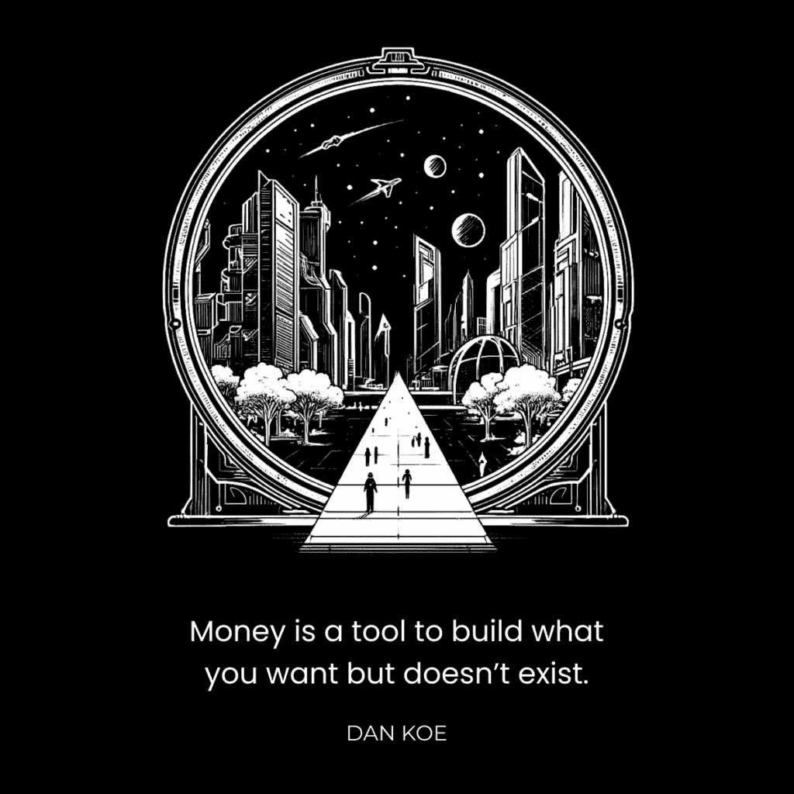

# 创业实战：如何在未公开发布时实现盈利 💰

在本节课中，我们将学习一种非传统的创业方法。我们将探讨如何在不依赖外部投资、不进行大规模公开推广的情况下，通过构建个人品牌和数字产品，在创业初期就实现可观的收入。这种方法的核心在于验证想法、建立受众和创造现金流。

## 引言：一个不同的起点

上个周末，我访问了在加拿大多伦多的开发团队。

在 Kortex，我们做事的方式有些不同。我想公开记录我们构建创业公司的过程，以便你能从我们的失败和成功中学习。

我想谈谈我们如何在 6 个月内，在没有公开发布产品的情况下，赚取了 759,900 美元。

大多数人在创业时存在误区。他们认为需要创业资金、风险投资和大量营销预算。他们常常没有考虑如何获取用户，或者最初的想法是否可行。

我们采取了完全不同的方法。这种方法的好处是任何人都可以做到，坏处是它需要时间。

## 核心教训：从构建过程中学习

当我抵达多伦多时，我问了核心开发者他们在构建 Kortex 过程中最大的教训。他们的回答很有启发性。

上一节我们介绍了创业的常见误区，本节中我们来看看我们从实际构建中学到的具体教训。

**最大的教训是：对不完美感到满意。**

我没有意识到软件开发可以如此复杂和昂贵。我们每周的烧钱速度接近 **$30,000**。我们已经移除了多个耗费数月开发的主要功能，也添加了未计划的功能。建立这个应用是一连串的问题。

所以，我的最大教训是：对做事情不完美感到满意。我们的目标不是快速获取，而是构建一个我们引以为傲、能真正帮助人们的应用。

以下是团队总结的其他关键教训：

*   **第 2 课：成为高效率个体的必要性。**
*   **第 3 课：学会与独行侠团队合作。**
*   **第 4 课：从零开始构建比在一家成熟公司工作需要更多努力。**

## 建立受众群体的重要性 🎯

大多数人在开始创业时甚至不会考虑社交媒体。他们看不到这是通往成功的最大“捷径”。

我们不是在用旧方法建立业务。技术已经进步。你不再需要完全依赖艰苦的直接销售和冷推广。

社交媒体让你能够：
*   通过内容免费测试产品想法。
*   在产品推出前，建立一个想要购买的观众群体。
*   在构建主要产品前，通过销售数字产品来验证想法并获得收入。
*   招募开发者、团队和投资者。

许多人认为我只是为了写内容而写内容。但通过发布数万条推文、新闻通讯和视频，我拥有了**数据**。我知道哪些想法能吸引追随者、客户并促进参与。这让我跳过了大多数初创公司必须经历的艰辛市场研究阶段。

以下是开始建立受众的简单步骤：

### 1. 创建你的主题树

首先，列出你所有感兴趣、有技能和想要讨论的想法。不要一开始就过于细分。从广泛且适用于大多数人的话题开始，例如生产力、自我提升、健康、商业等。

**核心策略**：为你想要的具体受众写作，但要以更广泛的人群也能受益的方式呈现。你需要一个更大的基础受众来传播你的影响力。

### 2. 制造噪音并关注信号

现在，只需开始写作。谈论你的兴趣、观点、专业知识和信仰。教授你的技能和成功的思维方式。

你写得越多，拥有的数据点就越多。模仿那些有效的内容结构。坚持 3-6 个月，然后分析哪些帖子表现更好。将这些验证过的想法融入你的品牌，更频繁地讨论它们，并将它们用于未来的产品和营销中。

## 如何为你的初创公司筹集资金 💡

最后，回答核心问题：我们如何在未推出应用的情况下，在 6 个月内赚取近 80 万美元？

答案相对简单。我们有一支团队在构建 Kortex 应用，同时有创作者在构建“Kortex 大学”来教授写作。我们将产生现金流定为首要任务，这样就不需要外部投资者。

我们使用已验证的想法构建了一个低成本的数字产品（写作课程），并通过正在增长的社交媒体和邮件列表进行推广。简而言之，我们**构建了一个产品，并用社交媒体流量为其提供动力**。

不过，我建议你先在自己的个人品牌下实践这个过程，建立技能和现金流，然后再为创业公司品牌重复它。

以下是你要采取的步骤：

### 1. 写内容，构建项目，并开展客户工作

你需要现金流。当你通过内容测试想法时，你会了解自己能帮助人们做什么。将你的专业知识转化为一个能帮助人们取得成果的“项目”（例如，一对一辅导、小组项目）。

**初期公式**：**高单价 + 深度服务**。当你没有大量受众时，向每位客户收取 **$1,000 - $5,000+** 的费用，通过深度服务确保他们获得结果。

### 2. 获得结果，扩大受众，并产品化你的服务

随着受众增长和客户成果积累，你的议价能力增强。你的全职工作是改进项目，为客户获得更好结果。结果将带来更多客户和经过验证的创业想法。

此时，你可以将服务产品化：
1.  **基于团队的课程**：包含课程大纲、社区和直播辅导。收费更高，每1-3个月启动一期。
2.  **常规课程**：仅出售课程视频和资料。启动一次，收费较低，边际成本几乎为零。

### 3. 构建你的初创公司并重复这个过程

此时你已拥有：
*   来自社交媒体的大量有效数据。
*   亲自帮助过的成功客户案例。
*   可能从你创业想法中受益的数百或数千名学生。
*   一个能产生足够现金流的盈利数字产品业务。

你解决了大多数初创公司的核心问题：**无法获取用户**。你现在可以为自己验证过的创业想法提供资金和初始用户。

现在，为你的创业公司品牌重复这个过程：建立社交媒体、测试内容、从高端服务开始构建价值层级、产品化服务、聘请团队加速发展。

## 总结与展望

本节课中我们一起学习了一种通过构建个人品牌、验证想法和创造现金流来启动创业公司的方法。关键在于**先建立受众和收入，再构建产品**，从而大幅降低风险。

虽然如此，我们仍然可能失败。Kortex 可能不会成功，但这套方法的价值取决于你的技能和执行，而非运气。我希望这能为你提供一个构建自己创业公司的路线图。

当 Kortex 构建完成时，我会分享更多关于我们如何具体构建它的细节。

感谢阅读。