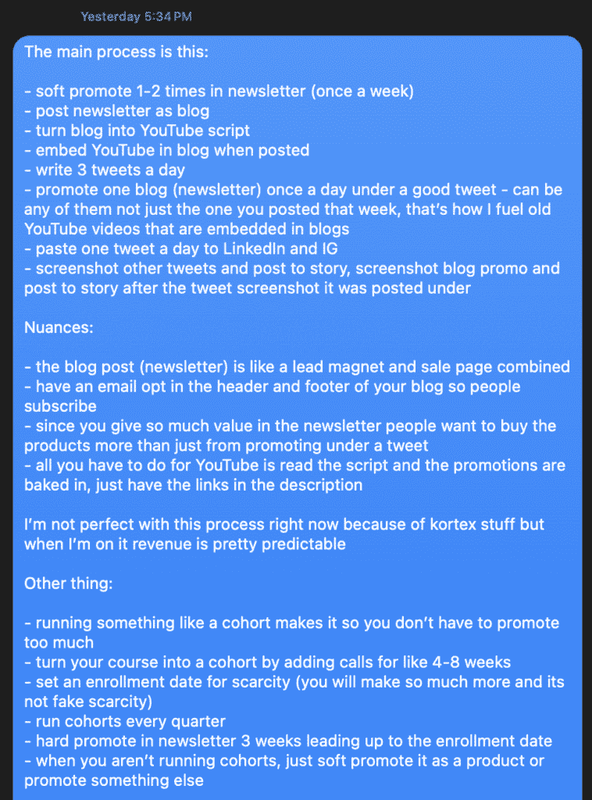

# 生产力提升：战术压力与深度工作策略

在本节课中，我们将学习一种结合了“战术压力”与“深度工作”的策略。这套方法帮助一位自称拖延症患者的人在30天内创造了70万美元的收入。我们将拆解其核心原理与具体执行步骤，让初学者也能理解并应用。

## 概述

拖延常被视为缺点，但本教程提出，拖延可以转化为一种强大的动力来源。关键在于通过“战术压力”为自己创造真实的生存危机，并配合一套结构化的“深度工作”日常安排，将压力转化为专注与高产出的燃料。我们将从核心理念开始，逐步深入到具体的季度规划、日常安排与推广战术。


## 核心理念：将拖延转化为超能力

上一节我们介绍了课程的整体框架，本节中我们来看看其背后的核心思想。

社会常将拖延视为不良习惯。但如果你具有以下特征，拖延可能是你的天性，而非缺陷：

*   你不擅长及时回复信息。
*   你在学生时代很少提前完成作业。
*   客户工作总是被拖到最后一刻。
*   在无人监督的创业中，你很难取得进展。

对于这类人，关键在于学会利用拖延的力量，而非对抗它。拖延者往往在真正的截止日期临近时，才能进入高度专注的“心流”状态，此时的工作质量远高于提前数周进行的分散性工作。你不需要改变自己，而是需要根据这一特点来设计你的工作和生活。

## 战术压力：强迫自己进入生存模式

理解了拖延的本质后，我们需要一种机制来激发这种专注力。这就是“战术压力”。

战术压力的核心是：**有意识地将自己置于“不成功便成仁”的境地，从而消除所有退路，将压力转化为前进的唯一动力。** 这就像为自己安排一场没有保护措施的举重，你只能选择举起重量或被压垮。

以下是应用战术压力的几个真实例子：

*   花光积蓄购买一个昂贵的商业软件，迫使自己必须学会并使用它来赚回成本。
*   报名一门高价课程，迫使自己必须实践课程内容以获得回报。
*   承担远高于当前收入的月度开支（如房租），迫使自己必须提升收入水平。

这种策略在心理上会产生以下积极效果：

*   **保持视角**：生存危机让你除了核心目标外无暇他顾，干扰自然消失。
*   **创造真实截止日期**：金钱的投入或承诺的接受，创造了无法回避的、真实的交付压力。
*   **缩小焦点**：生存模式下的压力会自然地将你的注意力收缩到当前任务上。
*   **使生活充满“心流”**：当所有外界信息都被大脑自动过滤以服务于你的目标时，你会进入一种高效、愉悦的状态。

**公式：战术压力 = 有风险的重大决策 → 生存危机感 → 高度专注与行动**

如果你感到生活停滞不前，或许正是需要迈出这“战术性的一步”的时候。这并非适合所有人，但它迫使你只面对两个选择：解决问题，或者被问题压垮。

## 制造紧迫感：深度工作日常体系

上一节我们介绍了如何通过外部压力激发动力，本节中我们来看看如何将这种动力融入日常，构建一个可持续的深度工作体系。

要有效运用此策略，你需要对自己的时间和收入有高度掌控权，这意味着拥有一份自己的事业至关重要。事业为你提供了通过创造性工作增加收入的弹性空间，这是绝大多数固定工作无法提供的。

### 0) 每日安排基础

我的每日安排围绕“深度工作块”和“硬性截止时间”构建，具体如下：

*   **第一工作块**：用于启动和推进新的核心项目。
*   **第二工作块**：用于内容创作（如写作）。
*   **第三工作块**：用于处理业务的运营与维护工作。
*   **块间休息**：在各工作块之间散步，以理清思路并为下一阶段设定目标。
*   **硬性截止**：设定一个固定的时间（如去健身房）作为每日工作的终点，这迫使工作必须在规定时间内高效完成。

这种安排的反直觉之处在于：**将个人健康和生活置于工作之上，反而能创造更强的工作紧迫感和专注力。**

### 1) 季度项目驱动

我的深度工作是由“季度项目”驱动的。我每个季度都会推出一个新的数字产品（如课程、社群、电子书）。原因如下：

*   **提供创作灵感**：在构建产品大纲的过程中，会产生大量可用于社交媒体和通讯的内容创意。
*   **最大化盈利点**：产品发布期是收入曲线中最陡峭的部分。
*   **分散风险**：多元化收入来源，避免依赖单一产品。
*   **持续进步**：每个季度都能推出更成熟、更有价值的产品，建立权威。
*   **创造公开截止日期**：固定的发布周期消除了拖延和业务停滞的可能。

对于初学者，可以从易于构建和测试的数字产品开始：

*   在线课程
*   辅导社群
*   电子书
*   模板工具

**核心工作流**：
1.  接受初期的拖延，你有整个季度的时间。
2.  在发布前1-2个月，开始制定产品大纲和计划。
3.  设定一个公开的发布日期，并在此日期前3-4周设定“早鸟促销”日期。
4.  **关键步骤**：先建立销售页面并开始接受订单，然后再着手构建产品。这创造了最直接的“战术压力”。

### 2) 公开写作构建受众

在线事业的成功需要三要素：受众、有价值的产品、说服人们关注你并购买产品的沟通能力。公开写作是这三者的基石。

我遵循一个“三点内容生态系统”：

1.  **推文**：用于测试想法和吸引初步注意力。
2.  **长文/帖子**：用于深入扩展已验证的想法。
3.  **电子邮件通讯**：用于培养深度关系、提供持续价值并温和地推广产品。



**代码示例（内容循环）:**
```
撰写推文 -> 测试想法 -> 扩展为长文 -> 整合进通讯 -> 从通讯反馈中获取新推文灵感 -> 循环
```

我的具体执行策略：
*   **每日固定写作时间**：早上进行60-90分钟的专注写作。
*   **推广策略**：我通常只发布通讯的完整内容（作为博文），让读者在获得价值后自然选择订阅，并在其中看到产品信息。
*   **发布月专注**：在产品发布当月，我的所有内容创作都围绕产品相关主题，以此建立权威并预热市场。

我保持写作一致性的动力，源于“不写即无法生存”的战术压力。如果停止写作，受众增长停滞，产品发布失败，我的事业将面临危机。

### 3) 战术性推广

完整的深度工作体系最后一块拼图是“战术性推广”。我不喜欢持续不断的硬销售。

我的推广哲学是：
*   **社交媒体**：仅在产品发布前的最后一周进行集中推广。这保证了一年中绝大多数时间我的社交形象是提供价值而非销售。
*   **电子邮件通讯**：在每期通讯的末尾进行“温和推广”，在提供充足价值后，给予读者自由选择是否了解产品的权利。
*   **利用稀缺性**：大部分收入产生于发布前1-2天，这时“早鸟优惠结束”或“名额即将截止”的稀缺性开始充分发挥作用。

## 总结

本节课中我们一起学习了一套将拖延特质转化为生产力的系统策略。其核心在于：
1.  **拥抱并重新定义拖延**，将其视为进入心流状态的触发器。
2.  **主动应用“战术压力”**，通过承担可计算的风险，为自己创造不容失败的生存动力。
3.  **建立以“季度项目”为驱动的深度工作体系**，用公开的截止日期倒逼产出。
4.  **通过每日公开写作系统性构建受众**，为产品建立市场基础。
5.  **执行“战术性推广”**，在提供巨大价值的基础上，在关键节点进行高效销售。

这套策略的本质是**通过外部系统设计来管理内在动力**，将模糊的愿望转化为具体、有压力且可执行的动作，从而持续推动个人与事业的成长。