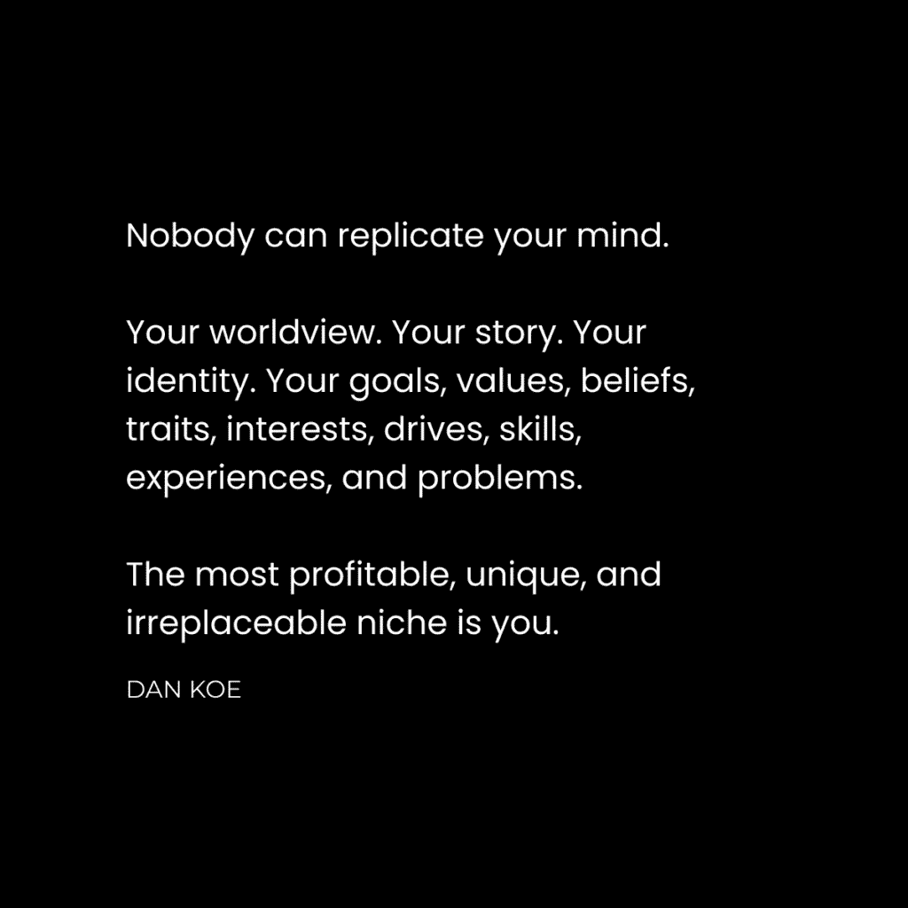
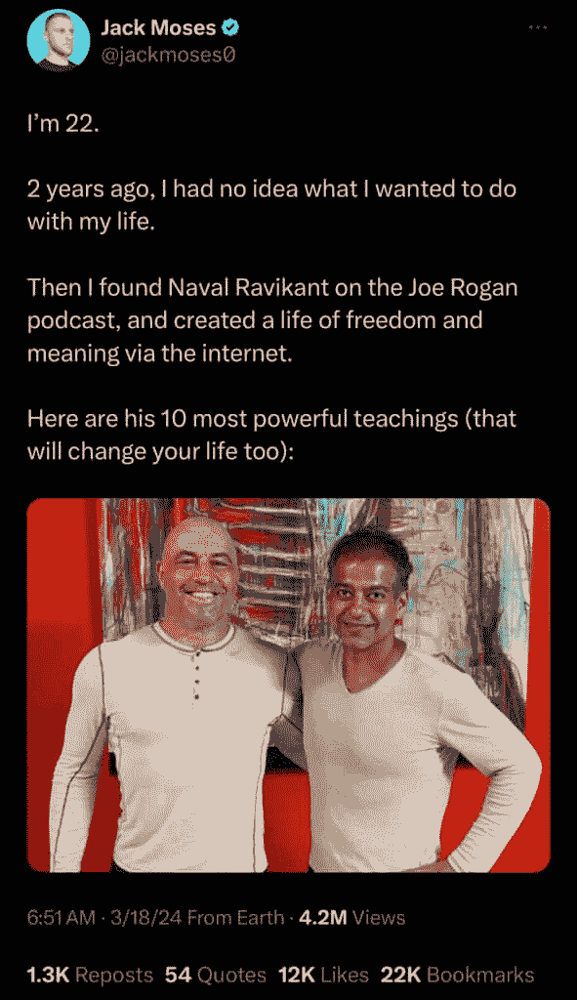
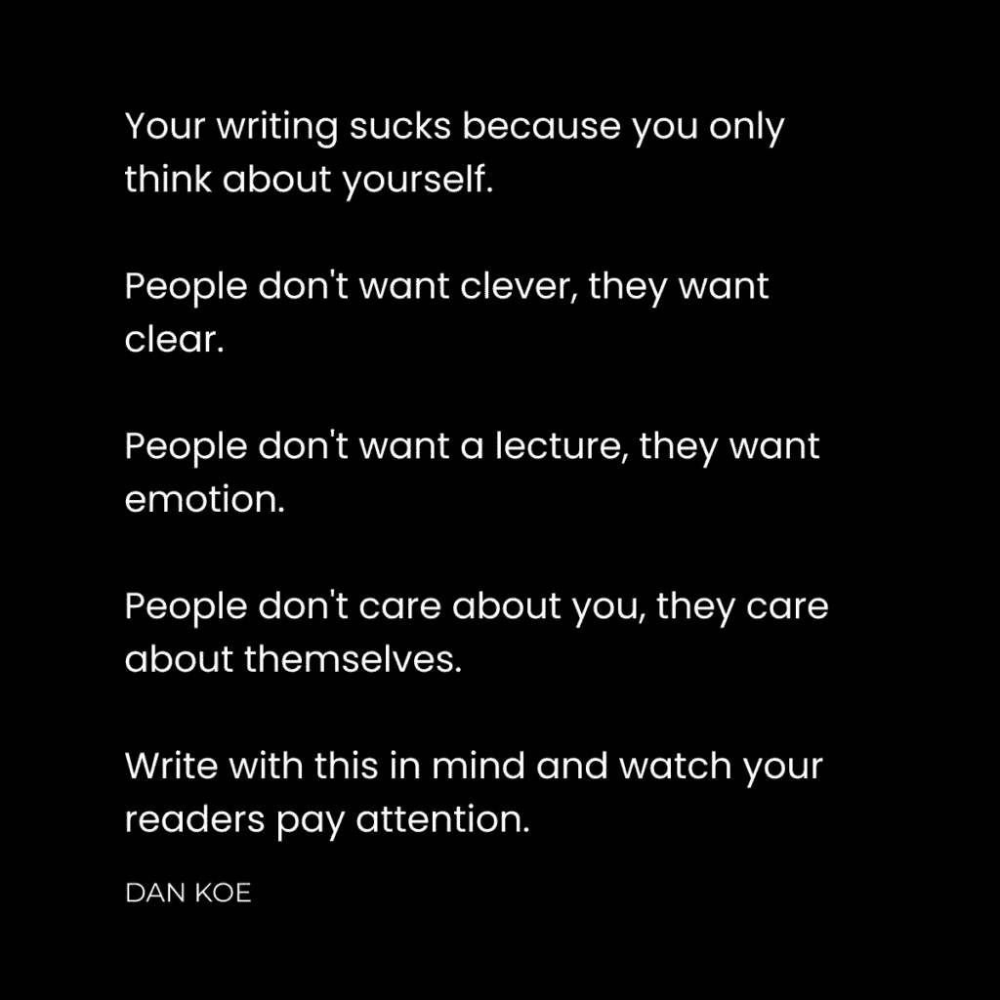

# 社交媒体增长指南：从零到一：最佳实践与策略

在本教程中，我们将学习如何从零粉丝和零经验开始，在社交媒体上实现有效增长。我们将探讨失败的原因、起步方法、利用权威、选择平台、内容创作策略以及将社交媒体视为一个协作游戏的重要性。

## 概述

许多人在社交媒体上起步时都怀揣梦想，但往往因缺乏正确的方法而失败。本节将概述成功的关键要素，帮助你避免常见陷阱，建立可持续增长的路径。

## 1) 从写作开始 ✍️

上一节我们概述了成功的关键，本节中我们来看看如何迈出第一步：从写作开始。

我在成为 YouTube 博主的梦想上失败了多年。根本原因是我不知道自己在做什么。我没有学习社交媒体所需的技能，这些技能包括说服、营销、销售和心理学。大多数人失败是因为他们没有站在读者的角度去创造内容。

我最初发布了关于心态、食物挑战和健身的视频，但效果不佳。后来，我尝试了多种商业模式，直到在自由职业网页设计上取得一些成功，并发现了 Twitter（现称 X）的力量。

以下是促使我转变的关键观察：

*   我看到他人通过简单推广就能建立受众并获取客户。
*   他们不仅谈论专业技能，还分享生活方式和个人兴趣。
*   使他们与众不同的是其独特的个性与观点组合。
*   Twitter 基于写作，无需复杂的视觉编辑或出镜，用想法就能建立业务。
*   我意识到自己拥有相似的知识，阻碍我的只是自我限制的信念。

于是，我开始行动。每当看到可以写的帖子，我就从自己的观点出发重写。每当看到不同意的内容，我就发表自己的看法。每当看到结构优秀的帖子，我就尝试将自己的想法套入那种结构。本质上，我观察有效的方法并进行模仿。

第一年，我获得了 10,000 名关注者。随后，复合增长效应显现，在近 5 年时间里，我的关注者增长到了 435,000 名。增长过程并非线性，而是“没有发生任何事情，然后所有事情都发生了”。

## 2) 选择能掌控增长的平台 🎮

上一节我们介绍了从写作起步的重要性，本节中我们来看看如何选择有利于掌控增长过程的平台。

我在 YouTube 上失败的第二个原因是，我只谈论自己想谈的内容，而非算法或观众感兴趣的内容。当我发现写作和 Twitter 的力量后，我意识到这或许能成为我最终在 YouTube 上成长的跳板。

以下是两个平台的对比分析：

*   **YouTube**：缺乏便捷的私信或转发机制（手动控制流量困难），需要掌握视频制作的多项复杂技能。
*   **Twitter**：拥有论坛式回复、无摩擦的转发、引用功能以及有效的私信，发布内容就像花2-3分钟写一段文字那么简单。

通过写作，我能够快速测试各种想法，并借助我的社交网络进行分享，从而掌控自己的增长节奏。我意识到，如果能在 Twitter 上建立一个受众群体，就可以在未来将其引导至 YouTube。

如今，YouTube 已成为我最大的平台之一，但它的成功根基在于 Twitter。在能制作一个视频的时间内，我可以写出 50 条推文。在这 50 条推文中，很可能就包含一个优秀的视频创意。如果没有好创意，制作的视频很可能表现不佳。

因此，通过在 Twitter 上写作，你可以建立一个优质创意的数据库，这些创意可以转化为表现优异的 YouTube 视频。虽然 Twitter 现在可能是我最小的受众平台，但它拥有质量最高的受众，并且是我一切开始的基石。

## 3) 用想法进行混音创作 🎧

上一节我们探讨了平台选择，本节中我们来看看如何创作独特的内容：像 DJ 一样混音想法。

作家是带着想法的 DJ。DJ 从多种来源选取歌曲和声音，创造出新的混音。同样，作家从多种来源汲取想法，并将其综合成属于自己的新内容。

你的社交媒体账户就像是你的 Spotify 个人资料，而你的工作就是发布值得聆听的“音乐”。在写作领域，这种“混音”的可能性是无限的。

关键在于，每位艺术家或 DJ 都有自己独特的“声音”。在写作中，你的“声音”就是你的世界观。它是你通过个人目标、面临的问题和独特经历来阐述想法的方式。这正是你能够形成自己细分市场的原因。

两个人都可以探讨“个人责任”这个概念，但阐述方式会截然不同：
*   一个有情绪管理问题的人，会从解决该问题的角度来写个人责任。
*   一个有商业目标的人，会从实现目标的角度来写个人责任。

核心方法是：不要直接复制，而是进行混搭。将外部的想法通过你个人世界观的滤镜进行加工和再创作，使其变成真正属于你自己的内容。

## 4) 借助权威杠杆启动增长 🚀

上一节我们学习了如何创作独特内容，本节中我们来看看作为初学者，如何在没有自身权威的情况下启动增长：利用他人的权威。

启动增长的方法是：先策划，再创作。利用他人的想法和权威来为你吸引初始关注。

可持续增长的唯一途径，是将人们从他们已经在的地方（即其他人的受众群）吸引到你这里来。

有几种方法可以实现这一点：

*   **撰写关于他人想法的内容并@他们**：当你引用并赞赏某人的想法时，他们可能会喜欢并与自己的受众分享你的帖子。
*   **创建综合多个他人想法的帖子**：汇集来自不同人的多个想法，并@所有人。这能吸引更多人参与，其中一些人可能会转发。
*   **围绕一位权威人物创建内容**：使用该权威人物最好的想法，创作一个很可能表现优异的帖子。

在选择撰写对象时，一个明智的策略是选择在该平台上活跃的人，这样他们看到并互动或转发的几率更高。如果你选择撰写关于超级名人，则需要让你的社交网络将帖子分享给他们的受众，以帮助帖子获得传播。

## 5) 掌握话题与钩子 🎯

上一节我们介绍了如何利用权威，本节中我们来看看决定内容表现的核心：选择正确的话题和撰写吸引人的钩子。

在社交媒体上增长，不仅仅是写你想写的东西。你的增长 95% 将取决于两件事：
1.  **选择正确的写作主题**。
2.  **完善吸引人们点击阅读的“钩子”**。

无论你的内容多么有价值，如果人们不点击，它就毫无作用。社交媒体的增长是非线性的，有时几周都没有增长，但一旦你同时击中了正确的**主题**、吸引人的**钩子**和有效的**流量来源**，你的关注者可能一天内就翻倍。

**关于选择主题**：你需要选择具有广泛适用性的主题。即使你有特定的目标受众，也应假设 95% 的读者是初学者。例如，不要写“作为创始人如何领导一个 50 人的团队”，而是写“能让你从 10 万美元做到 500 万美元的技能”，并用领导团队作为例子。这样既能吸引目标受众，也能吸引更广泛的、可能帮你传播内容的受众。

**关于撰写钩子**：如果为一个主题撰写钩子很困难，可能意味着你需要换一个主题。以下是写好钩子的方法：
*   从你过往写作中找出最有影响力的部分作为参考。
*   通过暗示**痛点**与**好处**的转变，开启读者的好奇心循环。
*   使用**独特的概念、大想法或流程**（如艾森豪威尔矩阵）。
*   尝试设定实现结果的**时间框架**（如“2小时学会XXX”）。
*   **重要**：研究其他成功的钩子，并训练你的大脑以类似结构思考。

完善钩子时，请对照以下清单：
*   **相关性**：内容与读者日常生活的关联度如何？是否解决了他们的痛苦或暗示了潜在好处？
*   **认知水平**：对于目标读者当前的认知水平，内容是否足够简单或足够深入？他们能理解你将展示的内容吗？
*   **所需努力**：读者能以多快的速度获得结果（教育、娱乐或启发）？获取这些结果容易吗？

每次撰写帖子标题、推文、YouTube 标题或邮件主题行时，都请运行一遍这个流程。

## 6) 将社交媒体视为全球多人游戏 🌐

上一节我们探讨了内容创作的核心技巧，本节也是最后一节，我们来看看如何将社交媒体视为一个协作游戏来获得成功。

社交媒体既是“单人任务”，也是“多人游戏”。
*   **作为单人玩家**：你必须不断丰富技能树，对构建业务所需的各项技能（营销、销售、设计、写作等）有基本了解。持续学习（如观看超过75小时的教程视频）是必需的。
*   **其他所有方面都是多人游戏**：你需要借助他人的受众来增长，需要他人的督促，需要一个让你在数字社会中产生归属感的群体。

你需要组建自己的“智囊团”——多个为共同目标努力的头脑。具体操作包括：
*   私信你想“组队”的人。
*   在你想要产生关联的人的帖子下进行有意义的评论。
*   建立群聊，与伙伴分享策略和见解。
*   互相分享彼此的最佳内容，以吸引更多流量。

这应被视为少数几种能让你掌控增长、而非完全依赖算法的方式之一。它能创造“群体效应”。当人们登录社交媒体，看到他们喜欢的一个账户，通常会联想到与该账户相关的其他几个他们也喜欢的账户。人们关注一个群体，是因为他们想加入其中，并为共同目标努力。

这与肤浅的“互赞互关群”不同。这是你的互联网朋友圈，是建立你理想事业所必需的。

## 总结

在本教程中，我们一起学习了从零开始在社交媒体上实现增长的完整路径。我们从**从写作起步**开始，强调了低门槛和快速试错的重要性。接着，我们探讨了**选择能掌控增长的平台**（如Twitter/X）作为起点。然后，我们学习了如何像DJ一样**混音想法**来创作独特内容，并利用**他人的权威**来为自己吸引初始关注。之后，我们深入研究了决定内容成败的核心：**选择正确话题和撰写有效钩子**。最后，我们认识到社交媒体是一个**全球多人协作游戏**，建立智囊团和群体是可持续增长的关键。记住，增长往往是非线性的，坚持运用这些策略，你将会看到“没有发生任何事情，然后所有事情都发生了”的时刻。