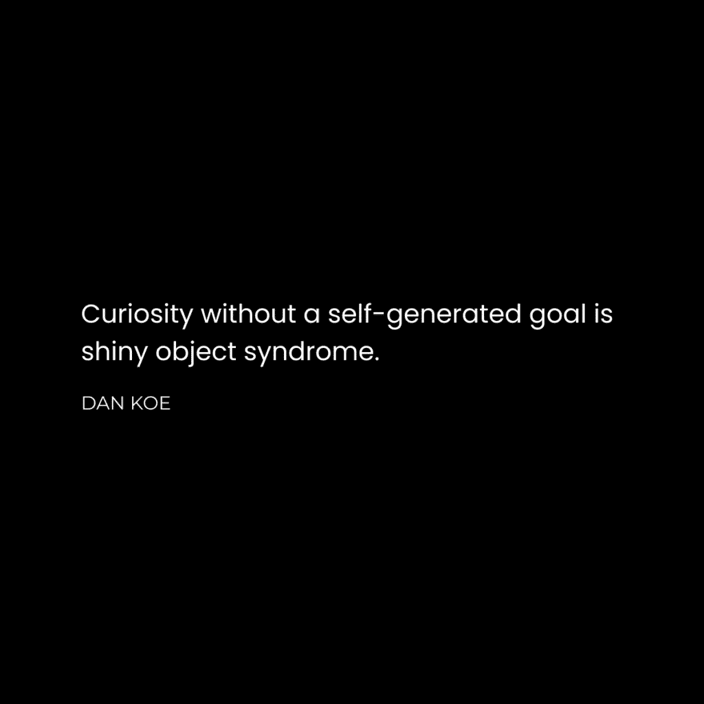
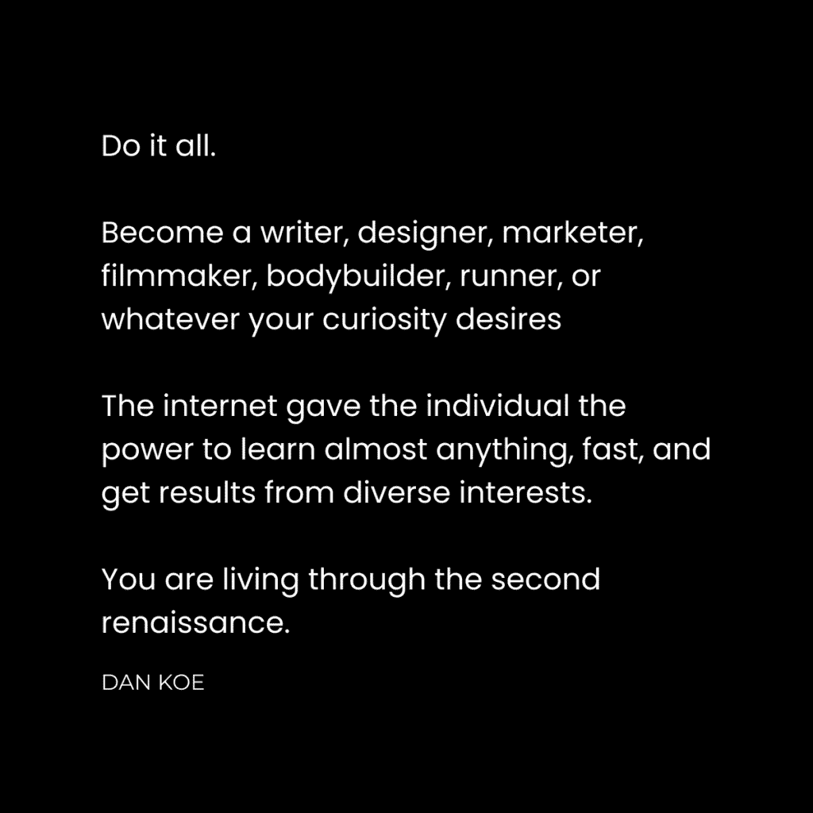

# 通用时代崛起：如何通过多种兴趣茁壮成长

在本教程中，我们将探讨为何在当今的“创作者经济”中，拥有广泛兴趣和技能的“通才”比只精通一门的“专家”更具优势。我们将分析背后的原因，并提供一套实用的步骤，帮助你作为一名通才，在数字世界中建立个人品牌、吸引受众并实现经济独立。

## 我们正处于第二次文艺复兴时期

少数人能够洞察到这一趋势，但真正能利用它的人更少。以下现象正在发生：

+   创作者经济正在以指数级速度增长。
+   人们不再相信传统的工作或教育能保障未来。
+   人们转向创作者，学习在快速变化的数字环境中所需的技能。
+   人工智能、自动化和软件降低了商业门槛，使人们更容易将爱好变为职业。
+   人们利用技术减少工作时间、增加收入，从而从旧的社会模式中解放出来。
+   人们渴望在网上与有真实个性的人建立联系，而非只谈论单一专业的“搜索引擎”。

这一切的根源在于，技术改变了我们的工作方式、工作机会以及对“有价值工作”的定义。如果你想将爱好变为职业，现在正是最好的时代。互联网将财富创造的机会，分散给了那些重视自我教育、个人责任并通过出色工作实现目标的人。

## 专家模式的困境

上一节我们提到了时代背景，本节中我们来看看为何传统的“专家”模式面临挑战。几个关键问题导致了这一情况。

**1) 专家与其他专家竞争。**

专家指那些试图仅凭单一兴趣或技能实现目标的人。例如：
*   专注于健身的健身爱好者。
*   在电子游戏中只玩一个角色/职业的玩家。
*   在工作中重复执行一系列机械任务的员工。

在工业时代，成为专家是有意义的，但在信息时代则不然。专家模式存在脆弱性：当健身爱好者受伤，当游戏角色被克制，当工作内容高度重复时，个人就容易陷入停滞、被替代或失去生活意义。

**2) 互联网青睐通才。**

当我开始创业时，总被“要极度细分领域”的建议轰炸。传统营销（如付费广告）确实需要精准定位。然而，在社交媒体主导的有机内容营销时代，情况已变。

社交媒体的运作方式（算法、转发、陌生评论）会将你的内容推送给多元化的受众。人们使用社交媒体的首要目的是娱乐，而非学习或购物。如果你的内容过于细分，人们会直接划走。

因此，你需要吸引具有各种兴趣的广泛受众，然后**说服**他们你所提供技能的价值。我宁愿拥有一个多元化的10万粉丝受众，而非一个高度细分的1万粉丝受众，前提是我懂得如何教育他们。

**3) 劳动力工作比以往任何时候都更容易被替代。**

社会旧有的信念体系（上学、找工作、退休）正在瓦解。许多人会无意识地阻挠你的改变，因为你的成功可能威胁到他们固有的身份认知。选择成为“第二次文艺复兴人”的道路，需要心理韧性和坚定的信念：你必须相信自己的潜力远大于那些在未来5-10年内可能被自动化取代的工作。

## 为什么通才在创作者经济中蓬勃发展

上一节我们分析了专家模式的局限，本节我们来深入探讨通才的优势所在。

只有奴隶才会被期望一生只做一项任务，这反映了当前某些教育和就业体系的弊端。而“自由人”则是那些能根据自身兴趣行事、在一生中从事多种活动的人。

通才是指那些为了达成生活中的目标，而去学习所有相关知识和技能的人。我个人在淘宝客、电商、SEO、数字艺术等领域经历过失败，但这些“失败”却让我积累了一套独特的、不可替代的技能组合。

单个技能可能带来的成果有限，但**五到七个技能的组合**，能让你拥有更多工具来解决更多问题，从而发现并利用有利可图的机会。例如：
*   淘宝客教会我品牌建设。
*   电商教会我广告和产品设计。
*   数字艺术教会我平面设计和社交媒体运营。

所有这些“失败”的叠加，成就了今天的我。这引出了两个核心概念：

### 1) 失败堆叠使你变得不可替代

大多数人知道“技能堆叠”，这就像多元化的股票投资组合。与其像专家一样把所有筹码押在一件事上（风险极高），不如在几个感兴趣的领域都达到前25%的水平，这要容易得多。

我们可以将“技能堆叠”重新定义为“失败堆叠”。获得失败意味着你正在积极朝着目标努力并获取实际经验。以下是步骤：

+   **在生活中确定一个目标**：例如辞职、保持健康。
+   **从你所知开始**：快速行动，在遇到障碍时才知道该学什么。
+   **追求你的好奇心**：让实践经验引导你进入新的探索路径。

所有这些路径最终会产生重叠效应。例如，从健身开始，可能引向营养学、写作（分享经验）、甚至哲学（思考身心关系）。每在一个领域达到前25%，你就为拓展新领域、增加成果打下了基础。

### 2) 最有利可图的领域是你自己

创作者经济（区别于网红经济）的特点是个人追求自身兴趣并记录、分享知识。没有人愿意追随一个总是谈论同一话题的、像搜索引擎一样无趣的人。

许多创作者害怕拓展新兴趣领域，担心无法协调。但观察你关注的人，他们真的只谈论一件事吗？更多时候，他们是在提供基于其生活经验的观点、信念和知识片段。

那么，通才该“卖”什么呢？答案在于你自己独特的经验组合和解决问题的方法。

## 如何成为一名通才

上一节我们理解了通才繁荣的原理，本节我们将进入实践环节，学习如何具体操作。

成为以谋生为目的的通才，第一步是选择一条不会将你局限于单一技能或兴趣的职业道路，本质上，你需要成为一名**创业者**。

在第二次文艺复兴中，社交媒体是新的城镇广场，创作者是新的文艺复兴者，是去中心化的教育体系和新经济的一部分。成为“创作者”意味着在你所处的数字世界中主动表达价值，而非被动消费。

创作者通过追求自身兴趣、教授所知来赚取独立收入。他们解决自己生活中的问题，并出售这些解决方案。这可能涉及任何领域，从防蓝光眼镜到商业建议，再到生产力系统。

### 建立一个广泛受众群体

我不推崇建立极度“细分”的受众。相反，我喜欢帮助受众通过**任何相关的技能、兴趣和想法**来实现一个**更大的生活目标**。

建立受众是获取注意力和人脉的基础，对于想赚取独立收入的人来说至关重要。以下是简要步骤：

+   **选择一个大的目标**：例如财务自由、拥有健康体魄、自我实现等。你的内容是帮助人们改善思想、身体、事业和人际关系。
+   **列出你的技能、兴趣和信仰**：人们需要了解什么才能达到那个大目标？你独特的组合就在于此。
+   **通过实现那个大目标的角度来构建你写的所有内容**：即使谈论编织篮子，也可以关联到它如何作为一种爱好，帮助提高创造力和精神清晰度，从而对实现大目标（如工作更高效）有益。

**示例**：假设我的大目标是帮助人们实现“财务自由”。我可以谈论创造力、心理学、写作和人类潜能，因为这些都是实现财务自由可能涉及的方面。另一个人可以选择表现、健康、预算和灵性。我们目标相同，但路径和内容独特。

### 制造噪音，寻找信号

大多数创作者难以开始，是因为不知道写什么。

1.  **直接开始写**。初期没人关注，这是最佳练习期。
2.  **写你所有的兴趣**。制造大量“噪音”，让你的受众数据告诉你，他们更想听什么。表现不佳的帖子不是失败，是宝贵的数据。
3.  **如何写作**：
    *   根据兴趣列出内容想法。
    *   关注“如何做”和“为什么重要”。
    *   写出初稿。
    *   用你的**大目标**作为滤镜来审视和修改内容。

**示例**：写“心理学”主题。
*   **想法**：如何管理情绪？
*   **步骤**：1. 觉察负面反应。 2. 行动前暂停。 3. 保持冷静或做出更好决定。
*   **关联大目标（财务自由）**：当你重复这个过程，你重塑大脑减少消极。更稳定的情绪带来更好的决策，从而让生活、金钱和关系更顺畅流动。

关键在于说明“为什么”这个主题对实现大目标重要。如果你的兴趣看起来不吸引人，那是因为你没有成功地向他人传达其重要性和趣味性。

### 通过数字资产建立权威

当你写了足够多的内容后，每周回顾数据，找出表现最好的主题（“信号”）。

然后，最大化利用这些成功主题：
+   将其扩展为更长的内容形式（长文、轮播图、新闻稿、视频）。
+   从不同角度重写该主题，持续获取参与度。
+   将该主题融入你的写作习惯，使其成为品牌的一部分。

为了确立你在该主题上的权威，并避免重复自己，可以创建一个**数字资产**，例如：
*   一个免费的指南/电子书。
*   一个置顶的精华帖子。
*   一个未来付费产品的雏形。

这样，当人们对该主题感兴趣时，你可以引导他们观看这个资产，从而腾出空间让你继续尝试新想法，多元化你的品牌。

### 建立一个收入来源的资产组合

作为通才，我们可以从那些成功整合多种兴趣的人身上获得灵感。

**核心策略**：围绕那些经过验证（表现好）的想法来推出产品。

通过课程、社群、模板、教程等形式，将你的知识产品化，帮助人们实现那些有助于接近大目标的小目标。

建议每3-6个月，至少推出一个免费产品和一款付费产品。逐步建立你的产品组合，直到形成让你满意的品牌和业务。

一旦你通过内容产品产生了稳定现金流，就可以考虑需要更多资本和受众的更大项目（例如出书、开发软件）。

---

**本节课总结**

在本节课中，我们一起学习了：
1.  **时代背景**：我们正处于“第二次文艺复兴”和“创作者经济”时代，技术为通才提供了前所未有的机会。
2.  **通才 vs 专家**：专家在单一领域竞争激烈且易被替代，而通才通过**技能/失败堆叠**构建了独特且抗风险的竞争力。
3.  **实践路径**：要成为一名以谋生为目的的通才，需要：
    *   选择一个大的人生目标作为内容核心。
    *   建立广泛的受众群体，而非局限小众。
    *   通过持续创作“制造噪音”，并用数据筛选出“信号”。
    *   将成功主题转化为数字资产来建立权威。
    *   围绕已验证的想法，逐步打造多元化的收入来源产品组合。

这就是在数字时代，作为一名通才不仅能够生存，还能茁壮成长并实现经济独立的蓝图。