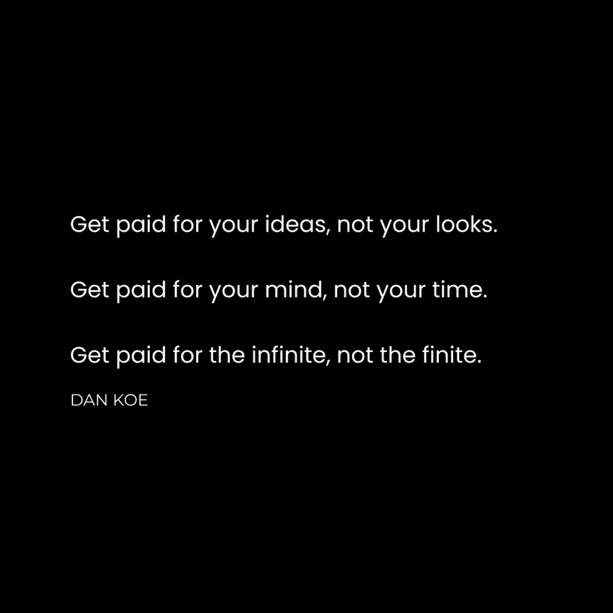

# 数字时代财富创造指南：思想是新石油

在本节课中，我们将探讨在数字时代创造财富的新范式。我们将分析传统投资和房地产的局限性，并揭示“思想”如何成为这个时代最宝贵的、可无限开采的资源。通过理解并构建“数字房地产”，任何人都可以踏上一条全新的致富之路。

## 概述：为何需要新思维

上一代人通过投资和房地产积累财富。然而，这些路径在今天对大多数人而言已不再高效或可行。投资需要漫长的时间积累，而房地产则需要高昂的初始资本。与此同时，数字世界正在催生全新的财富创造方式。本节课将引导你理解这一转变，并学习如何利用数字工具，将你的知识和想法转化为可持续的资产与收入。

---

## 传统路径的局限性

在深入探讨数字机遇之前，我们有必要先审视两条传统的致富路径为何不再适用于当今的初学者。

### 投资：时间与稀缺的困境

许多人被教导应尽早投资，通过数十年的复利积累财富。这背后的逻辑是**FV = PV × (1 + r)^n**（终值 = 现值 × (1 + 利率)^期数）。然而，这条路径建立在“稀缺心态”之上：你需要节省并投入辛苦赚来的钱，并等待数十年来获得回报。

对于拥有互联网和近乎零成本创业工具的现代人来说，存在一条更快的路径。你可以在2-4年内通过自己的事业创造数百万利润，之后再用这笔资本进行投资，其效率和最终收益远高于从零开始的缓慢积累。

### 房地产：资本的壁垒

我们常看到老一辈通过房地产致富的故事。房地产确实是资本保值增值的有效工具，但其前提是**你已拥有足够的资本**。对于需要靠工作收入来积攒首付的初学者而言，在可预见的、有意义的时间尺度内通过房地产实现财务自由是极其困难的。它需要大量初始资源，门槛过高。

---

## 思想：数字时代的新石油

上一节我们探讨了传统路径的瓶颈，本节中我们来看看数字时代真正的财富源泉：思想。

我们正处于一个历史性的转折点。物质世界受限于成本、时间和物理规律，而数字世界则近乎无限。人工智能正在取代高度专业化的技能，这意味着“过度专业化”可能面临风险。在这个背景下，创造新财富的核心不再是提取有限的物理资源，而是合成被称为“思想”的无限资源。

为什么思想如此重要？因为**执行的门槛已空前降低**。过去，一个伟大想法的实现需要庞大的资源和复杂的协调。今天，想法的质量、传播速度和迭代能力决定了成功。数字产品可以零边际成本复制和分发，数字通信能瞬间抵达全球。

所有新的财富都在数字空间中创造。数字地产可以零成本建设，数字产品可以低成本构建，数字社会（或称创作者经济）是新财富的诞生地。你的思想，就是等待开采的新石油。

---

## 构建你的数字财富体系：行动框架

理解了思想的价值后，我们来看看如何具体应对这场“数字淘金热”。以下是构建你个人数字财富体系的系统性步骤。

### 拥抱数字社会与创作者身份

有一种过时的建议是：“先在线下建立业务，再转到线上。”这忽视了社交媒体本身就是最可行的创业起点之一。它是最佳的吸引客户、建立联系和分销产品的“新城镇广场”。

成为“创作者”并非指追求一份时髦的互联网工作，而是一种新的生活方式：吸引社区、提升自我、获取技能、传播价值。创作者是企业寻求合作的对象，是消费者建立真实连接的窗口，也是个人能力的证明。一个人的创作者企业，就是明确你努力方向的理念。

### 打造你的个人垄断：成为细分领域代表

传统教育鼓励高度专业化，但这在快速变化的数字时代可能成为枷锁。相反，你应该成为一个“深度通才”，并建立你的“个人垄断”。

具体步骤如下：
1.  **明确目标**：思考你在生活中想要实现什么（如更多金钱、目标感）。
2.  **记录技能**：记录下你为实现目标而学习的兴趣和技能。
3.  **吸引同好**：吸引那些有相同生活目标的人。
4.  **组合独特性**：利用你独特的兴趣和技能组合，使你成为解决这类问题的唯一代表。

你的细分市场就是“自我实现”。你是一个经验载体，当你将这些经验转化为可被他人利用的内容和产品时，你就建立了个人垄断。

---

## 你的数字房地产投资组合

你在数字世界拥有的“地产”数量和质量，决定了你的成功。数字地产分为两类：**免费资产**（用于吸引受众）和**付费资产**（用于盈利）。以下是构建它们的顺序和逻辑。

### 第一步：通过每日内容建立受众

商业的核心是找到愿意付钱的人和收款方式。作为初学者，首要任务是找到“愿意付钱的人”，即建立受众。

**为什么需要受众？** 为了获得杠杆。你不想创建另一份朝九晚五的工作，而是想创造被动收入，控制自己的时间。在社交媒体上建立受众是实现这一目标最可行的方式。

**如何操作？** 专注于一个平台，每日发布内容。内容创意可以包括：
*   讲述你的个人故事和转变。
*   分析与教学你的技能和兴趣。
*   讨论目标受众的痛点与解决方案。
*   记录你学习过程中的经验教训。
*   分享你从书籍、对话中获得的启发。

社交媒体是一项可通过学习掌握的技能，而非仅靠运气。

### 第二步：通过新闻通讯实现受众去平台化

社交媒体平台是中心化的，你并不真正拥有你的受众。因此，你需要将他们引导至你完全控制的渠道——电子邮件列表。

发送每周新闻通讯，用来深化你的社交媒体内容，建立更紧密的联系，并为未来的产品推广铺路。

### 第三步：建立免费产品以树立权威

如何在不硬性推销的情况下进行销售？答案是提供免费产品（如电子书、清单、迷你课程）。

**免费产品的作用：**
*   **客户培育**：教育受众，将他们转化为付费产品的潜在客户。
*   **内容中心**：将某个主题的权威信息集中一处，无需在时间线上重复。
*   **销售桥梁**：在免费产品中提供足够价值，建立信任，并在末尾自然推广你的付费产品。

免费产品就像吸引人的小册子，能显著提升你的权威性和受众参与度。

### 第四步：通过数字产品组合盈利

当你拥有受众、通讯和免费产品后，就可以通过数字产品（如在线课程、模板、软件）实现盈利。数字产品让你完全掌控收入，边际成本极低。

建议不要只创建一两个产品，而是持续推出和改进，构建一个能产生稳定高收入的产品组合。

### 第五步：多平台扩张与增长飞轮

当你的数字业务开始盈利后，可以将已验证的最佳内容分发到其他平台（如播客、YouTube）。利用现有受众为新平台引流。

此时，增长飞轮开始转动：所有平台共同增长 -> 免费产品下载量增加 -> 新闻通讯订阅者增多 -> 付费产品销量上升。这种协同效应能带来指数级增长。

---

## 总结

本节课中，我们一起学习了在数字时代创造财富的全新蓝图。我们认识到，传统投资和房地产路径对初学者存在时间和资本的高门槛。真正的机遇在于将“思想”作为新石油，在数字世界中开采。

我们系统性地探讨了如何行动：从拥抱创作者身份、建立个人垄断，到逐步构建你的数字房地产投资组合——通过每日内容吸引受众，用新闻通讯巩固关系，借免费产品树立权威，最终通过数字产品组合实现盈利，并扩张至多平台形成增长飞轮。

这条路径的核心是**提供价值、建立连接、资产化你的知识与经验**。它不需要巨额启动资金，但需要清晰的策略、持续的创作和从失败中学习。现在，你已掌握了方向和框架，剩下的就是付诸实践，开始建造属于你自己的数字财富大厦。