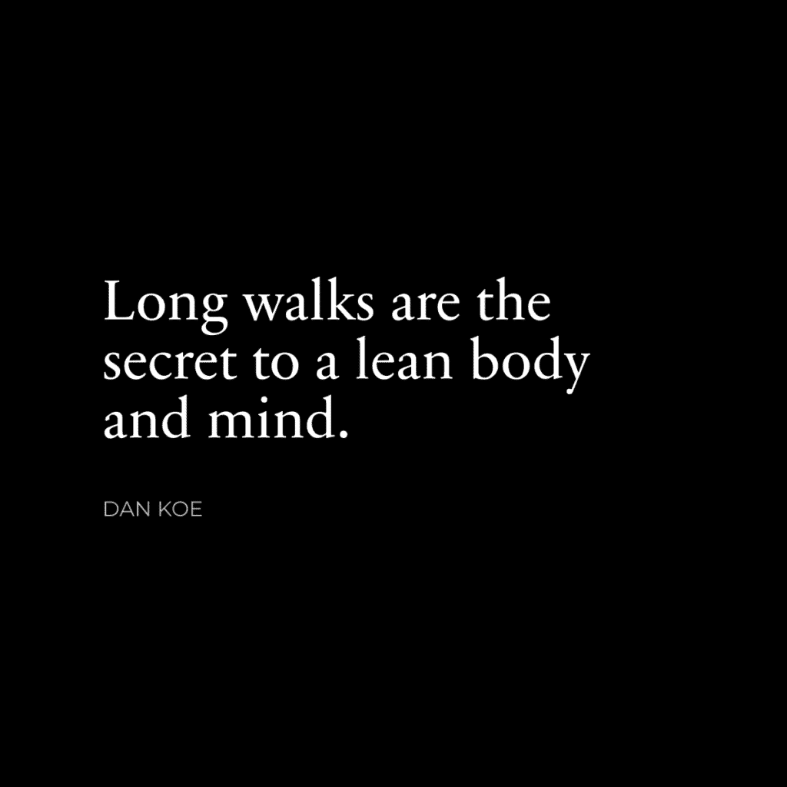

# 步行改变人生：长步走的威力

在本节课中，我们将学习一个简单却强大的习惯——每日长距离步行。我们将探讨它如何从多个维度改变生活，并提供一个易于遵循的指南，帮助你将其融入日常生活。

## 概述

我曾经非常讨厌走路。我不仅不喜欢散步，甚至讨厌走去任何地方。我本质上是懒惰的，或者说更“高效”。除了去健身房和经营生意，我大部分时间都坐在沙发、床上或办公椅上玩游戏。我总是只做最基本的事情。

我会找任何借口避免走路或选择开车。为了说明情况，我曾因为Juul电子烟的流行而开始使用尼古丁。最终，我改用Zyns（无烟尼古丁袋）来帮助集中精力工作。

在2019年的某一天，我意识到滥用尼古丁正在损害我对他人的注意力。我总是感到疲倦，在谈话中沉默寡言，并且如果一段时间不摄入尼古丁，就会一直想着它。

大约在同一时间，我看到了一篇关于步行益处的社交媒体帖子。帖子内容是关于“为夏天塑形”以及用步行替代无休止的有氧运动。

机缘巧合下，我决定彻底戒掉尼古丁。每当有渴望时，我就决定去散步10分钟，然后嚼口香糖。最初的几次散步很无聊，但很有效。戒掉尼古丁变得相当容易，我总是可以用“燃烧卡路里”来合理化这种轻微的不适。步行成了我“感觉”自己在燃烧脂肪的方式，这让我更想走路。

一个月内，我每天都达到了所谓的10000步。结果是，我完全爱上了步行。

五年来，我没有一天步数少于10000步。当我住在奥斯汀时，我平均每天走20000到25000步。现在我平均每天走大约15000步。

有些人甚至说，我的名字已经与“步行”同义，因为我经常谈论它的重要性。甚至有一个播客称我为“步行之王”。

类似于查尔斯·达尔文和史蒂夫·乔布斯将步行视为他们生活和工作的关键部分，我也发现了同样的道理。

有些人会问：“如果你一天要走几个小时，你怎么完成工作？”我建议你阅读纳西姆·塔勒布的《反脆弱》第七章，或者我的“4小时工作日”哲学。

简而言之，我尽量不做任何不必要的事情，因为这是自然界从噪音中过滤信号的机制。太多人整天忙碌却无所成就，因为他们陷入了无法推动进展的任务中。

此外，如果不是因为步行，你可能不会读到这篇文章。我的想法、我的内容、我的身体、我的身份都会不同。

我想与你分享：
1.  步行的原始力量，让你有多个坚持这个习惯的“理由”。
2.  如何将步行变成游戏，以便你能无缝地养成这个习惯。

我写这篇文章的愿望是，希望通过一个简单的习惯来改变你的生活。

让我们开始吧。

## 心灵、身体、精神、商业——全面的生活习惯

我希望我能把这一点说清楚：你每天的时间是有限的。这意味着你能养成的习惯也是有限的。因此，你选择养成的习惯至关重要，因为它们塑造你的未来并影响你的生活质量。

大多数人无法控制他们选择的习惯，因此他们的生活轨迹并非由自己设定，并且越来越难以改变。习惯不仅是身体上的，也是心理上的。

你通过在手机上滑动来分散自己的注意力。你的注意力持续时间缩短，因为你的大脑习惯于每30秒接收新信息。因此，你无法专注于有意义的对话、建立事业或穿上鞋子去健身房。

你的大脑几乎对任何事情都做出反应，充斥着他人植入的梗和随机片段。你无法认真对待任何事情，认为任何有价值的东西都是笑话。同时，你感到沮丧和绝望，但找不到解决方案，因为你的大脑被困在表面跳跃，试图窥见一斑。

解决你大多数问题的方法是：你必须重新获得专注力，以便能够实施新的习惯。你必须实施新的习惯，因为你只能选择少数几个。你选择的习惯必须是高杠杆、高影响和高乐趣的。你选择的习惯会将你的注意力重新集中在生活的深度上。你把注意力集中在哪里，就会编程你的大脑，塑造你成为谁，并决定你的未来。

步行作为一种习惯涵盖了所有方面：心灵、身体、精神和商业。让我来展示给你看。

### 步行冥想

我过去对冥想持怀疑态度。我曾认为这是嬉皮士和新时代人士的专属，他们认为自己在引导某种能量，变得像《阿凡达》中的最后的气宗一样强大。

结果表明，就像我大多数不喜欢的事情一样，我只是没有理解冥想是什么。冥想是解放你思想的行为。冥想是减少你对思想的依恋。冥想是实践与现实的统一，而不是对未来的期望或过去的经历。

换句话说，通过持续的冥想练习，生活会变得更好，因为你正在体验它。大多数人没有意识到他们的生活有多么肤浅。他们在脑海中跳跃，创造出不存在的问题，并失控地陷入深深的焦虑和混乱状态。

他们的生活被过去的压力情境所统治，这些情境影响他们对未来的看法。昨天对你大喊大叫的老板让你今天害怕上班。昨天糟糕的写作让你担心明天无法完成，你继续投射到一个未来，在那里你无法完成任务，你的副业失败，而你开始制定B计划，却没有意识到你正在用你的思想创造那个现实，因为你的行动将随之而来。

你将自己困在狭隘的痛苦状态中，而你唯一的出路是通过冥想重新编程你的思想。问题是我总是无法形成坐姿冥想的习惯。我总是忘记，或者发现如果早上不做冥想，我的其他工作（如写作）会受到影响。

我们稍后会讨论如何进行步行冥想。

### 步行与健康

这一点不难理解。

**步行 = 增加卡路里消耗。**

我不知道这是否完全准确，但我读到过，无论你是走路还是跑步相同的距离，你燃烧的卡路里数量是相同的。所以，如果一个人走了一英里，另一个人跑了一英里，他们燃烧的卡路里相同。两者之间可能存在微小差异，主要区别在于你完成这段距离的速度。

我喜欢散步，因为在跑步时我无法真正倾听、阅读、捕捉想法或写作。因此，如果你在减肥方面有困难，散步是一个可以养成的可持续习惯。

**户外 = 阳光和缺乏蓝光。**

蓝光不仅会损害你的睡眠，还会破坏你的健康，并导致慢性疾病。大多数人都听说过安德鲁·休伯曼关于早上第一件事就是晒太阳的建议，但即使是他也会承认这只是冰山一角。

我在这里不会深入探讨，因为涉及的信息量相当于一本书，但我将提供一些资料供你深入研究：分析 & 优化、杰克·克鲁斯、Grimhood。

阳光对你的健康比你想象的更重要，你可能害怕它，因为你认为你会得皮肤癌（而实际上阳光有助于逆转皮肤癌——起始信息和另一个，你可以根据自己的好奇心深入挖掘）。

大多数人被主流教条深深地洗脑，要保护自己免受阳光伤害，而阳光现在是许多疾病的主要原因。作为参考，我可能是你见过的最白的人。我总是害怕太阳，在我高中暑假做救生员的时候，我每天不得不涂抹4-5次防晒霜。

通过正确的饮食和方案，我在阳光下不会晒伤。我每天大约走15,000-20,000步，其中大部分是在亚利桑那州紫外线指数9-10的高温下，但我不会晒伤。

对于那些想要深入了解的人，可以开始搜索像“如何建立你的太阳能茧”这样的信息，并从那里研究你不了解的概念。请理解，我的思想不是他们的。我在分享我认为有用的信息，而不是要你采纳他们的意识形态。我不赞同他们说的许多事情，但这并不意味着我不能从中获益。

### 步行激发创造力

如果我能将我的写作和创作成功归因于一件事，那将是步行。对我来说，步行是我的创造力障碍。这是我在哪里：
*   听有声书和长的YouTube讲座（actualized.org是我最喜欢的）。
*   阅读实体书籍（是的，我早上带着一本书散步，边走边读）。
*   记下我想写的想法（使用我在免费课程中的天才想法过程）。
*   保持沉默，让我的大脑解决问题，缓解压力，或为我的目标或愿景带来清晰。

不要轻视“创造力障碍”的概念。你有专注工作的生产力障碍，但为了使那些工作具有独特或原创的贡献，它们需要与创造力障碍相平衡。

换句话说，如果你不花时间通过思考和解决问题来培养和发展想法，你的工作很难达到卓越。因为面对现实……你可能很难养成阅读或冥想的习惯，因为你被困在室内，那里充满了干扰。如果你的意图是阅读或思考，但你选择了专注工作，即使那也是一种干扰，而且你缺乏自律。

当你外出散步时，你唯一的选择就是做你打算做的事情。

## 通过将其变成游戏来形成愉快的步行习惯

为什么我们会如此沉迷于电子游戏？
1.  有一个清晰的目标层次（如何获胜+任务）。
2.  对于进步（升级+里程碑）有明确的反馈。
3.  有规则可以缩小你的注意力并消除干扰。
4.  有教程帮助你快速掌握游戏。
5.  根据你的技能水平，会有相应的挑战，这样你就不会感到焦虑或不知所措。

简而言之，视频游戏之所以上瘾，是因为它们推动我们进入心流状态。心流状态的特点是绝对的清晰、零干扰、纯粹的进步，这种感觉在世界上无与伦比……而且你可以通过大多数习惯，尤其是步行，进入这种状态。

你知道你需要做什么，如何做，何时做，这并不容易或众所周知，所以它是有意义的。新奇带来的额外多巴胺也不会有害。

因此，为了养成这个新的步行习惯，我认为将其变成一个游戏是明智的。这就是我不知不觉中做的事情。4年后，我不再担心体重过重、不健康，或者难以想出创意点子，让我能比大多数人更快地建立企业。

### 第1步：明确你为什么步行

愿景和反愿景。我总是谈论这些，因为它们真的很重要。如果你没有将你所采取的每一个行动与你理想的生活方式对齐，你就迷失了，你无意识，你被编程了。你没有做出自己的决定，你的思想容易无意识地服从他人的意愿，甚至没有注意到。

深入思考步行是如何成为一种全面的习惯，可以彻底改变你的生活。
*   你想从戒掉坏习惯中获得好处吗？步行可以替代那个习惯。
*   你想在工作中更有创意吗？你总是挣扎着写作或想出能改变你未来的想法吗？你能看到简单的散步如何改变你的人生方向吗？
*   你想减掉10磅脂肪，晒黑，并从持续的阳光照射中获益吗？如果你的心理健康状况糟糕，这不是值得一试吗？

列出你现在生活中不喜欢的一切。从那里，列出你希望一年后生活中拥有的一切。然后，思考每天走10000多步如何有助于实现这一点。

### 第2步：设定每日目标并将其分解

所有行为都始于一个有意识或无意识的目标。你所采取的每一个行动都可以映射到你正在追求的目标。问题是：你是否设定了那个目标？或者你是被媒体、你的父母、你的老师和朋友悄悄编程了吗？

一个简单的习惯并无不同。设定一个每日目标，并从小处着手。我觉得，如果人们现实地重组和优先考虑他们的生活，10000步对大多数人来说是可以实现的。你可以早点起床，早点睡觉，告诉你的配偶这对你很重要——这种“步行”的好处可以渗透到你的整个生活中。

如果你一天走10000步会让你焦虑，那就降低目标，就像你在视频游戏中做的那样。如果10000步是100级，那么选择2000步作为1级，然后逐步增加。

现在，将其分解为个人步行的子目标。
*   你打算在一次散步中完成所有的事情吗？
*   你打算分散它们吗？
*   你打算在散步中走哪条路线？
*   你打算走到一个特定的地标或地点吗？
*   你打算走到当地的咖啡馆去专注工作吗？

通过坚持这些目标直到大约一个月后它们变得自动，来为新习惯带来清晰性。

### 第3步：为散步制定规则

现在，为了进一步集中注意力和增加散步的乐趣，我们需要制定规则。如果我们不这样做，你的大脑会倾向于抱怨。“我不喜欢散步。”“外面太热/冷了，呜呜，我需要我的舒适的空调箱。”“我不住在一个适合散步的城市。”

所有借口。即使你不想走路，你也能走。你走进桑拿房，不在乎它有多热。你的期望和限制性信念正在毁掉你的潜力。

这里有一些你可以尝试的规则：
*   散步时永远不要踩到路上的裂缝。
*   带着从一本书或有声书中得到的3个写作想法回来。
*   让你的身体两侧都晒上15分钟太阳。
*   交替进行5-10分钟的行走冥想和5-10分钟的学习。
*   完成一本书的一章或一个课程的模块。
*   写你通讯的一节，或者写几篇内容（就像我在2小时作家中教授的那样）。

尝试一下。

### 第4步：进行散步（并有一个触发器）

散步是最容易的部分。让自己去散步是最困难的部分。如果你有一个触发器，比如我有了尼古丁渴望并想要戒烟，那么就用那个时刻立即出去开始你的散步。

如果你没有任何动机或触发器，你需要引导你的大脑走向你现在能采取的最低摩擦的行动。你能走进衣柜拿你的鞋子吗？如果这太难了，问问自己为什么你甚至无法控制自己的身体走几步。同时，进一步分解。你能走到你的房间吗？不？你至少能站起来吗？不？好吧，移动你的脚。仍然没有？我无话可说。到这个地步，没有人能救你。（如果你真的不能走路，因为你没有腿或者它们不起作用，忽略我，因为我确信你会告诉这些人他们应该感激自己能走路的能力）。

就这样。开始散步。

## 总结

在本节课中，我们一起学习了每日长距离步行的强大力量。我们探讨了步行如何作为一种全面的习惯，从冥想、健康到激发创造力等多个方面改善生活。我们还学习了如何通过明确目标、设定规则并将其游戏化，来轻松愉快地养成这个习惯。记住，改变始于简单的第一步。现在，穿上你的鞋子，开始你的第一次改变人生的散步吧。

周末愉快。
– 丹