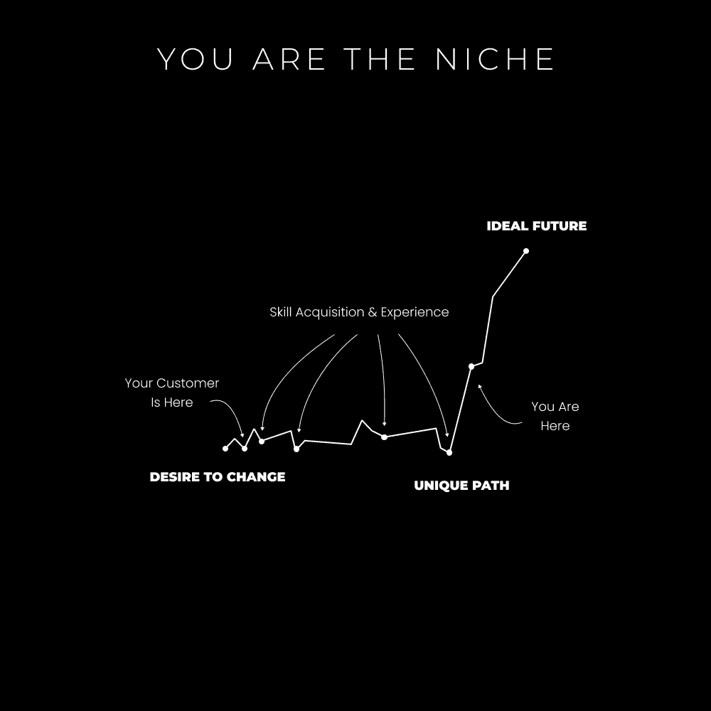
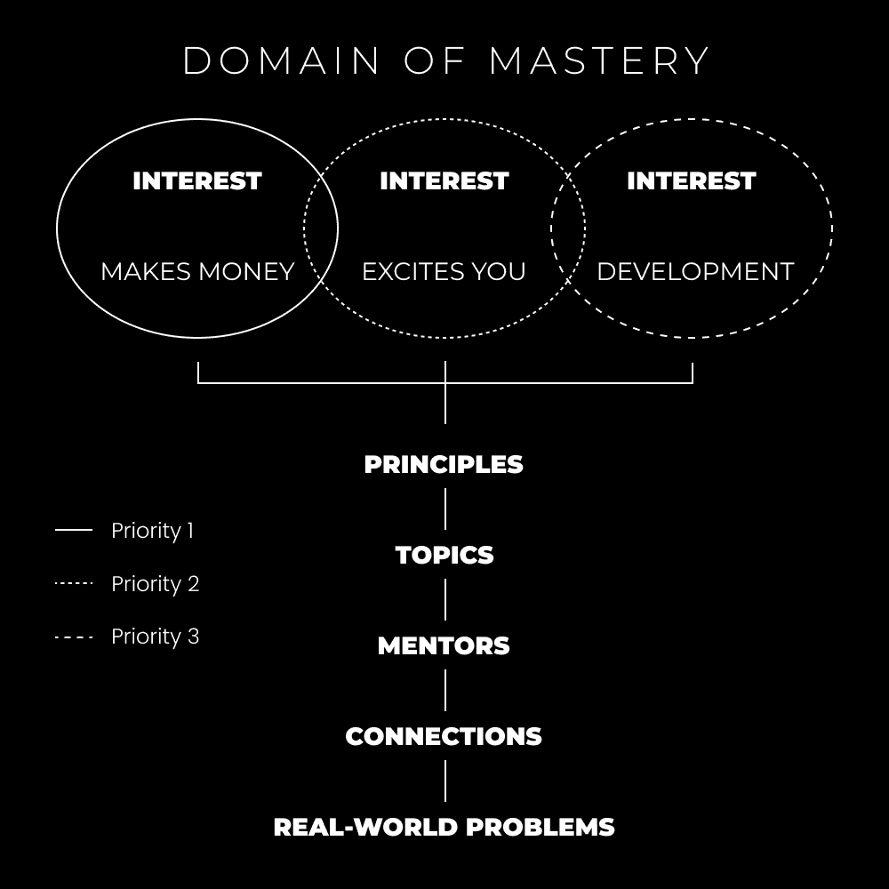

# 工作的未来：掌握这个技能栈

在本节课中，我们将要学习如何应对快速变化的工作环境，理解人工智能带来的挑战与机遇，并掌握一套能够保障个人未来的核心技能栈。我们将探讨为何传统职业路径正在失效，以及个人如何通过成为“深度通才”和建立“一人企业”来掌控自己的命运。

2022年，埃隆·马斯克以440亿美元收购了Twitter。此后不久，他解雇了Twitter超过80%的员工，人数超过6000人。这并非科技行业裁员的孤立案例。新闻头条充斥着公司裁员、剥夺人们生计的报道，让大众担忧自己是否会成为下一个。

此外，还有一些值得关注的趋势预测：
1.  自2020年以来，自由职业者在劳动力中的占比已从36%上升至46.6%。
2.  预计到2028年，创作者经济的规模将从2500亿美元翻倍至4800亿美元。
3.  有重要人物预测，通用人工智能（AGI）可能在今年年底前出现。

尽管也有人认为AGI的开发因成本高昂而放缓，可能需要2年或更长时间才能实现。但无论技术进步的快慢，唯一的解决方案是依靠自己。这本来就是你从一开始就应该做的事情。

人们担心被取代并非没有原因。他们的技能正在过时，正站在失去生存手段的边缘。他们的家庭、生活方式和再就业能力都岌岌可危。

理解以下三个要点至关重要，即使它们不直接适用于你，也将对你的未来有益。

### 1) 入门级职位正在消失

获得入门级工作正变得越来越困难。无论是编程还是营销，人工智能已经能够（或非常接近能够）在大多数领域执行基础的专业工作。这并不意味着入门级职位完全消失，而是意味着准入门槛正在提高。过去的入门级职位，现在变成了初级职位，未来可能很快会变成高级职位。

> 对于软件开发者来说，这是一个非常悲伤的结局。
> 我已经说了6年。
> 10年后，其中90%的人将无法获得与过去相当的薪资水平（经通货膨胀调整后）。
> 解决方案：立即成为独立创作者。
> 即使你失败了，你也会获得软技能，这些技能可以让你在以后被公司雇佣。

未来的劳动力将由具备特定特质的高技能、高收入个体组成。那么，这些“高技能”个体拥有哪些你可能不具备的特质？初学者如何赚钱？开发者、作家、营销人员等创意和技术工作者如何生存？

### 2) 人们缺乏真正的教育

> 如果你不为自己设定一个目标，别人就会为你分配一个。 ——《专注的艺术》

过去，奴隶被期望一生只完成一项任务。他们被教导特定职业的技能，如种植小麦或放牧。我们当前的教育体系在某种程度上反映了这种模式。今天，我们被教导要成为有用的工人，服从权威，并因害怕惩罚而追求好成绩。

**一个自由人应该拥有一个目标，并学习实现它所需的一切。** 目标是对他人产生积极影响的追求。大多数人没有选择自己的目标。他们在年轻时就被灌输了雇员心态，只做被告知的事情，并在狭窄的领域内学习。

拥有目标意味着必须学习解决阻碍你实现目标的问题所需的知识和技能。如果你没有选择自己的目标，你也就没有选择要学习的内容或要解决的问题。*你的思维默认是狭窄的，因为目标本身是狭窄的。* 你的命运已经被预先决定，因为你所知道的唯一潜力就是别人分配给你的那个。

那么，我们学到了什么？以及我们如何保护自己免受人工智能带来的风险？

### 3) 工作的未来属于个人企业

> 这个星球上有近70亿人。我希望有一天，几乎会有70亿家公司。 – 纳瓦尔

企业是一种法律结构，它允许你：
1.  建立你想要的东西
2.  解决有价值的问题
3.  从中获利

我之所以强调这一点，是因为我厌倦了人们认为“商业”或“创业”只属于那些有启动资金或特定性格的人。就我而言，停止将赚取独立收入视为创业。把它看作是变得有价值，将这种价值打包，并参与价值交换——这种行动从穴居时代就存在，而不仅仅是在法律要求它成为一件事的时候。

社交媒体、创作者经济和技术使得个人能够吸引受众并将其货币化，这本身就是一种分销渠道。这不是一种新的时尚商业模式，而是现代世界的现实。你有能力在互联网上学习任何东西，在互联网上建立任何东西，并从互联网上的任何人那里接受付款。是的，你可以从零开始。

我们还有很多东西要讨论，因为以上只是设定了场景。在接下来的章节中，你将学到：
1.  如何成为一个深度通才，以保障你的未来。
2.  你必须学习哪些技能，才能用任何兴趣或激情谋生（以及如何快速学习它们）。
3.  为什么人工智能并不像你想象的那样特别，它只会取代那些应该被取代的人。
4.  如何将自己变成一个个人企业，从而掌控自己的命运。
5.  如何在每天平均工作4小时的情况下，从0到10万美元，再到100万美元。

在历史上任何其他时刻，这一切都不可能实现。欢迎来到工作的未来。

---

## 工作的未来：2：未来保障的技能栈

> 传统教育和高度专业化是使人们服从主导范式/系统的一种方式。研究自然的普遍原则，成为一个深度通才。 —— 丹尼尔·施马赫滕贝格

上一节我们介绍了工作环境的变化和挑战，本节中我们来看看如何通过构建一套技能栈来保障未来。首先，让我们通过一个历史隐喻来理解专业化的陷阱。

巴克敏斯特·富勒在他的著作《地球宇宙飞船操作手册》中，描绘了“伟大海盗”的隐喻。这些海盗是通才，他们理解地理、导航、生物学、历史等多方面知识，因为这是成功进行贸易和统治所必需的。他们带上船工作的人则被故意保持“愚蠢”，只懂得服从命令。

陆地上的统治者是专家，只了解自己的领域。海盗们通过贸易和知识控制了他们。为了维持控制，海盗们鼓励陆地统治者将最聪明的大脑限制在“皇家历史学家”或“财政部长”等狭窄的专业角色中。这样，这些聪明人就无法获得全局视野来挑战海盗。

*聪明的大脑对声望感到满意。*
*陆地统治者对有“智慧”的人为他们服务感到满意。*
*海盗们对在多个土地上拥有控制权感到满意。*

这个隐喻的教训是：学校的建立，部分是为了通过承诺专业化的声望来“奴役”最聪明的大脑。这样，他们保持狭隘的思维方式，不选择自己的目标，因此无法学习到能够让他们超越现状的多种技能。这解释了为什么专业化仍然被高度鼓励，以及为什么“高薪工作”是青少年思考未来时的首要考虑。

**你已经被编程去被取代。** 现在，让我们学习如何逆转这种损害。

### 如何成为一个深度通才

> 做好每一件事。
> 成为作家、设计师、营销人员、电影制作人、健身者、跑者，或者任何你的好奇心所渴望的。
> 互联网赋予了个人几乎学习任何事物的能力，快速获得结果，并从多样化的兴趣中获得成果。
> 你正在经历第二次文艺复兴。

动物和人类的一个关键区别在于，动物通过专业化（缩小领域）来生存。但过度专业化可能导致物种灭绝。例如，某种鸟的喙变得特长以适应特定环境，但最终可能因为喙太重而无法飞行。

人类则通过制造工具来弥补不足。过去我们制造标枪来获取食物，今天我们使用手机来维持社交。所有的技术进步都是为了帮助人类适应和生存。这里有一个关键问题：**你是否在构建一些有价值的东西来防止自己被取代？还是满足于做一个在他人机器中等待被淘汰的单技能齿轮？**

人类本质上是通才。他们在不同领域的交汇处蓬勃发展，可以通过制造工具、获得新技能或学习新信息来适应新环境。接下来，我将告诉你确切需要学习什么，以成为一个深度通才。

德文·埃里克森提出的“七门解放艺术”（与学校教授的传统文科不同）是：
+   **逻辑**：如何从已知事实中推导出真理
+   **统计学**：如何理解数据的含义
+   **修辞学**：如何说服他人，并识别说服策略
+   **研究**：如何收集关于未知主题的信息
+   **（实用）心理学**：如何辨别和理解他人的真实动机
+   **投资**：如何管理和增长现有资产
+   **代理**：如何决定要追求的课程，并主动采取行动去追求它。

掌握这些解放艺术，你就能为未来做好充分准备。任何具体的技术技能都可以根据需要快速学习。基于这些原则，我获得了以下核心技能：

+   **市场营销与销售**——如果你不知道如何吸引和说服，你就永远不会得到你想要的东西，你唯一的选择就是等待雇主（或政府）的给予。（涉及修辞学，心理学）
+   **写作与思考**——以独特思维传达价值的技能。这是站在他人面前的基础。（涉及逻辑，研究）
+   **创业** – 将未来掌握在自己手中，寻找生存之道，并构建你希望在世界看到的（且他人关心的）产品。（涉及统计数据、效率、投资）

创业本身可能不是一项具体“技能”，但它是一种元技能。它教会你成为高效率的人，识别问题，销售解决方案，系统化工作，并培养使你不可替代的特质。

没有人能直接教会你如何写作、思考、营销和销售。他们只能分享他们的方法。因此，要学习这些技能，你必须具备自我实验的心态。

你的任务是：
1.  **研究他人成功的流程**。阅读书籍，使用谷歌搜索，观看YouTube教程。自我教育必须成为每天30-60分钟的习惯。这不是可选项。
2.  **尝试各种技术**。实施你学到的流程，并尝试获得结果。
3.  **识别模式和原则**。注意不同方法之间的相似性，并重点关注它们。
4.  **创建自己的流程**。将你所学的内容调整到适合你独特生活方式和情况。
5.  **通过传承来贡献真正的教育**。提供在学校无法教授的、以批判性思维为基础的教育。

以创业为载体，你为真正的教育和自主权设定了场景。通过写作和思考，你不断地创造、测试和迭代你提供的价值。你需要学习实用的心理学——即营销和销售——来理解自己和客户的想法。随后，你通过说服（而非强迫或欺骗）来激励人们关注你提供的价值。

### 技术知识与个人兴趣

在掌握了未来保障的技能栈基础之上，下一步是学习适应时代的技术技能。在当前的数字复兴时期，这包括：

+   **社交媒体** – 将你的名字建立为你所创造价值的“店面”。这是你业务的指挥中心。
+   **内容** – 通过写作、设计或视频来教育、娱乐并激励人们看到你的价值。
+   **电子邮件营销** – 通过新闻通讯或自动化序列来培养你获得的受众。
+   **视觉设计** – 展示你品牌的氛围，激发观众的情感。
+   **漏斗构建** – 创建着陆页、网站，并利用内容、电子邮件等其他技术技能来推动转化。

随着人工智能冲击各行各业，学习这些技能的要求必然会改变。它们不会很快消失，但由于获取这些技能的便捷性，一般性竞争将会加剧。**如果你只学习这些技术技能，而不学习之前的营销、销售、写作和创业等核心技能，这些技术技能将失去效力。**

这些技术技能是你作为企业家开始建立自己事业的方式。现在你可能会问：我该写什么？推广和销售什么？用电子邮件、设计等技术技能做什么？

答案是：**你忍不住要告诉别人的兴趣。** 你无法自拔的书。淹没你搜索历史的想法。你梦想中的项目。如果你想了解我的写作或构建产品的系统，可以参考我的相关教程。

**你是最有利可图的细分市场。**

创作者经济（不要与影响者经济混淆）的特点是个人追求他们的兴趣并记录他们的知识。创作者吸引人们关注他们的愿景、故事和目标。人工智能没有好奇心。你必须给它提供愿景、故事或目标的环境，它才能工作。**好奇心和通才能力是你吸引志同道合之人的优势。**

商业和价值就是解决问题。这就是你赚钱的方式。没有人想跟随一个总是谈论同样事情的自命不凡的搜索引擎。许多创作者害怕拓展到新的兴趣，担心这行不通。但看看你关注的人，他们真的只谈论一件事吗？还是他们在提供自己的观点、信念、知识和生活经验的片段，并将其打包成有影响力的内容？

“那我该卖什么呢？”我们很快就会谈到这一点。你不是“找到”一个有利可图的细分市场，而是通过说服“创造”一个。你为你的兴趣撰写有说服力的论点，说明它如何让他人受益，你销售与该兴趣一致的产品，并通过社交媒体、电子邮件和设计等技术技能来交付。

如果你理解了未来保障的技能和人类天性，你就会明白你可以影响他人对你的兴趣的认知。兴趣可以被激发和塑造。你对特定事物感兴趣是有原因的，这意味着其他人也可以通过巧妙的写作和内容对他们产生兴趣。你在你的兴趣上花费时间、注意力和金钱，这意味着如果足够有价值，其他人也会在你身上花费同样的资源。

**自由的人不会细分市场，他们创造市场。**

### 但关于人工智能呢？

让我们做一个思想实验。假设你是一个企业家，而不是雇员。你想在一生中构建多个产品。为了构建这些产品，你需要：一个有使命的品牌、各种形式的内容、有说服力的营销信息、一个能持续迭代的产品等等。

目前人们在社交媒体上常问：“如果人工智能可以写着陆页或论文，作家会被取代吗？”“如果人工智能可以构建应用程序，程序员会被取代吗？”答案是：**是的，其中一些人会被取代，如果他们不掌控愿景的话。**

计算机是超级专家。人类是深度通才。这是一个很好的组合，但单独来看并不太有效。**人工智能只会取代那些应该被取代的人。** 人工智能可以帮助个人更快地写作、设计或编辑视频，使一人企业更强大，但仍然需要个体来协调通往未来愿景的道路。

那些担心被取代的人的基本误解在于：**总会有问题需要解决。** 如果你不知道如何“狩猎”（主动寻找和解决问题），而是被困在别人分配的重复性任务中，那么你显然是一个理想的被取代候选人。你没有成长、进化或朝着实现愿景的方向努力。当你停滞不前时，你就找不到可解决的问题。

**如果你依赖别人给你一个问题去解决，你将会被取代。** 你需要目标、自主权和创造力。人工智能可以写一本书，但只有当这本书是为某个更大的目的而写，面向市场，并分发给认为它有价值的受众时，它才有价值。尝试让人工智能为你写一本畅销书，你会发现这几乎不可能，因为畅销书不仅仅是写作，还涉及钩子、联系、分发等。

同时，你可以利用人工智能更快地完成你的雇佣工作，从而腾出时间摆脱现状。我知道你要问什么：我该做什么来摆脱现状？

---

## 工作的未来：3：产品化自己——一人企业模式

*“如果你在生活中解决了问题，你就有资格开始创业。”*

上一节我们探讨了成为深度通才和应对人工智能的方法，本节我们将深入探讨如何具体实施，即通过“产品化自己”来建立一人企业。不只是任何企业，而是一个教育业务。作为一个人，从零启动成本开始，利用你头脑中的知识。

大多数人试图建立“初创公司”或追逐疯狂的想法，但他们通常缺乏商业经验，想法往往是幻想。如果你没有任何经验，几乎可以保证有人已经尝试过并失败了。当然有例外，但依赖运气并非好策略。

人们通过解决健康、生产力、职业、金钱、关系和生活方式等问题而赚取数百万，原因是：
1.  每个人都有自己的问题。
2.  人工智能可以帮助传播工具和知识，但它无法真正改变个人行为。而创作者通过教育（写作、信息、系统、产品）可以做到这一点。
3.  这些问题阻碍了人们享受生活。

有什么比解决你每天亲身经历的问题更好（且更有利可图）呢？

### 0 到 100 万美元，每天工作 4 小时

> 让我们把这个一人经营的事情变得简单：
> 1) 为自己而建
> 2) 写给自己
> 3) 卖给自己
> 有成千上万的人有相同的兴趣、问题和欲望——你只需要找到其中的一小部分。
> 最有利可图的细分市场是你自己。

如果你通过健身取得了成果，就卖一个健身计划。如果你通过专注力取得了成果，就卖一个生产力课程。如果你通过一项技能取得了成果，就卖一个教程。如果你通过心理学取得了成果，就卖日记提示。如果你通过灵性取得了成果，就卖冥想指南。列表可以一直列下去。

你可以看到人们每天都在做自己热爱的事情谋生，因为这是为数不多的不可替代的道路之一。人工智能正在解决人类不想解决的问题，留给我们一个选择：通过用我们独特的天赋为人类做出贡献来享受生活和找到意义。

“现在每个人都在卖信息产品……这看起来像是一场骗局。”这再次显示出缺乏远见。信息和教育是*一切*的基础。学习是人类经历的基础。与其打开心扉改变生活，人们常常选择封闭内心，停留在原地。这还表明你不懂商业的基本原则：**卖那些已经卖得好的东西。** 尤其是在刚开始的时候。

学校体系正在失败。教育是人类的基础。创造者是去中心化的学校体系。你总是抱怨“[任何现实世界问题]应该在学校中教授！”，现在它在互联网上以低成本（甚至免费）提供，你却称之为骗局。**唯一真正的骗局是你没有利用学校之外的大量信息来为自己的未来承担责任。**

在我看来，一人企业是为那些重视自力更生、时间自由和地点自由的人准备的。我们使用：
+   社交媒体来建立杠杆、吸引志同道合的人，并建立名声。
+   无代码工具和软件来建立数字资产（网站、产品、邮件列表）。
+   生活方式设计来创建最适合个人的工作日程——通常开始时每天工作2-4小时。

这是一个令人难以置信的活着的好时光。互联网让每个人都有能力成为企业家，选择自己的工作时间，并围绕自己的痴迷赚取收入。没有两个人会对现实中的同一“缝隙”产生完全相同的痴迷。如果做得正确，市场永远不会饱和……

### 3 种零经验开始一人企业的路径

最大的障碍是人们不相信商业适合他们，或者认为自己经验不足。首先，停止把商业想得比价值交换更复杂。商业是一个法律结构，用来建立你想要的东西。我们的祖先不需要法律结构来交换价值。你得到有用的东西，我得到有用的东西。

如果你曾经帮助过朋友或家人了解任何主题，你就有足够的经验。更重要的是，**经验是通过进入“竞技场”并在现实世界中练习技能而获得的。** 如果一个自由职业者可以为了获得经验而以零经验接触客户，你为什么不能发布一些有价值的内容而不期待立即回报呢？你的“冒充者综合症”是自我欺骗。

如果有帮助，不要把你的写作看作是教学。把它看作是公开做笔记，或者分享对你影响最大的想法。不同的人会被不同的想法所吸引，因此，仅仅通过分享你的想法，你就是独特的。

以下是你可以选择的3条路径：

**路径 1) 技能型**
这是最常见的建议路线。
1.  学习一项技能。
2.  教授这项技能。
3.  销售这项技能（服务或产品）。
这很好，但正如之前所说，你不想最终变得一维，成为客户工作的奴隶，或者当你想改变方向时又得从头开始。你可以从自由职业开始，但应该同时建立一个多元化的受众，以便未来转型。

**路径 2) 基于发展**
这条路线更符合我的风格。它基于4个永恒的市场：健康、财富、关系、幸福。人工智能无法解决人类深层次的问题，如缺乏意义、清晰度等。我们正进入一个目的/人类经济时代，人们超越基本需求，专注于成长需求——挑战、理解和意义。

路径1只关注财富（可销售技能帮助人们赚钱），容易建立一维品牌。在路径2中，你实际上是在追求自己的人生目标（品牌），在追求这些目标的过程中解决问题（内容），并创建一个帮助他人做到同样事情的体系（产品）。这就是如何成为你自己，提升你自己，并从中获利。

“但我刚开始！”那又怎样？你不必写“我是如何在3天内赚了100万美元”。如今越来越少的人关心这个，他们会认为这是骗局。品牌和内容关乎视角和定位。你所要做的就是保持诚实。哪个标题更好？“我是如何在3天内赚了100万美元”还是“我计划如何在5年内赚100万美元”？你会点击、跟随、共鸣并相信哪一个？自我意识和行为改变是品牌成功的关键。

**路径 3) 两者结合**
一人企业的美妙之处在于，你被迫成为一个通才。你需要学习使任何企业成功的所有技能，这使你默认成为未来保障型人才。
+   为你的网站、个人资料进行设计。
+   为你的内容和网页进行说服和营销。
+   为你的产品和服务进行销售。
+   通过系统化流程来进行运营管理。
当然，还有写作，这是任何商业成功的基础技能。你用它来制作内容、电子邮件、广告、视频脚本等。

为什么这很美？因为你会谈论你的兴趣和目标来建立受众。通过建立受众，你拥有了可以收费的市场化技能。你还有一个愿意为达到你同样目标的方式付费的感兴趣的人的受众。换句话说，你可以以多种方式货币化你的广泛技能或知识——这是强大的。

以Jose Rosado为例，他通过销售个人横幅获得了全职收入，然后转型为网页设计并赚得多个六位数，之后再次转型为数字产品。一人企业模式有利于你的个人发展。这就是你与他人不同的地方。

如果你看不到机会，那是因为你不在竞技场上。机会无法在你的意识中注册，因为你陷入了“教程地狱”，没有开始行动、经历失败并持续改进3-6个月。**生活中任何美好事物的入门门槛是半年的失败。**

### 一人企业的四个支柱

对于那些想要做自己热爱之事并帮助他人的人，传统的品牌、营销、内容创作方法可能会引导你走向错误的方向。个人品牌是我们这个时代最强大的店面，它建立了人与人之间的联系。

传统的商业模式会让你创建一个基于“可解决的有利润问题”的客户画像。我的方法——“体验模型”——将你变成客户画像。你的经验和故事使你成为细分市场本身。

这样，你可以解决你自己的问题，吸引与你处于相似路径的人，并帮助他们做同样的事情。另一个好处是，你不必花费无数小时进行市场调研来了解什么会畅销。

**第一支柱) 品牌建设**
> 在商业中，停止试图找到一个“问题”来解决。
> 相反，理解人们试图实现的“目标”。
> 然后，成为解决阻碍人们实现目标的问题的专家。
> 帮助他们尽快实现目标。这就是他们想要的。

你的品牌是：你是谁，你做什么，你正在朝什么**目标**努力？你为什么朝着这个目标努力？你试图实现的终极状态是什么？这就是人们会跟随你的原因。品牌信息不一定在所有地方直接陈述，人们会通过你的内容来理解它。

**第二支柱) 内容**
初学者需要理解：你的品牌（尤其是在社交媒体上）是通过1-3个月的内容累积形成的。内容会在人们心中累积，直到你的整个信息被理解。人们不会通过一条推文就理解你。你需要时间建立权威。

你该写什么？你撰写关于你计划掌握的兴趣、技能和主题——那些能以你独特方式帮助你实现目标的主题。所有内容都围绕着“问题”。问题是内容的起点，但你和你的追随者必须为这些问题设定相似的目标，这样问题才具有相关性。

每个人都可以有“过上美好生活”的相同目标，但实现路径各不相同。对我来说，是通过研究人类心灵、哲学和创造性工作。对另一个人，可能是网页设计、心态和健身。对又一个人，可能是自动化、营销和生产力。*如果你让5个人站在山脚下，问他们如何到达山顶，他们都会画出不同的路线。* 这些主题的独特组合就是你的细分市场。它们很广泛，因为我们想建立一个庞大、可利用和灵活的受众群体。

你该如何撰写关于这些主题的文章？你可以选择3个*广泛的*主题，将其分解为原则、灵感导师和子主题。然后，研究书籍、播客、文章和社交媒体，看看其他人是如何讨论这些主题的。这不仅仅是商业，这是你通过提升自己、学习如何思考和创造有意义的生活来获得报酬的方式。

理解这只是一个让你*前进*的起点。当你意识到你真正想做的事情时，你可以转型。在开始时，你的任务是模仿有效的方法。你需要通过撰写保证能随着时间增长的内容（尤其是初学者级别的内容）来建立权威。看看你最喜欢的创作者，他们开始时是只做有趣的小视频，还是将其作为全职工作来教育观众？

**第三支柱) 提供**
不，你不需要等待很久才开始盈利。你需要一些可以迭代的东西。你的第一个产品一定会很糟糕。这是无法避免的。你应该立即推出第一个糟糕的迭代。*你不能改进一个不存在的东西*。你需要了解销售的感觉，需要一个现实世界的平台来应用你所有的营销和销售学习。

“但我该卖什么？”让我向你介绍**最小可行产品（MVO）**。MVO可以是：
1.  单一技能自由职业服务（如设计、写作），定价$500-$1000。
2.  单一兴趣/技能的咨询、辅导或教程服务（如4次电话辅导），定价$500-$1000。

对于加入创作者经济的人，我通常推荐选项2。我不想让你从耗时的工作开始，导致没有时间创造内容。（而且，大多数创作者喜欢自己学习和实验）。

从一个MVO开始的美妙之处在于：
**1) 你可以立即开始盈利。** 如果理解销售流程，你甚至不需要复杂的着陆页。私信、问卷软件和日历链接就足够了。
**2) 你可以根据取得的结果构建一个可扩展的产品。** 为了提高MVO的价值，你会制定课程大纲、创建工作表等辅助材料。这些可以转化为未来可以销售的数字产品。产品买家也可能成为你的咨询客户。

**第四支柱) 营销**
假设你创建了编程辅导MVO。现在，你需要建立权威和信任来销售它。因此，你可以撰写关于初学者编程主题的每周通讯（触及更广泛的市场）。你可以与编程领域的其他人建立联系，让他们的观众看到你的内容。如果你在一个获得10万+浏览量的帖子底部推广你的服务，你几乎可以保证获得第一个客户。

重点是，你需要持续地**推广**自己。如果你不去推广你的产品，你就不会赚钱。就这么简单。

### 每天工作4小时从0到100万美元

作为一个人工作4小时或更少时间达到100万美元的路径：
+   严格限制每天工作时间（例如4小时）。
+   从客户工作开始（咨询、辅导）。
+   取得成果，赚取收入。
+   同时建立你的受众。
+   将你的工作产品化（创建数字产品）。
+   重复步骤3-5，直到达到目标。

然后，不要停止。继续进化。

> **科伊定律：*创造性*工作会随着完成所需时间的增加而获得更多收益。** 这要求创造力、成长和技能获取，以解决阻碍这种发展的难题。

帕金森定律说：工作会扩展以填满可用的时间。但那是第一层，你的收入不会随之扩展。有了技术，你可以在同样的时间内工作，同时赚取你想要的任何数额的钱。问题在于人们陷入了商业理念的陷阱，或者被困在自由职业的循环中。

让我们分阶段分解科伊定律如何运作，从年入10万美元进化到月入10万美元。

**阶段 1) 从客户工作开始**
作为没有受众的个人，客户工作是最好的起点。你可以使用手动策略获取客户，每个客户收费$1000到$10,000以上。只需要2-3个客户就能取代你的全职收入。最好直接进入辅导、咨询或教学，而不是传统的自由职业。
在4小时框架内，时间分配如下：
+   每天1小时寻找新客户。
+   每周3-5小时进行销售通话。
+   每周2-4小时与客户通话。
+   每天1小时为受众和客户撰写内容。
关键是要保持进化意图，不要陷入这个阶段。

**阶段 2) 建立受众并进化一层**
作为客户业务，在4小时工作制下，你能接受的客户数量有限。为了在不雇佣员工的情况下增加收入，你需要进化。
+   **通过写作建立受众** – 专注于社交媒体和通讯写作来建立受众，避免耗时的视频编辑。
+   **使用新的客户模式** – 创建团体辅导项目，将客户工作减少到每周1-2小时。
+   **进化你的履行方式** – 调整定价，减少一对一通话，引入群聊或社区，重构服务交付方式但不减少价值。
现在，得益于科伊定律，在同样的4小时工作时间内，你的年收入潜力从10万美元增加到30万至50万美元。

**阶段 3) 利用受众增长进行产品化**
分发 = 自由。受众 = 分发。你可以将客户工作转变为数字产品以获得被动收入。
在这个阶段，你：
+   **创建一个基于团队的课程** – 收费更低，但客户更多。得益于更大的受众，收入超过团体客户模式。
+   **构建一个独立数字产品** – 利用教学成果构建一次，销售多次的产品。
+   **可以选择离开客户工作** – 初期收入可能下降，但腾出的时间用于多元化发展和加速增长。
再次，得益于科伊定律，你的年收入潜力从30万美元增加到100万美元以上。这就是快速迭代的力量：摆脱体力劳动，完全依赖创造力。
你的时间分配变为：
+   每周1-2小时完成团队项目。
+   每天2小时撰写增长内容。
+   每天1-2小时构建新项目。

此时，你已经建立了巨大的杠杆和分销渠道，可以销售任何你想要的东西：开发软件、推出实物产品、写书等等。然后，你可以再次开始新的构建循环，因为金钱是构建你想要的东西的工具，其最终目的是促进个人和社会的进化。

---

**本节课中我们一起学习了：**
1.  工作环境正在剧变，入门级职位消失，真正的教育缺失，而未来属于个人企业。
2.  通过理解“伟大海盗”的隐喻，我们认识到过度专业化的陷阱，并学习了成为“深度通才”所需的解放艺术（逻辑、修辞、心理学等）和核心技能（营销、写作、创业）。
3.  技术技能（社交媒体、内容、设计等）必须建立在核心技能之上才有效，而你的个人兴趣就是最有利可图的起点。
4.  人工智能只会取代那些不掌控愿景、依赖他人分配任务的人。我们需要目标、自主权和创造力。
5.  通过“产品化自己”建立一人企业，你可以从解决自己的问题开始，吸引同类人，并通过最小可行产品（MVO）快速启动。
6.  我们探讨了三条启动路径（技能型、基于发展型、两者结合），以及一人企业的四个支柱（品牌、内容、提供、营销）。
7.  最后，我们拆解了“科伊定律”指导下的进化阶段，展示了如何在每天工作4小时的情况下，从零开始逐步实现财务自由。

未来已来，主动权在你手中。