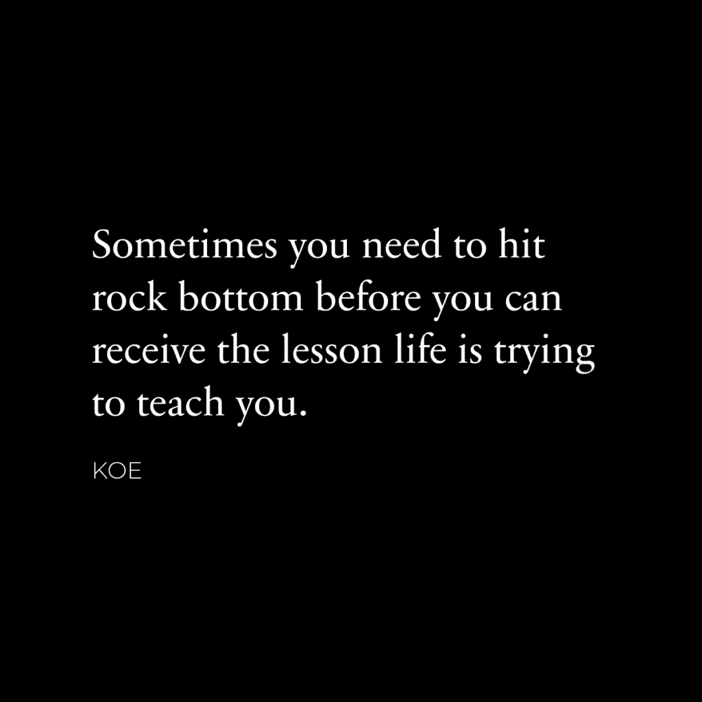
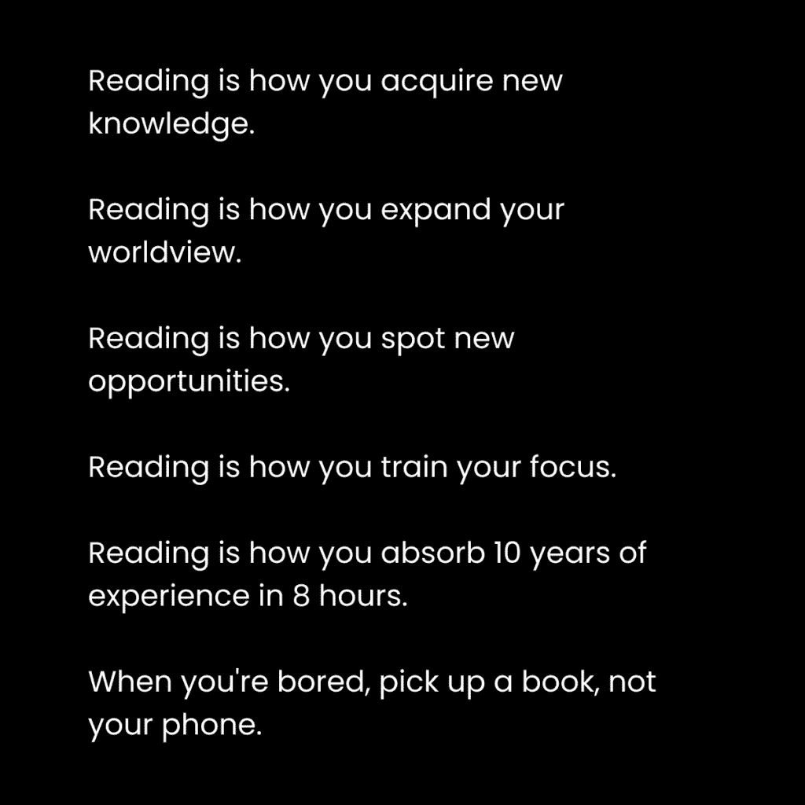
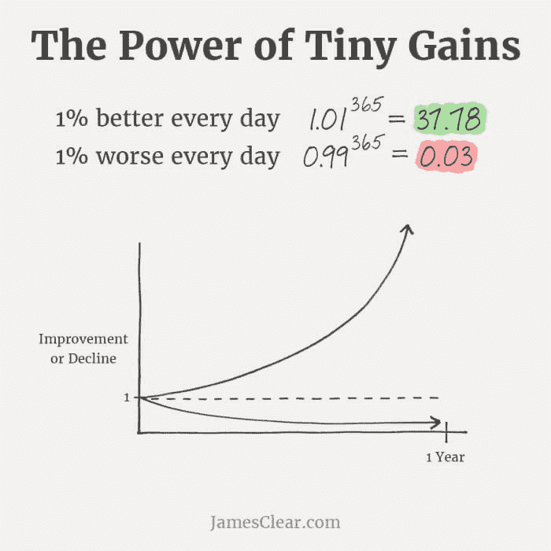
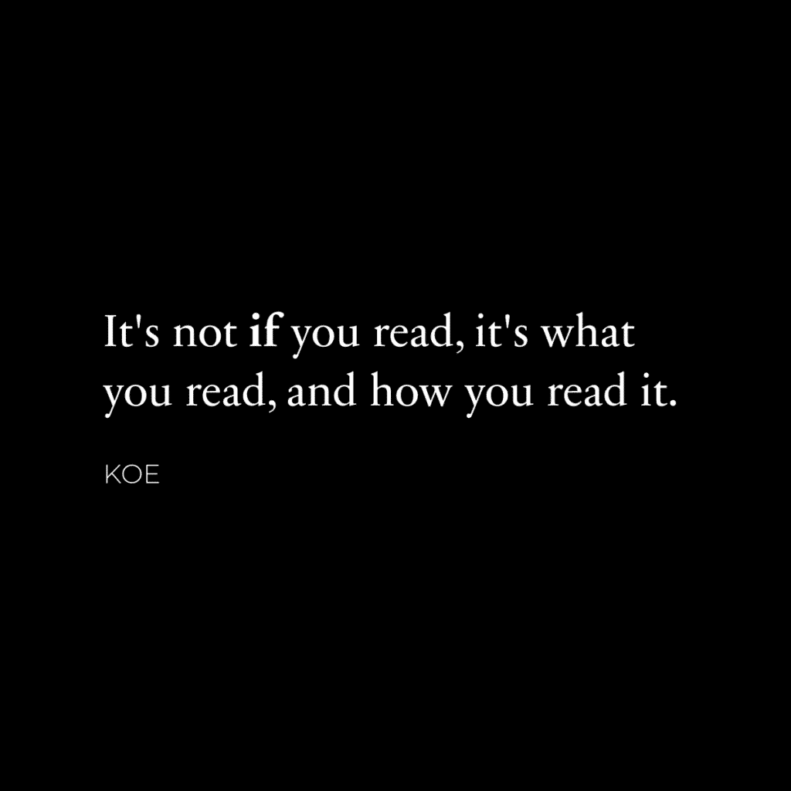
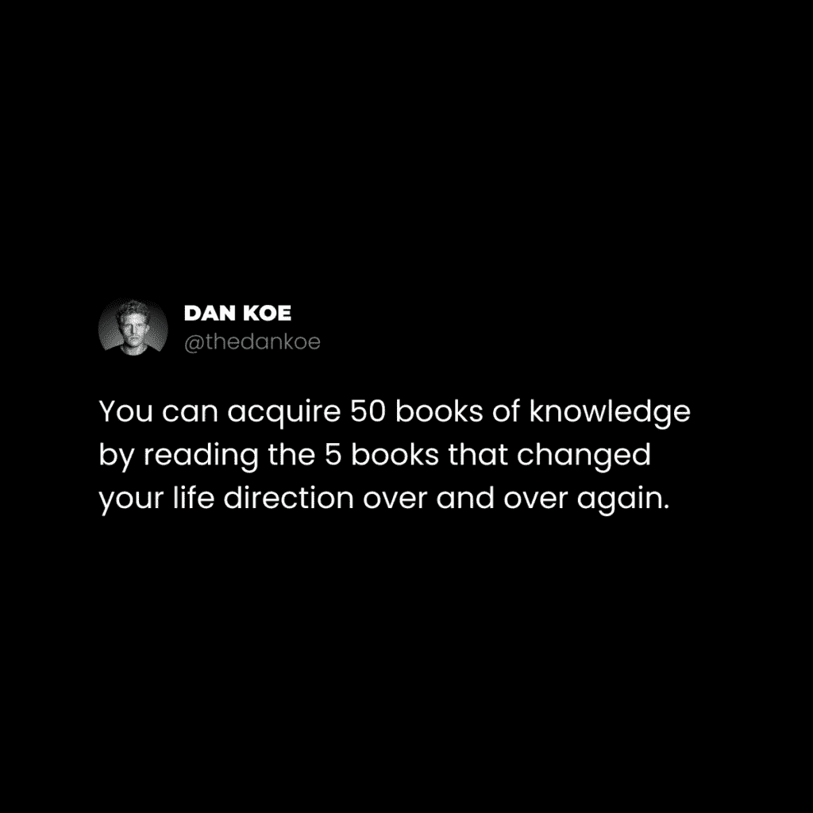
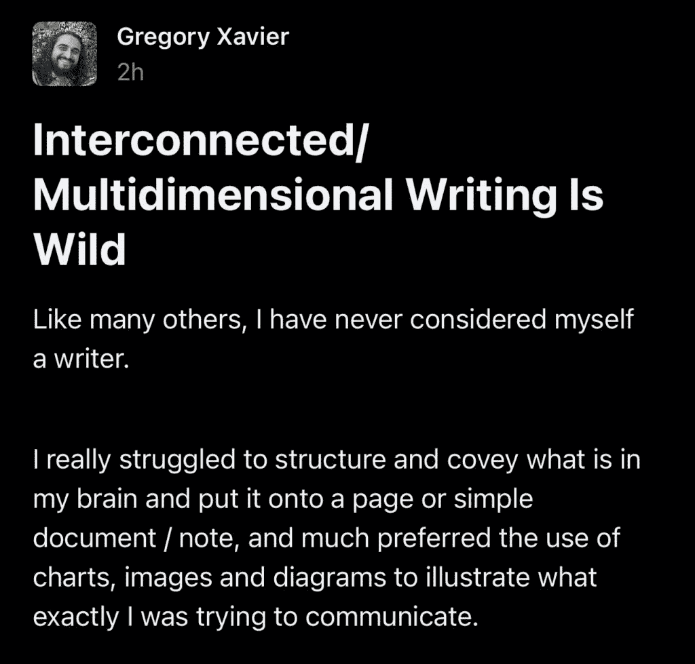
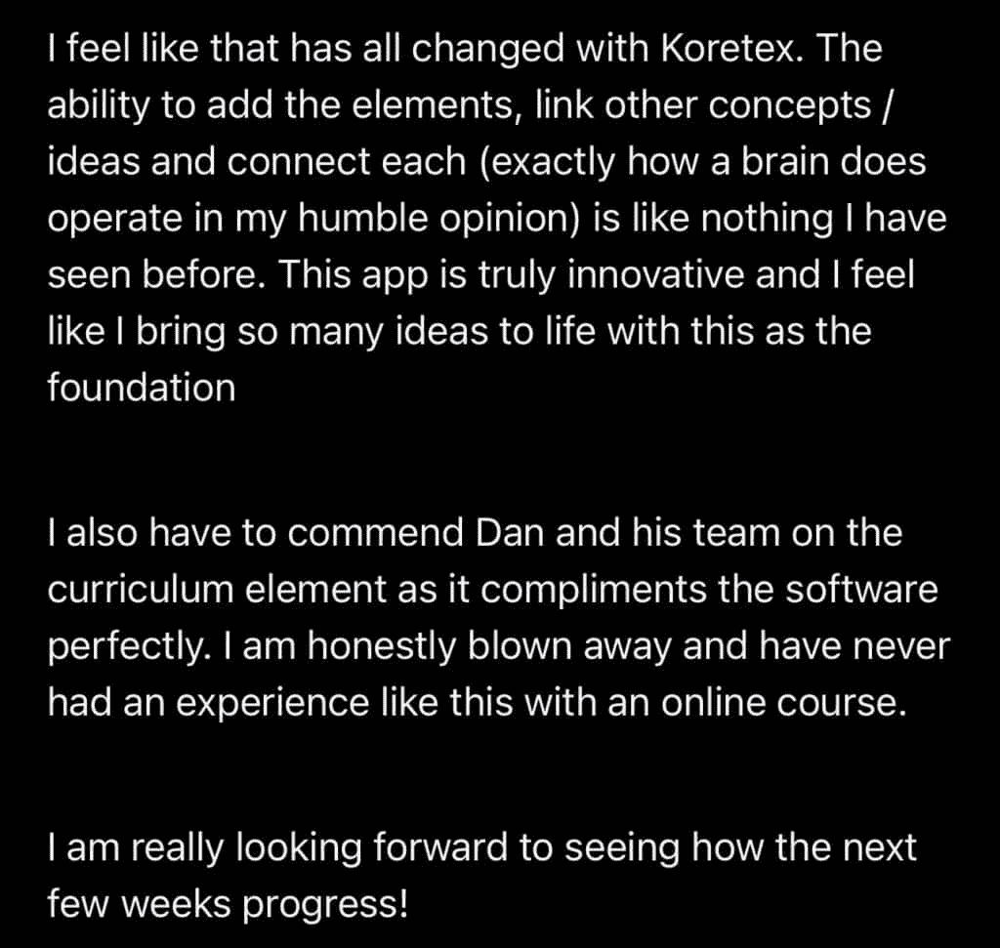
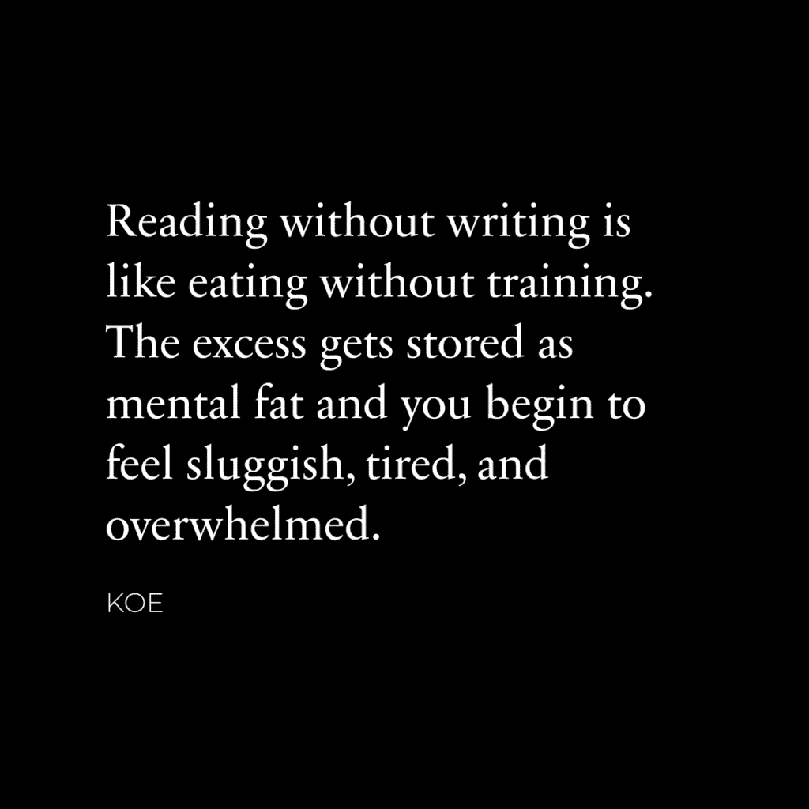

# 阅读：改变你生活的简单习惯：概述与引言

在本节课中，我们将学习如何通过培养阅读习惯来深刻地改变你的生活。我们将探讨阅读的重要性、如何选择书籍、如何有效阅读，以及如何将阅读与写作结合，从而将知识转化为行动和创造力。

---

## 第一部分：阅读的理由 🧠

上一节我们概述了阅读的巨大潜力，本节中我们来看看为什么阅读是改变生活的核心习惯。以下是支持这一观点的几个核心理由。

### 1. 你只能用冰箱里的食材来烹饪

这个比喻来自蒂姆·德莫斯。它意味着你的思维和认知范围，决定了你能为自己设定什么样的目标。如果你的信息来源单一，你的目标也会受限。

*   **公式**：`你的目标 ≈ 你摄入的信息`
*   如果你只接触常规信息，你的大脑只会注意到符合常规路径的机会。通过阅读新书进行自我再教育，你将接触到新颖的想法，从而为自己设定新的、更宏大的目标。你的“意识表面积”会扩大，开始将生活中的新想法联系起来，并注意到之前忽略的机会。

### 2. 大脑是一块需要训练的肌肉

许多人关注身体健康，却忽视心理“肌肉”的锻炼。心理健康关乎理解、认知和清晰度。

*   **核心概念**：**通过重新编程大脑来改变生活。**
*   阅读那些挑战你信念、让你意识到自身无知、并鼓励你做出积极行为改变的书籍。就像健身一样，不要期望一开始就能举起最重的重量。跳过不理解的部分，随着阅读习惯的养成，你的大脑会逐渐建立连接。

### 3. 结束坏习惯的最好方法是替换它们

你每天能培养的习惯数量有限。审视你无意识养成的习惯，有多少真正有益于你的未来？

*   **核心概念**：**用阅读替换一个坏习惯（如无目的地刷手机或看电视）。**
*   坏习惯不仅占用时间，还会缓慢侵蚀生活的其他方面。好习惯则具有指数级的好效果。用阅读来替代，不仅能改善心理健康，还可能带来更深远的影响。

---

## 第二部分：该读什么 📚

上一节我们探讨了为什么要阅读，本节中我们来看看如何选择能真正滋养你成长的书籍。选择书籍的关键在于“意图”。

**意图**意味着你正在为什么而努力。就像肌肉需要拉伸才能生长一样，有意识地生活就是在锻炼心智肌肉。只有当你有了改变的意图，书籍才能有效地帮助你。

以下是选择书籍的三个指导原则。

### 1. 阅读挑战你的书籍

一本有挑战性的书就像深入未知领域。过程可能艰难，但突破时的领悟感会带来巨大的多巴胺奖励，并教会你“进步”的过程。

*   **关键点**：感到困惑和不知所措是正常的，这标志着你的大脑正在努力学习和寻找答案。不要因此停止。

### 2. “一直阅读你所热爱的，直到热爱阅读。” —— 纳瓦尔

习惯养成的原则同样适用于阅读。就像健身要选择适合自己的计划一样，阅读也要从你真正感兴趣的主题开始。

*   **核心概念**：**有效的习惯形成 = 找到“有效”和“你喜欢”的交集。**
*   先选择吸引你的书籍，让阅读成为你生活的基础习惯。之后，你自然会知道该读什么。

### 3. 读那些能让你变得聪明的书

智力不在于知识量，而在于理解力和整体的模式识别能力。它源于成为通才，而非局限于单一领域的专家。

*   **核心概念**：**智力是整体的、创造性的和形而上的。**
*   选择那些能打开你思维、关于整体论、创造力和形而上学的书籍。它们帮助你以更宏观、更互联的方式理解世界。

### 推荐书单

以下是一些反复阅读能带来深刻洞察的书籍：

1.  **《不可能的艺术》** 史蒂文·科特勒 —— 关于达成非凡目标的科学与实践。
2.  **《心流》** 米哈里·契克森米哈伊 —— 理解如何在生活中获得深度乐趣。
3.  **《万物简史》** 肯·威尔伯 —— 以整体视角理解世界。
4.  **《安东尼·德·梅洛的觉醒》** —— 以清新幽默的方式探讨生活。
5.  **《成为超自然》** 乔·迪斯彭萨 —— 探讨打破习惯循环、改变生活。
6.  **《三发起者的基巴尔离子》** —— 对秘传哲学和现实模式的介绍。
7.  **《卓越男性的道路》** 大卫·迪达 —— 关于男女性动力学与精神成长。

---

## 第三部分：如何阅读 🔍

上一节我们知道了该读什么，本节中我们来看看如何高效、愉快地进行阅读。深度工作专家卡尔·纽波特每月读5本书的秘诀在于：选择有趣的书、像安排锻炼一样安排阅读、创造仪式感、读完一本书、减少手机干扰。

以下是几个实用的个人阅读策略。

### 1. 寻找一两个想法，然后放下

大多数书的核心观点在前几章。如果你是寻找灵感和大思想的创作者，找到那个让你兴奋的“金块”后，可以暂停阅读。

### 2. 去散步并听书

散步能摆脱干扰，运动能让大脑更易于接受新想法。结合听书，是一种高效的阅读方式。

### 3. 轮换不同的主题和类型以识别模式

同时阅读多本不同主题的书（纸质、电子、音频），有助于在脑海中形成思想网络，产生新颖的联系。

### 4. 让书籍无处不在

把书放在你常待的地方：桌上、床头、厨房。让阅读触手可及，比拿起手机更自然。

### 5. 创建一个你喜欢的阅读空间

打造一个专属的、舒适的阅读环境，比如安静的露台，配上一杯好咖啡，能让阅读体验更愉悦。

---

## 第四部分：写作不仅仅是作家的专利 ✍️

阅读是输入，写作是输出。本节我们将探讨如何通过写作将阅读所得内化并创造价值。**写作 = 有序思考。有序思考 = 有效沟通。** 而沟通，是你从生活中获得所需的关键。

### 为什么写作

你每天都在写作（邮件、信息、笔记）。互联网时代，写作能让你建立受众，分享技能，并以此谋生。写作是我们作为创造者物种的生存和进化方式。

### 写作地点

对于大多数人，最可行的起点是社交媒体。
*   **路径**：写短帖吸引关注 → 写长文通讯培养关系 → 积累的内容可成书或核心受众。

### 写什么内容

你不需要刻意寻找细分市场。
*   **核心**：**你就是你的细分市场。**
*   写那些帮助你实现目标的想法和经验。吸引那些与你有相似目标、你能帮助的人。你的独特视角会自动筛选出对你重要的内容。

### 如何写作

1.  **像纳瓦尔一样**：把平台当作公共笔记本。读到有启发的想法，就从自己的角度分享出去。
2.  **关乎行为改变**：写作是为了提出有说服力的论点，帮助人们做出更好的决定。
3.  **为自己而写**：把你的公开分享视为写给过去、现在和未来自己的信。说服自己变得更好，这些想法就会成为你身份的一部分。
4.  **注意“啊哈！”时刻**：阅读时，记录下让你灵光一现的想法和可操作的建议，并通过写作分享你的实践和心得。

写作不必复杂。坚持写下去，就能为你的未来带来杠杆效应。

---

**本节课总结**

在本节课中，我们一起学习了阅读如何作为一个简单习惯改变生活。我们从**阅读的理由**开始，明白了它如何扩展认知、训练心智并替代坏习惯。接着，我们探讨了**该读什么**，强调要基于意图选择挑战性、感兴趣和能提升整体智力的书籍。然后，我们学习了**如何阅读**，包括实用策略和创造愉悦的阅读环境。最后，我们认识到**写作**是将阅读内化并创造价值的关键一步，鼓励你为自己、也为能帮助的人而写。

记住，你不需要跌入谷底才开始。只需要一个意图，和一本书。