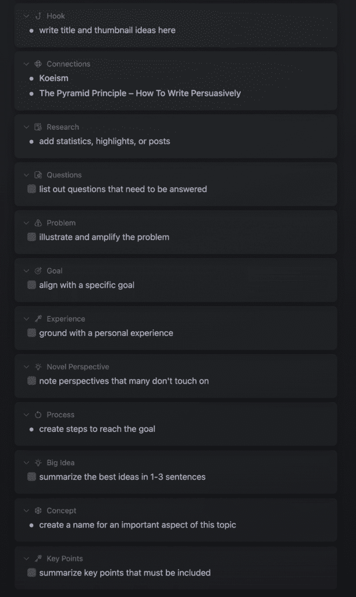
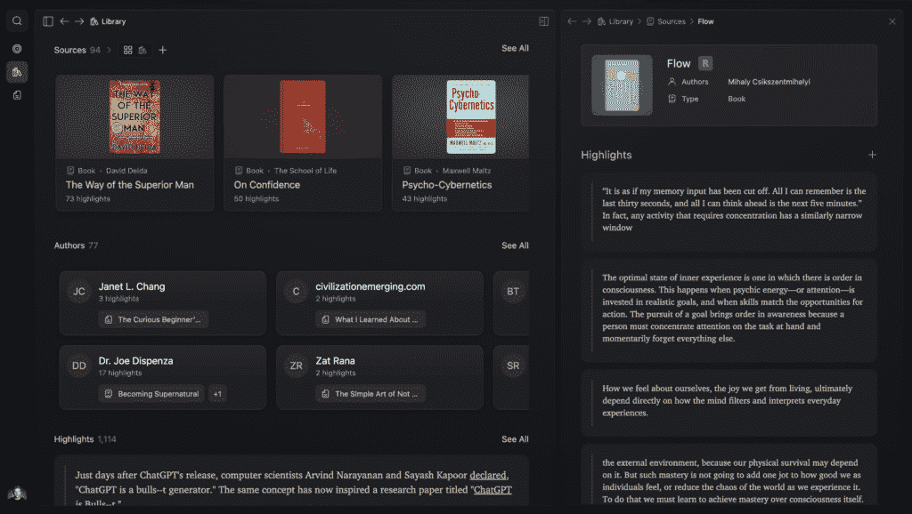

# 说服力：掌握21世纪的核心技能 🧠

在本节课中，我们将要学习说服力的本质、其重要性，以及如何通过结构化思维和具体框架来提升这项关键技能。说服力并非操纵，而是获取资源、实现目标并创造理想生活的必要能力。

## 说服力：力量与影响的游戏

说服力是21世纪最伟大的技能。说服力不是操纵，这是两个不同的概念。说服力也并非不道德。如果它是不道德的，那么你将是地球上最不道德的人，因为你每天都在无意识地进行说服。

当你试图说服朋友与你一起做某事时，你正在使用说服力。当你提出一个论点说明人们为何应该与你合作时，你也在使用说服力。你试图从生活中获取你想要的东西，你正在参与人生的游戏。为了得到你想要的东西，你需要说服人们给予你关注、资源、金钱，以及最重要的——权力。

在社会中表现出色并持续成功的人，是那些拥有权力和影响力的人。他们是努力获取实现目标所需资源、变得有价值并创造财富的人。在历史上，弱者、普通人或无思想的人从未免于被当作工具对待。地位、权力和影响力本身并不坏。每个人都有，每个人都试图获取它们。只有当出于无意识的原因追求时，它们才会变成坏事。

如果你想要被视为有价值，你需要产生权力。如果你成功的策略仅仅是表现得和善、高尚，你将被那些影响力更大但品行可能不佳的人推开。那些声称权力游戏是坏事的人，实际上也在玩他们自己的权力游戏。

为了实现你喜欢的工作、有意义的生活方式，你需要一定程度的权力。你需要有人为你所做的工作付费，需要有人愿意听你说话，需要对你创造的生活方式有控制感。你不仅需要说服人，还需要说服现实本身与你共谋。“创造”理想生活就是在说服现实。你不能强迫或欺骗现实，但你可以说服它。这是真理的标志。

你天生就知道需要学会说服以得到你想要的东西。唯一阻止你的，只是那些在生活中无所作为的人的评判。

## 如何开始说服：结构化思维的力量 💡

上一节我们探讨了说服力的重要性，本节中我们来看看如何通过结构化思维来启动你的说服实践。结构化思维至关重要。框架和结构不会剥夺你的创造力，反而会增强它。

人类通过故事来理解世界。大脑是一台寻求意义的机器，会将任何遇到的信息与自身目标和经验关联起来。因此，你可以写任何你想写的东西，但你的写作或说服的目的是什么？是为了得到你想要的东西。如果你的写作没有针对另一端的人，那么它就不能算作说服。

你将在几乎所有事情上使用以下方法。我挑战你在未来的每一个生活场景中练习说服，观察你的生活如何改变。

以下是你可以练习说服的场景列表：
*   在你的社交媒体帖子、时事通讯和着陆页上。
*   在你的社交网络、销售电话或私信中。
*   在你试图做出决定的人际关系中。
*   尤其是在你推广你的工作或产品时。

今后要有意为之，在任何机会都练习这些技巧。

### 金字塔原理：从结论开始 🏔️

金字塔原理是一种简单而有效的沟通方式。你可以用它来组织你的观点，使其清晰有力。

这就是你怎么做的：
1.  **从你的答案、结论或核心观点开始**。
2.  **用3个（或以上）关键论据来支持你的结论**。
3.  **用事实、数据、轶事、引言等来支撑你的每个论点**。

从大局来看，我的所有通讯文章都是这样写的。这并没有让我显得不真诚，反而给了我一个有影响力的方式来表达思想。读者能立即知道内容是否相关（钩子有效）。他们可以跟随你得出结论的逻辑。最后，它简单、易复制、易于使用。

**公式：结论 -> 论据 -> 支撑材料**

### 我个人使用的说服框架 🛠️

我喜欢在我写的或说的任何东西中，从痛点或问题开始。这使我的其他想法流畅，也很好地框定了情境，并使读者有了资格感。当某人意识到一个痛点时，他们的思维会将其与生活中的目标联系起来，激发了解更多信息的欲望。

记住：人类通过故事理解世界。故事通常从一个预示着“目标”或结果的问题开始。

以下是几个可以尝试的框架，从简单到复杂：

**1) PP – 痛点与过程**
非常简单。提出痛点并提供克服它的过程。
作为一个推文的例子：
> 如果你总是感到疲倦：
> *   在午夜停止刷手机
> *   改善你的糟糕饮食
> *   去散步，活动身体
> *   对一个新兴趣着迷
> 你之所以感到疲倦，是因为你陷入了导致疲倦的常规中。

将所有这些框架总结成一个结论或行动号召是明智的。此外，你的解决方案越独特，影响力就越大。

**2) PAS(O) – 问题，放大，解决方案，(提供)**
与此类似的故事。你从痛点开始，但这次你放大了它。你深入思考这个痛点如何蔓延到某人生活的其他方面。越具体、越有共鸣，效果越好。个人经历在这种情况下通常效果很好。
这个框架的“提供”部分是可选的。如果你用它来写社交媒体帖子，可能不需要提供部分。如果用于推广，则将你的产品定位为目标痛点的创新解决方案。

**3) PASTOR – 问题，放大，故事，证词，提供，回应**
PASTOR框架稍长，最好用于推广材料，如着陆页和电子邮件。当你推出产品、进行促销时，使用这个框架。
*   **问题**：从问题开始。
*   **放大**：放大它。
*   **故事**：提供一个个人或客户故事，说明他们是如何克服问题的。
*   **证词**：通过他人的证词展示证据。
*   **提供**：介绍你提供的功能优势。
*   **回应**：引导他们采取下一步行动，比如购买。

**4) 尝试并超越框架**
学习说服力的最佳方式是：
1.  研究写作和演讲框架。
2.  将它们并排写下来。
3.  在现实世界中练习它们。
4.  注意它们之间的模式。
5.  打破规则。

框架、系统和大多数教育都是训练轮。为了学习说服技巧，研究并写下5-10个框架在你的帖子、对话、通讯中尝试。然后，放下框架，使用最初使它们起作用的原理，在任何时候成为一个有说服力的人。

### 了解你的听众：五个意识层次 🎯

你的话只有在对某人说话时，且他们*感知*到你的话有价值时，才能说服他们。我们可以通过理解5个意识层次来解决这个问题：

以下是五个意识层次：
1.  **无意识**：意识不到他们的问题及其如何伤害生活质量。（关注**痛点**）。
2.  **问题意识**：意识到他们的问题，但不知道如何解决。（关注痛点**影响**）。
3.  **解决方案意识**：意识到问题，并知道有解决方案可以解决它。（关注**可操作建议**）。
4.  **产品意识**：意识到问题，并知道有简化的路径或系统可以解决。（关注你**独特的做事方式**）。
5.  **最意识**：他们准备好改变，只是需要正确的理由去行动。（关注从**不同角度覆盖**——用多种方式说一件事）。

在我的通讯中，我经常试图提升人们整个链条的认识。我假设人们不知道他们的问题，所以我会在开头陈述它。然后深入探讨问题及其影响，接着呈现逐步的解决方案，并推广我的相关产品或服务。

## 实践流程：我如何有说服力地写作 ✍️

上一节我们介绍了多种框架，本节中我们来看看如何将这些框架融入一个具体的写作流程中。我想展示我在写作时如何产生影响力的过程。

要开始这个过程，我们需要四样东西：
*   **写作主题**：最好是表现良好的内容主题。
*   **想法倾倒**：将所有想法倾倒出来，并随时记录新想法。
*   **大纲页面**：以有说服力、有影响力的方式组织所有想法。
*   **草稿页面**：将你的想法和大纲串联成文。

这就是我的写作工作流程：

1.  **每周开始时创建大纲**。
2.  **随时捕捉想法并附加到大纲**。
3.  **在大纲中使用“元素”进行组织**（例如：问题、放大、故事、解决方案等）。
4.  **连接相关的笔记、想法、推文、引言和研究**来加强论点。
5.  **列出需要回答的问题或反对意见**。
6.  **阐述并放大痛点**。
7.  **头脑风暴目标或期望结果**。
8.  **谈论个人经验以增强可靠性**，注意新颖视角，创建可操作步骤。
9.  **最后，进入草稿页面将大纲串联成流畅文章**。

**核心思想**：你不是学会写有说服力的文章，而是学会有说服力地组织你的思想，然后写作就变得容易了。

## 总结与行动指南 🚀

本节课中我们一起学习了说服力的核心价值、关键框架以及实践流程。为了开始练习你的说服力，请遵循以下步骤：

以下是你的行动指南：
*   **接受现实**：接受你需要力量和地位来实现目标。
*   **掌握基础**：以金字塔原理作为起点。陈述你的观点，论证你的观点，支持你的观点。
*   **使用框架**：使用文案、内容或说服力框架来构建你的写作、演讲或视频脚本。
*   **先列大纲**：首先基于框架创建一个大纲。
*   **捕捉想法**：建立一个随时记录想法的地方。
*   **撰写草稿**：将你的大纲想法串联成文。
*   **公开发布**：将其发布在公共平台上，收集反馈数据。

如果人们不参与、购买或关注，说明你可能需要更多地教育自己。说服力是一项可以通过刻意练习而掌握的关键技能。现在就开始应用这些框架和流程，去说服世界，创造你想要的生活。