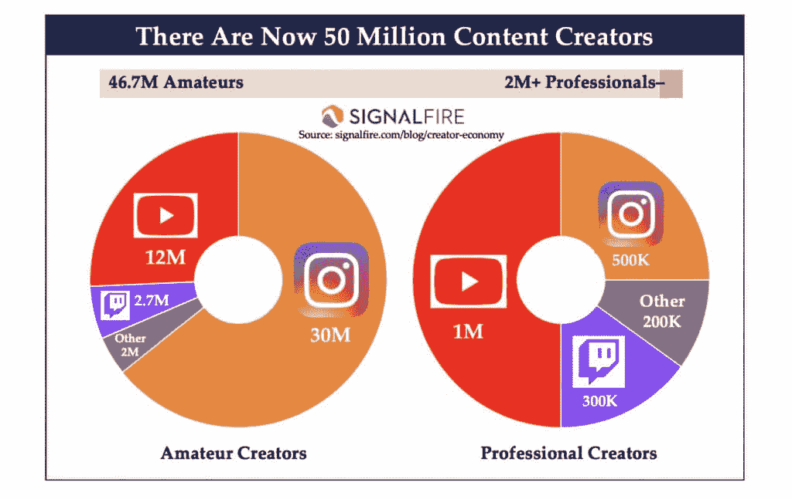

# 一人企业指南：未来教育、工作与个人品牌

在本课程中，我们将探讨一种面向未来的个人商业模式。这种模式融合了教育、价值创造与个人兴趣，使个人能够通过分享知识和技能来建立有意义的事业。我们将分析当前趋势，并提供一个可操作的框架。

## 概述

我们正处在一个变革的时代。传统的教育和工作模式正在被重塑。本课程将引导你理解这种转变，并学习如何构建一个以你个人品牌为核心、以创造价值为驱动的“一人企业”。我们将从宏观趋势入手，逐步拆解实现这一目标的具体步骤。

## 未来图景：教育、工作与个人的融合

上一节我们概述了课程目标，本节中我们来看看我们所设想的未来世界具体是什么样子。

在这个世界里：

*   **创作者成为新的教师**。知识传播不再局限于传统机构。
*   **在线课程成为去中心化的学校**。学习可以按需、个性化地进行。
*   **个人追求兴趣并教授同类人**。这创造了更具共鸣和效果的学习体验。
*   **教育更高效、经济且注重结果**。它超越了顺从的公立学校体系。
*   **个人可自由选择课程和导师**。他们不会被锁定在单一领域，从而避免思维狭隘和对固定工作的依赖。
*   **深度通才主义（成为博学家）日益普及**。这是培养独立思考能力的前提。
*   **学习、教学与赚钱合并为一种理想生活方式**。技术进步推动了这一融合。

你现在阅读这份材料，本身就是这一进程的体验。这封信探讨的内容，可能在传统教育中不会涉及。在我看来，这代表了教育、创业和整体工作的未来方向。所有迹象都指向这一点。

## 趋势与数据：为何现在是时机

上一节我们描绘了未来的可能性，本节中我们来看看支持这一愿景的具体数据和趋势。

首先，创作者经济的增长没有放缓迹象。下图展示了相关增长趋势。

在我看来，成为创作者是进入一个由AI和自动化使无意义工作变得可选的世界中，最合理的路径之一。追求兴趣并因此获得报酬的愿望是永恒的。

这种生活方式适合博学者、自学者和渴望掌握一系列不可替代技能的人。

让我们进一步看数据。

SignalFire的图表显示，目前有5000万内容创作者。此外：

*   自由职业者占劳动力总数的比例从2020年的36%大幅增至46.6%。
*   创作者经济规模预计到2028年将从2500亿美元翻倍至4800亿美元。
*   技术赋能的企业（如创作者）可以通过数字产品和服务实现高达95%的利润率。
*   大公司开始要求其领导者活跃在社交媒体上，以进行更人性化的营销。

企业正越来越多地选择承包商和创作者，而非传统员工和营销渠道。

简而言之，未来有利于个人、小团队和进步的公司。技术降低了创业门槛，人们现在拥有反击“讨厌的生活”的工具。

## 技术赋能：个人能力的超级进化

上一节我们看到了市场的增长，本节中我们来看看技术如何让个人变得更强大。

技术已经高度发展。

*   你不再需要一个10人开发团队来构建网站。现在有 `无代码拖放工具`（如Webflow, Bubble）可以快速实现。
*   你不再需要为传统广告付费。你可以通过发布内容来吸引受众。

许多人认为AI将取代创意工作者。但事实恰恰相反。AI是聪明人的能力放大器。它使个人或小团队能在更短时间内完成更多工作，例如在周末构建应用程序或快速产出内容。最终成果的质量取决于一系列广泛的技能，这些无法仅通过向ChatGPT输入指令来获得。

这是对通才和博学者的**超级赋能**。

## 重新思考教育：智慧人的新路径

上一节我们讨论了技术工具，本节中我们来看看为何需要重新评估传统教育路径。

> 学校找不到的知识，是就业中找不到的金钱来源。——《专注的艺术》

人们对未能兑现稳定未来承诺的机构和意识形态的信任正在下降。

*   学校将思维局限于对“好工作”的追求。
*   传统工作将人束缚在可替代的、重复的任务上。

对于那些重视自我教育和个人责任的人来说，现在可能是一生中最重要的时刻。社交媒体和互联网为教育、意义和工作的重新分配奠定了基础。界限变得模糊，中心化机构控制力减弱。

个人可以通过分享兴趣和信仰，在其品牌下提供产品或服务来获得收入。这是一个历史性的转折点，因为：

1.  任何人在互联网上都可以自由分享其兴趣和信仰。
2.  任何人都可以自由地自我发展、获取新技能并向他人学习。
3.  教育决定个人潜力，我们正进入一个教育来源可选择的新时代。

我们正在进入一个“人类经济”时代，一个反映自然模式、注重目的的经济体。在这里，人们可以选择向拥有共同愿景和目标的导师学习。

传统学生被赋予使其变得可替代的目标。现代学生则可以选择自己的目标，找到导师，投资自己，并在实现目标后进化或成为新的导师。

## 构建一人媒体公司：你的个人教育体系

上一节我们批判了旧体系，本节中我们来看看如何构建属于你自己的新体系。

理解进化，就能明白个人、行业和生命本身在 **统一（集中）** 与 **分裂（去中心化）** 之间波动。这是一个普遍原则。

我们正进入一个钟摆从机构摆向个人的时代。随着不确定性和混乱（熵）增加，创造价值（财富）的机会也在增加。财富是通过创造价值来增加秩序的行为，例如将木头变成房子。

以下是如何运作的分解：

### 1) 拥抱社交媒体作为起点

社交媒体是当前注意力的焦点。它是一种免费技术，彻底改变了我们为改善生活而学习和获取知识的方式（对于价值导向者而言）。社交媒体是你加入未来工作模式的方式。

企业正在培养“内部创作者”来增加公司个性。个人创作者（如从医生转型的Ali Abdaal）通过分享专业知识，发现了比原职业更有价值、更盈利的道路。

### 2) 成为价值创造者

如果我们观察进化的方向，现实的目的大概是统一意识。所有智能生命都通过创造价值向更高层次的统一迈进，或者说，通过创造财富来对抗熵。

在心理发展层面，随着个人成长，其关注圈从自我扩展到社会、世界乃至宇宙。欲望从生存转变为贡献。

那么，“创作者业务”适合谁？它适合那些处于“成就者”到“策略家”及以上发展阶段的人。这些人热爱学习，在特定领域有成果，并渴望通过帮助他人和推动进化来实现自然愿望。

创造者商业模式的美妙之处在于，它本身可以作为一种推动力，帮助人从传统思维过渡到后传统思维。自我发展是通往创业的“门户药物”，因为你意识到提升他人是提升自己的下一个层次。

### 3) 你的生态系统：品牌、内容与产品

让我们将其具体化。你需要三样东西来建立一个专注于教育而非娱乐的价值创造者企业：

1.  **品牌** – 你思想的延伸。你在网上的呈现方式，以及人们发现并追随你观点的途径。
2.  **内容** – 你分配教育、知识和智慧的方式，用以帮助他人在你擅长的领域成长。
3.  **产品** – 一个帮助人们解决问题和实现目标的系统。

你的品牌是你邀请人们进入的世界，你帮助他们采纳的视角。内容在其中扮演着最重要的角色。品牌是受众在3-6个月内对你思想的认知结晶。

我们构建的是一个**内容生态系统**，一个互联网的角落，让人们加入、学习并进化。

一个高效的实践系统可以是：
*   每天撰写社交帖子。
*   在全平台发布。
*   将表现最好的想法扩展为更深入的通讯文章或长帖。
*   在个人博客/网站发布文章。
*   将文章转化为视频和播客脚本。
*   在产品中插入链接，方便受众发现。
*   将视频嵌入对应的博客文章。
*   在所有社交平台推广这篇博客文章。

这创造了一个循环、互联的“学校系统”，让人们根据目标探索所需。核心创作工作可能每天只需1-2小时。

### 4) 销售高价值产品

企业家的未来是教育、意义和价值交换的融合。销售“高价值产品”指的是：销售能帮助人们达到新发展阶段、新意识层次、打破限制的产品。

在众多选择中，**教育产品**是最好的起点，因为：
*   创建和分发成本极低。可以从电子书开始，逐步发展为课程或社群。
*   改变行为通常始于教育和意识提升，不一定需要实体产品。
*   利润率高，可扩展性强，能创造高杠杆的生活方式。
*   可以先建立现金流并验证未来产品想法，同时积累潜在客户。

教育市场需求巨大，且远未饱和。随着选择增多（熵增），财富创造的潜力和资源也在增加。在线学习正被加速采纳。

最有利可图的产品通常是帮助人们达到或超越“成就者”和“多元主义者”阶段的产品。这些阶段对应着对 **健康、财富、关系和幸福** 这些永恒主题的需求。

如何创造有利可图的产品？以下是步骤：
*   **选择媒介** – 如电子书、付费通讯、课程、社群、辅导。
*   **选择领域** – 聚焦于健康、财富、关系或幸福。
*   **向过去的自己销售** – 解决你已克服的问题。
*   **改进现有热销产品** – 研究市场并做出自己的特色。
*   **尝试独特系统** – 测试并整合多种方法。
*   **规划并构建产品** – 创建解决大问题、达成预期结果的提纲。
*   **融入个人视角** – 过滤信息，使其与你的目标一致。

人们倾向于向处于相同或稍高阶段、并能提供清晰路径图的人学习。你的产品就是你的地图。市场饱和不是问题，因为人们追随的是个性、目标和能带领他们进入下一阶段的导师。

## 总结

在本课程中，我们一起学习了如何构建面向未来的“一人企业”。我们从趋势分析入手，探讨了创作者经济、技术赋能和个人品牌的重要性。我们重新审视了教育的角色，并详细拆解了构建一人媒体公司的核心框架：**品牌、内容和产品**。关键在于，通过分享你的知识和技能，建立一个帮助他人成长的内容生态系统，并以此为基础提供高价值的产品或服务。这条道路融合了学习、教学与创造价值，为追求深度、自主和有意义工作的个人提供了一种可行的未来蓝图。