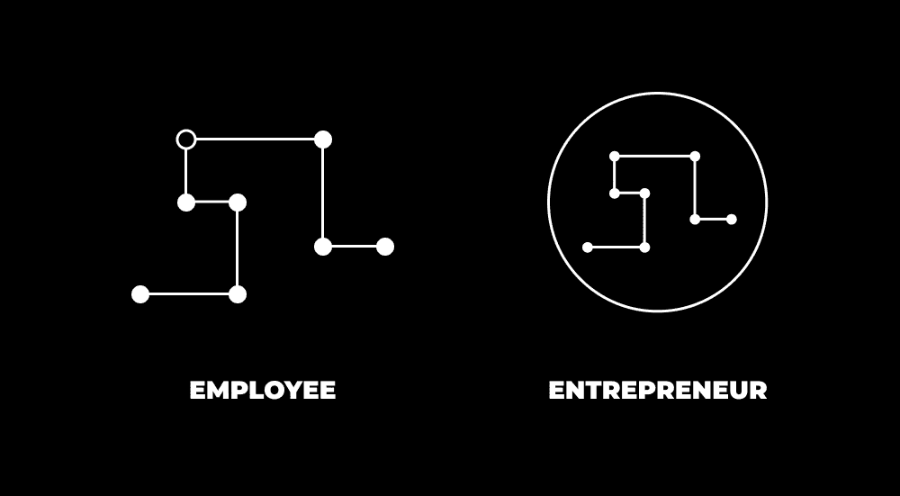

# 如何在20多岁时成为百万富翁：概述与心态准备

在本节课中，我们将要学习如何在20多岁时实现成为百万富翁的目标。我们将从心态转变开始，探讨传统观念的局限，并理解在数字时代创造财富的新逻辑。请记住，金钱能解决金钱问题，但真正的满足感源于个人全方位的成长。

我一直厌恶为微薄的回报付出巨大的努力。

在凌晨3点醒来，只为了一份最低工资的早班工作。

每天上学8小时，内心清楚这些时间投入未来可能只换来与普通人无异的收入。

为别人的公司全力以赴，但无论多么努力，收入都固定不变。

我很早就形成了这种认知。

当我向他人解释时，他们说我从小就观察力敏锐。

我能看到大多数人不快乐、缺乏活力，并为几乎每一个决定感到压力，尤其是财务决定。

因此，我的注意力转向了相反的方向。在青少年后期，我花了大量时间剖析成功人士成功的原因。

我一直梦想成为“百万富翁”。

这个标签听起来充满诱惑。

地位、自由、压力的减轻。

如今，作为一个已经实现这一目标的人，我可以告诉你，你对成为百万富翁的所有想象都是真实的。

我不会轻视这一点。回想起曾为支付合租屋里300美元租金而挣扎的日子，我充满感激。不必为99%的消费担忧，这既是幸运，也带来新的挑战。

当然，成为百万富翁并不意味着生活完美无缺。发展财务领域并不等同于同步发展了心理、身体、社交和精神领域。

事实上，如果你观察周围，那些只关注金钱的人，生活往往相当糟糕。

所以，在开始之前，请牢记这一点。

我将为你提供在20多岁时成为百万富翁的确切方法。

但要明白，赚钱只会解决你的金钱问题。

而你大多数的金钱问题，实质上是心理问题。除非你致力于成为最好的自己，否则金钱的影响可能远不如你想象的那样大。

## 学校里没有教给你的事

如果你正在阅读本文，你的成长环境深受旧经济模式及其观念的影响。

“把你的储蓄投进401k和股市，”妈妈这样说。

“房地产是99%的人成为百万富翁的方式，”斯科茨代尔一位随机的富有老人这样说。

“要节俭。省下每一分钱。收集优惠券。不要冲动消费。”一个过着无人向往的乏味生活的人这样说。

“去学校学一些你不感兴趣的东西，以便找到工作，”几乎所有人都这样说，却不理解我们的公立教育体系源自普鲁士军事国家模式——旨在培养顺从、依赖主流社会系统的人，同时抑制广泛探索和构建独特愿景的能力。

不，谢谢。

事实上，我们正经历着第二次文艺复兴。

新兴的富人们明白，在一个任何人都能学习和创造的世界里，思想是新的石油（如果你关注独立开发者领域，就会知道非程序员也能利用新的AI工具在周末构建出最小可行产品）。

他们明白，新一代人在思想空间而非物理空间积累财富（物理空间仍然重要，但如今主要对已建立现金流的人开放）。

数字空间是无限的。物理空间是有限的。

关于这个有人通过发布表情包和知识成为百万富翁的时代，你需要理解以下3件事：

### 1) 数字景观

这一点我花了些时间才真正理解。

我接受的教育让我认为应该精打细算每一分钱，并“慢慢变富”。

但这从未让我内心感到舒适。

多亏了互联网，我清醒地意识到，确实有人在做自己喜欢的事情并以此赚钱。我每天都在消费他们的内容。这足以证明，我可以尝试通过各种方式实现那种生活。

在深入细节之前，这是你需要理解的核心理念：

**1) 如果你想在工作之外赚钱，*你*需要创造并分发产品。**

我会不断重复这一点，直到每个人及其母亲都意识到，他们之所以依赖主流范式生存，是因为离开（或尚未离开）学校系统后没有持续学习。

如果你不去创造可销售的产品，你将永远在为别人销售产品。

你现在能获得任何收入，仅仅是因为你在公司中扮演了一个**特定**角色，而该公司通过销售产品或服务来赚取收入。

换句话说，如果你想获得自由，首先，你需要一个企业；其次，你需要一个产品，让人们自愿用金钱交换其中封装的价值。

简而言之，创造一些你可以出售的东西，否则，那些由公司决定、无法控制的生活压力和情绪，将像海浪一样不断冲击你。

**2) 互联网使任何拥有网络连接的人都能接触到商业和教育。**

如果你正在阅读本文：

+   你可以在3-6个月内学会任何东西（如果着迷，我用了2-3周就学会了制作[这个视频](https://youtu.be/hN-ITerTpLg)）。
+   你可以围绕兴趣写作，并吸引观众。
+   你可以将兴趣打包成产品或服务进行教学，成本极低。
+   或者，你可以用一项有市场需求的技能自由职业，直到你觉得需要将工作产品化或进行教学。

如果你想成为百万富翁，你可以走父母和老师教导的漫长道路，但他们中的大多数并非百万富翁，你为何要听他们的呢？

我今天使用的每一项技能，都来自课程、随机的系列文章、好奇心驱动的探索以及试错。

我赚的每一分钱，都直接受到我所创造的东西、看到它的人数以及这些人是否在意的影响。

如果你不在互联网上学习和构建，我恳请你审视自己实际在做什么。

将你的一天细分到每一分钟。

你是在做有助于实现目标的事情吗？

还是你在等待，希望如果足够多地刷社交媒体，某天奇迹会自动出现？

### 2) 劳动价值论已不适用

你可以在任何事情上努力工作，但这并不意味着它对人类进步有用。

这是辛勤工作的错觉。

你可以投入4年时间去获得一个学位。

你可以投入10年时间去攀登企业阶梯。

但你得到的报酬可能远低于期望。

因此，你非但没有将未来掌握在自己手中，反而在抱怨和哀叹。

“我应该得到更高工资！”

“我辛勤工作了14年，就得到这些？”

“我几乎没有时间陪伴家人。我没有足够的钱去度假。我在黑暗的隧道中劳作，看不到希望。”

世界上的抱怨者缺少一个关键拼图：

劳动价值论认为，报酬应与你付出的劳动成正比。

这让你感觉像在机械地跳圈。

让你觉得自己应得某些东西。

但现实并非如此。

货币是价值的单位。

价值是衡量人们对你所做事情在意程度的一个指标。

你的价值 = 你解决问题的规模 × 你创造的解决方案的结果 × 你让人们在意你创作的能力。

如果你对自己的收入不满意，或许是时候残酷地诚实地审视你对世界的贡献了。

根据一个人工作的数量来支付报酬没有意义。根据一个人解决问题的水平来支付报酬才有意义。

为什么？

我可以努力写作一年以成为作家，但一年的时间并不足以证明10万美元的报酬是合理的。很多时候，这种写作可能被认为比制作汉堡的最低工资工人的价值更低。关键不在于*你做什么*，而在于*你怎么做，以及你为谁做*。

你能赚多少钱取决于其他人对你那一年所做的事情的在意程度。也就是说，你的创作如何帮助他们解决问题、改变生活，并为人类进步做出贡献。

抱怨收入不足不会让你获得报酬。事实上，这可能会让你被解雇或忽视。或者被你接触到的任何人憎恶，因为他们会想，“那么……你打算*做些什么*来解决它？”

唯一的选择是亲自掌控局面。

### 3) 被动收入 VS 现金流

对99%的人来说，被动收入只是一个幻想。

被动收入是通过投资来自现金流业务的超额活跃收入建立的，正如我在[数字经济学](https://digitaleconomics.school)课程中所教授的那样。

大多数人不可能仅靠每年在股市或退休基金中投入几万美元就超越通货膨胀。

你需要超额收入。

你要么需要一份顶尖1%的工作（这就像进入NBA一样，对普通人来说概率几乎为零），要么需要建立一个企业，其收入完全依赖于你的技能获取、个人成长和持续迭代能力。

现金流业务可以归结为简单的控制论和数学。

**控制论**是指一个系统自我调节以实现目标。

换句话说，当你下定决心追求一个目标，听取反馈并根据反馈调整行动时，你将实现目标。控制论表明，低智能系统（或心智）是那些选择放弃而非调整方向的人。他们不够聪明，无法意识到任何问题都可以通过调整追求目标的方式来解决或转移。

因此，要大胆思考。要考虑数字化。要考虑无限可能。给你的思维留出连接创意的空间。

你每天的时间是有限的。

因此，你花费与建立一家互联网业务（几乎零启动成本，收入上限仅取决于你的创造力）相同的时间，可能只能建立一家实体咖啡店（收入上限为几十万美元）。

**数学**是对系统本身及其所需行动的简单理解。

如果你想在1年内赚100万美元，那就把它分解开来。

`$1,000,000 / 12 = $83,333` 每月

`$83,333 / 30 = $2,777` 每天

现在有几种方法可以实现。

以下是几种收入分解模型：

+   每天卖出18个价值`$150`的产品
+   每天卖出111个价值`$25`的产品
+   每隔一天获得一个价值`$5000`的客户
+   每隔4天获得一个价值`$10,000`的客户
+   结合两者。每周1-2个客户加上每天几件产品销售。

这本身就决定了你大部分的策略选择。

如果你选择客户路线，你可能需要一个团队（或者将服务产品化到可以自己处理交付的程度）。

如果你选择产品路线，你需要巨大的流量。

假设你擅长社交媒体。

你可以通过YouTube视频获得5万到10万次观看，或者每月在社交媒体上获得100万到500万次曝光。

当然，偶尔会有异常高的观看量或曝光量。

要在价值`$150`的产品上每天卖出18件，你需要将720人引导至产品页面，并实现2.5%的转化率。

如果你不能通过每月4-8个视频或一个活跃的社交媒体账户做到这一点，那就是技能问题。变得更强。你能获得多少观看量以及其中有多少点击，都在你的控制之中。

但具体“如何”做到呢？

## 在20多岁时成为百万富翁：2：两大核心杠杆

上一节我们探讨了数字时代的新规则和心态准备。本节中，我们来看看实现百万美元目标具体需要拉动的两个核心杠杆：产品和分销。除此之外，你的全部成功都取决于实验和迭代，即试错。

你可以通过像 [2 Hour Writer](https://2hourwriter.com) 这样的课程来补充分销知识，通过 [Mental Monetization](https://mentalmonetization.com) 这样的课程来补充产品知识，但课程只是为你指明方向，减少试错。除非你是课程的完美目标客户，否则课程无法完全契合你的意识状态和先前经验，因为只有你能完全接触自己的思想。

### 1) 产品：赚取独立收入的唯一途径

为避免混淆，我用“产品”一词定义你出售的任何东西，也包括服务。

最近在Kortex社区，有人提出了一个好问题：

*“我对自己的产品销售能力没有信心。我有成果，但我没有使用特定的框架或步骤，我只是做到了，所以我不确定如何能帮助别人。”*

这适用于健身、心理健康、编程等任何领域。

许多人认为他们不能销售产品，因为他们虽然取得了成果，但没有使用特定的过程、程序或框架。

你没有意识到的是，这正是开始创建产品的完美起点。

任何人如何创建一个产品？

你不是简单地抄袭别人的框架。

你自己创建一个。这需要从实验中获得真实客户的反馈。

你创建一个MVP（最小可行产品）。

你获得第一批客户或免费用户。

你听取反馈并衡量结果。

你实施反馈并尝试改进产品。

然后，一旦你有了扎实的成果，你就可以更积极地营销，并充满信心。

这与初学者自由职业者获得客户是一样的。他们以相对较低的价格开始，直到对自己的能力充满信心。他们获得的是*真实世界的经验*，而不仅仅是学到的理论或个人项目。

我的产品哲学是：

以下是创建产品的三种思路：

+   建立一个你之前使用过但更好的产品。
+   解决你自己的问题并出售解决方案。
+   建立一个你想要但不存在的产品。

大多数人应该从第一个开始，进步到第二个，一旦有了现金流，就转向第三个。

但你必须意识到，你可以创建任何你想要的产品。

想想亚马逊上有多少种计划本？数不胜数。

你也可以通过以下方式创建一个：

+   购买3-5种计划本
+   使用它们并注意不顺畅的地方
+   设计你自己的计划本
+   使用一两周并改进它

然后，将其打包并出售。

倾听客户反馈，让它变得更好。

很简单。现在你有了**能力**赚钱，但你还需要另一件东西：

### 2) 分销：如何在未来生存

> 建立分销渠道，然后建立你想要的任何东西。 – 杰克·巴彻勒

分销是你将**所建之物**展示给**在意之人**的潜力。

既然我们已经建立了一个产品，我们需要把它展示给人们。

最容易让人们看到你的方式是在互联网上。

互联网的前端是媒体。

传统媒体正在衰落，因此你有几个选择：

**分销有三种类型：**

*自建、借用和购买*。

你可以通过创作互联网内容来扩大受众，从而**自建**分销渠道。然后，你可以（并且应该）通过“去平台化”你的受众更进一步。

你通过将受众引导至一个社区或邮件列表来**去平台化**。这些可以是免费的或付费的。

社交媒体平台可能随时消失。你的账户可能被暂停，你可能被“取消”，或者你可能只是讨厌社交媒体而想离开。

但是，他们无法夺走你的线下社区或电子邮件列表。而且，这些是你最忠实的追随者，无论如何，你都应该为他们提供最多的价值和关注。

你可以通过利用他人的受众、社区或邮件列表来**借用**分销。

你可以作为嘉宾出现在他们的播客上并推广你的产品。

或者，你的想法可以如此独特，以至于他们在播客中提及你，即使你不在场。他们可以在帖子、邮件通讯中认可你的想法，有时甚至是一整本书。

这是你最终想要参与的游戏。让你的想法具有如此强的传染性，以至于你的分销渠道无需人工努力就能持续增长。

让你的想法免费存在于人们的脑海中。

你可以通过多种方式**购买**分销。

各种付费广告选项是显而易见的，但不是最有力的。

你可以在播客、邮件通讯和YouTube视频上购买赞助位。

你还可以购买付费分享，如转发、Instagram故事，甚至在YouTube视频上的“接下来观看”位置。对于好奇者，我最近的YouTube增长是突然的（但我并不反对尝试）。

最后一种，付费增长，是我最喜欢的，因为它通常能带来大量积极参与的追随者。你不需要告诉他们关注你，他们是因为你的内容好而关注。这会随着时间的推移而累积，并与“自建”的分销渠道交叉。

对此常见的反对意见是“作弊”，这通常来自不参与创作者游戏的人。如果你的品牌、内容或产品很糟糕，你不会获得增长、销售或被视作任何形式的权威。

购买的分销会放大你在游戏中已经拥有的成果、想法和时间投入。

有一样东西太多人忘记了：

你的受众不仅仅是**你的**受众。

*网络效应*非常强大。

我不仅能直接接触我的关注者。

我还能间接接触到每个关注我的人的关注者——其中许多人本身就是拥有10万以上受众的创作者。例如，戈登·拉姆齐和约翰·塞纳关注了我。我不指望有什么直接结果，但谁知道呢。

我还能接触到那些通过数字或口头分享我内容的人。

此外，我还能接触到所有关注我的人的“关注者”。当然，程度较小。

重点是，如果（1）我保持一致性（2）我优先考虑那些能留下深刻印象的创意想法，我的想法就有可能触及互联网上45亿人中的任何一个。

我有320万粉丝，我可以间接接触到10倍于此的潜在流量。同样，对于较小的粉丝群也是如此，他们只是没有意识到。一个“微不足道”的1000人受众实际上可以彻底改变你的生活，因为那1000人中的任何一个都可能拥有100万粉丝。

### 我最大的商业教训：模仿，然后创新

无论你是构建产品还是创作内容以建立分销，你只需要一个启发式方法来指导决策：

*模仿，然后创新*。

销售已经畅销的产品。

创作已经表现良好的内容。

添加个人经验和观点，使其独特。

将手伸入已经存在的注意力流中。

学习有效的方法。学习原则。在构建或写作时，打开另一个产品或作品。注意产品的*结构*而非内容。你不是在抄袭任何一个词。你是在模仿有效事物的本质。你从这些事物中抽象出经验，并尝试复制它。

一旦你看到结果——如果你正确且有意识地去做，你会的——然后尝试创造你自己的东西。

这就是全部。

– 丹

---

本节课中我们一起学习了在20多岁时成为百万富翁的路径。我们从转变对金钱和成功的传统认知开始，认识到数字时代的无限可能。核心在于理解并运用两大杠杆：**创造有价值的产品**和**建立有效的分销渠道**。通过模仿成功模式并加以创新，结合持续的实验与迭代，你完全有可能掌控自己的财务未来。记住，旅程始于行动。