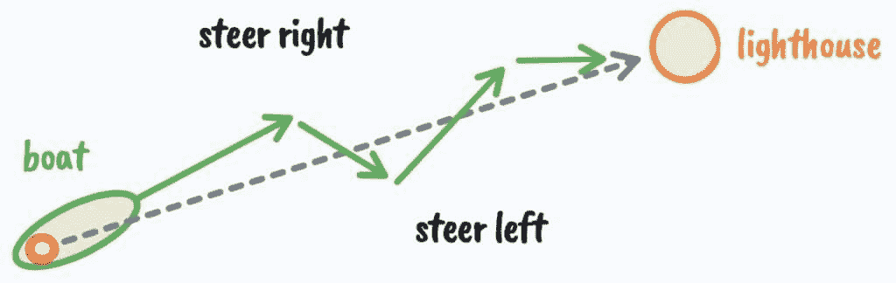

# 如何加入智商前1%的行列：完整指南 🧠

> 原文：[`thedankoe.com/letters/how-to-join-the-top-1-of-intelligence-full-guide/`](https://thedankoe.com/letters/how-to-join-the-top-1-of-intelligence-full-guide/)
>
> 智能的唯一真正测试是从生活中获得你想要的东西。—— 纳瓦尔·拉维坎特

在本教程中，我们将学习智能的科学。我们将探讨智能的真正定义，它远不止书本知识或认知测试。我们将了解如何通过理解控制论、心理发展阶段以及大脑如何解释现实，来系统地提升你的智能水平，从而获得你想要的生活。

## 课程名称：控制论——获得你想要的东西的艺术 🎯

上一节我们概述了智能的广义定义，本节中我们来看看实现智能的核心方法论：控制论。

控制论源自希腊语单词 *kybernetikos*，意为“引导”或“擅长引导”。它也被称为“获得你想要的东西的艺术”。如果智能是从生活中获得你想要的东西，那么理解控制论可以帮助你更快地实现它。

控制论阐述了智能系统的特性。你的大脑就是一个系统，一个元系统。一个智能系统遵循以下循环：

1.  设定一个目标。
2.  朝着那个目标行动。
3.  感知你的当前位置。
4.  将当前位置与目标进行比较。
5.  根据反馈调整行动，然后重复。

**公式：目标 -> 行动 -> 感知 -> 比较 -> 调整 -> (循环)**

你可以根据系统在试错中迭代和坚持的能力来判断其智慧。一艘偏离航线的船会不断纠正方向以到达目的地。恒温器感知温度变化并启动加热或冷却。这与从生活中得到你想要的东西密切相关。

从元视角进行行动、感知、比较和理解系统是高智慧的基本要素。高智慧是迭代、坚持并理解大局的能力。**低智慧的特征是无法从错误中学习**。低智慧的人会卡在问题上而不是解决问题，遇到障碍就会放弃。

高智慧在于意识到任何问题都可以在足够长的时间尺度上得到解决。你可以实现你心中设定的任何目标。智慧在于意识到你可以做出一系列的选择来帮助你实现目标。

如果你想变得更聪明，就从你追求的目标开始。目标决定了系统，决定了旅程。目标和目的地远比系统或旅程更重要，因为它们创造了后者。当你谈到“目标”时，是从**目的论**的角度——即一切都有其**目的**，是更大整体的一部分。

在一个人人重复“系统优于目标”的世界里，目标实际上比我们想象的要重要得多。目标决定了你如何看待世界，决定了你如何看待“成功”或“失败”。你的大脑是现实的操作系统，那个系统由目标组成。对于大多数人来说，这些目标是被社会赋予的。

要变得更聪明，你必须：
*   拒绝已知路径。
*   深入未知。
*   设定新的、更高的目标来拓展你的思维。
*   拥抱混乱，允许成长。
*   研究自然的普遍原则。
*   成为一名深度通才。

超专业化会使你服从于主导范式。人类与机器人的区别在于，人类创造了范式，讲述故事，设定框架。

## 课程名称：2：你的大脑如何解释现实 🔍

上一节我们介绍了控制论和目标设定的重要性，本节中我们来看看你的大脑如何基于这些目标来解读现实。

大脑有两个关键目的以确保生存：
1.  实现已知的目标。
2.  发现未知的目标。

大脑是一个信息处理和模式识别机器。它是一个接受、拒绝并使用信息来帮助你实现输入目标的复杂系统。如果你总是专注于负面结果，它们就会成为现实。

换句话说，如果你认为自己可以，你就行；如果你认为自己不行，你就不行。在你思维的深处是你的身份或自我。你的自我是一个由想法、信念、价值观和标准组成的系统，它塑造了你的视角。你的工作不是摆脱它，而是发展它、扩展它。

你的视角就像相机的镜头，可以放大或缩小，可以聚焦于局部或全局。你的身份将限制它可以感知的信息。如果接收到的信息与它的信念不匹配，它会拒绝它。你的思维会自动接受和拒绝那些有助于实现你头脑中编程的目标的信息。

如果你想要找到一份工作，多巴胺会标记那些相关的信息和机会为重要。你的行为、对话和关注点都会反映那个目标。如果你想要辞职，多巴胺会做同样的事情，让你更关注与创业相关的信息。

无论你是否意识到，我们都在强化我们可能平庸的身份，这个身份决定了我们生活的结果。对于大多数人来说，这将是消极的。

### 你的思维是一个控制论系统

社会是一个行为系统。在你学会语言的时候，社会就在你的脑海中注入了三个主要目标：1) 上学，2) 工作，3) 退休。99%的人只是以导致那些目标的方式解读日常情况。他们为了地位和生存而学习，关闭了生活中其他可能性的大门。

成功不是计划出来的，它是自动的。成功的人——无论是否意识到——都有一个被编程去实现特定目标的大脑。他们通过目标的角度看待生活，这使他们的潜意识能够存储*正确*的信息，影响他们的选择。

你的身份、观点和对情况的感知都是一系列系统，按照这个顺序相互输入和加强。80%的生活归结于创造你自己的目标，而大多数人却成了社会目标的盲目奴隶。目标改变了你对情况的解读方式，这影响了你的行为，这塑造了你的身份，这些在多年后累积成丰富的生活。

除非一个目标受到影响，否则你无法意识到一个问题。除非你意识到它，否则你无法解决问题。大多数人没有目标，害怕犯错，不给自己改善生活的机会。如果你不对一个目标投入精力，你就不会感受到达不到那个目标的痛苦。

重点是，除非你有相应的目标，否则问题就不是问题。如果你没有值得追求的目标，你就无法*看到*那些一旦解决就能带来更好生活的众多问题。大多数人对于他们从目标中想要得到什么没有清晰的愿景，因此他们行为的负面影响被忽视。

目标与身份交织在一起。人类在概念层面上生存。当我们感到身份的威胁时，我们会感到威胁。一套常规是一系列实际目标，它们有序地组织了心智。如果你通过新的刺激训练自己，拥有一个不能“生存”而不实现新目标的身份，你将不可避免地轻松实现任何目标。

要改变自己，你必须通过教育、实践和体验新信息来重新编程你心中由社会安装的错误接线。

## 课程名称：3：心理发展阶段——达到前1% 📈

上一节我们探讨了大脑如何运作，本节中我们来看看如何通过提升心理发展阶段来达到更高的智能水平。

正如阿尔伯特·爱因斯坦的名言（虽非原话）：“你不能从创造问题的同一意识层次解决问题。”想要变得更聪明，你需要扩大思维以看到更大的图景。

在自我发展理论中，有3个运动方向：
1.  **水平发展**：在同一阶段进行横向扩展，发展新技能，增加信息和知识。
2.  **垂直向上发展**：变革，成长到新的阶段和视角。
3.  **垂直向下发展**：由于生活情况、压力等导致的暂时或永久性退步。

水平发展是填满一个人的杯子，垂直发展是扩大杯子的容量。我们的目标是达到新的垂直发展阶段。

达到新的发展阶段需要你观点的进化。你需要：
*   时间、理解，以及在该阶段内的水平发展（新技能、挑战和目标）。
*   对不同于你自己的观点保持意识和开放心态。
*   通过教育和有意识的培养，致力于更深入的理解和寻求真理。
*   控制论式的试错：设定新阶段的目标，以此方式解决问题，并在意识到错误时自我纠正。

疼痛有时是达到新视角的必要催化剂。理解下面的阶段可以极大地改变你的人生方向。

### 前传统阶段——占人口的5%

前传统阶段以自我中心为特征。大多数人在从出生到大约10岁期间通过这些阶段发展。自我与他人的界限模糊，需求集中在生存、个人欲望和即时满足上。

### 传统阶段——占人口的75-80%

大多数高智商的人会到达这个阶段。这些阶段没有哪一个比另一个“更糟”，它们只是“更低”。问题是陷入任何一个阶段。

**阶段 3) 顺从者**
他们的身份由他们与群体的关系定义。他们服从权威并遵守群体规范。

**阶段 3/4) 专家**
专家阶段的特点是自我授权、解决复杂问题、自我反思。他们擅长完成任务，但不好判断是否在做正确的事情。他们是“无所不知的人”。

**阶段 4) 成就者**
大多数西方教育旨在培养成就者。这是一个人在思想上可以达到的最高阶段，也是西方成功的定义。从员工心态转变为创业心态。

### 后传统阶段——占人口的15-20%

每个阶段都有不同的目标和世界观。后传统阶段是我们开始遇到系统思维的地方。现实更像是一个有机体，而不是机器。

**阶段 4/5) 多元主义者**
多元主义者开始走出他们成长中的系统，并质疑他们的信念和价值观。他们发现了第四人称视角。

**阶段 5) 策略家**
策略家意识到直觉比逻辑和理性更强大。探索和发现开始比实现具体目标更重要。策略家是价值创造者，主要关注自我发展、他人发展和整合。

**阶段 5/6) 构造意识**
构造意识进入第五维度的思考，即认知维度。他们可以看到心灵如何构建现实和意义。他们开始从新的、抽象的层面思考世界，理解现实的普遍原则。

### 智力前1%——超越阶段

最后是智力前1%的统一阶段。他们接触到了源头，即无限的智慧。

统一性阶段的特征包括：
*   真理无法通过逻辑或理性来把握。
*   以宇宙视角作为组织原则。
*   实现了大多数关于开悟的定义，以全新的方式代谢经验。
*   理解个人自我生存的需要，同时也认识到对永久性的渴望是一种错觉。
*   二元性和冲突在没有紧张的情况下被见证。
*   投身于不断的人类进程中，实现进化的命运。
*   生活被视为一种暂时且有时是自愿的与“创造性基础”分离的形式。
*   非个人立场在需要时允许更清醒、更强大和更直接的行动。

智慧不在于书本知识或放大，而在于整体模式识别和视野。你的能力可以扩展到如此之远，以至于所有的界限和限制都消融了。通过有意识的成长和意识到自己何时关闭了成长的大门，你可以达到统一性阶段。

## 总结 📝

在本教程中，我们一起学习了如何加入智商前1%的行列。我们从智能的真正定义——从生活中获得你想要的东西——开始，深入探讨了实现这一目标的核心框架：

1.  **控制论**：我们了解了智能系统通过“目标 -> 行动 -> 感知 -> 比较 -> 调整”的循环运作。设定正确的目标是驱动整个系统的关键。
2.  **大脑的运作**：我们认识到大脑是一个根据预设目标过滤和解读信息的系统。我们的身份和视角决定了我们看到什么以及如何行动，因此重新编程我们的目标至关重要。
3.  **心理发展阶段**：我们探索了从传统到后传统，最终到统一阶段的发展路径。真正的智慧在于垂直提升我们的意识层次，扩大认知的“杯子”，从而能够解决更根本的问题。

要变得更聪明，你需要：主动设定并追求更高的个人目标，拒绝社会强加的默认路径；通过持续学习和体验，重新编程你的思维模式；有意识地朝着更高的心理发展阶段努力，拥抱过程中的不适和挑战。

记住，智慧是迭代、坚持并从更广阔的视角理解世界的能力。这不是一蹴而就的，而是一段需要每日投入的旅程。从今天开始，每天花一小时进行有意识的学习和反思，你就在通往更高智能的道路上迈出了坚实的一步。