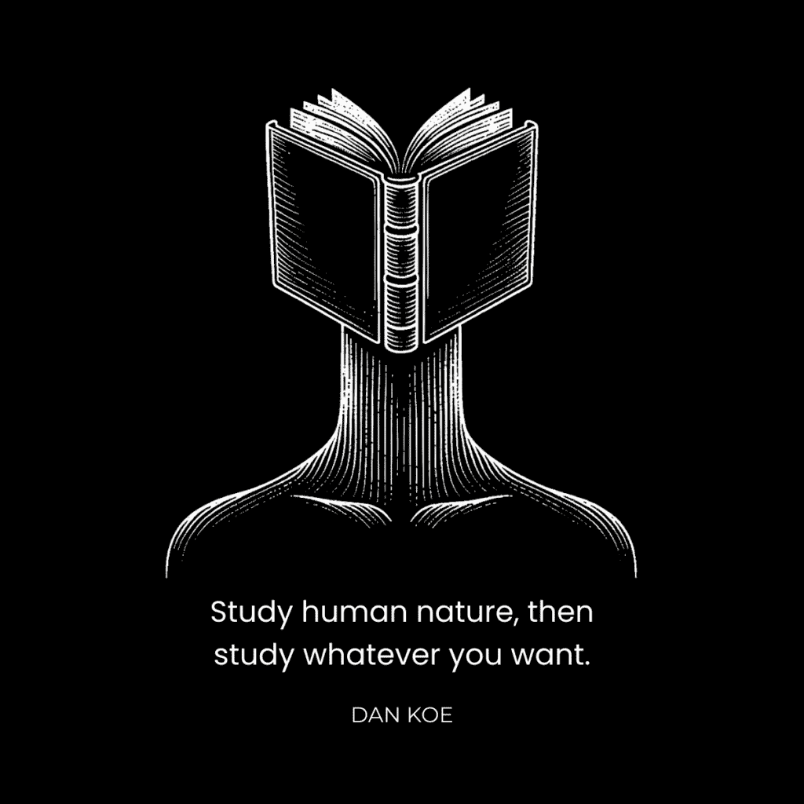
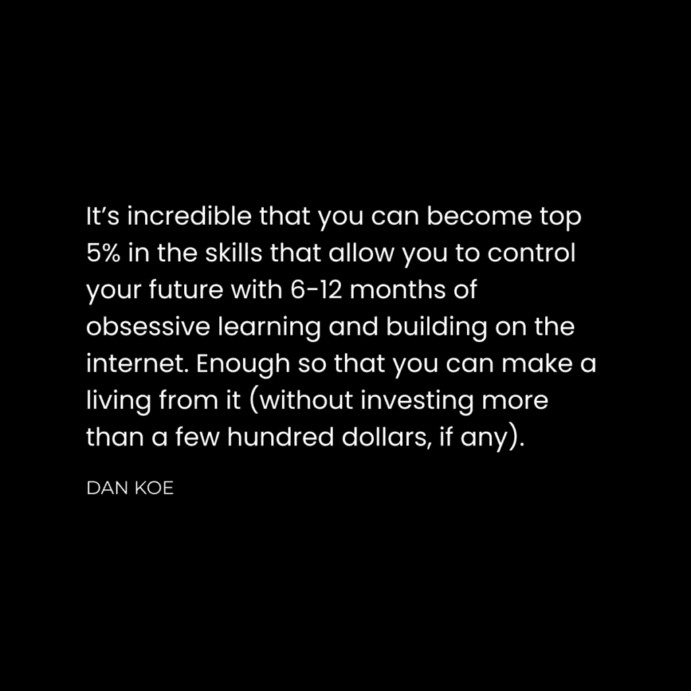

# 未来保障技能栈：概述与核心理念

在本节课中，我们将要学习一套面向未来的核心技能体系。这套体系旨在帮助你成为一个能够自主决策、持续学习并适应任何变化的“主权个体”，而非一个只能执行单一任务的“现代奴隶”。我们将探讨为何传统的职业培训模式可能不再适用，并介绍一套更基础、更持久的“解放艺术”。

## 核心理念：从“执行者”到“创造者”

我们的教育体系常常训练人们成为特定岗位上的高效执行者。然而，在技术快速迭代、人工智能日益强大的未来，单一的职业技能可能面临过时的风险。真正的未来保障，不在于掌握某一种具体技术，而在于培养一种能够**自主设定目标、主动学习并创造性解决问题**的根本能力。

**核心区别公式**：
*   **传统模式**：`个体 = 被分配的任务 + 被培训的技能`
*   **未来模式**：`主权个体 = 自我设定的目标 + 自主学习的能力 + 创造性解决方案`

上一节我们介绍了从被动执行到主动创造的理念转变，本节中我们来看看构成这种能力的基石——未来保障技能栈。

# 未来保障技能栈：2：核心七艺

基于德文·埃里克森的观点，真正的“解放艺术”包含以下七项核心技能。这些技能不针对任何具体职业，而是赋予你理解世界、做出决策并采取行动的根本能力。

以下是构成未来保障基础的七项核心技能：

1.  **逻辑**：如何从已知事实中严谨地推导出真理，进行清晰的推理。
2.  **统计学**：如何理解和解读数据的真实含义，不被数字表象迷惑。
3.  **修辞学**：如何有效地进行说服，以及识别他人使用的说服策略。
4.  **研究**：如何针对未知主题，高效地收集、筛选和整合信息。
5.  **（实用）心理学**：如何辨别和理解他人行为背后的真实动机与需求。
6.  **投资**：如何管理和增长你现有的资产（包括时间、金钱、注意力）。
7.  **代理**：如何自主决定追求的方向，并主动采取行动去实现它。



掌握了这些基础技能，你便拥有了适应任何新领域或新挑战的“元能力”。接下来，我们将探讨如何将这些抽象的艺术转化为具体可学的现代技能。

# 未来保障技能栈：3：现代技能映射

“解放艺术”是内核，而要在当今世界应用它们，我们需要将其映射到具体的、可实践的技能上。通过自我实验和持续学习，你可以掌握这些技能。

以下是将核心七艺转化为具体行动的关键技能领域：

*   **营销与销售** – 这是**修辞学**和**实用心理学**的实践。如果你无法吸引他人并说服他们认可你的价值，你的选择将受限于他人提供的选项。
*   **写作与思考** – 这是**逻辑**和**研究**能力的体现。清晰的写作源于清晰的思考，这是你向世界传达独特价值、建立影响力的基础。
*   **创业** – 这是**代理**、**投资**和**统计学**思维的综合应用。它将你的未来掌握在自己手中，让你通过创造价值来谋生，并打造你理想中的产品或服务。

**学习路径代码框架**：
```plaintext
def 学习技能(技能名称):
    研究成功者的流程()
    尝试各种技术()
    识别模式与原则()
    创建个人流程()
    分享与贡献()
```

通过创业作为载体，你为实践真正的“主权个体”教育搭建了舞台。写作与思考让你不断创造和迭代价值，而营销与销售帮助你理解并连接你的受众。有了这些基础技能，我们便可以为其添加当前时代所需的技术工具。

# 未来保障技能栈：4：时代技术工具

在建立了以“解放艺术”为核心的思维和技能基础后，我们需要掌握当前时代（数字文艺复兴时期）的具体技术工具，以有效地实施和传播你的价值。

以下是当前构建个人事业常用的技术技能：

*   **社交媒体** – 作为你个人品牌的“店面”和业务指挥中心。
*   **内容创作**（写作/视频） – 用于教育、娱乐受众，并展示你的价值。
*   **电子邮件营销** – 通过邮件通讯或自动化序列来培养与受众的关系。
*   **视觉设计** – 塑造品牌视觉形象，激发受众的情感共鸣。
*   **漏斗构建** – 创建着陆页、网站，并整合其他技术技能来引导用户转化。

**重要提示**：这些技术技能会随着工具和平台的变化而演变。AI可能会降低其入门门槛，但竞争在于如何运用**未来保障技能栈**（如心理学、修辞学）来更有效地使用这些工具。技术是“如何做”的载体，而核心技能决定了“为何做”以及“做得有多好”。那么，我们该用这些技能来做什么呢？答案在于你的个人兴趣。

# 未来保障技能栈：驱动内核——个人兴趣

拥有了思维框架和实用工具后，你需要一个投入的方向。这个方向不应是外部“寻找”的所谓热门赛道，而应源于你内在的、无法抑制的**个人兴趣**。



兴趣是你行动的天然驱动力。它体现在那些你忍不住想与人分享的话题、让你废寝忘食的书籍，或是充斥你搜索记录的想法中。一个自由的人不会仅仅选择一个现有市场，他可以通过热情和说服力**创造**一个市场。

**兴趣转化公式**：
`个人兴趣 + 未来保障技能 + 技术工具 = 独特的价值创造`

你对某事感兴趣，意味着你已在此投入了时间、注意力和情感。如果你能运用所学技能，将这份兴趣转化为对他人有独特价值的东西（产品、服务、内容），那么他人也愿意为你投入他们的资源。你的“理想未来”往往就诞生于用你的技能解决你自身或他人面临的真实问题之中。

# 未来保障技能栈：6：整合实践与总结

本节课中我们一起学习了如何构建一个面向未来的、以“主权个体”为目标的能力体系。现在，让我们将所有这些元素整合起来，形成你的**精通领域**。

## 构建你的精通领域

精通是**创造性思维**与**具体领域知识**的结合。它无法仅靠听课获得，必须通过实践来锤炼。你的精通领域应由以下部分构成：

*   **创业**是你的**工具**——让你掌控自己的航向。
*   **营销与销售**是你的**信息**——让你连接并影响他人。
*   **写作与思考**是你的**媒介**——让你清晰表达价值。
*   **技术知识**是当前的**“如何做”**——让你有效执行。
*   **个人兴趣**是你的**“做什么”**——让你充满热情地深耕。
*   **理想未来**是你的**“为什么”**——为你提供持续的动力和目标。

**行动建议**：不要将未来寄托在单一职业技能上。每天投入30-60分钟，通过社交媒体上的优质创作者、课程、播客等去中心化教育资源，系统地学习上述技能栈。坚持6-12个月，你就能超越绝大多数人。

## 总结

技术将持续进步，恐惧它只会阻碍你的发展。明智的做法是理解它、利用它。让技术成为你加速掌握核心技能、快速构建个人事业的助力。未来属于那些能够自主设定目标、主动学习并创造性解决问题的“主权个体”。现在，你已经拥有了构建这种未来的蓝图。