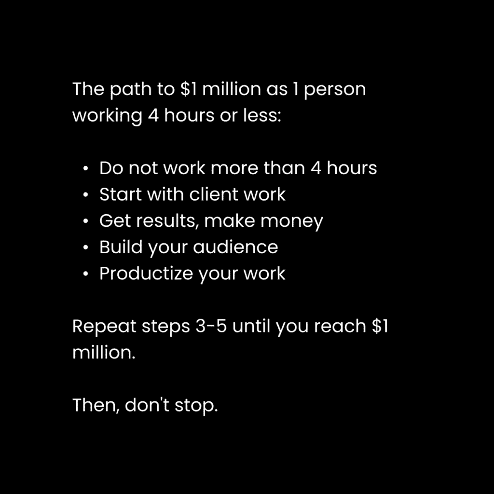

# 一人企业构建指南：从零到百万美元的教育业务（每日工作2-4小时）

在本课程中，我们将学习如何构建一个单人教育业务，实现从零到年收入百万美元的目标，同时将每日工作时间控制在2-4小时。我们将探讨其核心理念、实施步骤以及背后的进化逻辑。

## 概述

传统的创业路径往往伴随着高风险、高投入和漫长的工作时间。本教程提出了一种不同的范式：基于个人已解决的问题和知识，构建一个低成本、高杠杆的教育业务。这不仅是一种商业模式，更是一种顺应技术发展和人类需求演变的生活方式。

---

## 核心理念：解决自己的问题并出售解决方案

上一节我们概述了课程目标，本节中我们来看看构建此类业务的根本出发点。

如果你在生活中解决了某个具体问题，你就具备了创办相关教育业务的资格。这适用于健身、生产力、职业技能、财务管理、人际关系等广泛领域。原因在于，这些问题普遍存在，并且阻碍了人们享受生活。

**核心公式**：`你的专业知识 = 你已解决的问题 = 可出售的解决方案`

“市场上已经有很多人在卖信息产品了”这种观点源于经验不足。商业的基本原则之一是：销售市场上已经存在需求的产品。尤其对于初学者，跟随已被验证的需求（红海）比开拓未知的蓝海更明智。

当前的教育体系存在不足，而互联网使得由个人创作者构建的去中心化“学校”成为可能。这些创作者通过直接经验解决问题，并以远低于传统教育的成本传播知识。这不是骗局，而是教育的进化。

### 关于经验与冒名顶替综合症

人们倾向于向与自己处境相似但略进一步的人学习。如果你能集中注意力2小时，你就能帮助那些只能集中15分钟的人。这本身就提供了巨大价值。

解决冒名顶替综合症的关键在于诚实。你的营销应基于你在自身成长旅程中的真实位置以及你能提供的具体帮助。在一个充满虚假承诺的市场中，保持真实就能脱颖而出。

**核心观点**：在一个极端的市场中，如果你想出类拔萃，你只需要做到平均水平即可。

---

## 时代背景：教育业务的未来

上一节我们确立了业务的基础是个人经验，本节我们将探讨为何现在是发展此类业务的最佳时机。

现实的发展模式总是在**集中**与**去中心化**之间循环。得益于互联网、代码和人工智能等技术，曾经高度集中的教育体系和就业市场正在向由个人创作者主导的去中心化模式演变。

传统的教育和职业路径正在失去吸引力。人类需要的是与自身心理结构相符、能激发学习热情的教育，而不是僵化的形式。从大公司到个人，现实正在去中心化，抓住这一趋势的人将搭乘历史上最有利可图的转变之一。

### 创造性工作是未来

工作最初是经济生存所需。但在技术增强的社会中，**创造性工作**成为未来。进化就是不断解决问题的过程，以对抗无序（熵）。人类天生追求个人发展、扩展自我意识以及从事有意义的工作。

随着自动化（如机器人技术）的进步，许多体力劳动终将被取代。这并非意味着所有人都必须从事创造性工作，但明智之人应看到其中的机遇。你的心理渴望创造，创造能带来满足感，这表明创造是人类的天职。

这里提出的生活方式是利用互联网作为你创造力的延伸：
1.  学习学校无法教授的技能。
2.  解决自身问题以实现个人进化。
3.  取得雇佣工作无法带来的成果。
4.  在互联网上展示个性，吸引同类人。
5.  帮助他们解决问题，实现集体进化。
6.  通过以上过程，赚取有意义的独立收入。

---

## 业务模式：如何转化技能

上一节我们讨论了时代趋势，本节我们来看看如何将个人技能转化为具体的教育业务。

你需要知道如何将技能和兴趣转化为可行的教育产品。以下是三种主要模式：

以下是三种主要的业务转化模式：

*   **出售教程（辅导）**：出售针对特定技能、练习或兴趣的入门指导。例如：网页设计、汽车维修、Photoshop、吉他。
*   **出售项目（辅导）**：出售一个人们可以作为日常惯例采纳的行动计划。例如：健身计划、生产力提升方案、自我改进项目。
*   **销售系统（咨询或自由职业）**：销售一套可应用于他人工作或业务的系统。例如：潜在客户生成系统、内容创作流程。

实施方法是：观察你所在领域中成功的人，逆向工程他们的方法。购买他们的课程，分析他们的营销漏斗，研究他们的内容。在此过程中自我教育，以理解其本质。

---

## 核心法则：科伊定律与收入演进

上一节我们介绍了业务模式，本节将深入探讨实现高效增长的核心法则：科伊定律。

**科伊定律**：`工作会随着时间而演变，以在更短的时间内赚取更多收入`。这要求通过创造力、成长和技能获取来解决阻碍这种演变的问题。

人们常陷入帕金森定律（工作会填满可用的时间），但这只关乎时间扩张，而非收入增长。结合技术，你可以在固定时间内实现收入的指数级增长。问题在于，许多人固守单一商业模式（如自由职业），思维无法突破，从而为自己创造了新的“朝九晚五”。

下面我们根据科伊定律，分解从年入10万美元到月入10万美元（即年入约120万美元）的三个实际阶段。

### 阶段一：从客户工作开始

作为没有受众的初学者，从直接为客户提供服务开始是最佳选择。

你可以通过手动寻找客户，为每个客户收取1000至10000美元以上的费用。只需要2-3个客户即可替代你原有的工作收入。建议直接切入教练、咨询或辅导模式，而非传统自由职业，因为教育本身更具杠杆效应。

在每日4小时的工作框架下，时间分配如下：

以下是每日4小时工作制下的时间分配建议：

*   每天花1小时寻找新客户。
*   每周进行3-5小时的销售通话。
*   每周进行2-4小时的客户服务通话。
*   每天花1小时为潜在受众和现有客户创作内容（如写作）。
*   其余时间处理上述活动衍生的事务。

关键是要保持“进化”的意图，避免长期陷在这个阶段。

### 阶段二：建立受众并演进一层

客户业务模式受限于时间，服务客户数量有上限。为了在保持单人运营的前提下增长，你需要演进业务模式。

以下是实现演进的具体步骤：

*   **通过写作建立受众**：专注于在社交媒体和邮件通讯上写作来建立受众，无需在初期复杂化视频或图形制作。
*   **采用新的客户模式**：创建一个标准化项目、教程或课程，并在团体辅导环境中服务更多客户。这将你的直接客户工作时间压缩到每周1-2小时。
*   **优化服务交付**：适当调整价格，取消一对一通话等耗时服务，引入群聊或社区支持，重构服务交付方式但不减少价值。

至此，在同样的4小时工作日内，你的年收入潜力可从10万美元提升至30万到50万美元。

### 阶段三：产品化与杠杆化

受众意味着分销渠道，分销带来自由。

在这个阶段，你可以：

以下是第三阶段的核心行动：

*   **创建基于小组的标准化项目**：以更低单价、更高效的服务形式（如录播课+社群答疑）接纳大量客户。借助更大的受众基数，在相同时间内赚取比第二阶段团体模式更多的收入。
*   **构建独立数字产品**：利用你在服务客户过程中积累的教学材料和成功案例，打造一个可自动销售的数字产品（如在线课程）。一次构建，持续销售。
*   **逐步脱离直接客户工作**：你可能会经历短期收入波动，但腾出的时间可用于拓展平台、增加收入来源和加速受众增长。

此时，你的年收入潜力可以从30万美元迈向100万美元以上。

快速迭代是关键。你必须摆脱体力劳动，完全依靠创造力。时间分配演变为：

*   每周花费1-2小时维护小组项目。
*   每天花费2小时创作内容以推动增长。
*   每天花费1-2小时构建能让你业务更进一步的新项目或产品。

到达此阶段后，你已建立了强大的杠杆和分销体系。你可以选择开发软件、推出实体产品、著书立说，或者享受生活。金钱是构建理想生活的工具，而非终极目的。

---

## 总结

本节课中，我们一起学习了如何构建一个单人教育业务。我们从**解决自身问题并出售解决方案**这一核心理念出发，探讨了在**教育去中心化**时代下的巨大机遇。我们介绍了将技能转化为**教程、项目或系统**的具体业务模式，并深入阐述了通过**科伊定律**指导业务从客户服务向产品化、杠杆化演进的三阶段路径，最终实现在每日工作2-4小时的前提下，达成百万美元年收入的目标。这不仅仅是一门生意，更是一种聚焦于创造、成长与自由的现代生活方式。