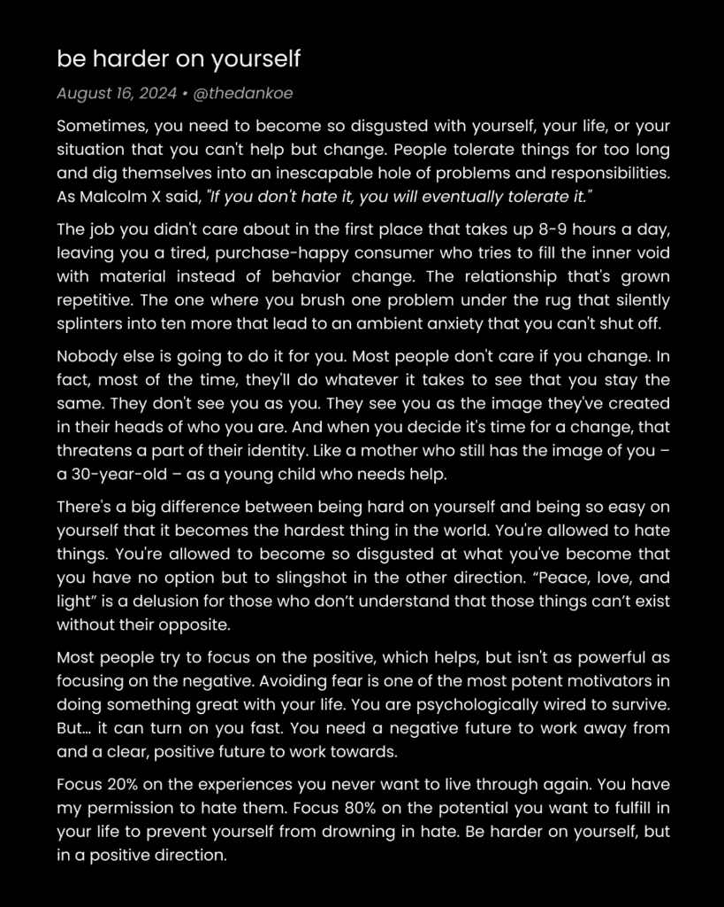

# 单人企业快速启动指南：概述与核心框架

在本课程中，我们将学习如何在60天内，通过最简化的方式启动一家单人企业，并赚取你的第一笔1000美元。我们将专注于建立受众、掌握核心技能、创建微型产品以及执行具体的行动计划。

> 原文链接：[`thedankoe.com/letters/the-minimalist-creator-business-make-your-first-1000-in-60-days/`](https://thedankoe.com/letters/the-minimalist-creator-business-make-your-first-1000-in-60-days/)

本指南提供了一个为期60天的行动计划。下图概括了你将在课程结束时掌握的核心流程：

本指南面向初学者。如果你已有经验，你学到的内容将帮助你在60天内赚取更多收入。内容将尽可能简洁，但心态和信念是成功的基础，不容忽视。

如果你能赚到1000美元，你就能赚到10万美元。随着你不断学习和进步，赚取1000美元所需的时间会越来越短。

我们的方法极其简化：
*   你不需要庞大的受众。
*   你只需要学习两种高收入技能的基础。
*   你的所有行动都会累积，没有浪费。
*   坚持下去，你每次都能赚取超过1000美元。

但首先，有一个重要的前提：你必须摒弃“快速致富”的心态。想要掌控收入，你需要建立一家企业。这需要你对自己负全责，学会管理自己，并拥抱创业过程中的情绪起伏。

在本课程中，我们将涵盖以下内容：
*   在自由职业和代理世界中，建立受众的重要性。
*   确定谈论和销售的主题。
*   **微型技能栈**：学习两种高收入技能，为盈利未来奠定基础。
*   **微型产品**：如何在不花费数月构建产品的情况下，立即开始吸引客户。
*   吸引客户的两种核心方式，以便你专注于未来60天。
*   **1000美元挑战**：每天需要执行的具体步骤。

让我们开始吧。

---

## 单人企业快速启动指南：2：设置你的数字店面 🏪

上一节我们概述了课程目标，本节中我们来看看如何建立你的在线业务基础。你将在社交媒体上建立受众。

**商业第一课**：你需要将*流量*引导至你的产品或服务。现阶段，建立网站或设计Logo不是有效利用时间的方式。

你不需要百万粉丝即可开始，但一个不断增长的受众对未来至关重要。冷邮件和付费广告有效，但有更好的方法可以达到相同效果，且能避免零结果。

通过在社交媒体发布内容建立受众，你可以实现以下几点：
*   持续触达关注你的人。
*   起步免费，无需高深技能或许可。
*   你发布的每一条内容都在培养受众的购买意愿。
*   你可以建立新产品并提升盈利能力。
*   人们因你本人而关注你，不会被困在特定商业模式中。
*   当受众足够大时，你可以离开客户工作或创建梦想的初创公司（你已拥有潜在客户和团队成员）。

接下来，让我们快速设置你的社交媒体资料。

### 决定教授和销售的内容

确定内容方向的最快方法是：**加入你已身处其中的利基市场**。

回答以下问题，并选出1-3个最相关的主题：
1.  你的搜索和YouTube观看历史中，有哪些*有价值*的内容？
2.  你关注的账号在谈论什么？你是否觉得自己有相近的知识水平？
3.  如果你现在要买一本新书，它会是什么主题？
4.  当你购买教育或行为改善产品（如计划本、软件、健康补剂，而非新衣服等必需品）时，你买的是什么？

成功的秘诀是**智能模仿**。如果很多人都在做某件事，通常意味着它有利可图、有市场需求。你的任务是做类似的事，但加入一点独特性。

根据以上问题，写下1-3个你已阅读过的主题，这将是你内容的来源。同时，写下1-3个你已购买过的课程、模板或产品，这将是你提供服务的起点。

**关键点**：只有当你真正开始写作和销售时，你才会获得想法和反馈，从而使你的产品和服务变得真正独特。

### 创建你的个人资料

一个好的社交媒体个人资料是一个小成就。它涉及设计、文案、漏斗意识等多方面技能。但你不必陷入“教程地狱”。最快的方法是：
*   观看1-3个关于拍摄头像或创建个人资料的YouTube教程，并同步创建你的资料。
*   使用我们讨论过的主题来撰写个人简介。

以下是经过验证的个人简介模板：
`我写关于[主题]。[他们将从你的服务中获得的结果]。`

例如，如果你的主题是生产力、写作和自我提升，并想销售写作相关服务，你的简介可以是：
`我写关于生产力、写作和自我提升。学会将写作发展为一项高收入技能。`

然后，链接到你服务的第一步（我们将在“微型产品”部分讨论）。

如果你的简介不够完美，没关系。立即开始用现有简介发布内容。在宏观层面，简介的影响有限。人们看一两次就会忘记。**你的内容才是吸引粉丝和促成销售的最主要因素**。

最后，用一个问题引导你完善资料：**它看起来像是有100万粉丝的账号吗？** 如果不是，在接下来的6-12个月内逐步改进，直到它是。即使不完美，你仍然可以增长粉丝并赚取收入。

---

## 单人企业快速启动指南：3：微型技能栈 ⚙️

作为单人企业主，你最终需要学会运营完整企业所需的所有技能（除了实体分销和商业地产）。我们讨论的“微型创作者”模式只是一个起点。

为了开始赚钱，你只需要两样东西：
1.  一个流量来源。
2.  一个要出售的产品或服务。

因此，简化的两个核心技能是**写作**和**销售**。

### 通过写作建立受众

社交媒体内容主要有两种类型：

**1) 短内容**
包括推文、视频剪辑、短片、TikTok、Instagram帖子等任何300字符以内或1分钟以下的内容。
*   **作用**：保持关注度，吸引受众，测试想法。
*   **建议**：每天至少发布1条。在X（原Twitter）上，可以每天发布2-3条来测试内容。

**2) 长内容**
包括X上的长推文串、Instagram的Threads、LinkedIn长文或轮播图，或“微型文章”。
*   **作用**：有策略地传播，能快速吸引更多粉丝，建立更深信任。
*   **建议**：每周撰写1-2篇。确保主动分享以获得更多曝光。

**平台选择**：建议从X开始。X的用户质量较高，且平台适合进行观点输出和教育类内容分享。当你拥有5万以上粉丝时，再考虑将内容分发到其他平台。

**内容创作流程**：将一个想法变成一条推文，将一条推文扩展成一个话题，将话题变成一封通讯稿，将通讯稿变成一个YouTube视频，将视频变成一个免费下载，最终将免费下载变成一个产品。这是验证好想法的方式。

**写什么？** 根据你选择的主题：
*   将其分解为常见痛点，并撰写如何解决。
*   使用工具研究其他账号的热门推文，并从你的角度重写。
*   读书，并用社交媒体做笔记——但要以“钩子、正文、结论”的结构来写。
*   浏览你喜欢的YouTube频道，筛选最受欢迎的视频，用其标题作为你帖子的起点。

现在，开始写作。

### 销售流程

销售的本质是讲故事。你向对方展示他们可以成为的样子，让他们意识到当前处境中的痛点，并**提供**一条从A点到B点的路径。

销售公式可以概括为：
`痛点 -> 期望结果 -> 实现路径（最好是你的独特方法）`

这不仅适用于销售，也适用于所有有说服力的沟通和内容创作。

作为创作者，你90%的“销售”是通过内容完成的：
*   让人们意识到他们的问题/痛点。
*   提供解决方案供他们测试。
*   展示他们未来可能拥有的理想生活状态。

我们将在下一节探讨更实际的销售方法。

---

## 单人企业快速启动指南：4：微型产品 💡

上一节我们介绍了写作和销售的核心技能，本节我们来看看如何将其转化为具体的收入来源。微型产品是一种无需预先构建完整产品的服务形式。

你只需要：
*   一个社交媒体资料作为公开简历。
*   展示你专业性的内容。
*   能够给互动你内容的用户发私信。
*   一份供感兴趣者填写的问卷。

创建微型产品的最佳方式是：**提供一套为期4周、每周一次的一对一会议服务，定价1000美元。**

这样做的好处：
*   1000美元是一个合理的测试价格。
*   4周时间足以让客户看到初步结果。
*   教学（辅导/咨询）比单纯替客户做事（自由职业）适用性更广。
*   在销售几份这样的服务后，你可以确定完整产品应包含的内容。

### 微型产品框架

以下是创建微型产品的三步框架：

**步骤 1) 确定一个核心问题**
找出与你主题相关、人们普遍面临的大问题。可以通过分析你的高互动内容、研究热门YouTube视频或观察其他账号的热门帖子来发现。问题应属于健康、财富、关系这三大永恒市场之一。不仅要说明问题，还要放大它带来的后果。

**步骤 2) 描绘理想生活方式**
描述解决该问题后的理想状态。记录下目标达成后，一天中3个方面的美好场景。这创造了客户的渴望。

**步骤 3) 创建独特流程**
设计一个你可以在会议中引导客户完成的独特过程或系统。
1.  写下从问题现状到理想状态需要经历的每一步。
2.  优化这些步骤，形成一个清晰的系统。
3.  给这个流程起一个吸引人的名字。

你的整个提案就包含这三部分：解决的问题、期望的结果、独特的解决流程。

### 创建资格问卷

你需要一个地方让潜在客户表达合作意向。目前无需复杂网站，使用JotForm、TypeForm或Google Forms即可。

问卷应简短，包含以下问题：
1.  姓名
2.  邮箱
3.  社交媒体账号（用于联系）
4.  你最大的挑战是什么？（提供与主题相关的多选）
5.  你希望30天后达到什么状态？（提供与主题相关的多选）
6.  “这不是一项免费服务。你真的想一起[实现期望结果]吗？”（是/否）

第4题让客户意识到问题，第5题激发改变欲望，第6题植入付费概念。将此问卷链接放在你的个人简介和内容中。

### 私信的艺术

避免给完全陌生的人发冷消息。你的目标对象是：
*   评论或分享与你提案相关帖子的人。
*   首先给你发消息的人。
*   填写了资格问卷的人。

**在私信中说什么？**
1.  **延续对话**：如果是评论/分享者，发送原帖链接并回复他们的评论。如果是问卷提交者，询问他们填写的具体原因和目标。
2.  **询问进展**：询问他们在相关领域的努力进展如何，这能提醒他们的目标和痛点。
3.  **提供价值并提及报价**：先提供一些免费的专业建议证明你的能力。然后自然提及你的服务：“我提供一套4次会话套餐来帮助解决这个问题，总费用是1000美元。”
4.  **处理异议并发送发票**：解答他们的疑问。如果他们同意，直接发送Stripe或PayPal的付款链接。销售电话可有可无。

---

## 单人企业快速启动指南：60天行动计划 📅

学习新事物初期感到困惑和不知所措是正常的。大部分成果会在30天后开始显现。给自己完整的60天时间，专注于执行。

以下是每日/每周需要关注的核心行动：

**1) 创建资料并停止纠结**
创建好社交媒体资料后，就不要再反复修改它。资料本身不会直接带来收入，内容才是关键。

**2) 每天撰写3-5条短内容**
多写能激发更多想法。具体做法：
*   建立“灵感库”，收藏你喜欢的内容。
*   在消费内容或与人交谈时随时记录想法。
*   撰写与你的产品相关的挑战、解决方案、教程、评论等内容。
*   每天查看互动，并向相关用户发送友好私信。
*   定期在内容中加入问卷链接和行动号召。

**3) 每周撰写1-2篇长内容**
长内容是增长和销售的主要燃料。具体做法：
*   将你最好的短内容或他人的好想法扩展成长文、系列推文或“微型文章”。
*   在长文中分享更深入的见解，至少包含一个不常见的建议。
*   在文末插入你的问卷链接。
*   **特别推荐“系列推文”形式**，它结构清晰，易于阅读和传播，也方便改编成其他平台的内容。

**4) 主动推广你的内容**
社交媒体的增长离不开主动努力。你需要：
*   积极回复评论。
*   私信他人，建立关系，共同成长。
*   在系列推文中标记相关账号，增加被转发的机会。
*   不要完全依赖算法。

**5) 完善你的微型产品提案**
你现在不需要一个完美的最终产品。你只需要一个你高于平均水平、并能解决他人实际问题的服务。思考你擅长什么，是否有人想学习它。然后，承诺提供一个4次通话、1000美元的套餐来教别人。获得反馈后，再投入时间构建更“完整”的企业。

**6) 每周发送30条私信**
这个数字其实很低。60天内发送约210条消息。你只需要其中不到0.5%的人接受报价即可。即使只成交一个客户，你也已经建立了一个网络，与210人建立了直接联系，并让上千人了解了你的专业领域。坚持下去，客户会越来越多。

---

## 总结

在本课程中，我们一起学习了启动单人企业并赚取第一个1000美元的完整框架。我们从建立社交媒体资料和确定利基市场开始，然后掌握了**写作**和**销售**两项核心技能。接着，我们学习了如何创建**微型产品**——一个低风险、高灵活性的服务提案，并制定了具体的**60天行动计划**，包括每日创作、每周互动和主动推广。

记住，关键在于执行和坚持。摒弃快速致富的心态，专注于提供价值、建立关系并持续优化你的服务。如果你能完成第一个1000美元的目标，你就已经验证了这条路径的可行性，并为未来更大的成功奠定了基础。

现在，开始行动吧。