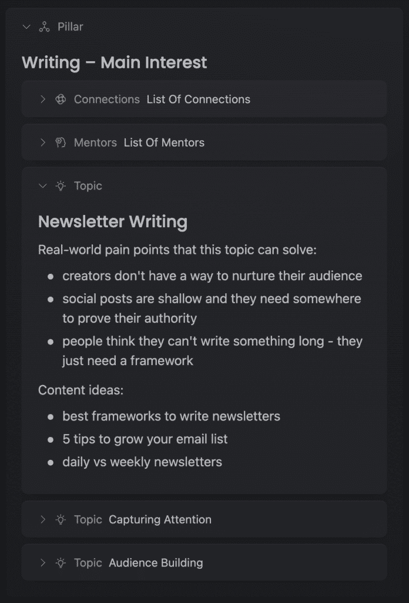

# 单人创业指南：启动微型产品业务的最简路径 🚀

在本节课中，我们将学习如何以最简单、最低成本的方式启动一家单人企业，专注于销售“微型产品”或提供“微型服务”。我们将从零开始，逐步搭建业务框架，涵盖工具选择、方向确定、产品/服务设计、内容创作以及自我推广等核心环节。

---

## 第1步：搭建简单的数字工具栈 🛠️

上一节我们介绍了单人创业的核心理念，本节中我们来看看启动业务所需的基础工具。这些工具构成了你业务的数字基础设施，大部分可以免费开始使用。

建立在线业务需要四个核心组件：

1.  **流量来源**：吸引潜在客户的地方。
2.  **邮件列表**：直接接触并再营销潜在客户的地方。
3.  **支付与产品托管**：接受付款并展示产品或服务的地方。
4.  **内容与想法管理**：用于规划、撰写和存储所有营销及产品内容的地方。

以下是针对每个组件的具体推荐：

### 1) 流量来源：社交媒体写作

开始生成流量的最简单方式是社交媒体写作。以下是选择平台时的考虑因素：

*   **X (原Twitter)**：潜力大，适合深度思想交流。
*   **Threads**：对初学者友好，但社区成熟度较低。
*   **LinkedIn**：用户资金最充裕，但内容风格更偏专业。

**建议**：选择一个你最能适应的平台，并集中精力运营。写作是一项可以通过练习掌握的技能。

### 2) 邮件列表：创建简报

简报是展示专业能力、培养受众和直接推广的核心。推荐使用 **Beehiiv**，它对前2500名订阅者免费，并集成了网站、博客和自动化功能。

### 3) 支付与产品托管：一体化商店

需要一个地方来链接你的产品、设置着陆页、托管数字产品（如电子书、课程）或预约服务。**Stan** 是一个以简单易用著称的一体化解决方案。

### 4) 内容与想法管理：知识库

你80%的工作将围绕“想法和写作”。你需要一个地方来捕捉灵感、撰写内容和规划产品。**Kortex** 是一个为此设计的工具，提供免费的文档编写和想法管理功能。

---

## 第2步：确定你的专业领域 🎯

现在我们已经有了业务的基础工具，接下来需要确定业务的具体方向。本节将帮助你找到可以围绕其建立内容、产品和服务的核心技能或兴趣。

请思考以下问题来确定你的方向：

*   你最喜欢的实用类非虚构书籍是什么？
*   你目前的工作或学习背景是什么？
*   你在生活的哪个领域经历过重要的转变？
*   如果必须就一个兴趣写一篇论文，你会选择什么？

确定一个主要方向后，请执行以下操作：

1.  列出该领域的5位专家或创作者。
2.  研究他们销售的数字产品类型（如电子书、课程、辅导）。
3.  将你的主要兴趣分解为3个主题。
4.  为每个主题列出至少5个现实世界中的痛点，并基于这些痛点构思5个内容创意。

**核心方法**：将大主题分解为可管理的小块，并围绕具体问题创作内容。

---

## 第3步：设计微型产品或服务 💡

明确了方向后，本节我们将学习如何将你的技能转化为可销售的产品或服务。有两种主要路径：

### 1) 微型产品

指低单价、易交付的数字产品，例如：
*   **公式**：`10-30页的PDF指南` 或 `一套可下载的模板`。
*   **案例**：有人通过出售一份获得理想工作的旧简历（定价10美元），很快赚到了1000美元。
*   **关键**：你已有的知识、经验或资源，都可以打包成微型产品。

### 2) 微型服务

指小规模、高价值的个性化服务，例如：
*   **代码**：`服务套餐 = 4次一对一Zoom辅导通话`。
*   **定价**：此类套餐可定价在 **750-1000美元**。
*   **优势**：无需复杂准备即可启动；能快速验证市场需求；为未来开发更完善的产品（如课程）提供基础。

**选择建议**：如果你已有成型的内容或资源，可从**微型产品**开始。如果你更擅长通过互动教学，**微型服务**是更好的起点。

---

## 第4步：创作驱动销售的内容 ✍️

有了产品或服务，我们需要吸引愿意付费的客户。本节将介绍如何通过内容创作来实现这一目标。我们将主要利用免费的社交媒体渠道。

内容创作应围绕以下三个核心主题展开：

1.  **个人故事**：你与所选主题相关的经历、转变和心得。
2.  **痛点问题**：你的目标受众面临的具体困难和挑战。
3.  **解决方案与过程**：针对上述痛点，分享你的见解、方法和步骤。

以下是内容创作的具体框架：

### 简报写作框架：痛苦与过程 (P&P)

1.  **引言（痛苦）**：描述一个读者可能正在经历的具体问题或挫折。
2.  **主体（过程）**：逐步拆解解决这个问题的具体步骤、方法或思维模型。
3.  **结尾（行动号召）**：自然地引导读者了解你的相关产品或服务。

### 社交媒体帖子写作方法

1.  **解构学习**：收集10篇你认为优秀的同领域帖子。
2.  **分析结构**：逐句分析它们的开头、论证和结尾方式。
3.  **模仿创新**：使用类似的结构，填入你自己的主题和观点进行创作。

**写作心态**：像给一位咨询你专业领域的朋友发信息那样去公开写作。

---

## 第5步：持续进行自我推广 📢

最后，也是至关重要的一步，就是推广。本节将强调自我推广的必要性，并提供简单的执行策略。许多业务失败的唯一原因就是缺乏推广。

推广至关重要，因为：

*   **提供动力**：明确的变现路径能让你更有持续创作的动力。
*   **传递信息**：如果你不展示，人们永远不会知道可以为你付费。
*   **克服恐惧**：只有通过实践才能逐渐消除对销售和自我展示的恐惧。
*   **获取反馈**：只有推广，才能获得真实的数据和反馈，从而优化你的产品和营销。

以下是简单的推广执行策略：

*   **社交媒体**：每天在发布的帖子中，选择一条进行回复评论。交替推广你的**简报订阅链接**和**产品或服务购买链接**。
*   **电子邮件简报**：在每周发送的简报中，始终包含一个指向你产品或服务的链接。
*   **核心聚焦**：初期只需专注于**提升写作质量**和**推动简报订阅增长**。

**行动许可**：允许自己一开始做得不完美。第一个成功的业务往往源于不断的尝试和错误。

---

## 总结 📝

本节课中，我们一起学习了启动单人微型产品业务的完整路径：

1.  **搭建工具栈**：用免费或低成本工具建立流量、邮件、支付和内容管理系统。
2.  **确定方向**：基于你的技能和兴趣，选择一个可商业化的细分领域。
3.  **设计产品/服务**：将知识转化为低单价的“微型产品”或小规模的“微型服务”。
4.  **创作内容**：围绕个人故事、受众痛点和解决方案，在社交媒体和简报上持续输出。
5.  **积极推广**：无惧地将你的产品链接融入日常内容和互动中，完成商业闭环。

记住，最简单的开始就是：**选择一个点，创作内容，推广产品，然后基于反馈持续优化**。现在，你已经拥有了开始的全部所需。