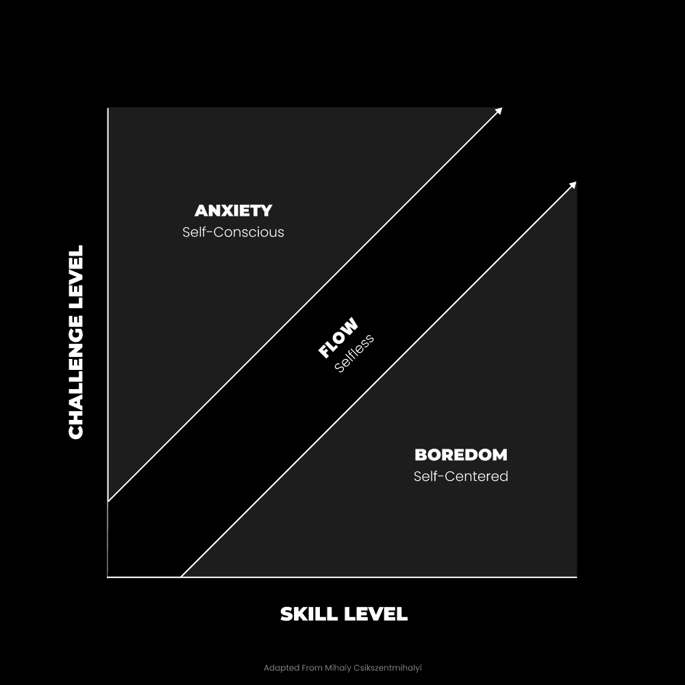

# 人生经验课：给18岁自己的信

在本节课中，我们将学习一位28岁人士回顾过去，总结出的核心人生经验。这些经验旨在帮助年轻人，特别是那些感到迷茫、渴望超越平凡生活的人，建立自主性、明确目标并采取有效行动。我们将把这些经验整理成一套清晰的教程，涵盖目标设定、思维方式、行动策略与价值观重塑。

## 概述

本节课内容源自一封写给18岁自己的信。作者回顾了从迷茫到领悟的十年历程，核心观点是：**最佳的生活方式没有标准答案，关键在于培养自主性，为自己设定目标，并通过持续学习和建造来掌控人生**。我们将把这些感悟转化为可操作的步骤和思考框架。

---

## 1) 如果你不去创造一个目标，别人会为你指定一个 🎯

上一节我们概述了自主性的重要性，本节中我们来看看如何主动设定目标，避免人生被他人规划。

大多数人在18岁前，其生活轨迹已被社会系统（如教育、职业路径）暗中决定。逆转此过程的关键在于理解大脑的工作机制：**你的目标塑造了你的感知和行动**。

*   **多巴胺与习惯形成**：大脑通过释放多巴胺来标记重要信息，驱动你实现目标。重复达成目标的行为会形成习惯，这个过程可称为“编程”或“条件反射”。
*   **早期目标的被动性**：年轻时，我们往往被动接受社会灌输的目标（如：上学、找工作、退休）。教育体系旨在培养对社会有用的工作者。
*   **自主性的定义**：**高自主性**意味着自己设定并积极追求目标，无需他人许可。**低自主性**则意味着被动接受并执行被分配的目标，看不到其他可能性。

以下是培养高自主性的核心区别：

*   **自由个体 vs. 仆人**
*   **企业家 vs. 雇员**
*   **通才 vs. 专家**

如果你不主动创造一个有意义的、能统一你所有决策的宏大目标，你就无法掌控自己的真正潜力。

---

## 2) 经常思考你不想做的事情 🚫

上一节我们探讨了设定目标的重要性，本节中我们来看看如何利用负面思考为前进提供动力。

人类从错误和挣扎中学到的最多。当感到舒适时，我们容易陷入停滞。因此，迈向理想生活不仅需要正面思考，更需要清晰认识并避免不想要的未来。

**反愿景**：即明确你“不想要”的生活状态，它能提供强大的逃避动力，推动你奔向独特的未来。

构建愿景和反愿景是一个渐进的过程，需要通过经验不断描绘。以下是具体做法：

1.  **允许自己失败与探索**：给自己尝试、害怕和进入未知领域的许可。
2.  **养成反思习惯**：在大多数人忽视问题时，定期反思你的经历。
    *   你绝不想再经历什么？
    *   你当前的行为将导向何处？
    *   你因为思维封闭而忽略了哪些本可解决的痛苦？
3.  **在冷静时复盘**：激情时刻不利于开放思考和解决问题。必须在情绪平稳时进行自我反思，才能实现改变，避免错误累积。

---

## 3) 关注“为什么”并观察“如何”神奇地出现 ❓

上一节我们学会了利用反推力，本节中我们来看看如何找到行动的根本驱动力，从而保持灵活与适应力。

人类本质是**通才**，我们通过创造和使用工具（包括概念和技能）来适应各种环境。问题在于，当我们错误地将自己视为某个固定角色（如医生、程序员）的“工具”时，就限制了可能性。

深入挖掘欲望，你会发现，头衔（如医生、艺术家）背后是更根本的人类需求：**创造、扩展和超越**。

*   **创造**：做出有价值的事物帮助他人。
*   **扩展**：提升自我复杂性以应对更大挑战。
*   **超越**：整合更全面的世界观，达到更高发展水平。

“如何做”（具体技能和路径）会随时代变化，但“为什么做”（根本目的）却持久不变。因此，策略如下：

*   **聚焦于“为什么”**：建立一个能随你成长而演变的个人宗旨。
*   **技能为生活方式服务**：不要只为特定工作学习技能，而要学习任何能帮你创造理想生活方式的技能。
*   **保持实验心态**：尝试一切，找到你热爱之事；当热爱消退时，再次开始探索。

**注**：技术（如AI）本身是工具，其价值在于应用。例如，`OpenAI`通过聊天应用变得有用，`Cursor`将其集成到编辑器中。关注根本目的，你就不会惧怕新技术和变化。

---

## 4) 如果你不去建造，你就在死亡 🔨

上一节我们明确了行动的根本目的，本节中我们来看看为何必须通过“建造”来将想法付诸实践，并保持成长。

对于长期思考者而言，**创业**或**建造自己的事物**是唯一合理的路径。即便在职场上表现出色，你仍不掌控最终愿景和目标。

**技能-挑战平衡模型**：
*   当**挑战**远高于**技能**时，产生**焦虑**。
*   当**技能**远高于**挑战**时，产生**无聊**。
*   理想状态是设定**略高于当前能力的目标**，以激发成长并获得进步乐趣。

工作可能带来技能、经验和人脉，但长期来看容易陷入重复，导致**心理熵增**（思维混乱）。无聊滋生自我中心，焦虑导致自我怀疑，两者都会引发消极思维和坏习惯。

因此，行动指南如下：

1.  **每日投入1小时**：每个人都能为梦想挤出时间。每天1小时，一年便是365小时，足以创造非凡事物。
2.  **规划项目拼图**：将项目视为构建理想生活的组成部分。
3.  **允许试错**：给予自己尝试、失败和犯错的许可。
4.  **学习多元技能**：掌握构建自己事物所需的各种技能。

核心结论是：如果你没有在建造与理想未来一致的东西，你就是在走向停滞（死亡）。

---

## 5) 金钱是个人发展的工具 💰

上一节我们强调了建造的重要性，本节中我们来看看如何正确看待建造过程中必然涉及的工具——金钱。

金钱是**价值的衡量标准**。厌恶金钱往往源于它揭示了你的创造所获得的社会支持度。将金钱视为个人发展的工具，可以带来根本视角的转变。

成为一名建造者（企业家）是强大的个人成长催化剂，因为它迫使你：
*   **增强自主性**。
*   **整顿生活其他方面**（如健康、习惯）。
*   **扩展自我复杂性**（学习新技能）。
*   **变得更加无私**（创造以帮助他人）。

关于金钱的认知需要调整：
*   **按价值获取报酬**：现实世界按你提供的价值，而非单纯的工作量来回报你。
*   **资源是实现改变的手段**：要改变世界，你需要关注、权力和资源。这些工具本身并非绝对邪恶，其好坏取决于使用者的意图与发展水平。
*   **征服金钱以摆脱束缚**：你的生活已受金钱影响，唯有理解并掌握它，才能获得真正的自由。

你可以赚钱，能赚多少取决于你自己。阻碍你过上充实生活的，往往正是对金钱的误解和恐惧。

---

## 总结

本节课中我们一起学习了如何从被动接受人生转向主动设计和建造人生。核心要点包括：
1.  **主动创造目标**，掌握人生自主权，避免被系统规划。
2.  **利用“反愿景”**，明确不想要什么，为行动提供强大动力。
3.  **聚焦根本的“为什么”**（创造、扩展、超越），让具体的“如何做”自然涌现并保持灵活。
4.  **必须成为建造者**，通过每日持续行动将理想转化为现实，并保持技能与挑战的平衡以持续成长。
5.  **将金钱视为发展的工具**，理解其作为价值尺度的本质，并利用它来扩大影响力和实现个人成长。

记住，没有唯一正确的生活方式。最佳实践是：培养一个能为自己创造工具、规划蓝图，并愿意根据经验重新开始的大脑。