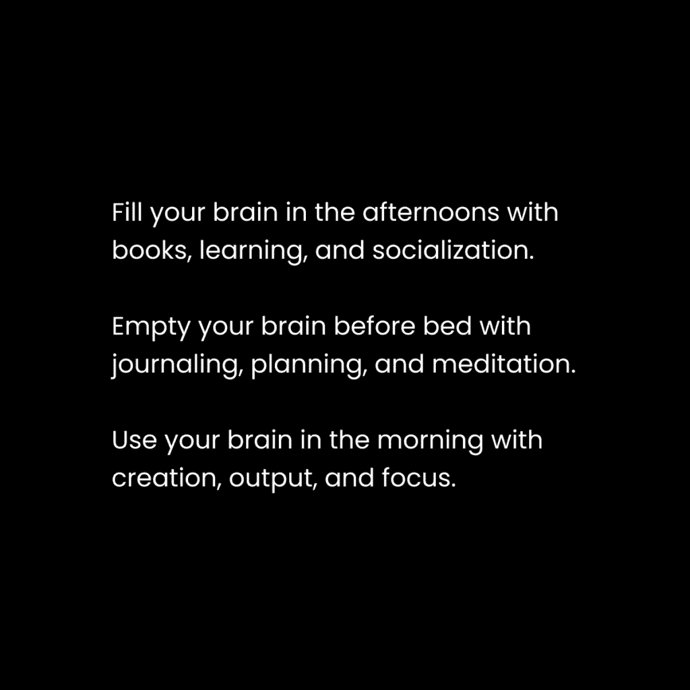
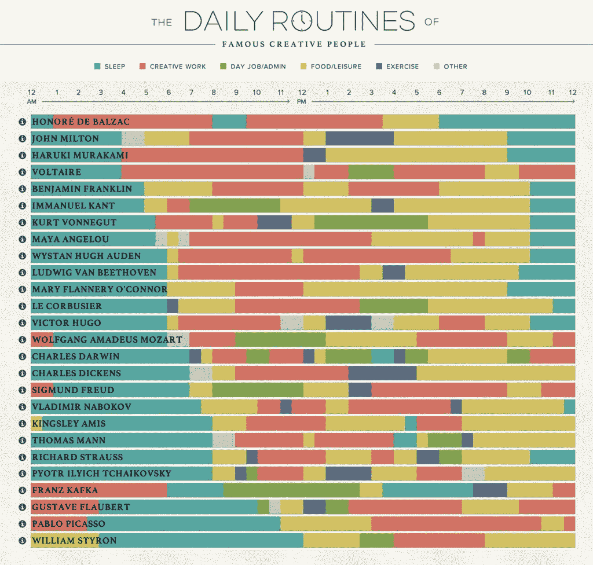

# 生产力未来：一种组织不确定生活的日常惯例

在本节课中，我们将学习一种名为“生产力未来”的日常惯例，它旨在帮助创意人士通过优化创造力而非单纯延长工作时间来组织不确定的生活。我们将探讨为何想法质量至关重要，并介绍一套由四个核心习惯组成的创意生活方式设计框架。

许多人错误地将过度工作等同于成功或责任感。然而，真正对工作负责的人会优先考虑创造力。他们会注重健康饮食、坚持锻炼、保证充足睡眠并进行社交。他们明白，**4小时的专注工作 > 12小时的分散工作**。人类不仅追求生理繁衍，更追求精神与思想的繁衍——即传播我们意识中的信息与身份。当过度工作成为身份的核心，人们在不“生产”时就会感到焦虑。

大多数人误解了生产力，认为它关乎数量而非质量，认为所有时间单位价值相等，并试图处理所有事情而非聚焦于能带来关键结果的那一件事。他们没有区分“任务”和“杠杆”。两个人收入的巨大差异源于**技能、杠杆和认知**，而非努力程度或工作时长。

因此，关键在于设计一种创意生活方式。生产力的未来就是创造力。

## 生产力未来：2：理念流动比以往任何时候都更重要

上一节我们介绍了生产力未来的核心理念是创造力。本节中，我们来看看在人工智能时代，为何个人想法的独特流动变得前所未有的重要。

人工智能可以轻松生成文本、代码或艺术品，但无法自动产生畅销作品或成熟软件。工具变得强大，但大多数人的自主性并未随之提升。AI无法取代“作家”的本质，即：

*   **筛选**：从海量想法中甄别出一个。
*   **构建**：创造有吸引力的叙事目标。
*   **吸引**：捕获特定人群的注意力。
*   **连接**：通过有意识的体验建立深度联系。
*   **记录**：为后世留存高价值信息。

人工智能缺乏执行功能与自主意识，它是一个需要“大师”来驾驭的工具。这位大师必须是兼具通才视野的专家。如果个人缺乏自主性、有意识的体验和承担风险的勇气，就容易被自动化取代。

真正的差异化优势在于“想法流动”。杰出的创作者在成功前往往经历了大量的积累：阅读百本书、产生上千个想法、发布无数次内容。这种量变引发质变的过程无法由AI直接生成列表来替代，因为它缺失了整体的**愿景、故事、经验、意义和目的**。

人们追随的是**传说**而非单纯的信息。在技术发展的螺旋中，社群与同好部落的价值将再次凸显。构建受众并拥有独特的视角，是在AI时代找到意义的关键。

## 生产力未来：3：创意生活方式设计的4Cs

我们了解了独特想法的重要性，那么如何系统地培养这种创造力呢？本节将介绍构建创意生活方式的四个核心习惯模块。

作者通过每天约4小时的深度工作，完成了写作、内容创作、产品开发等多重任务。其秘诀在于优化带来关键结果的“正确工作量”，并将阅读、散步等视为滋养创造力的必要环节，而非“工作”。创造力的提升是生产力的根本燃料。

充分利用有限专注时间的方法，是设计一种创意生活方式，并逐步增加投入。你需要培养以下四个习惯，它们是你一天中的可组合模块：

以下是创意生活方式设计的四个核心习惯（4Cs）：

1.  **清理**
    这个习惯旨在清空思绪，提升意识。最有效的方法之一是将消极想法转化为5-10个可用于工作的积极点子。也可以在睡前进行，为次日早晨的创作储备素材。另一种方法是进行“脑图日记”：
    *   记录脑海中浮现的所有事情。
    *   将它们分类（如工作、烦恼、琐事）。
    目标不是立即处理这些想法，而是通过**意识**实现自我纠正。

2.  **消费**
    没有输入就没有输出。这里的消费指的是**有目的的学习**，为你的工作寻找灵感和想法。
    *   阅读书籍或长文。
    *   浏览精选的社交媒体时间线（限时）。
    *   学习已购买的课程。
    *   收听播客或讲座。
    **关键步骤**：必须有一个系统来捕捉这些灵感，并将其关联到具体的项目中。例如，使用笔记软件的捕获功能，通过“@文档名”将想法归集。

3.  **创造**
    创造、扩展和超越是核心的人类欲望。大多数人停留在消费信息（增加“心理脂肪”）或记录信息（减轻心理负担）的阶段。只有少数人能将信息综合成对他人有价值、能产生影响的产物（获得“心理力量”）。
    你需要一个**具体的项目**作为思维框架，来连接和整合想法，从而为世界贡献独特价值，找到深层目标。

4.  **连接**
    当你拥有一个发自内心想要构建的项目（而非外界强加）时，你会以全新的视角看待生活。你的思维会扩展以匹配项目的框架。日常生活中体验的信息、对话都会成为新想法的来源，你的思维能进行更复杂的推理，形成AI难以复制的独特思路。
    大多数人未能优化这种**模式识别**能力，因此很少感到好奇或着迷。投入一个能鼓励思维重塑的项目至关重要。

## 生产力未来：4：如何结构化你的深度工作

上一节我们掌握了创意生活的四个模块，本节我们将学习如何具体安排每天的深度工作时间，并借鉴查尔斯·达尔文的范例。

没有一种适合所有人的“正确”工作方式。目标是通过**实验**，收集不同观点，体验并筛选出适合自己目标、兴趣和价值观的部分。这就是“生活方式设计”的意义。

查尔斯·达尔文的日常安排是一个杰出范例。他的一天有序而松弛：
*   **早晨**：7点起床散步、早餐。**8点至9点半**进行第一个（也是最高效的）工作时段。
*   **上午**：工作后休息、读信、与家人相处。10点半工作至中午，之后便觉得“完成了一天的好工作”。
*   **下午**：进行著名的“沙径”散步以思考，午餐、读报、听妻子朗读，4点再次散步。
*   **成果**：以这种节奏，达尔文撰写了**19本书**并提出了进化论。

这个例子表明，工作时间与产出成果可以分离。**深度工作结合定期散步与沉思**，是实现高创造力的有效平衡。

### 我的日常安排 – 熵的释放与约束

我喜欢将一天分为三个熵值阶段：

*   **低熵**：不确定性低，头脑清晰，深度专注，意图明确。
*   **中熵**：允许互动与外界联系。
*   **高熵**：受控的混乱，为次日积累创意素材。

我的具体日程如下：
1.  **清晨（~5:00）**：自然醒。温暖季节先散步20分钟，思考写作主题；寒冷季节直接开始工作。
2.  **第一工作块（90分钟）**：用于最高杠杆率的任务（如写书、开发产品）。同时通过头脑风暴5-10个相关想法来“预热”清晰思维。
3.  **早餐后**：简单进食（如水果）。
4.  **第二工作块（45-90分钟）**：处理高优先级增长与维护任务。例如：撰写通讯部分、产生内容想法、跨平台发布。周二此时间段用于录制视频。
5.  **午间散步**：进行第二次散步，常晒太阳，同时消费有声书等内容，并用捕获工具记录并关联所有灵感。
6.  **午后**：处理行政任务（邮件、消息）、健身（短时高强度，30-40分钟）、高蛋白午餐。
7.  **下午至傍晚**：进入休息与灵活时段。可能散步、阅读、小憩、处理零星想法或安排会议。高强度项目期则会专注工作。
8.  **晚间（~17:00后）**：与伴侣共进晚餐。之后基本不工作，放松休息。
9.  **就寝**：21:00-22:00。

**总结**：关键在于将深度专注工作与规律的休息、散步和灵感输入相结合，根据个人能量周期设计日程，而非盲目追求长时间工作。

---

本节课中我们一起学习了“生产力未来”这一理念。我们认识到，在AI时代，**创造力**是未来生产力的核心，独特的**想法流动**和个人**经验**构成了无法被替代的竞争力。通过实践**清理、消费、创造、连接**这四个习惯模块，并借鉴达尔文式的工作-休息节奏来结构化我们的深度工作时间，我们可以设计出一种优先考虑精神输入与输出的创意生活方式，从而用更少的时间产生更大的影响，并组织好不确定的生活。