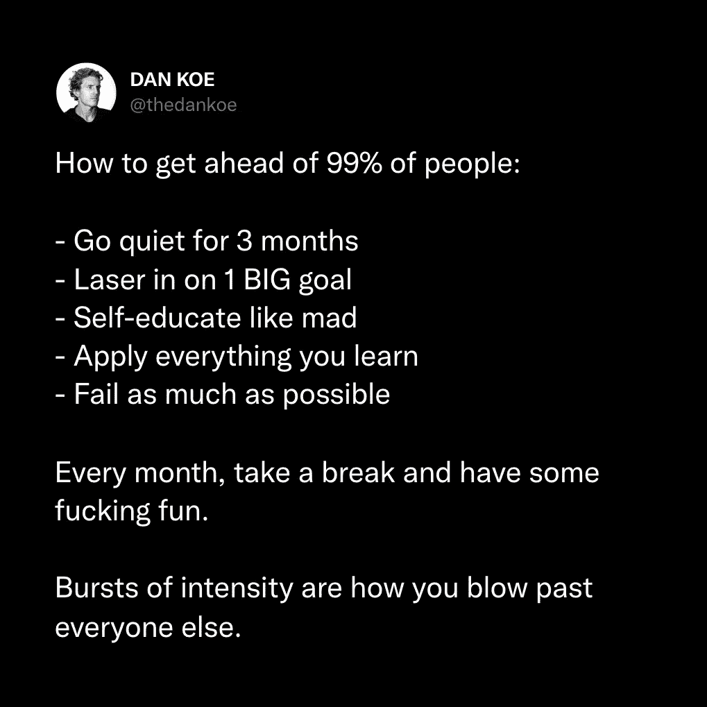

# 创作者指南：如何摆脱新手地狱

在本教程中，我们将学习创作者如何突破最初的停滞期，即所谓的“新手地狱”。我们将探讨导致这一困境的核心原因，并提供一系列具体、可操作的策略，帮助你建立权威、创作吸引人的内容、有效建立网络，并最终构建可持续的个人事业。无论你是作家、教练、艺术家还是任何领域的创作者，这些原则都将为你指明方向。

## 创作者指南：理解新手地狱

大多数创作者会经历一段持续3到6个月的“新手地狱”时期。

在这段时期，你会感到迷茫，不确定自己在做什么，并质疑继续前进是否值得。

你会不断尝试新方法，但往往重蹈覆辙。

许多人会在情况好转之前选择放弃。

但你需要明白一个关键点：仅仅“保持一致性”并不是答案。

在没有取得任何进展的情况下盲目坚持是痛苦的。

问题的残酷真相在于：你没有进步，是因为你没有做正确的事情。

在回归舒适区之前，请理解：你需要达到一个“顿悟”时刻。

在这个时刻，一切变得清晰，你知道如何突破到中级阶段。

记住你开始的初衷：你想从事创造性的工作，拥有自己的受众，并掌控自己的收入和生活方式。

为了做到这些，你需要写作或创造，建立自己的媒体影响力。

本教程将帮助你达到那个关键的“顿悟”时刻。

## 创作者指南：2：采取导致结果的有效行动

成功并非偶然，而是一系列正确行动的结果。

但许多创作者只是盲目遵循教程或课程中的步骤。

请记住，作为个人创作者，你就是自己事业的CEO、CMO和COO。

你需要像经营者一样思考并采取行动。

我曾在新手地狱中挣扎了近5年，涉足多个领域却屡屡受挫。

直到我开始系统性地应用正确的策略，才实现了突破。

以下是从教授近30,000名学生的经验中总结出的7个核心策略。

## 创作者指南：3：为初学者量身定制有效策略

初学者的困境可能持续3个月到30年不等。

核心原因在于：初学者没有意识到，高级创作者现在做的事情，并非他们起步时所用的方法。

**最重要的观点是：你没有成长，是因为你没有做那些能带来成长的事情。**

初学者常犯的错误是，在没有任何权威时，就发布深奥或哲学性的内容。

在人们关心你的观点之前，你必须在社交媒体上建立权威。

以下是建立权威的方法：

**1. 解决更多问题**
作为初学者，你80%的内容应从**痛点**开始。
使用以下短语开启你的内容：
*   **“大多数人”** – 例如：大多数人写作都很糟糕。
*   **“如果你在”** – 例如：如果你难以集中注意力超过5分钟。
*   **“最糟糕的”** – 例如：你可以学到的最糟糕的技能是网页设计。
从问题开始，然后用步骤、独特观点或新颖见解来提供解决方案。

**2. 深入探讨核心常青主题**
在你选择的领域内，总有一些基础、常青的主题表现良好。
例如，在“创业”领域，这些主题包括：如何选择利基市场、适合初学者的最佳商业模式、最佳学习技能等。
不要回避书写这些基础话题，因为市场中的大多数人都是初学者，他们需要反复学习这些内容。
研究5-10个同类账号，注意他们重复讨论的主题，并将其纳入你的内容体系。

**3. 研究成功者的早期内容**
不要只模仿大账号当前的内容，因为他们已拥有受众和权威。
去研究他们为了成长而创作的**早期内容**。
滚动查看他们最旧的帖子，找到那些帮助他们获得早期突破的内容。
分析这些内容的结构和主题。

## 创作者指南：4：提升内容质量与吸引力

如果你的内容没有带来增长，那么很可能它还不够出色。

创作不仅仅是随意书写想法，你需要考虑读者心理，成为“多巴胺销售员”，即**吸引注意力、保持注意力、传递价值**。

大多数人认为自己做到了，但实际上没有。他们发布内容前缺乏二次思考和打磨。

以下是10个提升内容参与度的法则，建议你在写作时参考并应用其中至少2-3条：

**1. 具体数字**
在标题或开头使用具体数字。例如：“苹果新的**1175美元** iPhone有这个新功能。”
**效果**：制造模式中断，增加权威感。

**2. 模式中断**
打破读者常规浏览模式的内容。在满是文字和图片的信息流中，用不同的形式（如独特排版、视觉元素）让人停下来。

**3. 消极偏见**
人类大脑更关注负面信息。将内容置于消极背景下（但仍可导向积极）。例如，将“你将取得巨大成就”改为“你将永远不会再次触底”。

**4. 目标呼吁**
明确指出你正在与哪类人对话。例如：“如果你20多岁…”、“向所有创作者呼吁！”。这能让读者对号入座。

**5. 问题呼吁**
从痛点问题开始内容，这是吸引注意力的最有效方式之一。

**6. 潜在利益**
始终回答读者“这对我有什么好处？”的问题。确保你的内容能带来明确的、有利的转变。

**7. 社会证明**
展示你的成果、经验或资历。分享你的具体成就（如写完一本书、减重20磅、商业收入截图），这能建立信任。人工智能无法复制你的真实经历。

**8. 信心与信念**
用坚定、绝对的语言表达观点，消除表示不确定的词语（如“可能”、“也许”）。例如，将“如果有些人能发展技能集，那可能很明智”改为“地球上每个人发展技能集都至关重要”。

**9. 节奏与可读性**
使用短句、换行符和项目符号来提升可读性。控制内容的节奏，引导读者向下阅读。

**10. 警告与注意事项**
以指出一个常见陷阱或警告开始你的内容。例如：“停止做X，因为它正在摧毁你的Y。”然后解释原因。每个主题都有其陷阱，识别它们就能创造吸引人的内容。

## 创作者指南：使用框架与模板进行练习

大多数人的问题不在于缺乏想法，而在于**结构**。

任何想法，只要以正确的方式构建，都可能取得成功。

你需要训练大脑，以有影响力、结构化的方式阐述想法。就像学习任何技能一样，从“辅助轮”开始：

**1. 创建灵感库**
以研究者的心态浏览社交媒体，而非消费者。每当看到让你赞叹“真希望这是我写的”的爆款内容时，保存下来。
记录链接并按主题整理（例如，使用笔记软件创建一个“灵感库”文档）。
这些内容不仅是灵感来源，更是**结构模仿**的样板。

**2. 学习写作框架**
学习和研究5-10个经典的文案或内容框架，如AIDA、PAS、PASTOR等。
这些框架能指导你系统地构建有说服力的内容。
例如，**PASTOR框架**：
*   **P**roblem：提出问题
*   **A**mplify：放大痛苦
*   **S**tory：讲述故事
*   **T**estimony：提供证明
*   **O**ffer：给出方案
*   **R**esponse：呼吁行动

**3. 在创作时应用框架**
为你的所有内容（包括视频脚本）先撰写文字稿。
在写作时，打开你的灵感库和写作框架作为参考。
你不是抄袭想法，而是在**模仿成功的结构**。
每周安排固定的时间（如2-3天，每次1-2小时）进行这项结构化创作练习。

## 创作者指南：6：主动建立网络与可见度

即使你有好的内容和想法，如果没人知道你是谁，增长也会非常缓慢。

你不能只依赖算法。你的成长很大程度上掌握在你自己手中。

社交媒体方程中，比内容更重要的是：
*   **了解并喜欢你的人数**（他们更可能分享和互动）
*   **看到你帖子的人数**（作为初学者，自然曝光很低）
*   **与成长中的人建立的友谊质量**（他们能带动你成长）

如果你的500粉丝被一个50万粉丝的账号转发，你的潜在受众就变成了50.5万。

专家知道如何让内容被自己粉丝和网络之外的人看到。

以下是你可以采取的行动：

**1. 策略性回复与参与**
加入你所在领域的社群。有目的地回复优质账号的帖子。
关键不是简单说“好帖！”，而是撰写**高质量、能增加价值的回复**，展示你的见解。
通过持续提供有价值的回复，成为一个社群中熟悉的面孔，从而吸引关注。

**2. 练习非需求型社交**
主动私信你欣赏的创作者，但不要带着直接需求（如求转发、求合作）。
从赞美他们的具体内容或提出一个深思熟虑的问题开始。例如：“刚刚读了你的X帖子，关于Y的观点让我深受启发，你是怎么想到Z的？”
目标是建立真诚的连接，而非即时交易。

**3. 每周发布战略性帖子**
不要只发布常规内容。每周计划一篇旨在引发对话、具有高分享价值的“战略性帖子”。
将这篇帖子分享给你通过上述方法建立联系的人，邀请他们参与讨论或分享。

## 创作者指南：通过产品实现价值与成长

许多创作者等到粉丝数达到某个目标才开始变现，或者过度依赖平台广告收入，这两种方式都不可靠。

如果你想掌控收入，就需要销售自己的**产品或服务**。

这样做有几个关键好处：

**1. 建立更深层的权威**
内容本身不足以建立深厚联系。当人们**投资**于你的产品或服务时，他们与你的关系会更进一步。如果你改变了他们的生活或习惯，你在他们心中的地位会显著提升。

**2. 提供内容框架和动力**
如果你不知道写什么，就写与你的产品或服务相关的痛点解决方案。
拥有产品也给了你持续创作的直接理由和潜在回报，让你更专注于能产生结果的活动。

**3. 使试错可衡量**
如果内容没流量，你知道需要调整痛点选题或扩大传播。
如果产品没销售，你知道需要优化产品本身或销售文案。
这种反馈循环清晰且可操作。

如果你不知道从何开始，可以考虑构建一个“最小可行产品”，例如一份低价指南、模板或咨询服务。

## 创作者指南：8：构建内容世界而非单一漏斗

过去那种依赖倒计时和稀缺营销的简单漏斗模式已经过时。

现在的创作者在构建**内容世界**——一个由多种内容和互动点组成的生态系统。

你需要建立一个“漫威电影宇宙”式的品牌世界，包括：
*   **短内容**：推文、LinkedIn帖子、Instagram快拍等。
*   **长内容**：新闻通讯、博客、播客、YouTube视频。
*   **免费资源**：电子书、模板、视频教程。
*   **低价产品**：课程、模板、社群。
*   **高价产品**：教练服务、咨询、高端会员。

**建议启动路径**：
从一种短平台（如X/Twitter）和一种长平台（如新闻通讯）开始。
将新闻通讯的内容改编成YouTube脚本或视频。
将短平台上的优质内容交叉发布到其他平台。
将经过验证的最佳内容转化为数字产品。
持续优化这个系统。

## 创作者指南：9：平衡自我表达与市场需求

最后一个常见的顾虑是：“我想真实地表达自我，使用模板会不会让我变得不真实？”

**答案是否定的**。
创造力在约束中蓬勃发展。框架和模板是你**表达真实想法**的工具，它们帮助你以他人能够理解和共鸣的方式沟通。

你可以同时创作两种内容：
1.  **制造“噪音”的内容**：那些你知道更符合算法、能吸引广泛受众、为你带来曝光的内容。
2.  **增强“信号”的内容**：那些你真正热衷、代表你深度思考、用于巩固与核心受众关系的内容。

如果人们首先找不到你，他们就没有机会看到你更深度的想法。
因此，大胆地制造“噪音”来获得关注，同时持续发布增强“信号”的内容来建立忠诚度。
你不需要一开始就严格限定细分领域。尝试不同的想法，观察受众的反馈，让他们告诉你最适合你的方向。

## 总结

在本教程中，我们一起学习了创作者摆脱“新手地狱”的完整路径。我们首先认识到，停滞不前往往是因为没有做正确的事情，而非不够努力。接着，我们探讨了七个核心策略：从为初学者设计有效内容、运用参与度法则提升内容质量，到使用框架进行练习、主动建立人际网络。我们还强调了通过产品或服务实现价值转化的重要性，并指出应构建一个多元的“内容世界”，而非单一的营销漏斗。最后，我们讨论了如何在保持真实自我的同时，策略性地创作以满足市场需求。记住，突破的关键在于将正确的策略转化为持续的行动。现在，是时候应用这些知识，掌控你的创作者之旅了。