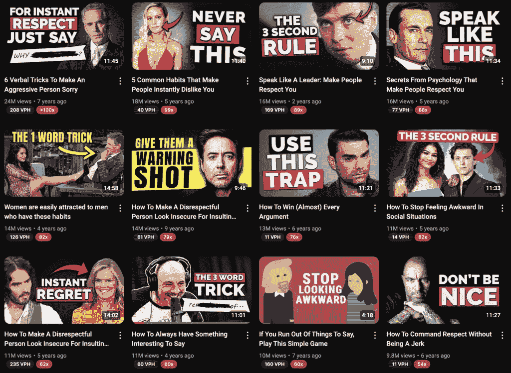
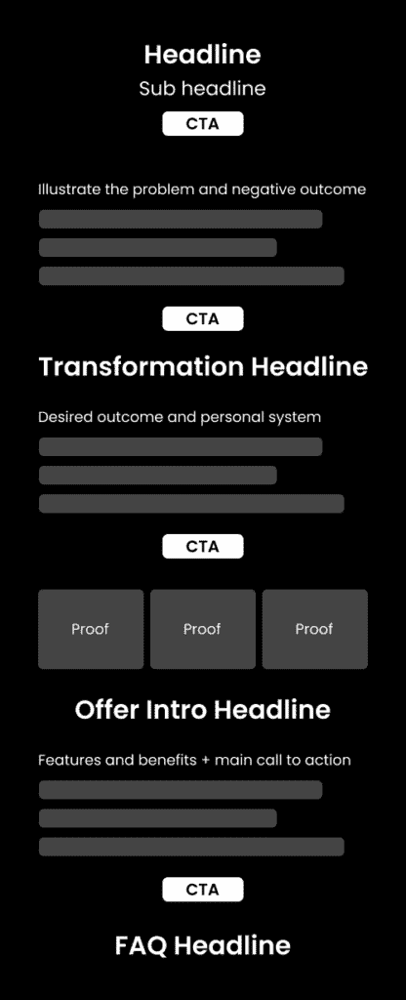

# 《一百万美元产品：如何包装和营销你的知识》课程：概述与核心理念

在本节课中，我们将学习如何将你的知识、技能或兴趣打包成一个可以持续销售的数字产品，并探索如何通过有效的营销策略，将其打造成一个价值百万美元的业务。

你的大脑里可能蕴藏着价值十万美元的知识。这些知识可能正闲置在你的Google Drive、Notion或Kortex中。关键在于，你可以将你的专业技能和知识打包成产品，在你睡觉时也能为你创造收入。这封信中你将学到的内容，将很大程度上决定你作为一名创意人士的成功。

但这不仅仅是关于构建产品。我们将探讨一系列混合因素，包括：如何找到一个高盈利的想法；如何创建营销策略并进行迭代；如何将一个看似普通的产品定位得令人无法忽视；不可抗拒的报价的五个要素；即使你从未写过，如何撰写一个着陆页；如何实际构建产品并接受付款；以及如何成功推出产品，避免其被闲置。

核心在于：如果你想获得独立收入并掌控自己的时间，你需要一个产品。许多人从客户工作开始，虽然取得了一些成功，但时间被耗尽，最终发现自己讨厌为别人的项目工作。你离开工作是为了追求写作、探索兴趣或专注于技艺，而不是重新陷入为生存而工作的模式。一旦你拥有一个不需要投入大量时间和劳动就能创造可观收入的产品，赚取十万美元就只是坚持和迭代的问题。如果你能赚到一美元，你就能赚到一百万美元，前提是你拥有一个能够达到这种规模的单人产品。

这不是快速致富的秘诀。我构建产品的第一年赚了大约一万美元，第二年赚了十万美元，然后是十五万、八十万、四百万。坚持多年并拒绝回到你原本想逃离的生活，你就会看到成功。这是一门关于产品和营销的大师课程，两者都是不可或缺的关键技能。

---

## 《一百万美元产品：如何包装和营销你的知识》课程：2：如何找到一个价值百万美元的想法

上一节我们介绍了构建知识产品的核心理念和潜力，本节中我们来看看如何找到一个有潜力价值百万美元的产品想法。

这里有一个令人震惊的想法：你已经购买过价值百万美元的产品。事实上，你可能购买过数百个。这意味着你可能想得太复杂了。如果你能理解本课程的内容，大多数想法都有可能达到一百万美元的规模。

假设这是你的第一个产品，并且你是个新手。那么，迈向未来的最佳路径是：
1.  建立一个拥有免费且高杠杆流量来源的受众群体。
2.  在你的兴趣或专长领域成为权威。
3.  从一个可以快速测试的“个人系统”数字产品开始。
4.  坚持并迭代，直到收入超过十万美元。
5.  然后，凭借你积累的数据和成果，将这个系统转化为软件或实体产品。

一个关键问题是：“什么是‘个人系统’产品？” 这是将任何想法转化为独特事物的方法，它无法被AI复制或取代，因为AI可以在过程中使用它。它可以表现为自由职业服务、教练服务、教育产品或软件。

例如，我的“2小时作家”课程不是单纯教写作，而是教授我个人的写作系统、我的写作方式和原因。它以一种对特定人群有吸引力和价值的方式重新定位了写作。教育产品是超盈利且超有价值的完美组合。你只需构建一次，就可以无限次销售。

### 将你的专长转化为产品想法

最好的教育产品通常具备以下特点：
*   **解决一个具体的痛点**
*   **提供获得结果的方法**
*   **对执行系统所需的一切提供清晰说明**

首先，决定你想创建产品的主题。以下是一些可能激发你想法的领域列表：
*   写作
*   视频编辑
*   公开演讲
*   社交动态
*   人际关系与约会
*   生产力
*   网页设计与开发
*   人工智能
*   心理健康
*   举重
*   跑步
*   营养学
*   快速学习
*   知识管理
*   财务管理
*   获得面试机会

简单地想一想你在哪些方面比平均水平更高，并写下来。

其次，研究该主题内现有的产品和想法。目标是找到**市场上已经证明有效**和**你能做得更好**的交集。至少找出10-20个产品或想法。

你可以通过以下方式寻找：
*   在Masterclass、Udemy或Skillshare等课程网站搜索你的主题。
*   搜索相关主题的课程评论（例如，“最佳训练计划”）。
*   深入研究你关注的创作者，加入他们的邮件列表，了解他们在销售什么产品。
*   回忆你过去购买过的产品。
*   在X（原Twitter）上找到相关主题的账户，使用Twemex等工具查看他们的热门推文，搜索关键词，并保存可以作为产品或营销灵感的帖子。
*   在YouTube上找到相关主题的频道，筛选最受欢迎的视频，记下可能转化为产品的热门视频标题。

例如，如果你想围绕“社交动态”创业，可以研究“Charisma On Command”YouTube频道的热门视频标题，你会发现“有趣”、“自信”、“不安全感”等主题非常受欢迎。你可以围绕这些主题，用自己的独特视角创建产品。

在研究过程中，将这些想法保存在一个地方。对于你找到的课程，可以考虑购买一些作为参考和灵感来源。目前，你不需要确切知道要创造什么。

---

## 《一百万美元产品：如何包装和营销你的知识》课程：3：如何营销和构建你的产品

上一节我们探讨了如何寻找产品灵感，本节我们将进入实战阶段，学习如何在构建产品之前就通过营销验证想法并赚钱。

大多数人会浪费2-3个月时间构建一个产品，结果却从未推出或售出。我们将采取相反的策略：在开始构建产品之前就赚钱。这样，如果想法不奏效，你可以快速调整并再次尝试。一旦验证成功，你就可以全力以赴，用2-3周时间打造产品并成功推出。

教育产品的优势再次凸显：
1.  可以快速测试和迭代。
2.  可以转化为软件或其他形式的产品。
3.  如果做得好，能真正帮助购买者。

换句话说，大多数产品应该*从*教育产品开始，大多数创始人都可以通过增加教育内容（哪怕只是一本电子书）来创建新的收入渠道。

### 选择你的目标用户画像

人们常常在这个问题上卡住。让我们简化一下：你需要一个目标用户画像，即你产品所针对的人群，这样你的营销才能具体且可执行。实际上，会有更广泛的市场对你的营销产生共鸣，尤其是在社交媒体上。你不想过于具体，否则内容无法传播。

个人建议从以下两个选项中选择：
1.  目标是你自己或过去的自己。
2.  目标是拥有大量财富的人（如创始人、高管、高薪工作者）。

选择后者的问题在于，你可能并不真正了解他们，难以建立共鸣。目前，对你想要服务的人群有一个模糊的概念就足够了。

### 五步打造无法抗拒的报价

你不是从产品开始的，而是从营销开始的。因为好的营销可以指导你构建一个有效的产品。基于好营销构建产品，远比为一个糟糕的产品创造营销容易得多。

现在，拿起你的主题和收集的想法，按照以下步骤构建你的报价：

**1) 核心问题**
这是最重要的一步。与你的主题相关的“大问题”是什么？人们目前处于什么状态？如果不改变，会导致什么后果？这个问题如何衍生出更多小问题？这个问题需要具备：
*   **相关性** – 目标用户必须能*感受*和体验到它。
*   **重要性** – 问题值得解决。
*   **有据可依** – 确保你不是在凭空制造问题。

大多数紧迫问题都关乎健康、财富和人际关系。

**2) 期望的结果**
如果核心问题是起点，那么期望的结果就是转变的终点。你需要明确人们真正想要什么，以及他们*为什么*想要。这需要结合你的目标用户画像来具体化。

**3) 可信的时间框架**
时间框架能极大提升营销效果，例如30天、3-6个月、6周、2小时。它使产品更具体，并帮助压缩产品内容，只保留解决问题和达到结果所必需的部分。

**4) 个人系统**
你的个人系统是产品独特性的核心。它是你克服痛点并达成结果的方式。创建个人系统的方法：
*   进行实验（在自己或目标用户身上）。
*   列出在**时间框架**内达到**结果**所需的所有步骤。
*   测试并记录改进点。
*   重写步骤并再次测试，直到能为更多人带来结果。
然后，为你的系统起一个名字（例如“间歇性禁食”、“Stronglifts 5×5”）。

**4.5) 教育内容**
对于教育产品，你需要围绕系统创建课程大纲，涵盖用户需要了解的基本原理、步骤和技能。

**5) 功能与好处**
不要只列出产品功能，要将其与吸引人的好处配对，或者直接用好处描述。人们不关心产品本身，而关心产品如何改变他们的生活。例如，将“5周训练计划”描述为“5周计划，让你走进健身房时不再迷茫”。

**6) 交付机制**
最后，决定如何交付你的产品。回顾一下我们构建的报价示例：
*   **主题** – 生产力
*   **目标用户画像** – 过去的自己（想平衡学业和创业的18岁青年）
*   **核心问题** – 不想做传统工作，但学业落后，业务停滞；若不改变，将陷入平庸工作难以脱身。
*   **期望结果** – 每天专注12小时以上，无需依赖药物。
*   **时间框架** – 14天
*   **个人系统** – “注意力马拉松”训练计划
*   **教育内容** – 心流状态、多巴胺、工作空间设置等。

交付机制的选择包括：
*   **电子书** – 制作快，但定价难高。
*   **邮件课程** – 结构化，但完成率低。
*   **训练营** – 4-8周课程，含电话和社区，稀缺感强，价值高，但成本也高。
*   **常规课程** – 常青产品，可持续推广，但需要大流量。
*   **社区** – 月度订阅，重复收入，也意味着重复工作，销售较难但回报大。
*   **软件** – 开发时间长，失败风险高，但长期潜力巨大。

一个好的初学者路径可能是：先推出一个特定主题的$27电子书，然后升级为包含模板的$150课程模块，最后扩展为更全面的$399训练营课程。你的交付机制必须能兑现你的营销承诺。

在概述了报价包含的所有内容后，是时候赚取你的第一个1美元了。

---

## 《一百万美元产品：如何包装和营销你的知识》课程：4：着陆页、启动与构建——正确的顺序

上一节我们完成了营销策略和报价设计，本节我们将学习如何按正确顺序执行：先创建着陆页并启动预售，再构建产品。

这是对初学者最友好的路径。你几乎无法用其他类型的产品这样做。在过去，数字产品并不常见，人们会投入大量资源开发可能失败的产品。如今，通过构建受众和数字产品，你可以快速“转型”。你可以每天在内容中测试想法，将这些想法转化为营销，创建着陆页，设置支付，并启动预售。如果不行，就放弃并无限次尝试，直到成功。换句话说，只要你坚持迭代，就不可能失败。

有了营销策略后，按以下步骤操作：

### 第一步：创建着陆页

你将在[Stan](https://join.stan.store/thedankoe)这类平台上先创建着陆页。然后，*推出*产品预售，告知人们产品将在特定日期发布。在Stan上，你可以添加一个模块，告知用户上线详情。

一旦完成第一笔销售，你就有了公开的责任和动力，必须按照宣布的日期打造一个优秀的产品。

着陆页文案的目的是清晰且有说服力地展示你的报价。结构可以参考以下方式（使用类似Stan的平台可以简化这个过程）：

**标题**
标题和副标题应是你报价中所有价值的浓缩。结合核心问题、期望结果、个人系统、时间框架中最有力的部分。
*示例*：每天学习12小时无需安非他命（14天计划）

**副标题**
补充其他部分。
*示例*：使用“注意力马拉松”系统，避免低薪的9-5工作，征服廉价多巴胺。

**问题阐述与深化**
在引言部分，阐述核心问题和负面后果。可以从个人故事开始：你过去在哪里？为什么想改变？尝试过什么失败的方法？列出由该问题衍生出的具体痛点。

**个人系统**
解释你的个人系统有何不同。你的转折点是什么？如何发现并创建了这个系统？为什么它比市面上的方案更好？可以添加图表辅助说明。

**成果或见证**
展示使用产品后的成果图片。如果没有客户见证，可以免费带人体验以换取推荐，或者展示你自己的成果（如图片、截图）。

**功能与好处**
这是“产品包含什么”的部分。最简单的方式是列出功能点，并对应其带来的好处。可以将其视为前面“痛点列表”的对立面。

**行动号召**
促成交易。可以进行对比：“使用产品前的你” vs “使用产品后的你”，重复痛点与好处。如果使用Stan等平台，可以直接引导至支付按钮。

**常见问题解答**
如果构建自定义着陆页，可以包含FAQ，用于解答用户可能的疑虑。

### 启动、启动、再启动

设定发布日期（例如从首次推广起3-4周后）。每周在你的通讯中推广，将链接放在个人资料和描述中。围绕产品主题创作内容（帖子、轮播图、视频等），并在其中融入你的营销元素，附上简单的行动号召（如“如果你在[痛点]上遇到困难，[产品]将于[日期]上线”）。

在发布前1-2周，增加推广频率和强度。考虑为早鸟用户提供折扣。

---

本节课中我们一起学习了如何将知识产品化的完整路径：从寻找百万美元创意，到设计无法抗拒的营销报价，再到按照“着陆页-启动-构建”的正确顺序验证并推出产品。关键在于坚持、迭代，并利用教育产品作为低风险、高潜力的起点。通过将你的个人系统打包，并提供真正的价值，你完全有可能建立一个在你睡觉时也能创造收入的可持续业务。