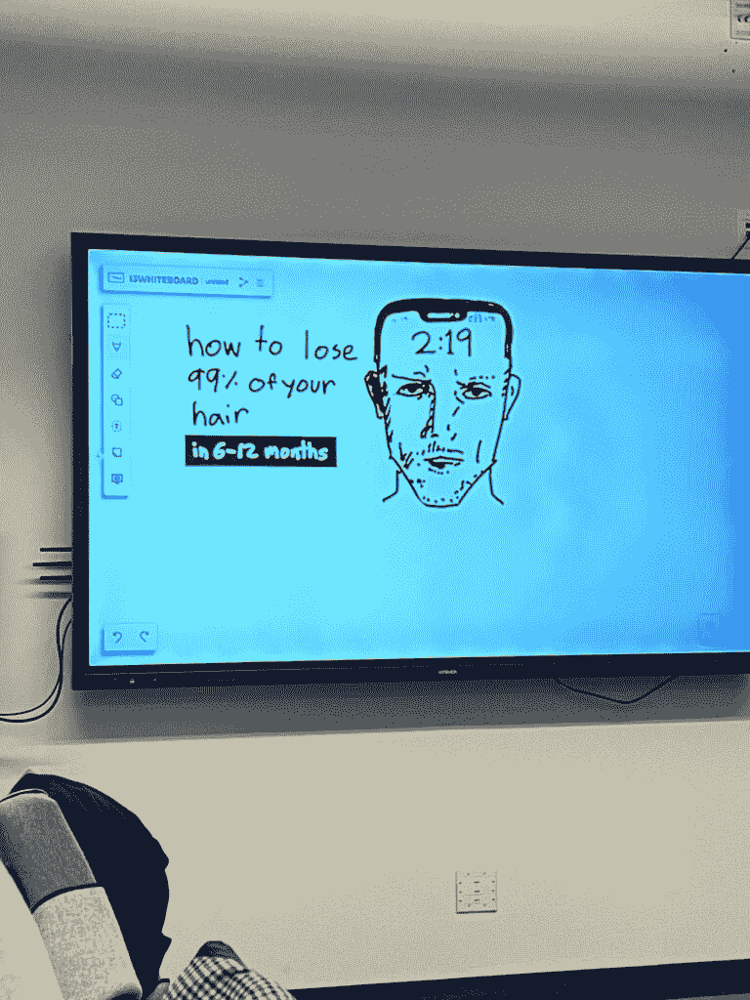

# 目标达成训练营：如何在2-3个月内攻克大目标

在本节课中，我们将学习一种名为“战斗模式”的系统性方法，帮助你在2-3个月内集中火力，攻克那些看似遥不可及的大目标。我们将从设定愿景开始，逐步深入到制定计划、转变身份，并最终通过高强度行动实现目标。

## 概述：什么是“战斗模式”？

“战斗模式”是一种与常见的“僧侣模式”相反的自我提升策略。它不是通过远离世界和消除干扰来寻求发展，而是主动出击，攻击目标。在这种模式下，你会模拟一场狩猎，对机会说“是”，让自己暴露在大量新经验中，用可控的混乱迫使自己扩展能力，塑造一个能够承担巨大责任的新身份。

现代生活往往过于舒适，导致人们陷入无聊和焦虑的模糊地带。“战斗模式”通过创造极端的对比——有意义的工作和有意义的休息——来打破这种僵局，从而实现快速成长。

---

## 第一部分：另一个自我效应——步入新身份

上一节我们介绍了“战斗模式”的核心概念。本节中，我们来看看实现这种模式的关键心理工具：**另一个自我**。

“另一个自我”是你现有身份与你渴望成为的人之间的桥梁。它允许你跳出充满自我怀疑的思维定式，从一个全新的、更有能力的视角来看待挑战。当你采用一个“另一个自我”时，你的注意力会从内在的恐惧转移到外部角色的行为要求上，从而没有多余的精神能量去滋养不安全感。

以下是创建并运用“另一个自我”的三个步骤：

### 1) 愿景——你想要什么？

首先，你需要一个强大的**注意力锚点**，即一个清晰、有意义、能吸引你全部注意力的长期愿景。这个愿景不是一成不变的，它会随着你的成长而迭代和进化。

你可以从回答以下问题开始构建你的愿景：
*   你希望自己的形象、谈吐和他人如何看待你？为什么？
*   你渴望生活在什么样的环境中？为什么？
*   你希望对他人产生什么样的影响？为什么？
*   如果金钱是你影响力的反映，你希望赚取多少？
*   你预见自己会擅长什么并因此闻名？为什么？
*   你理想的日常生活，直到细节，是怎样的？为什么？

### 2) 清晰度——你如何取得进步？

缺乏自信常常源于缺乏清晰度。一旦有了愿景，你需要一个具体的计划来知道每一步该做什么，从而保持专注，进入心流状态。

制定计划的步骤如下：
1.  **分解愿景**：将大愿景分解为可实现的里程碑（例如，从赚取第一块钱，到一万元，再到十万元）。
2.  **明确行动**：写下为了达到第一个里程碑必须完成的具体任务（例如，为了赚钱，需要开始一项与兴趣相关的业务）。
3.  **识别知识缺口**：明确写出你需要学习哪些技能或知识才能完成那些任务（例如，学习营销、内容创作、产品开发）。
4.  **定义日常任务**：列出能直接推动进度的每日行动，而非琐事（例如，每日发布高质量内容来建立受众）。

### 3) 身份——你必须成为谁？

为了执行计划，你需要成为配得上那个愿景的人。这意味着你需要塑造一个“另一个自我”，他具备你目前尚未完全拥有、但实现目标所必需的品质。

塑造“另一个自我”的方法如下：
1.  **选择原型**：挑选2-3位在你目标领域已取得成就的人物作为灵感来源。
2.  **记录品质**：研究并写下这些人物身上使你钦佩的关键品质（例如，高效、创造力、冷静）。
3.  **赋予名字**：为你的“另一个自我”取一个名字，使其具体化，便于你在需要时“切换”进去。

---

## 第二部分：如何进入战斗模式

上一节我们探讨了通过“另一个自我”进行心理建设的框架。本节中，我们来看看如何将这些心理准备转化为切实的、高强度的行动，即真正进入“战斗模式”。

“战斗模式”是一个为期2-3个月的密集冲刺期，你需要通过承诺、学习和构建，把自己置于必须成长的环境中。

### 承诺——做出不可逆的改变

行动始于坚定的承诺。你需要做一个**物理上**的、象征性的行为，来切断退路，表明你义无反顾的决心。

*   这可以是剃光头发（一种象征）。
*   也可以是购买符合新身份的衣服、搬到一个更有挑战性的环境、或将所有资源投入到一个新项目中。
*   关键是制造“战术压力”，让失败的后果变得真实，从而迫使自己前进。

### 学习——拥抱混乱与新知

在快速变化的世界中，持续学习至关重要。你需要建立两个核心习惯：

*   **每日学习（30-60分钟）**：主动学习新技能、新技术和新思想。
*   **每日构建（30-60分钟）**：将所学转化为实际产出，为你自己创造价值。

此外，学习不仅限于书本。主动寻求新体验、打破常规、尝试未知，让混乱成为推动你进步的催化剂。

### 构建——聚焦三大支柱

你的精力应集中在构建三个核心领域上，它们是你实现一切愿景的基础：

1.  **思想**：通过学习和反思，提升决策质量和风险判断能力。
2.  **身体**：通过锻炼和健康管理，改善精力、外观和自信心。
3.  **事业**：通过创造产品或服务，为他人提供价值，并以此维持理想生活。

将每一项都视为一个需要持续投入的“项目”。关于人际关系，当你专注于自我发展时，你会变得更充实、更独立，反而能以更健康的方式改善与他人的关系。

### 暴露于巨大经验之中

在2-3个月的“战斗模式”期间，尽可能多地积累经验。

*   对新的机会说“是”。
*   主动与人交流。
*   启动那些让你害怕的项目。
*   用大量的新信息和挑战“淹没”自己。

即使你感到压力巨大甚至暂时崩溃，这段经历也会让你变得更强大、更成熟。成长不是线性的，它往往以这种短期的、爆发式的冲刺形式出现。

---

## 总结

本节课我们一起学习了“战斗模式”的目标达成体系。我们首先了解了通过塑造“另一个自我”来转变心态和视角的方法，包括确立有吸引力的**愿景**、制定清晰的**计划**和定义新的**身份**。接着，我们探讨了如何通过不可逆的**承诺**、拥抱混乱的**学习**、聚焦核心的**构建**以及主动寻求**巨大经验**，来进入为期2-3个月的高强度执行期，从而快速攻克大目标。

记住，你可以在需要突破时主动启动“战斗模式”，在完成后进入恢复期，如此循环往复，实现阶梯式的成长飞跃。