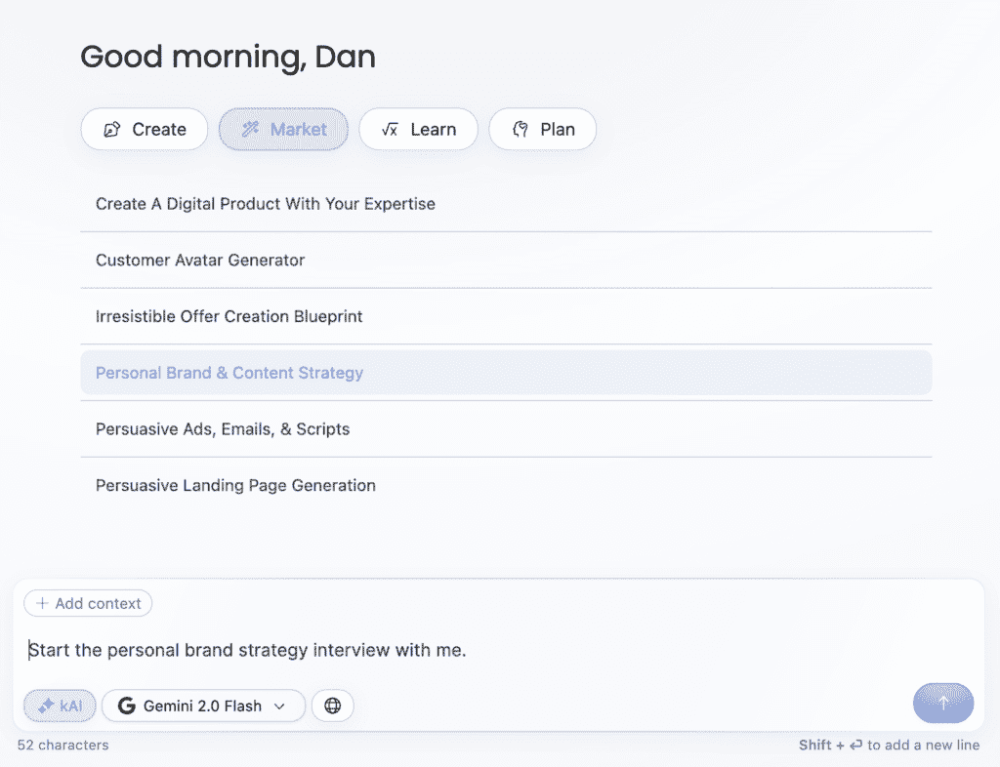
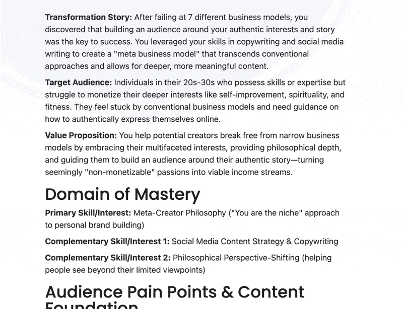
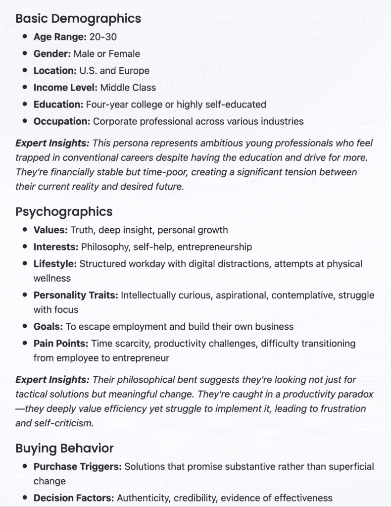
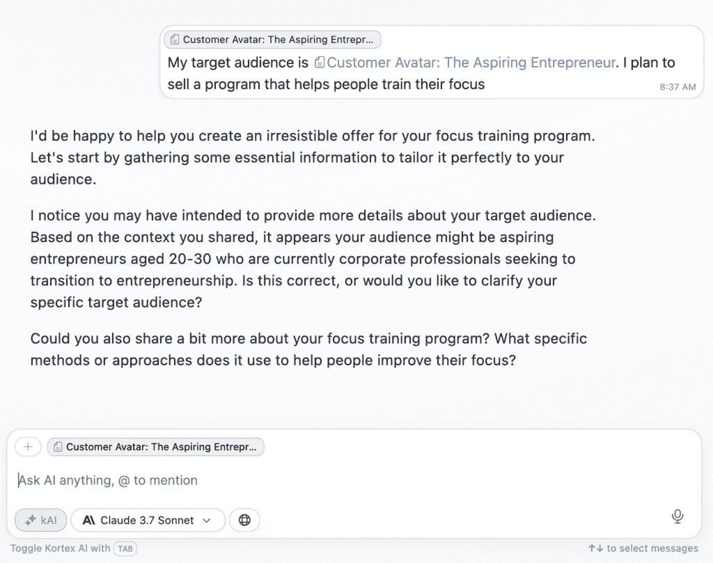
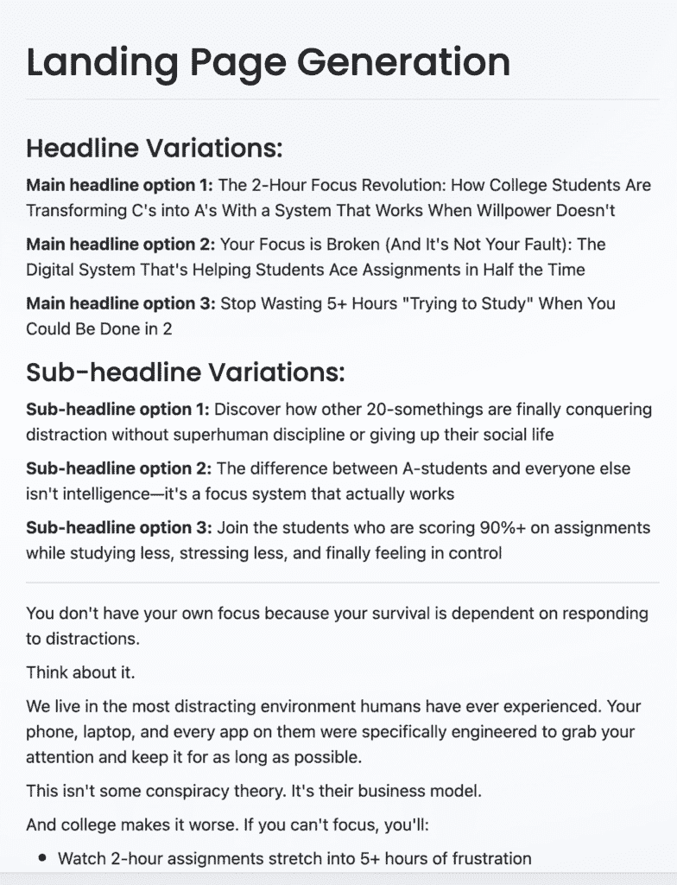
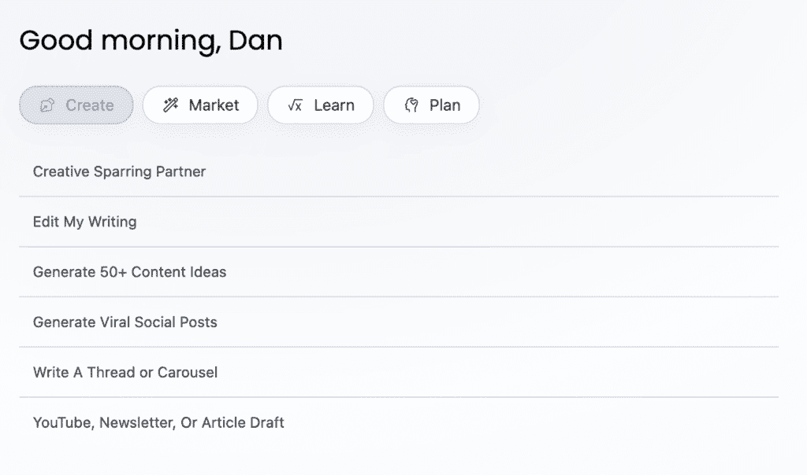

# 人工智能创富指南：如何真正通过人工智能赚到 100 万美元

> [原文链接](https://thedankoe.com/letters/how-to-actually-make-1-million-with-ai/)

在本节课中，我们将学习如何利用人工智能来构建一个可持续的在线业务，并探讨实现年收入100万美元的可行路径。我们将打破对AI的幻想，聚焦于商业的本质，并介绍一套利用AI工具系统化提升效率的具体方法。

## 概述

许多人期望人工智能能提供一种无需努力即可快速致富的捷径。然而，现实并非如此。人工智能并未改变商业成功的基本法则，它只是改变了执行这些法则的速度和质量。本节课将引导你理解这一点，并提供一个从零开始、利用AI辅助构建个人品牌和营销体系的完整框架。

## 人工智能并未改变商业本质

你永远不会生活在一个只需命令机器人工作，自己就能坐享其成的世界里。这不是它的工作原理。

事实上，人工智能并没有改变商业成功所需的任何核心要素。你仍然需要：
*   获取流量
*   创作内容
*   进行推广
*   提供一个有价值的提议
*   明确你的客户形象
*   拥有一个着陆页
*   撰写有说服力的文案

当然，你还需要**理解**你在做什么，以便有效地协调所有这些环节。

因此，人工智能并非一种能让你免于学习商业原则的新奇模式。它唯一改变的是你完成上述任务的速度和最终产出的质量。

## 外包你的弱点：AI作为解决方案

在商业中，明智的做法是将你不喜欢或不擅长的事情外包出去。现在，这个“外包对象”可以是人工智能。

问题是，通用的人工智能并不天生擅长特定领域（如营销或写作）。它需要具体的信息和指导才能变得有用。

所以，如果你想将营销工作外包给AI，你有两个选择：
1.  自己成为营销专家，然后创建你自己的AI系统。
2.  找到一个由营销专家构建的AI系统，并利用它，这样你就可以专注于你热爱的事情。

## 实现100万美元收入的现实路径

在深入使用AI工具之前，让我们先分析几个实现年收入100万美元的现实路径。

计算公式为：`$1,000,000 / 12个月 = 每月$83,333`，或`$83,333 / 30天 ≈ 每天$2,777`。

以下是几种达成此目标的方法：
*   每天卖出 **18** 个单价 **$150** 的产品。
*   每天卖出 **111** 个单价 **$25** 的订阅。
*   每两天签下一个 **$5,000** 的客户。
*   每四天签下一个 **$10,000** 的客户。
*   结合以上方式，例如每周1-2个高价值客户加上每天几件产品销售。

如果你选择服务客户的路线，后期可能需要组建团队。如果选择产品或订阅路线，则需要大量流量。

## 流量从何而来？

假设你的产品着陆页转化率为2.5%，要每天卖出18件$150的产品，你需要每天有 **720** 人访问该页面。

这720人可以从社交媒体、广告、搜索引擎优化（SEO）或网红营销中获得。

如果你擅长社交媒体（这是一项技能），你可以实现：
*   每个YouTube视频获得1万到5万次观看。
*   每月在社交媒体上获得5万到100万次曝光。

在如此庞大的曝光量中，要求其中720人点击你的链接并购买，以实现年入百万的目标，这个比例并不算高。当然，简单不等于容易，精通营销和文案可能需要数年时间。但如果我们能训练AI掌握这些原则，结果会大不相同。

## 如何使用AI系统化构建业务

上一节我们探讨了商业的基本框架和收入目标，本节中我们来看看如何利用AI工具一步步构建整个业务体系。以下是核心步骤。

### 第一步：制定个人品牌策略

我们将聚焦社交媒体，因为它是免费、易获取且高效的流量来源。

操作流程：
1.  访问 [Kortex](https://kortex.co) 并开始一个新聊天。
2.  在“市场”类别下选择“**个人品牌策略**”选项。
3.  按提示回答一系列面试式问题。
4.  AI将输出一个完整策略，包括：转型故事、目标受众、价值主张、可货币化的技能领域、受众痛点、内容灵感、社交媒体简介、货币化策略和内容日历。

**关键点**：复制并保存此输出的所有内容，作为你后续所有工作的基石文档。

### 第二步：生成详细的客户头像

市场研究至关重要但常被忽视。模糊的客户形象会导致营销效果不佳。

操作流程：
1.  在Kortex的“市场”类别中选择“**客户头像生成器**”。
2.  使用第一步策略中得到的目标受众描述来填写初始信息。
3.  回答AI提出的深入问题，涵盖人口统计、心理特征、行为习惯等。
4.  将生成的详细客户头像保存为新文档，并在后续所有环节中随时参考。

### 第三步：打造不可抗拒的提议

大多数人对于卖什么以及如何包装缺乏清晰思路。AI可以帮助你基于数据和逻辑构建有说服力的提议。

操作流程：
1.  选择“**不可抗拒的提议创建蓝图**”。
2.  在第一个空格中引用你的“@客户头像文档”。
3.  在第二个空格中简要描述你计划提供的产品或服务。
4.  回答澄清问题后，AI将输出一个完整的提议框架，包括：交付形式、核心创意、受众痛点、量化结果、独特卖点、功能益处以及价值定位分析。

**关键点**：再次保存此输出文档。AI提供的框架基于营销原理，远胜于大多数人的凭空猜测。

### 第四步：创建高转化率着陆页

现在，你将整合前几步的所有成果，生成一个纯文本但极具说服力的着陆页。高转化率的着陆页往往重在文案而非复杂设计。

操作流程：
1.  选择“**有说服力的着陆页生成**”选项。
2.  插入你的目标受众描述、提议蓝图文档，并可选择添加你的“语音分析”（让文案更符合你的风格）。
3.  AI将生成多个标题变体和结构完整的着陆页文案。
4.  你可以将此文案直接用于 [Stan](https://join.stan.store/thedankoe) 等产品托管平台。

**重要提示**：AI的输出并非一劳永逸。你需要测试和迭代。如果转化不佳，可以回到与AI的聊天中，询问：“转化率不高，可能是什么原因？”或“请生成10个新的标题变体供我测试。”与AI对话，持续优化。

### 第五步：规模化内容创作

有了策略、受众、产品和着陆页，最后一步就是持续创作内容来吸引流量。AI可以在此环节大幅提升你的效率。

在Kortex的“创建”类别下，你可以：
*   **生成大量内容创意**：使用“生成 50+个病毒性内容想法”。
*   **撰写各类文案**：使用相应工具为X（推特）、LinkedIn、Threads、Instagram、YouTube短片或TikTok编写社交媒体帖子或短视频脚本。
*   **制作长视频脚本**：使用工具编写完整的YouTube视频脚本、新闻通讯或文章。
*   **改编内容形式**：使用“将一个想法变成 reels、tiktok 或短片”来跨平台复用内容。

此外，在“市场”类别下的“**说服性广告、电子邮件和脚本**”选项，可以帮你撰写用于推广产品的销售帖子、电子邮件和广告文案。

## 总结

本节课中，我们一起学习了如何理性看待人工智能在商业中的作用，并掌握了一套利用AI工具系统化构建在线业务的完整流程。我们从**制定个人品牌策略**开始，明确了方向；接着通过**生成客户头像**深入理解受众；然后**打造不可抗拒的提议**来设计核心产品；再利用这些信息**创建高转化着陆页**完成转化；最后借助AI**规模化内容创作**以持续吸引流量。记住，AI是强大的增效工具，但商业的成功依然依赖于你对核心原则的理解、持续的测试优化以及执行的纪律。现在，唯一阻止你前进的就是开始行动的决心。