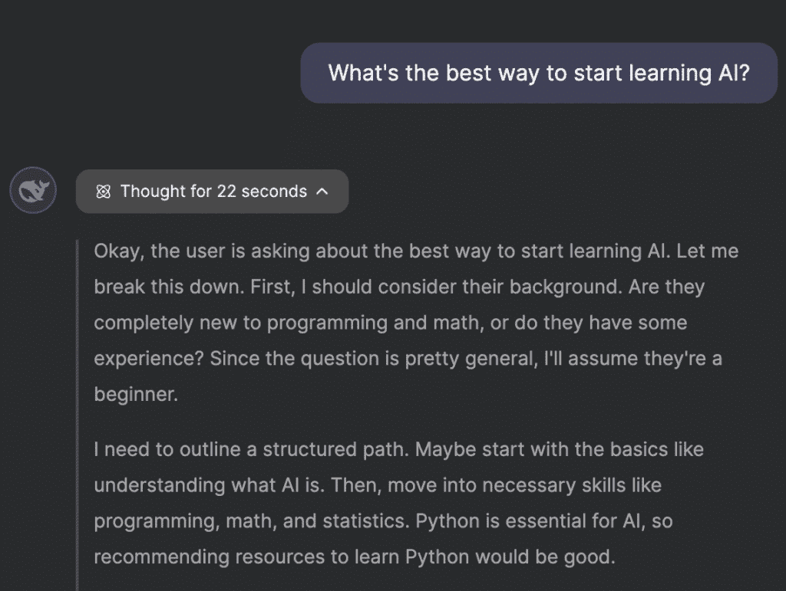
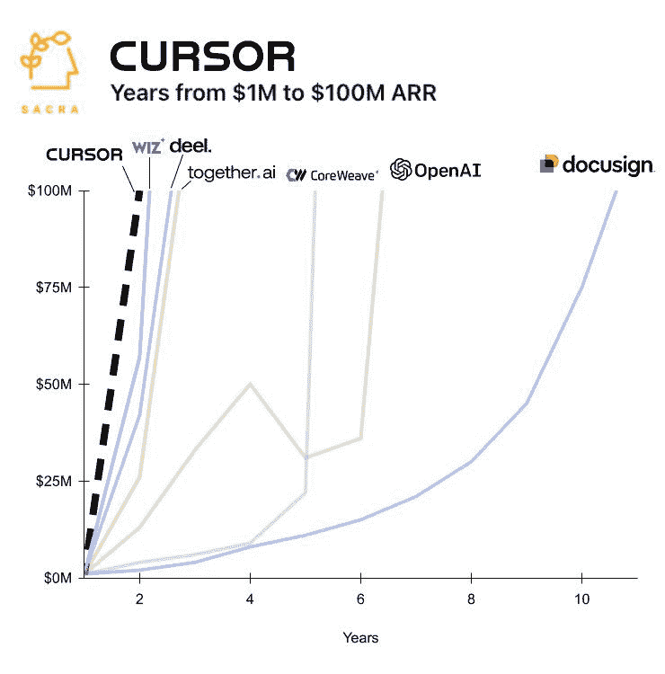

# 人工智能入门指南：概述与核心概念

在本节课中，我们将学习人工智能的基础知识，理解它为何是一项能极大提升其他技能价值的“元技能”。我们将探讨人工智能如何工作，以及如何通过学习它来改变你的工作和学习方式。

人工智能是一项能显著提升你现有数字技能价值的新兴“元技能”。与那些会随技术演变而变化的特定技能不同，人工智能能与你的任何技能结合，使其价值倍增。关键在于，人工智能本身也是一项需要学习和练习的技能。大多数人并不理解其基础原理，只是输入一句话并期望奇迹发生。本指南旨在为你提供一个关于当前人工智能的迷你大师班，帮助你掌握其基础知识、工具和有效使用方法，从而在生活和工作中获得先发优势。

## 人工智能入门指南：2：人工智能模型与工具的基础

上一节我们介绍了人工智能作为“元技能”的潜力，本节中我们来看看支撑人工智能应用的核心模型与工具。了解这些基础知识，将帮助你更好地选择和使用合适的工具。

如果你不打算构建人工智能或为其公司工作，可能无需深入了解所有内部运作机制，就像使用电子邮件营销软件无需知道如何构建它一样。但掌握大局有助于更有效地应用。大型语言模型是我们今天常说的“人工智能”。当你与模型对话时，你的文本会被转换成“标记”进行处理。标记可以理解为单词的片段。每次新对话都会开启一个“上下文窗口”，它决定了人工智能能记住的文本量。

以下是当前主要的人工智能模型提供商及其特点：

*   **OpenAI (ChatGPT)**：市场领导者，提供广泛的应用。
*   **Anthropic (Claude)**：在写作和编程方面表现出色。
*   **Google (Gemini)**：拥有巨大的上下文窗口，能处理大量信息。
*   **xAI (Grok)**：提供独特的“未过滤”对话模式。
*   **Meta (Llama)**：开源模型，可供研究和定制。
*   **LeChat (Mistral)**：另一款强大的开源模型。
*   **Deepseek (V3)**：性价比较高的选择。

这些模型之间的主要区别在于：
*   **预训练数据**：模型从特定时间点之前的互联网数据中学习，因此通常不了解近期事件。
*   **后训练调整**：这决定了模型的个性和语气。
*   **上下文窗口大小**：影响单次对话中模型能记住的内容量。
*   **定价策略**：不同模型的成本差异很大。

当基本模型能力不足时，可以使用“推理”或“思维”模型，如 **ChatGPT o1** 或 **Claude Sonnet 3.7（思维模式）**。这些模型能模拟人类解决问题的思考过程，虽然更昂贵，但适合处理复杂的写作或编程任务。



尽管功能强大，LLMs也有局限，例如无法获取实时信息。因此，出现了结合互联网搜索的“工具”，如 **Perplexity**，它像一个增强版的谷歌搜索。此外，还有 **DeepResearch** 功能，能进行深入研究和提供信息来源。

最后是“包装”应用，它们将基础模型与特定工作流程的工具集成，使其在特定场景下更高效。例如：
*   **Perplexity**：结合多个LLM和搜索。
*   **Cursor**：专为编程设计的集成开发环境。
*   **Kortex**：集工作、笔记、AI助手于一体的中心枢纽。



## 人工智能入门指南：3：学习新技能——提示工程

了解了人工智能的模型与工具后，本节我们将深入核心：如何与人工智能有效沟通，即“提示工程”。掌握这项技能，意味着你从执行单一任务转变为构建系统。

成为“人工智能高手”需要从任务思维转向系统思维。当你编写一个提示或一系列提示来实现某个目标时，你实际上是在用文本构建一个系统。这类似于编写代码：你有愿景，理解步骤，然后执行直到完成。人工智能不会改变实现目标的过程，但它能帮助你更快完成、提供更多知识、并帮你克服盲点。然而，人工智能无法弥补个人能力的不足，它不是一个快速致富的魔法。

撰写有效的提示有两种主要类型：
1.  **系统或元提示**：用于构建整个对话或任务框架的初始提示。
2.  **后续提示**：用于细化输出或深入探讨的较短提示。

我们将重点介绍元提示的构建。一个好的元提示通常包含以下几个部分：

*   **系统**：为人工智能分配角色和任务描述。
*   **上下文**：提供背景信息或你对任务的期望。
*   **说明**：完成任务的详细步骤。
*   **示例（可选）**：提供具体的参考样例。
*   **约束**：列出需要避免或必须包含的内容。
*   **输出**：指定你期望的输出格式。


例如，一个用于总结书籍的元提示可能这样结构：
```
系统：你是一位擅长提炼核心观点的内容总结专家。
上下文：我将提供一段文本内容。
说明：请总结其核心论点、关键支撑论据和主要结论。
约束：避免个人观点，只基于文本总结。
输出：以清晰的要点列表形式呈现。
```

撰写优秀提示的过程通常包括以下步骤：
1.  **提供详细信息**：将人工智能视为一个需要具体信息的聪明人。给出越详细的指示，输出质量越高。
2.  **测试与改进**：运行初始提示，根据输出结果调整和优化提示内容，例如添加“示例”部分。
3.  **确保输出质量**：检查输出格式是否符合要求，并进行微调，直到结果稳定且令人满意。

## 人工智能入门指南：4：如何每周节省数小时——人工智能用例


上一节我们学习了如何构建有效的提示，本节我们来看看如何将这些知识应用到实际场景中，自动化繁琐工作，从而每周节省大量时间。


人工智能应该用于增强你喜爱的创意工作，并自动化你讨厌的忙碌工作。为了找出人工智能如何最好地帮助你，请先列出：
*   你每天做什么？
*   你喜欢哪些部分？（不想放弃）
*   你讨厌哪些部分？（不需要创造力）

然后，思考如何将人工智能融入日常工作，并建立一个提示库来加速处理讨厌的任务。即使人工智能不能在创意上节省时间，它也能通过提供更好信息来提高工作质量。

以下是几个关键的人工智能应用用例：

**用例 1：新的谷歌搜索**
将每次想用谷歌搜索的习惯，改为打开人工智能工具（如 Perplexity）。这能提供更直接、综合的答案，极大提升信息获取效率。

**用例 2：快速学习和知识对手**
无论学习新语言、理解复杂书籍，还是从PDF中提取信息，人工智能都可以作为你的知识陪练。例如，你可以：
*   让AI解释书中复杂概念。
*   使用AI作为语言教练进行练习。
*   上传整个PDF让AI帮你查找特定信息。

**用例 3：创意工作或创业中的想法生成**
在写作或构思商业计划时，人工智能可以帮助：
*   分析优秀内容的结构。
*   基于目标受众生成痛点、愿望和内容创意。
*   协助撰写大纲、帖子或完整文章。
*   以不同视角（如哲学家口吻）重写句子，激发新想法。

**用例 4：客户画像与语音分析**
对于营销和内容创作：
*   分析YouTube视频的结构和风格，用以撰写类似脚本。
*   创建详细的客户画像，并让AI基于此生成定向营销材料。
*   进行“语音分析”，输入某人的作品（如文章），让AI学习并模仿其写作风格。

**用例 5：个人成长与清晰**
人工智能可以充当个人顾问：
*   将大目标分解为可执行的任务和习惯。
*   通过日记分析，提供关于自身优缺点的洞察。
*   帮助识别问题的根本原因。
*   作为逻辑问题解决者，排除情绪干扰。

## 人工智能入门指南：总结与行动指南

在本节课中，我们一起学习了人工智能作为一项“元技能”的价值，了解了其核心模型与工具，掌握了构建有效提示的“提示工程”方法，并探索了多个能切实节省时间、提升效率的应用场景。

总结来说，人工智能是一项强大的工具，但它的效能取决于使用者的技能。关键在于从任务执行者转变为系统构建者，通过精心设计的提示来引导人工智能。记住，人工智能旨在增强你的创造力，并接管那些重复性的繁琐工作。

现在，你可以立即开始行动：
1.  **改变习惯**：尝试用 Perplexity 等AI工具替代下一次谷歌搜索。
2.  **创建你的第一个元提示**：选择一个你经常做的重复性任务（如总结会议记录），按照我们学习的结构（系统、上下文、说明、约束、输出）编写一个提示。
3.  **建立提示库**：在笔记软件中新建一个文档，专门存放你测试成功的有效提示，方便随时调用。
4.  **聚焦自动化**：列出工作中你最不喜欢的部分，思考如何用一系列提示将其自动化或加速。

通过持续练习和应用，你将能越来越熟练地利用人工智能，将其转化为提升任何其他技能的强大杠杆。