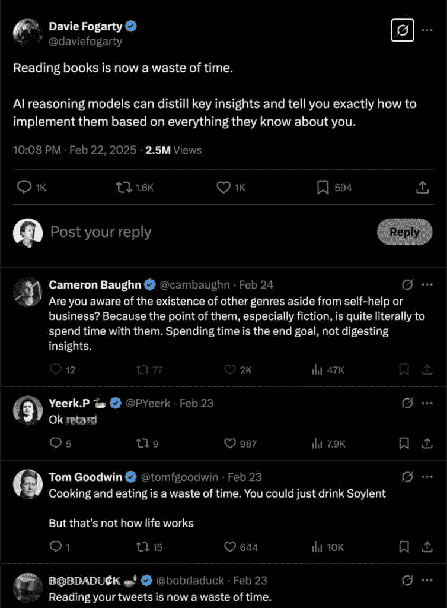
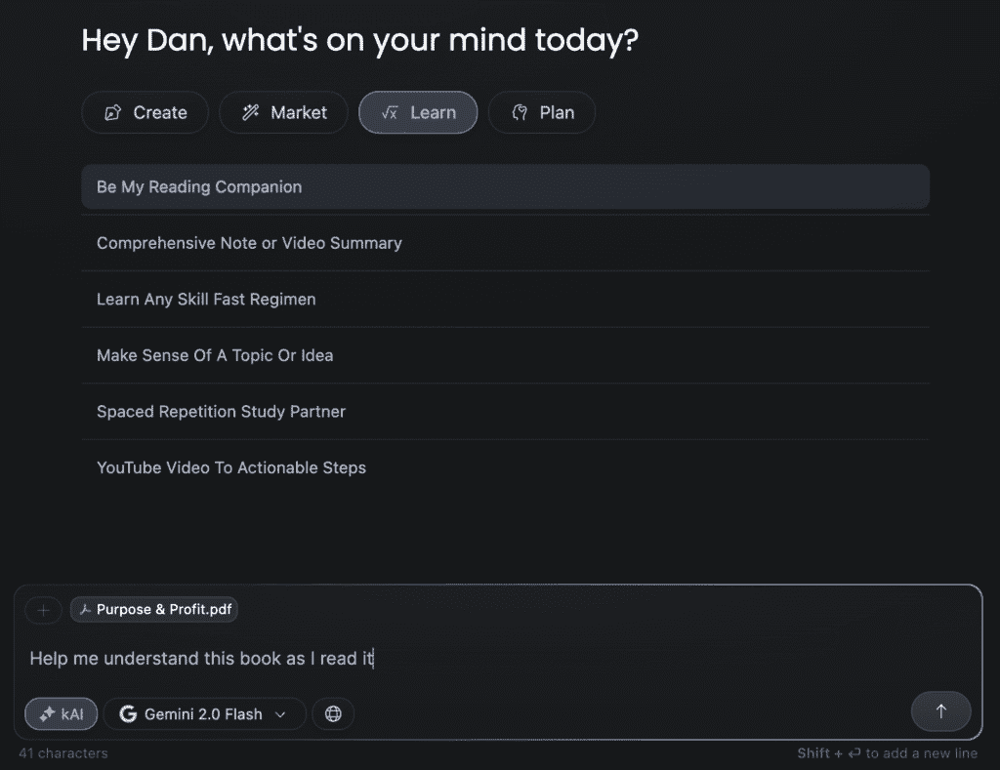
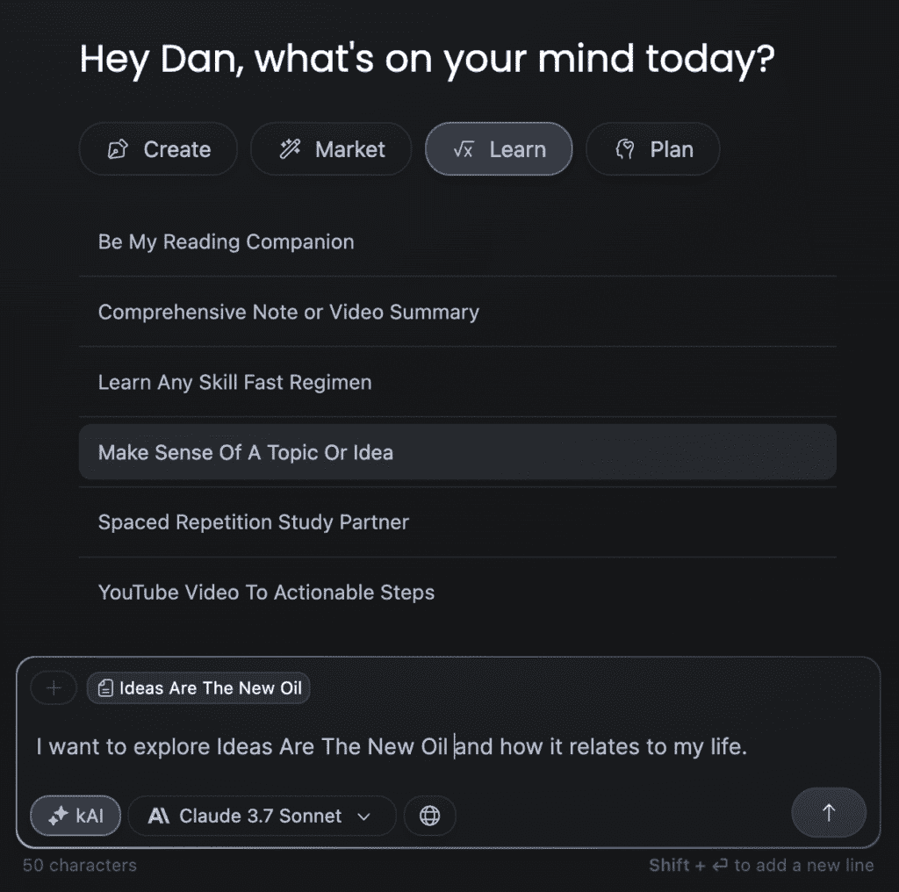
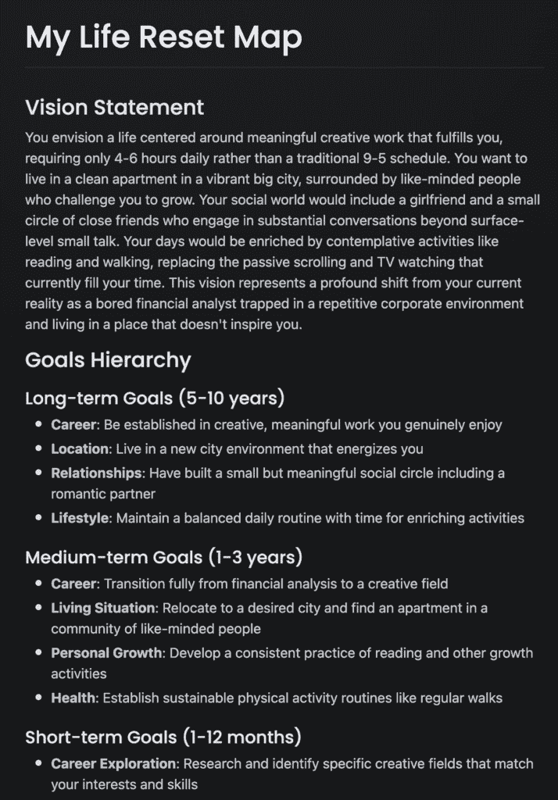

# 如何利用AI记住你阅读的一切：阅读的真正价值与AI的角色

在本节课中，我们将要学习阅读的真正目的，以及人工智能（AI）如何帮助我们进行深度阅读，而非简单地替代它。

起初，我感到很生气。
现在，我只是为这个人感到难过。

他所说的背后有一些真理，但这主要是因为大多数人不知道如何阅读。
这不是因为他们不识字，而是因为他们在一个旨在培养顺从公民和工人的普鲁士教育体系中学会了阅读。
这个体系专注于强制出勤、教师培训、国家课程和考试、按年龄划分学生以及学级概念。

对大多数人来说，阅读是一种*表演性*行为。
他们阅读是为了找到“测试”中的特定信息，无论是学校的测试还是生活的测试。
他们阅读是为了向他人展示成就。
他们避免阅读难懂的书，因为他们认为不理解就没有意义。

但事情是这样的。
你阅读不是为了找到特定的答案。
如果你需要弄清楚如何做某事，直接使用谷歌、Reddit或AI会更高效。
如果你试图对事物有一个全面的了解，书籍是有用的，但智能和有计划的调查可能更好。

但这并不意味着阅读无关紧要。
事实上，如果你想成为一个更有效率的人、拥有自己的企业或保持良好的健康，这需要行为改变和大脑的根本重组——而这并不来自寻找特定的信息。
大多数人都错过了阅读带来的众多改变生活的益处。

## 为什么聪明人喜欢阅读

是的，AI让你几乎可以访问世界上几乎所有的*已知*信息。
我们从AI的兴起中学到的是，即使人们可以访问任何答案，他们的生活也不会发生太大改变。
大多数人仍然在做他们一直做的事情。

> 这从来不是关于你知道多少。这始终是关于你知道你不知道多少。你只能用你有的原料来烹饪。

现在，你*已经可以*找到你需要的信息来赚取数百万美元，塑造一个美观的身体，或者实现其他任何目标。
但即使人们知道该寻找什么，在哪里寻找，以及如何应用信息，他们的生活也不会有太大的改变。
因为这不是一个信息问题，*这是一个身份问题*。

你的身份反映在你的日常选择中。
大多数人并不是出于自己的愿望而做任何事情。
他们被训练去上学，找工作，重复同样的日子，并希望有一天能快乐地退休。
那些是他们的大脑自动试图实现的目标。
他们生活在一种无意识的恐惧中，如果他们不遵守规则，就会被部落排斥。
因此，他们一生都在追求他人的目标。

这很正常，但你之所以读这篇文章，是因为你不想成为他们那样的人。
这就是阅读重要性的所在。

你读书不是为了找到已经可以找到的信息。
你读书是为了探索未知，追求你的好奇心。
你读书是为了发现你之前不知道甚至没有想过要搜索的事情。
你读书是为了扩展你的思想。
*你读书是为了通过接触* **新想法** *来缓慢地重新编程你自己的身份*。

“AI使阅读变得无关紧要”这种说法假设每个人读书是为了想要特定的、已知的信息。
所以，这并不是关于你拥有多少信息。
这也不是关于你如何使用这些信息。
这关乎改变你的思想。
因为你的思想是你与现实互动的方式。
你的思想不会因为几个关键点而改变。
当新的想法填补了缺失的部分，挑战了旧信念，或者给你提供了一个新的角度时，它就会发生变化。

没有哪个人读书能从中得到完全相同的教训。
每个人都有自己的信念、目标、问题、故事和兴趣，这些都塑造了他们如何感知书中的信息。
书籍摘要已经存在了几十年，但它们并没有带来太多好处，因为它们缺少了背景信息。

最后一点：
对可执行步骤和要点总结的迷恋只是廉价多巴胺和分心的另一种表现。
阅读更多书籍。阅读更长的书籍。阅读与你试图实现的事情无关的书籍。
阅读那些人们甚至不会考虑用AI总结的书。
那里就是金子所在。

我和任何人一样喜欢AI及其发展方向，并且每天都在使用它，但如果你不能做AI能做的事情，你将是那个被取代的人。
如果你让AI做你的决定，你就不是高自主性的人。

## 如何使用AI进行深度阅读

> 知识的目的是行动，而不是知识。 —— 亚里士多德

智慧的人以两层阅读：
1.  **消费**——他们吸收信息到几乎令人窒息的程度，并努力理解。
2.  **消化**——他们深入研究，系统地写下他们学到的内容，并通过行动尝试连接这些点。

第一个问题是很少有人阅读。
第二个问题是他们在阅读时记不住任何内容。
第三个问题是人们不喜欢不舒服，所以他们不读难书。
第四个问题是，由于人们不增加他们能理解的知识的复杂性，他们无法承担更具挑战性的情况。

现在，AI不能为你阅读书籍，但它可以在你阅读时帮助你深化理解。
AI不能为你采取行动，但它可以帮助揭露你的限制性信念和盲点。
当大多数人使用AI将内容压缩成可执行步骤时，你将使用AI做相反的事情，这使得它变得更有力量。

### 第一步）消费：将AI作为阅读伙伴使用

大多数人阅读是为了尽可能多地记住内容，因为这就是他们在学校被训练的方式。
但问题是……你阅读不是为了记住书中每一句话。
你通过向构成你思想的观念网络添加几个节点，通过改变你看待世界的方式阅读。

以下是具体步骤：

**1）在Z-library等网站上下载任何PDF。**
你应该为书籍付费，但你需要一个PDF才能用AI参考它。如果你下载PDF，建议购买平装本以支持作者。

**2) 将PDF拖入** [**Kortex**](https://kortex.co) **以添加为来源。**
这会将书籍添加到你的图书馆，这样你就可以随时用AI参考它。
然后，转到聊天 > 成为我的阅读伴侣。

将所有占位符文本替换为“帮助我理解我正在阅读的这本书”并点击发送。
建议使用Gemini 2模型，因为你将需要处理大量的上下文。

**注意**：你不必使用Kortex。你可以将PDF上传到任何允许PDF的AI工具，并在阅读时提问。但Kortex优化了帮助你更深入理解。

当你开始阅读这本书时，你可以把所有的笔记都放在这个聊天中，并在你想深入了解某个概念时随时提问。

现在，关于阅读的一些一般性建议：
*   如果你对此不感兴趣，你可能不会学到任何东西，所以你可以放弃。
*   你不是在比赛看谁先读完这本书，实际上，越慢越好。
*   你可以同时阅读多本书。
*   创建一个阅读仪式。每天至少30分钟。

对于这个阅读消费层，专注于快速阅读全书，在AI聊天中记下你想要深入了解的部分的笔记，并让这些想法在你的脑海中沉淀。
当你的脑海中充满好奇心或兴奋时，这是好的多巴胺告诉你深入探索。
当你感觉到这一点时，回到上面的AI聊天并开始提问。
当你觉得你理解了，就回到阅读。

### 第二步）消化：使用AI进行探索与反思

完全消化一本书的思想需要时间。
一些想法甚至需要好几年才能理解其意义。
大多数人记得他们所读的很少，因为他们看不到它如何应用到他们的生活中。
他们不能*整合*这些课程，因为这些课程没有*反映*在他们的日常行动中。
如果你认为这是你性格中深层次的一部分，你不需要记住这些台词。

因此，对于阅读的消化层，你有几个选择。

**1) 探索一个主题的关联，以锚定你的理解。**
提醒：阅读的目的是通过身份改变来实现行为改变。
当你在脑海中找到导致书籍教训“点击”的关联时，那就是积极行为改变发生的时候。
因此，你可以使用Kortex中的“理解一个主题或想法”工作流程。

这个工作流程的目的是：
*   就你的个人目标、价值观和情况提出一些澄清问题
*   帮助简化概念，以便一个12岁的孩子也能理解它
*   提供具体的方法，将这一课以实际的方式融入你的生活中
*   描述你生活中可能出现的潜在结果和需要注意的障碍

这为学习增加了一个全新的层次。
更进一步，你可以将上一次AI聊天中的回复保存为文档，并在这次新的聊天中引用它，以帮助理解。

**2) 用知识来行动，而不是知识。**
大多数人不需要更多的动力，他们需要更多的清晰度。
你已经有了目标和抱负，但你从未追求过它们，因为A点（你所在的位置）和B点（你想要到达的位置）之间需要一个桥梁。
没有清晰度桥梁，焦虑和不知所措开始渗透进来。

我最终将这个模板变成了一个在[Kortex](https://kortex.co)中的生活重启地图工作流程，它会通过访谈来创建你的愿景、计划和任务。
当你完成那个工作流程后，它将输出你的生活重启地图，你可以将其添加为文档以供日后参考。

从那里，你可以转到“成为我的清晰度教练”工作流程，该工作流程将在你朝着那些目标行动时指出你的胡言乱语。
仅此一项就能帮助你整合你所阅读的大部分内容。
你会惊讶地发现，当你阅读时，你的大脑会自动开始将某些洞察与你的愿景联系起来。

**3) 通过写作综合想法，反思你所学的知识。**
费曼技巧是一种通过教学来深入学习的方法。
简而言之，它通过用简单的术语解释一个概念，就像你正在教一个没有先验知识的人一样，来深入理解一个概念。

以下是费曼技巧的步骤：
*   **选择一个概念** – 选择你想要理解的主题。
*   **教授它** – 用简单的语言解释概念，就像你正在教一个孩子一样。
*   **识别差距** – 当你难以清晰地解释某事时，识别你理解薄弱的领域。
*   **回顾和简化** – 回到原始材料，重新学习概念，然后尝试用更简单的术语再次解释它们。

做这件事最好的方式是写作。
当你在公共场合（即互联网上）教授你所知的内容时，你打开了几个可能性：
1.  你会学得更快，因为你有一个促使你理解的概念。
2.  你吸引了一群具有相似兴趣的人。
3.  你在进入未来可能被取代的工作时建立了优势。

如果你想要开始写作并且让AI引导你，请访问Kortex Chat中的“创建”类别，并从任何后写作、线程写作或通讯写作流程中选择。
对于你正在学习的特定主题，建议使用*YouTube、通讯或文章草稿*工作流程。
当它提出主题想法时，忽略它们，并要求它从之前的步骤中继续你正在学习的主题。
然后，当它给你一个大纲时，尝试仅凭这个大纲写出完整的通讯或文章。
这是你使用AI帮助你学习的机会。

当你在写作上遇到困难时，你总是可以请AI教你如何最好地写那部分。
尝试一下。
看看你能走多远。
认识到没有创造的消费并不能带来真正的学习，而且几乎没有任何理由在没有创造的情况下进行消费，因为那正是你最初消费的全部原因。

希望这对你有所帮助。
感谢您的阅读。
– 丹

---

**本节课总结**
在本节课中，我们一起学习了阅读的真正目的不是获取已知信息，而是通过接触新想法来重塑身份和思维方式。我们探讨了AI在阅读中的正确角色：不是替代阅读或进行简单总结，而是作为深度理解和知识整合的伙伴。具体步骤包括：在消费阶段，使用AI作为阅读伙伴来提问和深化理解；在消化阶段，利用AI探索概念关联、制定清晰行动计划，并通过写作（如应用费曼技巧）来综合与反思所学。关键在于将阅读、思考与行动相结合，让知识真正内化并改变行为。