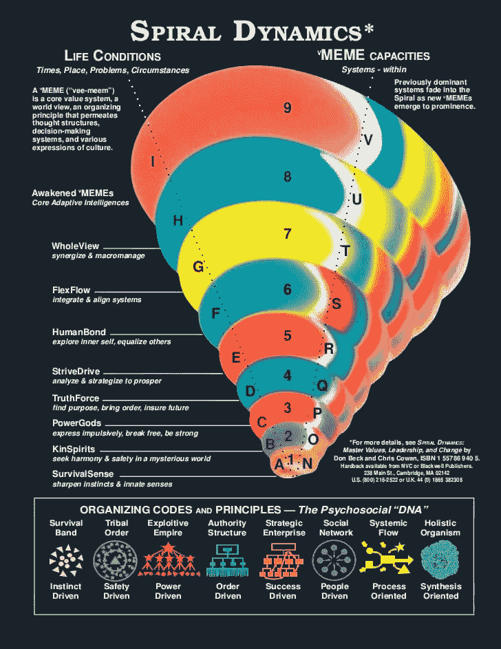
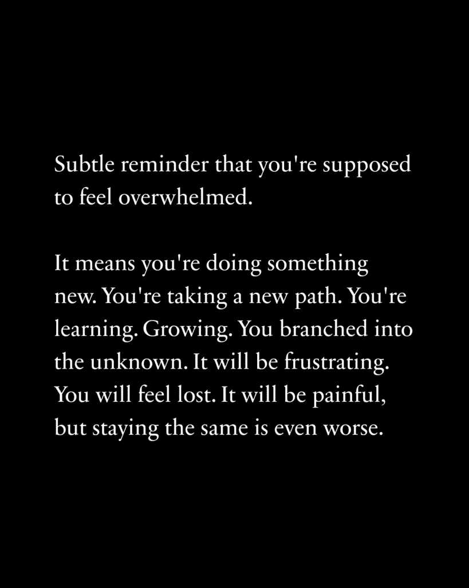
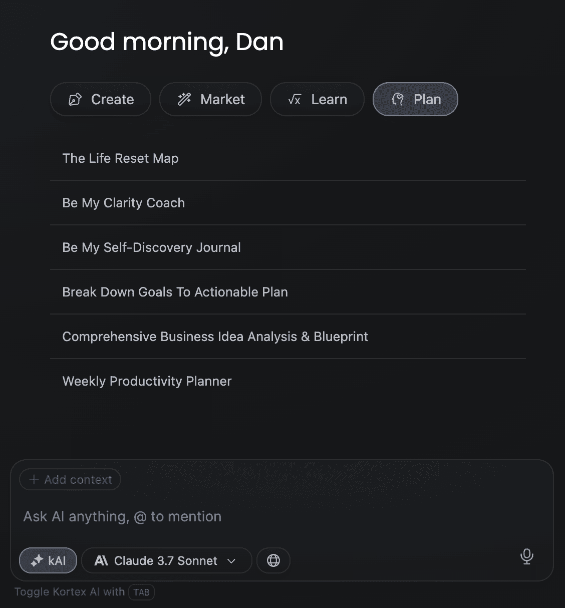

# 基于证据的生活优化指南：如何系统性地改善你的生活

## 📖 概述

在本教程中，我们将学习一个基于发展心理学的系统性框架，帮助你理解当前的生活状态，并找到实现持久、积极改变的具体路径。我们将探讨“螺旋动力学”理论，识别你当前所处的思维阶段，并学习如何创造条件，向更高层次、更自由和更成功的生活阶段迈进。

---

## 🧠 改变人类潜能的理论：螺旋动力学

上一节我们概述了本教程的目标。本节中，我们来看看支撑整个方法的心理学理论。

我们讨论的心理学突破被称为“存在层次”理论。
它由克莱尔·W·格雷夫斯博士开发，后来影响了其他理论。
简而言之，它表明人类价值观体系或世界观通过上升螺旋的阶段不断发展。
这些阶段构成了我们思考的结构。
我们每个人在成长和发展的过程中，随着年龄的增长都会沿着螺旋上升。
但这不仅仅适用于个人，它也适用于整个社会。

我的目标是通过本教程，给你提供工具来识别你目前的位置，并超越到新的阶段，让你能够从新的视角看待你的生活。

### 第一级阶段（第一级思考者）

第一级代表了“旧范式”的思考方式。
这些阶段主要受生存本能驱动，并由匮乏需求所激发。
每个阶段都相信他们的世界观是“正确”或“唯一”的思考方式。
最后，这些阶段往往对生活**做出反应**。他们按照自己的编程生活，并以可预测的方式对情况做出反应。

当然，这些阶段都不是坏的。
每个人在生活的某个领域都会经历这些阶段。
但是，如果你陷入了一个不太理想的阶段，这在第一级阶段是非常可能发生的，事情可能会变得非常糟糕。

以下是第一级的具体阶段：

**阶段 1) 米色 – 生存感**
米色思考者专注于满足基本的生存需求。
在当今世界，这种情况越来越少见，人们通常在童年早期就离开这个阶段。

**阶段 2) 紫色 – 社区安全**
大约 10%的人口处于紫色阶段，这主要属于部落社会和宗族。
我假设你们大多数人都不生活在这些条件下，所以我们不会深入探讨。

**阶段 3) 红色 – 权力与行动**
虽然这个阶段主要是由发展中国家和帮派领土组成，但教义很重要。
这些阶段的问题在于，虽然它们可能是你的“基准”世界观或思考方式，但你实际上从未真正“离开”过任何给定的阶段。你超越了它们，并包含了它们的特性。
你实际上从未真正处于**一个**阶段。

**阶段 4) 蓝色 – 秩序与目的**
今天的世界大部分都处于蓝色阶段。
蓝色思维者重视结构、规则、明确的目的和稳定性，通常由外部来源赋予他们。
在工作和职业领域，蓝色价值观稳定的工作和清晰的等级制度。他们遵循公司政策以避免风险。他们想要确定性。

**阶段 5) 橙色 – 成就与成功**
当大多数人处于蓝色阶段时，我会说阅读本教程的大多数人处于橙色阶段。
橙色思维者重视个人成就、理性和个人成功。
他们是目标设定者、自我帮助者和那些不惜一切代价获胜的人。
在工作和职业方面，人们往往会陷入两个阵营：追求自己的副业或创业项目，或者攀登企业阶梯。

**阶段 6) 绿色 – 社区与和谐**
绿色价值观连接、共识和意义。他们通常是进步的、后现代的，并专注于普遍的爱。
主要问题是绿色可能会陷入肯·威尔伯所说的“无观点的疯狂”。
从本质上讲，当个人或社会认识到多种观点的有效性，但随后陷入相对主义的陷阱，无法或不愿意整合这些观点或在他们之间做出价值判断时，就会发生无观点的疯狂。

### 第二级阶段（第二级思想家）

第一级和第二级之间的关键转变是，第一级阶段认为他们已经到达了正确的世界观，并试图将其强加于人。
然而，第二级阶段认识到每个阶段都是人类发展的必要且宝贵的部分，每个阶段都有其对应于其生活条件的适当反应。

格雷夫斯和贝克认为从第一级到第二级的转变是意识上的一个重大飞跃。这是从生存价值到“存在价值”的飞跃。

**阶段 7) 黄色 – 整合灵活性**
黄色思想家重视系统思维和根据情境调整解决方案。
他们理解情境的内容高度依赖于上下文。
这个阶段可以结合来自各个视角的多种方法。
在灵性和政治中，他们是整合的。他们超越群体界限，从每个视角中提取真理。

**阶段 8) 天蓝色 – 整体流动**
天蓝色思想家重视全球意识、整体观点和相互关联的系统。
他们以三重底线——人、地球和利润——建立企业。
在精神领域，这正是意识工作、统一和盖亚理论生根发芽的地方。

所有这些阶段都遵循一个普遍趋势：
随着每个阶段的提升，我们关注的圈子从以自我为中心扩展到宇宙为中心。
最后，这些阶段以螺旋状上升，因此得名。

### 知识病毒的重要性

知识病毒就像基因，但针对的是意识或心灵。
知识病毒是文化传播的单位，从一个人传播到另一个人。
知识病毒之所以迷人，是因为它们揭示了一个其他生物所不具备的独特特征：
虽然动物和人类都在物理层面上试图生存和繁殖，但人类也试图在概念层面上生存和繁殖。

你现在所生活的世界背后的隐藏过程要归功于一件小事：自我。
在螺旋动力学中，之前展示的阶段被称为 vMEMEs（价值观系统模因）。
模因作为一个整体，代表了为什么某些想法与我们产生共鸣或不产生共鸣。
您的价值观——信仰、标准、参考点或其他身份元素——塑造了您认为重要的事物以及值得注意的事物。

螺旋动力学的阶段之所以重要，就是这个原因。
您所处的阶段决定了您在现实中注意到的许多事物以及您所拥有的机会。
而且您达到的层次越高，您就越能挖掘到下面的层次，这意味着您既有能力也有智慧来发现各种成功版本的机会。

那么，问题来了，我如何超越让我感到被困的阶段，继续向上发展？
好消息：您正处于改变的最佳位置。

---

## 🛠️ 如何应用理论：让你的生活不再糟糕

上一节我们详细介绍了螺旋动力学的各个阶段。本节中，我们来看看如何将这些理论应用于你的实际生活，启动改变的过程。

首先，我们需要理解*变化的顺序*。
当您从一个阶段过渡到另一个阶段时，可以预见的 4 个“阶段”如下：

以下是变化的四个阶段：
*   **Alpha** – 生活美好且正常。有秩序。
*   **贝塔** – 当您进入新阶段时，会产生怀疑。重复做同样的事情只会使情况变得更糟。
*   **伽玛** – 您感到迷茫。事物混乱且动荡。这就是您可能会陷入困境并感觉无处可去的地方。
*   **Delta** – 事物充满活力。您会迅速取得进步并达到新的基准。这是您学习最多和*感受到*成长的地方。

您可能之前已经经历过这个序列，但没有意识到它。

现在，这些都很好，但你怎么才能实际上为自己达到新的发展阶段做好准备呢？
我们关注肯·威尔伯的*醒来，清理，成长*框架中的人类发展“成长”部分。
*   **醒来**意味着超越自我意识认识到你的真实本性。
*   **清理**意味着通过阴影工作进行心理治疗。
*   **成长**意味着认知、道德和视角的发展。

我们将在其他教程中保存醒来和清理，但在成长方面，以下是新阶段发展的条件：

### 0) 使用 AI 作为教练导航变化

令人难以置信的是，AI 可以根据你的特定需求定制方法。
我不能给你提供达到下一个阶段的超实用步骤，因为这需要一本书来详细说明每个阶段的潜在策略。

我希望你要这样做：

**1 – 运行生活重置地图工作流程**
你可以在相关 AI 工具的聊天或计划功能中找到这个。
一旦你完成面试问题，它将输出一个包含你的生活愿景、目标、自我教育计划和潜在技能获取的全面蓝图。
你可以使用 AI 消息底部的“创建新文档”按钮保存这个输出。

**2 – 在螺旋动力学上训练 AI，并请求它帮助你进入下一个阶段。**
这里是一份你可以复制并使用的螺旋动力学笔记文档，其中包含了如何使用 AI 的说明，包括提示词。
你将连接之前的生活重置地图作为背景，结合螺旋动力学笔记，并请求 AI 帮助你确定你目前处于哪个阶段。
在与 AI 聊天结束后，请让它总结整个聊天，并将它保存为文档。

**3 — 使用成为我的清晰度教练工作流程来帮助你当你陷入困境时**
现在，你可以去相关 AI 工具的清晰度教练工作流程，将那些文档作为上下文附加，并询问它你应该开始做什么。
如果你完成它给出的挑战并继续提问，你会走得很远。

在进行时，以下是一些需要记住的条件：

### 1) 改变的潜力

如果你想要达到下一个阶段，改变必须是可能的。
你需要技能获取、资源或环境，这让你看到改变的可能性。
为了在垂直方向上提升，一个人必须在当前阶段获得足够的知识、技能和经验。你不可能在不充分发展当前阶段的情况下跳过阶段。
这需要你在生活中目前所做的事情上进行教育、实践、追求目标，并*改进*。

### 2) 解决未解决的问题

每个阶段都带来一组独特的问题。
我个人喜欢将自我发展视为一个无休止的问题系列，一旦解决，其意义和复杂性就会增加。
由于你们中的大多数人都处于蓝色到绿色的阶段，并且我们专注于我们的个人生活，这些几乎总是涉及三大要素：

以下是三个核心生活领域：
*   **工作**
*   **健康**
*   **人际关系**

所有这些因素都是相互交织的，并且极大地相互影响。
所有这些在你生活中循环的问题都有解决方案。
识别这些问题、自我教育并尝试解决方案，直到你找到有效的解决方案，这是你的工作。这也增加了你改变的可能性。

### 3) 在当前世界观中感受到的不和谐

这是我最喜欢的一个，因为我们在这个领域看到它很多。
一个典型的例子是有人觉得自己必须一直忙碌才能感到理智。
对于许多从蓝色阶段进步到橙色阶段的孩子们来说，他们感觉他们从小被培养的信仰已经不再与他们产生共鸣。它不能充分回答他们的问题，并产生一种不满感，激发他们学习的好奇心。

### 4) 洞察点和对其他方法的意识

经过一段时间与这种不和谐相处并开放接受其他方法后，他们会达到洞察的临界点，此时一切同时冲击他们的心理。
对于生产力狂热者来说，他们意识到休息可以提高他们输出的质量。
好奇的孩子会找到一个新的信仰体系去深入研究和认同。

### 5) 消除、绕过、中和或重新构建障碍

一旦你在两个对立的极端之间被拉扯，你将在路上遇到障碍。
如果你是一个有抱负的作家，你可能会陷入完美主义的陷阱。
针对这一具体障碍，你需要重新构建你对完美主义的看法。你需要意识到，唯一变得更好的方式是从你感到尴尬的事情开始。

### 6) 预期混乱的时期和漫长的学习曲线

所有这些都悬而未决，因为没有人能告诉你该怎么做，他们只能告诉你他们是如何做到的，而这忽略了许多个人因素。
目前，教育的目的是意识。
我可以给你举例和过程，但如果你没有理解你所在的位置和你是谁的能力，这些对你帮助不大。
路线将会令人困惑。
它现在还不应该有意义。
当你做新的事情时，你不应该有任何其他的感觉，除了迷失，因为你正挣扎在海洋的中间，直到你学会游泳。

---

## ✅ 总结

在本教程中，我们一起学习了如何系统性地改善生活。
我们首先介绍了“螺旋动力学”理论，它将人类思维的发展分为多个可预测的阶段，从受生存驱动的第一级（米色、紫色、红色、蓝色、橙色、绿色）到更具整合性与存在性的第二级（黄色、天蓝色）。
接着，我们探讨了从一个阶段过渡到下一个阶段所经历的四个变化阶段：Alpha（稳定）、Beta（怀疑）、Gamma（混乱）和 Delta（突破）。
最后，我们提供了具体的行动步骤，包括利用 AI 工具进行自我评估和规划，并阐述了实现阶段跃迁所需的六个核心条件：改变的潜力、解决未解决的问题、感受到不和谐、达到洞察点、克服障碍以及预期并接纳学习过程中的混乱。

理解你所在的阶段并主动创造向上发展的条件，是解锁更自由、更成功生活的关键。现在，你拥有了一个框架和工具，可以开始导航你的成长之旅。