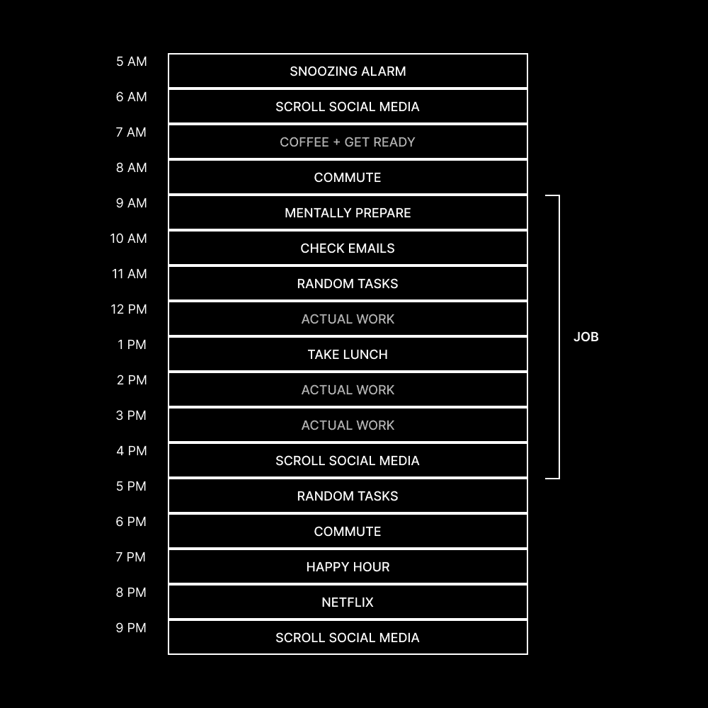

# 生产力哲学：80小时神话与忙碌成瘾

在本节课中，我们将探讨一个普遍存在的文化现象——“忙碌成瘾”，并拆解“每周工作80小时”这一神话。我们将分析为何长时间工作往往效率低下，并学习如何通过更聪明而非更努力地工作，来提升生活质量与产出成果。

## 概述：忙碌文化的陷阱

从记事起，我就不想把全部生活都花在工作上。我观察到许多反面典型。我从小就对此保持警觉。我不想凌晨4点起床，5点开车上班，辛苦劳作一整天，晚上7点回到家，却因为支撑家庭而精疲力尽，结果可能还要面对家庭矛盾。仅仅想象这个场景，就足以唤起许多负面的童年情绪。

因此，我拒绝走上那条路。

## 我的个人路径：追求效率而非时长

我没有每天12-16小时去“拼命”让副业成功。如果诚实地安排时间优先级，我每天只有1到4小时可用。

以下是我在不同阶段采取的策略：

*   **青少年时期**：我痴迷于寻找用最少工作赚取最多钱的方法。
*   **大学时期**：我上课并做兼职。每天会花2-3小时建立副业项目，通过Udemy课程或YouTube学习。
*   **第一份全职工作**：我会在1小时的通勤路上学习，并利用工作间隙的一两小时来发展当时的副业。

我想表达的是：成功并不必然与工作时长挂钩。

## 对“拼命”文化的反思

有一件事会让我真正感到愤怒。几天前，有人在X上评论我关于“如何休息以做到最好工作”的观点，他们说：“你说得容易，但初学者的情况并非如此。”

人们经常这样说，即使在我教授写作时也是如此，仿佛我没有传授我作为初学者时所做的事情。我之所以感到沮丧，是因为年轻人已被训练成将“拼命”无意识地视为一种伪装成有效成功策略的地位象征。

我的目的是拆解这种导致95%初学者和整体企业失败的愚蠢思维方式。“拼命”既不是智慧也不是策略，它是一种缺陷。

我曾每天只在副业上工作1-4小时，目标就是离开我的全职工作。当我开始全职经营自己的事业时，我工作的时间几乎一样多。如今，在写了两本书、创建了近10个产品、运营一家软件初创公司并建立了一个相当大的受众群体后，我相当确信：大多数人要么在浪费时间，要么就是不知道自己不知道什么。

如果你每天工作超过12小时，尤其是作为初学者，我敢保证存在一种方法，可以让你用少于4小时的工作获得更多成果。事实上，我认为如果你工作超过4小时，你至少在某些事情上做错了，并且有改进的空间。

你可以放弃无效的事情。你可以用AI加速繁琐工作。你可以发现自己的优势并专注于高杠杆环节。但你可能不愿承认这一点，因为你不想适应这个赞美忙碌的世界。

如果你理解**休闲**与**利用**，你的生产力、思维和生活方式将发生转变。

## 何时长时间工作才有意义

上一节我们批判了盲目追求长时间工作，本节中我们来看看，长时间工作在什么情况下才有其合理性。

我并非要说服你工作少于4小时是唯一正确的方法。这只是一种方法。人的一生不会只走一条路。

**生产力具有季节性**。

*   在一个季节，你可能只工作4小时。
*   在另一个季节，你可能工作16小时。
*   有时是6小时、2小时、8小时或10小时，因为投入与产出往往不是线性关系。

我也有过不少不得不长时间工作的时期，并且我很享受。但系统（尤其是生产力系统）不会永远保持单一状态。它们会进化、适应，也可能迅速崩溃。

我写这篇文章的目的，是要证明持续的16小时努力并不能让你达到想象中的高度。持续的12-16小时工作日不是个性特征，而是重大功能障碍和普遍忽视大脑结构的迹象。

## 80小时神话——为何我们沉迷于忙碌

> 创作者的悖论：创造力是试图不创造的结果。

人类是模仿性生物。我们通过模仿来生存，避免被排斥。我们的大脑会适应那些让我们融入环境的事物。

问题始于每个人都赞美“**可见的极端**”。我们发现那些年轻创业者“拼命工作”三周就建立百万美元业务的故事很励志。这感觉很有共鸣：任何人都能做到，对吧？我工作得越久越努力，就越可能得到想要的，对吧？这只是因为努力工作，对吧？

**错误**。

我们都知道，有一个更深的公式在起作用。我们都知道，那些由无意识能力激发的精彩片段并不代表现实。我们都知道，你可以花10,000小时写10本书，但它们可能永远超不过50个读者。而有些人懂得如何推广质量不佳的书籍，却能卖出数百万份。

大多数人忽略了背景。他们忽略了实际上导致大多数创意人士、思想家和策略家成功的关键因素——**“无形的极端”**。

以查尔斯·达尔文为例。这位一生写了19本书、发现进化论、改变了世界的人，每天只工作4-5小时，随后会进行大量长时间散步、阅读和其他休闲活动。这些活动用想法滋养了他的大脑。

你和他之间的区别在于，这是他一生的作品。时间长短并不重要。对你而言，这似乎是生死攸关：要么在6个月内成功，要么放弃。这种持续的压力和生存状态无助于成功。

当我们审视成功人士的生活方式以及人脑和心理事实时，就能揭示一些真相。

首先，我们钦佩的大多数创意人士都有非常相似的日常习惯：他们有强烈的专注工作阶段，随后是彻底的休息和脱离工作。

以传奇广告商大卫·奥格威为例，他相信进行深入研究，写下所有可能的东西，然后离开，让潜意识处理问题。

> 伟大的想法来自潜意识。这在艺术、科学和广告中都是如此。但你的潜意识必须充分了解信息，否则你的想法将变得无关紧要。用信息填满你的意识思维，然后让你的理性思维过程脱钩。——奥格威

伟大思想家的长时间散步、阅读和休闲时间，正是为了激活大脑中的**默认模式网络**。当你停止专注于工作时，你的潜意识会继续以更富创造性和有效的方式为你工作，通常会将想法呈现给你的意识。

> 其他科学家发现，DMN（默认模式网络）的复杂性塑造了我们的自我意识、记忆、想象未来的能力、同理心和道德判断能力……DMN越发达，你构建他人心理模型的能力就越强。——《休息》，亚历克斯·庞

换句话说，**你做的最有效和能产生结果的工作，是在你根本不工作的时候**。这对那些身份与“忙碌生活”紧密相连的人来说，是一剂苦药。

当你专注于一系列任务时，你的思维会像电子游戏中的任务一样集中。你受限于大脑中已有的想法，不会试图提出**新**想法。大多数伟大的想法都来自信息丰富的自我反思。

## 拖延的力量——非懒惰，而是天性

> 我和你都不像牛。我们不是用来整天吃草的。我们是用来像狮子一样狩猎的……作为一个智力运动员，你希望像运动员一样发挥作用。这意味着你努力训练，然后冲刺，然后休息，然后重新评估。——纳瓦尔

大多数人将自身与“忙碌生活”绑定的潜在恐惧和欲望包括：

*   浪漫化漫长而艰难的道路。
*   有潜在创伤，想向不在乎的人证明自己。
*   在节俭家庭长大，因内心深处害怕赚钱而推迟成功。
*   认为自己还不配拥有杠杆，所以事必躬亲或试图一次性做所有事。

事实是，寻找并利用捷径已不再被接受。当你停止大量工作并感到无聊时，会觉得在落后。但对古希腊人而言，休闲是文明生活的顶峰。工作是必要的，但次于休闲。

我最近重新发现了这一点。作为“创业创始人”，我觉得需要整天忙碌才能跟上AI竞赛。两个月后，我的写作开始受影响，思维不再清晰。我回想起以前长距离散步时，大脑因连接不同世界观而发光的状态。我错过了这一点。

于是，我开始**有意地**在一天中更多地休息，即使有强烈的冲动也要强迫自己不工作。最初感觉不对劲，像在落后。但我的大脑慢慢地、然后突然地感谢了我。我的创造力以惊人的速度回归，思维重新变得清晰。

## 像狮子一样工作，而非像牛

工作有两种方法。

第一种，像在田野上吃草的牛：
*   每天持续长时间工作。
*   产出稳定且可预测。
*   以线性方式用时间换金钱。
*   不论精力如何都定期出现。
*   往往导致过度劳累和收益递减。

第二种，像狮子一样工作（我们在心理上更接近猎人）：
*   短暂、高能量、高度专注的工作爆发。
*   狩猎之间有长时间的休息和恢复。
*   根据精力和创造力周期工作。
*   优先考虑影响力而非记录的小时数。
*   寻求结果不与**时间**直接挂钩的杠杆。

根据今天的标准，狮子看起来像个巨大的拖延者。但如果你擅长回复短信或倾向于把工作拖到最后一刻，这不是性格缺陷。你需要明白：**强度比持续时间更重要，休息是最具生产力的工作形式，结果比小时数更重要**。

但这里有几个关键点：
1.  利用给你带来不对称优势的独特优势。
2.  选择能让你将生活方式放在首位的工作。

这样，你可以根据能量周期工作，并有意识地选择做什么。有些创意人士喜欢熬夜，有些喜欢早晨。如果有人告诉你必须做什么而你无法改变，那么你的首要任务必须是离开那份工作。

## 如何少工作、多赚钱、享受生活

要像狮子一样工作，你需要清晰的目标。

让我们提出 **Koe法则**：**如果你需要强迫自己工作，那么你正在做的事情就是错误的。**

如果你对能让你更接近愿景的想法、项目或策略有绝对的清晰度，你就不需要自律。你会无法停止工作，进入心流状态，并高质量地迅速完成工作。这就是我大多数最佳项目完成的方式。

为了减少工作量，需要满足以下条件：
1.  你必须定义并遵守你的理想生活方式。
2.  你的独特优势必须与基于杠杆的游戏相匹配。
3.  你需要意识到拥有的工具和技术，以便以更少的时间做更多的事。

### 1) 理想生活方式决定焦点

创造理想生活的最佳方式是现在就开始以小规模实践。如果你想成为作家但还没开始写，你永远不会成为作家。如果你现在开始写，即使只有30分钟，也可以逐渐增加时间。

要减少工作量，**你必须用理想生活方式过滤每一个决定**。“理想生活方式”不是静态目标，而是一幅不断演变的画卷。

设定**反目标**非常有用：为了实现成功，你不愿意放弃什么？健康？与重要的人共度的时间？智力发展？社交生活？

许多人认为这是限制，实则是一种极大的自由，因为创造力在限制中蓬勃发展。当不能无限延长工作时间时，你被迫充分利用拥有的时间，这通常会导致更专注和更好的结果。

### 2) 无需许可的杠杆

我们错过了一个关键点：机械工作与创造性工作的区别。机械工作可以每天做16小时，因为它不需要太多脑力。但杠杆的来源不在这里。

有三种形式的杠杆，效率由低到高：
1.  **劳动力杠杆** – 增加你在任务上的时间或外包给他人。（缺点：管理成本和复杂性）
2.  **资本杠杆** – 让你的钱通过投资为你工作。（缺点：需要现有财富）
3.  **无需许可的杠杆** – 现代最强大的形式。（缺点：看似竞争激烈）

我们生活在历史上最“无需许可”的时代。**无需许可的杠杆**形式包括代码、媒体、书籍、播客、推文、邮件通讯、课程等。这些工作的**边际复制成本为零**。

**公式**：`数字产品价值 = 一次构建成本 / 无限分发潜力`

这为什么重要？因为个人从未掌握如此多的权力。一个人可以通过互联网达到全球规模，无需守门人。数字产品不需要**许可**来构建或分发，其时间投资回报率往往是指数级而非线性的。

人们容易混淆：他们认为必须努力创作内容来建立受众。但如果你进行批判性思考，就知道那不正确。只要你有**高质量和持续的内容输出**，就更有可能让作品传播。

我每天写3条推文两年（偶尔有长篇帖子），增长到超过10万粉丝。3条推文不需要“拼命”。数字产品需要一些时间（现在AI可以加速），建立一个登录页需要几小时。一旦建成，你只需要专注于通过内容生成流量。

这条道路对任何人开放。你的任何兴趣或技能都可以转化为能引起共鸣的数字产品和内容。如果你想工作更少，这是建立初始杠杆的最佳入门途径之一。

### 3) 对AI的新视角

我越使用AI，就越意识到我不是在外包思考，而是在**增强**它。当我尝试让AI执行一项任务时，我会接触到清晰和明智的思考。我读得更多，理解得更多，更能揭示自身盲点。

AI正在缩小学习与实践之间的差距。由于AI可以按照指令完成任务，你既是在**完成**任务，又是在**学习**如何更好地在下一次完成。一个经过精炼和重复使用的“提示”反映了你对任务的了解。

以下是我现在使用AI的方式：
*   选择一个任务来完成。
*   找到一个参考（视频、PDF等），让AI将其分解为可复制步骤。
*   将其转化为可重复使用的元提示。
*   在使用过程中不断精炼提示。

例如，我可以将一本关于“心流”的书输入AI，让它帮我生成早晨例行程序、清晰度顾问或个人治疗师等应用。信息不再**静态**，现在可以为你**做事**。

在我看来，AI的目的是让你花更多时间在你喜欢的事情上（你的独特优势），并构建AI工作流程和提示，这样如果你花时间构建一次，就可以永远以高质量完成剩余工作。

### 4) 休闲的类型

我们都明白什么是工作。但休闲常被误解。**休闲是一种心态**。

你可以为了乐趣而写作，但一旦它与强制性结果挂钩，就不再是休闲。你可以带着步数目标散步，但目标是为了让大脑从思考中解脱。你可以读书，但一旦开始分析并试图“得到什么”，它就变成了工作。

对于创造性工作，美妙之处在于休闲往往是工作的**直接燃料**。由于创造性工作很大程度上取决于想法质量，而你最好的想法多不在工作时产生，因此休闲是创造一种工作、休息和玩耍模糊融合的生活的方式。

### 5) 负责任的生活内置截止日期

常见的建议是：在20多岁时尽可能努力工作，放弃大部分生活。但我认为大多数人误解了其含义。这指的是承担更大风险，信任自己，创造自己的道路。这不需要16小时工作日，因为你可以比业务更努力地工作在更多事情上：你的心智、身体、精神也需要发展。

因此，负责任的生活中已经内置了截止日期。如果你真正重视健康、人际关系和全面发展，就无法持续工作16小时。那些这样做的人暴露了他们不重视这些。

如果我重视健康，并知道疲倦会影响健身表现，我就需要为工作设定中午的截止日期。如果我重视伴侣关系，就不能在晚上只想着工作。

这不是降低工作质量，而是升级。为什么？因为截止日期会缩小你的思维，创造紧迫感，成为深度工作的火箭燃料。结合**帕金森定律**（工作会扩展以填满分配的时间），你会对在短时间内能完成多少工作感到震惊。

当然，结果不会立即显现。适应新生活方式需要几周时间。但如果你坚持下去，我保证你的生活将比你想象的改善更多。

## 总结

本节课中，我们一起学习了“80小时神话”的真相，拆解了忙碌成瘾的文化陷阱。我们探讨了像狮子而非像牛一样工作的重要性，理解了休息和潜意识对创造力的关键作用。我们学习了如何通过定义理想生活方式、利用无需许可的杠杆（尤其是数字产品与内容）、以及善用AI工具来减少工作时长、提高产出效率。最后，我们认识到，将健康、人际关系和个人发展置于首位，不仅不会阻碍成功，反而会通过内置的“截止日期”效应，迫使我们更专注、更高效地工作，最终实现少工作、多赚钱、享受生活的平衡状态。