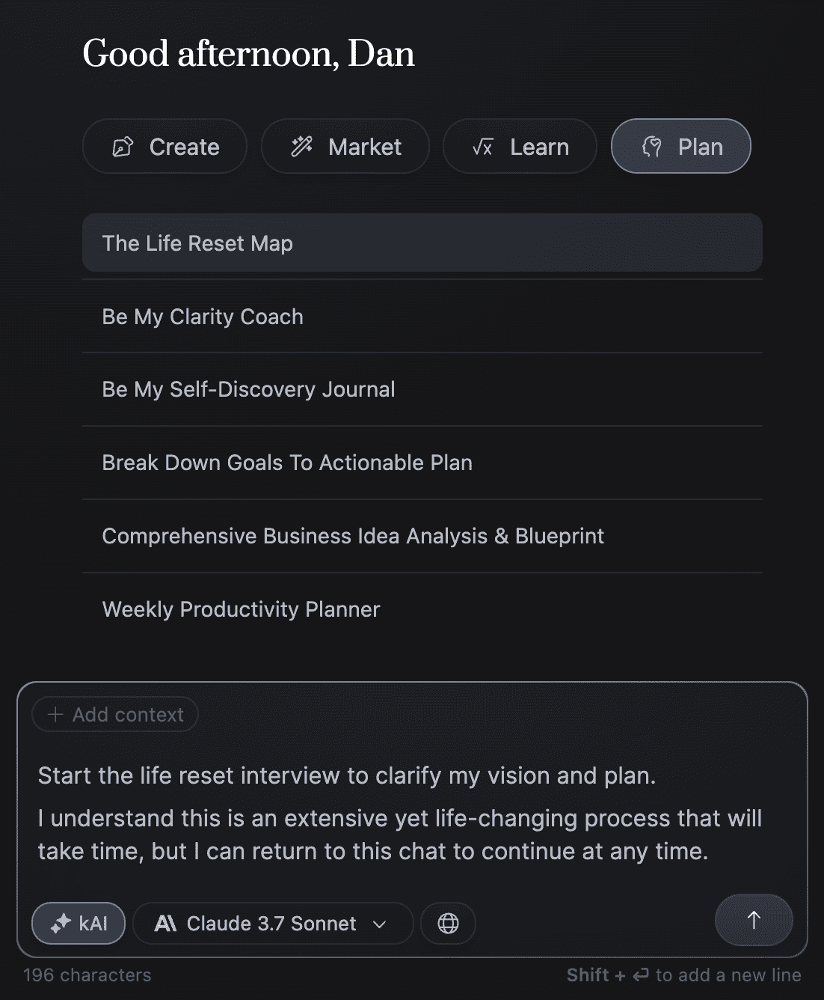

# 深度工作：改变生活的常规 🧠

在本教程中，我们将学习一套能极大提升专注力与生产力的深度工作常规。这套方法的核心在于理解并管理你的注意力，将其视为最宝贵的资源，并像管理计算机内存一样去优化它。我们将从核心概念开始，逐步拆解具体步骤，帮助你建立高效、可持续的深度工作习惯。

## 核心概念：注意力即RAM 💻

你的大脑是一台超级计算机。你的注意力就像是计算机的**RAM（随机存取存储器）**，它决定了系统的性能。

**公式：** 打开的浏览器标签越多 = 系统性能越慢。

这与你的注意力没有区别。人类有意识注意力能处理的信息量约为每秒 **50比特**（相比之下，我们从已习得技能中无意识处理的信息量高达每秒1100万比特）。一生中，你能处理的有意识信息总量约为 **1250亿比特**。

这就是你的定时炸弹。你要么将这1250亿比特投资于构建更好的未来，要么让干扰像未关闭的浏览器标签一样堵塞你的“内存”。

## 当熵值低时，完成最佳工作 ⚖️

上一节我们介绍了注意力的核心概念，本节中我们来看看如何为高效工作创造理想环境。这需要理解“熵”的概念。

熵是衡量系统混乱、无序或随机程度的指标。热力学第二定律指出，在任何自然过程中，除非投入能量来维持秩序，否则总熵（无序度）会随时间增加。

这个原理同样适用于你的大脑，即“心理熵”。如果你不主动清理思维，它就会逐渐被混乱占据，导致效率低下。干扰是熵的起点，因为它们将能量从你的目标上转移开。

以下是识别和纠正干扰的两个关键信号：

1.  **无聊**：源于自我中心。当任务的挑战性低于你的技能水平时，注意力会中断，你会开始想其他“更好”的事情。
2.  **焦虑**：源于自我意识。当任务的挑战性高于你的技能水平时，注意力会转向内心，消极想法开始涌入。

由无聊或焦虑引起的混乱，只能通过**清晰度**来解决。你必须将注意力集中在眼前的任务以及生活的整体理想目标上。

> 如果你不清楚理想的生活是什么，可以尝试使用 [Kortex 中的“生活重置流程图”工作流程](https://kortex.co)。它会通过一系列问题访谈，帮助你输出第一版人生愿景、技能发展树及长短期目标。

## 将工作时段视为游戏任务 🎮

上一节我们了解了心理熵和清晰度的重要性，本节我们将学习如何将工作设计得像游戏一样引人入胜。

电子游戏令人上瘾的原因在于：
*   **清晰的目标层级**：随着挑战升级，需要提升技能。
*   **明确的规则与反馈循环**：让你专注于愉快的进步过程。

你可以将生活视为一场大型游戏，而深度工作时段则是其中带来经验值增长的关键“副本”。具体实施方法如下：

以下是构建高效深度工作时段的具体步骤：

**1. 量化你的2-3个“最重要任务”**
    *   最重要任务是指那些需要最多精神能量、最能推动你向目标迈进的任务。它们与日常维护性工作相反。
    *   **示例**：不要说“写一些通讯稿”，而要说“写1000字”。这创造了可视化的反馈循环。

**2. 设定具有挑战性的截止日期**
    *   我们每天进行深度专注工作的能力是有限的。将首要任务限制在2-3项，迫使你专注于真正重要的事。
    *   为每个任务设置以时间块为形式的截止日期，例如60-90分钟。
    *   在时间块之间安排重要的非工作任务（如吃饭、锻炼），这为你提供了停止工作的合理理由，反而能提升整体专注力。

## 优先考虑精神代谢 🧘

到目前为止，我的深度工作常规流程如下：

*   **从低熵到高熵安排时间块**：利用早晨安静、无干扰的时间进行深度工作。
*   **在2-3个时间块内完成2-3个最重要任务**：利用时间压力迫使自己集中注意力。
*   **深度工作完成后才进行浅层工作**：在深度工作时段结束前，绝不查看邮件、社交媒体等。

那么剩下的时间做什么？把你的大脑想象成身体。深度工作就像在心理健身房进行了极限训练，消耗了大量精力。之后你需要“进食”和恢复。

对于依赖想法和策略质量的工作者（如创作者），大部分“工作”其实在坐下之前就已完成。后半天应专注于**休闲最大化**，为大脑补充营养：
*   摄入优质信息（阅读、学习）。
*   体验新事物（散步、旅行、交谈）。
*   与亲人放松。

这能确保你第二天能以最佳状态重返深度工作。

## 总结 📝

本节课中，我们一起学习了改变生活的深度工作常规。我们认识到注意力是有限的宝贵资源（如同计算机RAM），需要通过管理“心理熵”来维持秩序。通过将工作设计成具有清晰目标和反馈的游戏任务，并量化最重要的2-3件事，我们可以在短时间内实现高效产出。最后，我们理解了“精神代谢”的重要性，即用高质量的休闲和输入来恢复和充实自己，为下一次深度工作蓄力。

记住，在一个AI能做很多事情的时代，你独特的想法、故事和经验综合而成的创造力，才是你最深的护城河。

> **延伸资源**：
> *   [用于规划深度工作的AI提示](https://substack.com/@thedankoe/note/p-163073465)
> *   [加入每周高信号总结邮件列表](https://thedankoe.com/letters)
> *   [免费注册Kortex，获取AI工具与工作流程](https://kortex.co/)