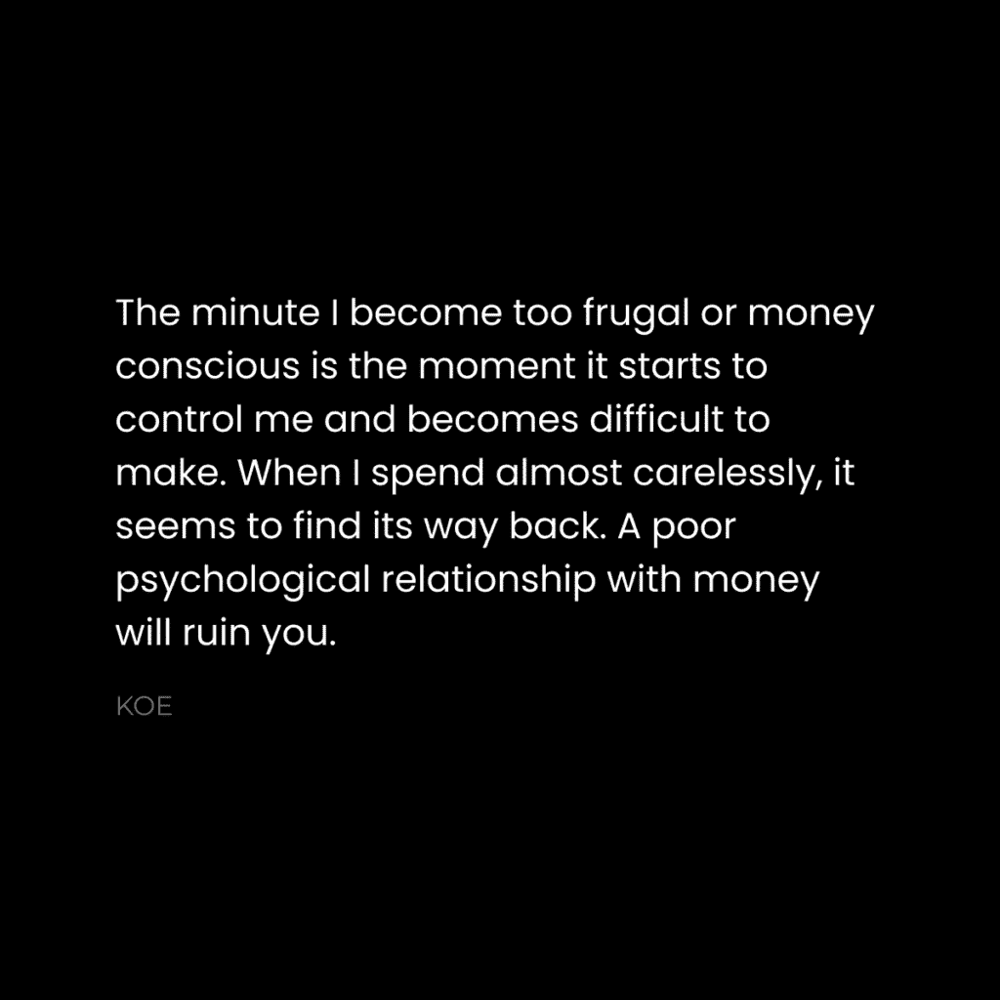
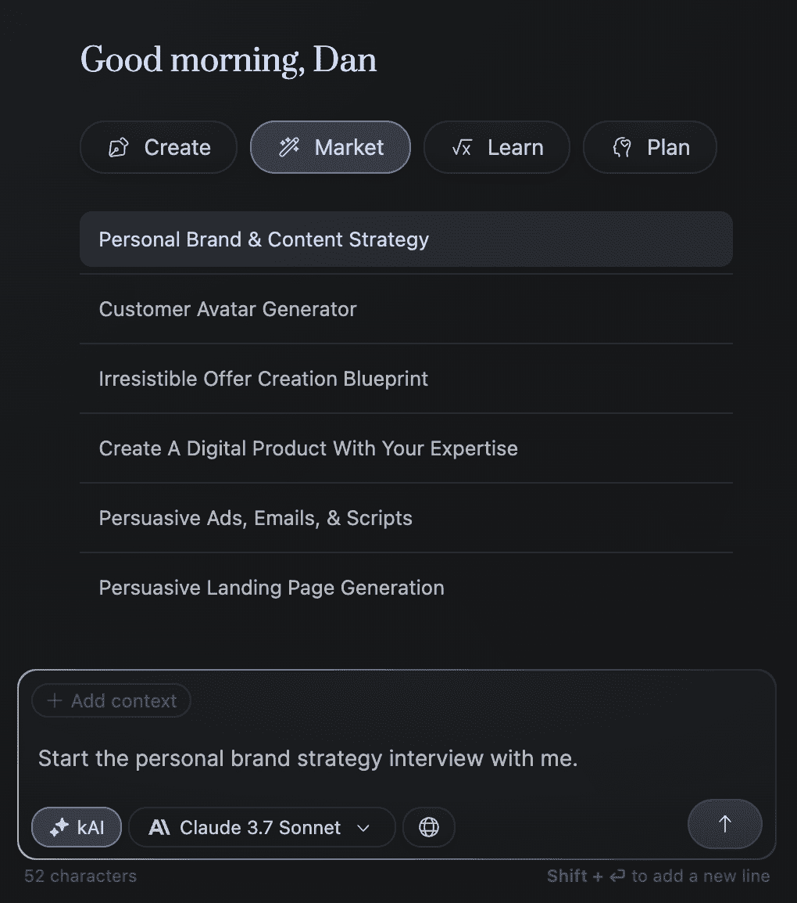

# 个人成长：阻碍理想生活的 7 个心理习惯 🧠

在本节课中，我们将要学习阻碍我们过上理想生活的 7 个常见心理习惯。这些习惯并非外在行为，而是深植于我们思维中的无意识模式。理解并克服它们，是迈向理想生活的关键一步。

## 概述

我们常常感到生活停滞不前，却难以找到原因。问题往往不在于外部环境，而在于我们内心的思维习惯。本节将逐一剖析这 7 个习惯，并提供清晰的行动思路，帮助你重新连接思维，采取有效行动。

## 习惯 1：不够自私 😇

上一节我们介绍了这些习惯的本质是心理模式。本节中我们来看看第一个习惯：不够自私。我们常被教导要先人后己，但这可能导致我们忽视自身需求，最终耗尽自己，无法以最佳状态帮助任何人。这就像飞机上的氧气面罩原则：你必须先确保自己的安全，才能有效帮助他人。

**核心公式**：`个人福祉 > 帮助他人的能力`。只有当你的“电池”充满时，你才能高效输出。

以下是实践“策略性自私”的步骤：

*   **确定不可协商的事项**：列出对你高效运作绝对必要的事情，如锻炼、睡眠、独处时间。视其为必需品，而非奢侈品。
*   **在说“不”时不要道歉**：练习礼貌但坚定地拒绝，无需过度解释。这能帮你筛选出真正关心你福祉的人。
*   **根据资源过滤请求**：在答应前问自己：我是否有精力？这事是否重要？是否需要我牺牲重要事项？我会讨厌做这件事吗？如果答案消极，就拒绝。
*   **当你富足时给予**：先满足自己的核心需求，确保自己处于最佳状态，然后在此基础上有余力地给予他人。

自私与无私是一体两面。优先照顾自己不是缺点，而是你能持续为他人提供价值的前提。

## 习惯 2：总问“我如何开始？” 🤔

我们探讨了优先自我照顾的重要性。接下来，我们面对一个常见的行动障碍：总是询问“我如何开始？”以及“需要多久？”。这些问题背后隐藏的是对失败的恐惧和对确定性的过度追求。

**核心代码**：`开始 = 行动`。没有更复杂的指令。

想象你是世界上第一个做这件事的人。没有教程，没有指南。你只能通过行动、犯错、学习来前进。成功不是一个等待到达的终点，而是一个不断尝试和积累经验的过程。

以下是改变这种思维的方法：

*   **接受过程而非只求结果**：将你的人生追求视为一个成长的过程，而非一个必须达成的目标。即使花费一生，成长本身就有意义。
*   **直接开始行动**：不要等待完美的计划或全部的知识。从你能做的最小一步开始。
*   **拥抱试错**：将早期的尝试视为收集“不可行方案”的数据，而非失败。每一次尝试都让你离成功更近一步。

关键在于，假设你必须自己摸索出路，并对探索过程本身着迷。

## 习惯 3：从不发布 🚫

上一节我们讨论了如何克服开始的恐惧。本节我们来看一个紧随其后的习惯：从不公开发布你的作品或想法。许多人花费大量时间私下准备，追求完美，却从未让作品面对真实世界。

从不发布会导致“进步的隐形性”。你缺乏真实反馈，没有外部责任督促你坚持，也无法让机会找到你。这就像永远在学习理论，却从未开始实践——而实践才是真正学到技能的地方。

**核心概念**：`发布 = 获得反馈 + 创造机会 + 建立责任`。

点击发布按钮。公开你的想法、作品或进展。这是从学习循环进入成长循环的关键一步。如果你不知道发布什么，可以从撰写简短的思考开始，发表在任意平台上。

## 习惯 4：创造人为的复杂性 🌀

我们明白了发布的重要性。但有时，即使我们开始行动，也会陷入另一个陷阱：将事情过度复杂化。我们可能认为成功需要掌握某些不为人知的秘密，从而用复杂的理论和知识来拖延实质性的行动。

简而言之，行动力强的人往往进步更快，不是因为他们更聪明，而是因为他们想得少，做得多。他们专注于持续执行最基本、最有效的原则。

**核心思想**：`成功 = 对基本原理的持续执行`。

你需要识别并剥离自己添加的、用于证明不行动合理性的复杂层。学习基础知识，然后开始行动。从错误中学习，再继续行动。这就是全部蓝图。就像冲浪者，他们通过大量练习和失败，将应对海浪变成第二本能，而非依赖复杂的理论图纸。

## 习惯 5：过于节俭 💸

我们清除了行动中的思维障碍。现在，让我们审视一个与资源密切相关的习惯：对金钱持有过于节俭和限制性的观念。许多人挣扎于金钱问题，但这本质上是一个心理和发展阶段问题。

金钱是一项可以学习和掌握的技能。你对金钱的信念（如“赚钱很难”、“金钱是邪恶的”）会限制你识别和抓住机会的能力。

**核心观点**：`金钱问题 ≈ 心理发展问题`。

你的金钱观随着个人发展阶段而变化：

*   **生存阶段**：关注基本安全。
*   **地位阶段**：寻求认可和价值体现。
*   **创造力阶段**：追求自主性和自我表达。
*   **贡献阶段**：聚焦于帮助他人和创造影响。

意识到自己正处于哪个阶段，并理解前一个阶段的局限性会推动你进入下一阶段，这本身就是治愈“节俭习惯”的开始。将金钱视为一个值得掌握的技能领域去发展和学习。

## 习惯 6：最小化预期的遗憾 😨

我们调整了关于金钱的心态。接下来，我们探讨做决策时的一个常见误区：旨在最小化未来的遗憾，而非最大化潜在的积极成果。例如，你花费大量时间纠结于选择“完美”的平台或商业模式，主要是为了避免选错路带来的后悔。

这种心态导致过早优化和行动瘫痪。你害怕走错路，但事实上，走一些“错路”是找到正确道路的唯一途径。

**核心视角转换**：问自己，你更可能为什么感到遗憾？是为尝试后获得的经验，还是为因害怕犯错而永远停滞不前？

解决方案是转变视角。接受“错误”是学习过程的一部分。专注于能带来实际结果的工作，而不是试图预先避免所有可能的遗憾。通常，你并不需要万事俱备才能开始。

## 习惯 7：保留一个不符合目标身份的自己 🎭

最后，我们来到最根本的一个习惯：你当前的身份与你想成为的人不匹配。你希望生活发生改变，却不愿意改变自己的习惯和生活方式。例如，想减肥却不愿改变饮食，想赚钱却不愿投入时间学习新技能。

问题在于，你当前的生活方式和习惯，恰恰产生了你当前的结果。如果你不改变它们，就无法到达新的目的地。

**核心等式**：`旧习惯 + 旧身份 = 旧结果`。`新习惯 + 新身份 = 新结果`。

你需要有意识地“跳入”一个新的身份。这意味着立即开始践行与你目标一致的新习惯，哪怕最初会感到不适。就像装修房子，过程是混乱的，但结果值得。放弃旧习惯不会让你消亡，反而会为你渴望的新身份铺平道路。

## 总结

本节课中，我们一起学习了阻碍理想生活的 7 个心理习惯：
1.  **不够自私**：未能优先保障自身福祉，导致无法持续输出。
2.  **总问“如何开始”**：陷入对失败和不确定性的恐惧，阻碍了行动。
3.  **从不发布**：追求私下完美，缺乏现实反馈和机会。
4.  **创造人为复杂性**：用过度思考掩盖行动不足。
5.  **过于节俭**：对金钱持有限制性信念，阻碍财富技能发展。
6.  **最小化预期遗憾**：决策时优先避害而非趋利，导致行动瘫痪。
7.  **身份不匹配**：固守旧习惯，未拥抱与新目标相符的新身份。

识别这些习惯是改变的第一步。通过有意识地运用“策略性自私”、直接行动、勇敢发布、简化思维、升级金钱观、拥抱试错以及重塑身份，你可以逐步打破这些模式，朝着理想的生活迈进。改变始于思维，成于行动。