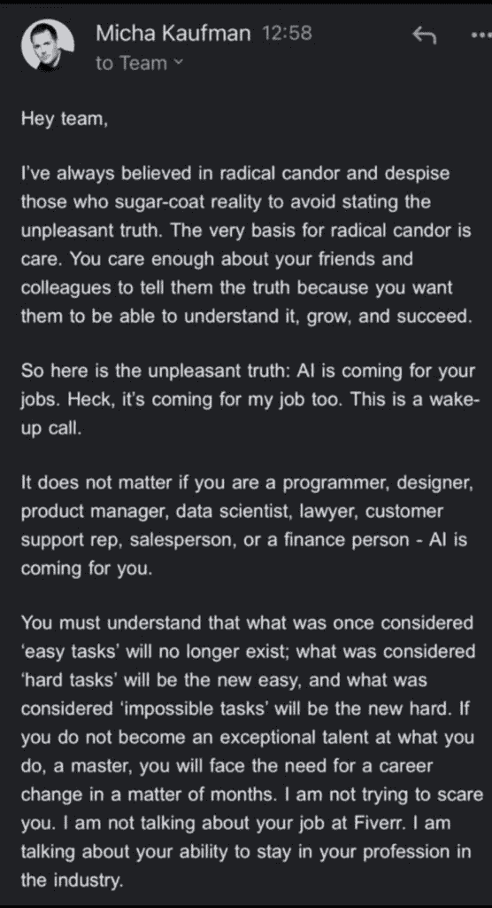
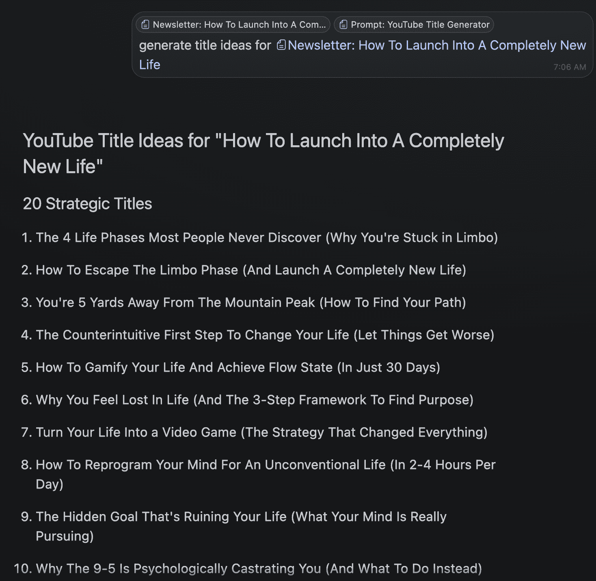
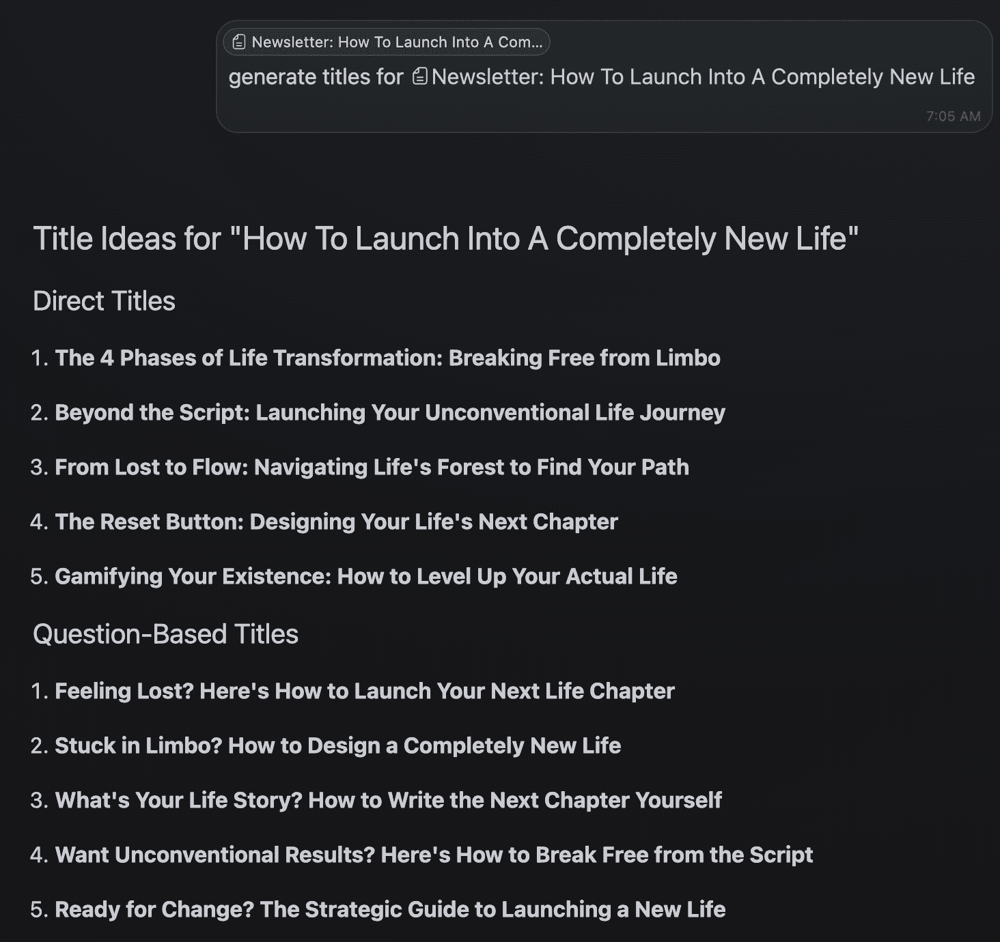

# 人工智能与未来工作：不愉快的真相与应对策略

在本节课中，我们将探讨一个正在发生的现实：人工智能（AI）正在深刻改变就业市场。我们将分析现状，理解其影响，并学习如何通过转变思维和行动，积极适应这场变革，从而在未来保持竞争力。

---

最顶尖的AI模型现在比85%的人类更聪明。到2026年底，它将比99.9%的人类更聪明。你认为你还会有一份工作吗？

上述观点源自David Patterson在社交媒体上的帖子，而Elon Musk对此的回复是：“大致正确”。这引发了一个紧迫的讨论：AI对工作的影响究竟有多大？

上个月，Fiverr的CEO向其团队发送了一封内部邮件，其中透露了几个关键信息：
*   不愉快的真相是，AI正在取代人类的工作，包括他的工作，以及每一个工作。
*   简单的任务将不复存在，困难的任务会变成新的简单任务，而看似不可能的任务则会变成困难任务。
*   面对这个现实，我们需要在短暂的焦虑后振作起来，为不可预测的未来做好准备。

此外，Shopify的CEO、Duolingo公司以及其他许多组织都已公开表示，他们正在采用“AI优先”的战略。已有新闻报道称Duolingo正在用AI替代部分员工。

许多人对此感到恐惧。尽管无法在此详尽阐述所有观点，但本文将分享一些能帮助你立即采取行动、为即将到来的挑战做好准备的想法。

这是人类历史上最激动人心的时期之一。相信在阅读完本文后，你也会认同这一点。

---

上一节我们了解了AI对就业市场的冲击，本节中我们来看看如何主动拥抱AI，成为“AI优先”的个体。

与AI相关的人大致可分为三类：
1.  **浅尝辄止者**：几年前尝试过一次ChatGPT，认为它并不特别。
2.  **基础使用者**：使用AI工具进行网络搜索、内容总结等简单任务，但这些任务没有AI也只需多花几秒钟。
3.  **深度整合者**：充分使用AI，深刻理解其潜力，并在所有可能的地方应用它。

一个关键的理解是：**AI的输出质量取决于使用者的技能和想象力**。如果你给出模糊的指令，AI会给出平庸的结果。但如果你能提供具体、专业的指令，AI就能产出高质量的内容。

例如，一个普通用户可能只会要求AI“为我创建一个YouTube视频脚本”，结果往往流于俗套。而一个深度整合者会提供详细的指令，包括：
*   如何基于特定兴趣和专业知识生成高潜力的视频创意。
*   如何撰写能吸引观众的开场白。
*   如何构建视频主体结构、设定语气风格、指明何处插入B-roll画面或引用等。

通过这种方式，你可以为各类任务（视频、社交媒体帖子、着陆页等）创建可重复使用的**提示词（Prompt）**。这些提示词就像你的“员工”，能在几秒钟内完成原本需要数小时甚至数天的工作。

**公式：高质量输出 ≈ 使用者的专业知识 + 精确的指令（提示词）**

当我们把AI当作思考伙伴时，我们的思维方式也会随之改变。通过不断与AI交互并学习其输出，我们的决策能力会得到提升，而这将累积成生活结果的巨大差异。

### 尝试将自身工作自动化

> 成为AI原生并非仅为用户提供功能。它是一种运营模式，关乎如何管理公司，是你工作、思考乃至公司呼吸的方式。这是一种从“我们如何扩展人类？”到“我们如何通过机器扩展决策、创造力和行动？”的哲学重构。
>
> – Signull

在工业化之前，自由人多是农民和工匠，他们根据兴趣行事。而奴隶则被训练终生从事单一任务。随着机器和AI的出现，我们面临一个问题：这场AI革命是会进一步削弱我们的自主权，还是为我们提供新的选择？

答案在于，我们必须将技能抽象到更高层次，**从劳动转向思维**。虽然AI的思维和执行能力日益强大，但我们必须思考“如何思考”，并决定何时利用AI，何时亲自动手。

以下是“AI优先”原则在公司不同角色中的应用示例：

**对于产品开发：**
*   **非AI优先做法**：慢速反馈循环、手动研究、基于主观意见的路线图辩论。
*   **AI优先做法**：几分钟内总结所有用户访谈、根据功能聚类生成路线图选项、在产品推出前模拟用户行为。
*   **示例提示**：
    > “总结过去50次用户访谈，按频率和强度对主要痛点进行聚类。提出3个具有最高信噪比的产品方案。”
    > “根据用户反馈和使用数据，为新用户引导流程编写产品需求文档。需包含边缘情况和反论点。”

**对于客户支持：**
*   **非AI优先做法**：人工分类工单、客服代表重复回答相同问题。
*   **AI优先做法**：使用大型语言模型（LLM）24/7自动解决一级问题、为人工升级总结复杂对话线程、根据工单数量动态生成帮助中心内容。
*   **示例提示**：
    > “总结这个包含5条消息的支持对话线程，并提出正确的解决方案。突出显示任何客户不满情绪。”
    > “针对这个重复出现的问题，生成一篇帮助中心文章。需包含截图、边缘情况和错误排查步骤。”

常见的反对意见是“AI还没达到那个水平”，但这正是问题的关键——它终将达到。届时，那些早已与AI深度协作的人将拥有巨大优势。即使进展缓慢，学习使用AI也极具价值。

那么，如何从现在开始准备？我的建议是：**练习将你自己从工作中解放出来**。

对于**任何**任务，请遵循以下步骤：
1.  **详细记录过程**：像教别人一样，写下完成该任务的完整流程（包括思维和创意过程）。
2.  **假设可自动化**：假设该任务或其任何部分都可以通过提示词完成。
3.  **转化为提示词**：尝试将任务或流程的一部分编写成具体的提示词。
4.  **测试与优化**：测试提示词的效果，注意其不足之处，并不断优化，直到其产出达到至少90%的完美度。
5.  **保存与积累**：将优化后的提示词妥善保存。

如果你不知道如何执行某项任务，可以先让AI分解专家教学视频或书籍的内容，然后将其转化为提示词并进行优化。

**核心观点：你工作的质量，取决于你编写提示词的质量。** 问题往往不在于AI不够好，而在于你尚未掌握让AI变得和你一样好的方法。这需要从“任务思维”转向“系统思维”。

如今，事业的成功不再依赖于单打独斗，而是 **“一个人 + 由精确指令驱动的AI员工”** 的模式。一个精于编写提示词的人，其生产力可能相当于十个普通员工。

---

上一节我们探讨了如何利用AI提升个人效率，本节我们将视角放大，看看这场变革如何要求我们重新思考整个职业生涯与生活目标。

对于许多人来说，适应AI时代可能意味着需要改变整个生活轨迹——但这实际上是个好消息。

我必须声明，我并非处于指导所有人生活的立场。但对于那些拥有一定空闲时间、生活相对舒适的大多数读者，我想问：问题究竟在哪里？

尽管当前的9-5工作模式（除了极少数特例外）几十年来一直备受诟病。如今，技术进化正在解决这个最令人痛苦的问题之一，我们其实没有理由抱怨。摆在你面前的是人生中最大的机遇之一。

如果你从事的工作能被机器自动化，这本身就是一个强烈的信号：你的生活可能缺乏新奇感、持续成长、挑战和复杂性。根据心理学记录的发展模式，满足基本需求后，人们会追求自我实现。AI恰恰能加速这两个层面的进程。

对于那些决心采取行动的人，你需要开始构建新的能力体系。

**1) 精通与意义成为核心**

在可能被替代之前，你还有几年时间。AI的目标不仅是艺术家和程序员，而是任何从事脑力劳动的人。

未来可能会形成一个以**精通（Mastery）和意义（Meaning）**为核心的经济形态。换句话说，就是去发现并追求你一生的使命。

以下是行动步骤：
*   **选择深感兴趣的领域**：找到你真正热爱并愿意投入的事情。
*   **精通该领域**：结合AI优先的心态，全力以赴地学习、研究并掌握它。
*   **公开分享**：毫无保留地在公开场合分享你的知识、作品和背后的思考。

因为在当今世界，**唯一真正的安全网是你无法被忽视的作品集**。

**2) 注意力是唯一的差异化因素**

随着世界充满更多AI生成的内容，信任、注意力和真实信号将变得愈发稀缺。

任何人都能用AI批量生成内容，但这毫无意义。市场对内容复杂度的要求会迅速提高，人们会厌倦千篇一律的东西，并对大多数内容失去信任。你仍然需要深厚的专业知识，才能指导AI创造出独特且引人入胜的作品。

我的建议是：
*   **用AI处理你不愿做的琐事**：例如营销、销售、行政等。
*   **保留核心创意工作**：对于你深感兴趣并擅长的核心领域（如写作、艺术创作），不要完全让AI代劳，保持你的独特视角和思考。

这不是不真诚，而是**规模化地保持真诚**。AI让你能以一人之力，达到一个团队的运营规模。

这意味着什么？意味着**你本人就是领域的专家和区分者**。你的精通程度、经验以及你通过一生信息处理所锻造的独特世界观，是AI无法复制的。当AI让90%的产品变得雷同时，实际上什么都没变——人们仍然会从他们认识、信任并追随的人或品牌那里购买。

这更多是关于**构建一个让人们愿意探索的世界**，而不仅仅是建立一个销售漏斗。

**3) “1,000个真正的粉丝”理论愈发重要**

大多数人并不想成名，他们只想通过热爱的事情谋生。你不需要数百万粉丝，你只需要大约**1,000个真正的粉丝**。

如果你擅长你所做的事情，你可以通过多种方式实现：
*   提供单价5，000美元的服务。
*   运营一份10美元/月的付费订阅（如Newsletter）。
*   销售单价50至150美元的产品。
*   为现有客户创造衍生品（如书籍、软件），促成复购。

大多数人可以靠每月5，000至10，000美元的收入生活得很好。以10美元的订阅为例，如果你在1-2年内建立起500名付费用户，月收入即可达到5，000美元（考虑到部分用户按年付费，收入可能翻倍）。

通过组合多种可重复销售的高价值与低价值产品，完全有可能通过做自己喜欢的事情来谋生。社交媒体上始终有新的注意力流动，关键在于将这份事业视为“工作的对立面”——它是一项要求持续学习、不断发展、并需要你保持部分生活有组织的“进化中的工作”。

**核心公式：可持续的创造性事业 ≈ 精通领域 + 真实分享 + 深度连接（约1000名粉丝） + AI效率工具**

当你停滞不前的那一刻，熵（混乱度）就会增加。**保持不变是美好生活的敌人**。

---

**本节课总结**

在本节课中，我们一起学习了：
1.  **认清现实**：AI正在并将在未来几年更深入地改变就业市场，替代许多现有工作。
2.  **积极应对**：成为“AI优先”的个体，通过编写高质量的提示词，将AI转化为提升个人效率的强大“员工”，实现从劳动到思维的跃迁。
3.  **重构生涯**：将职业重心转向追求**精通与意义**，通过公开分享建立个人作品集和品牌。
4.  **把握关键**：在AI内容泛滥的时代，个人的独特视角和与受众建立的**真实信任与注意力连接**是核心的差异化优势。
5.  **设定目标**：采用“1，000个真正粉丝”的策略，专注于服务小规模但高忠诚度的群体，从而实现通过热爱之事谋生。

面对AI的浪潮，恐惧和抱怨无济于事。最大的机遇在于主动学习、整合AI工具，并重新聚焦于人类独有的创造力、深度思考和情感连接能力，构建一个既有意义又具备抗风险能力的未来。