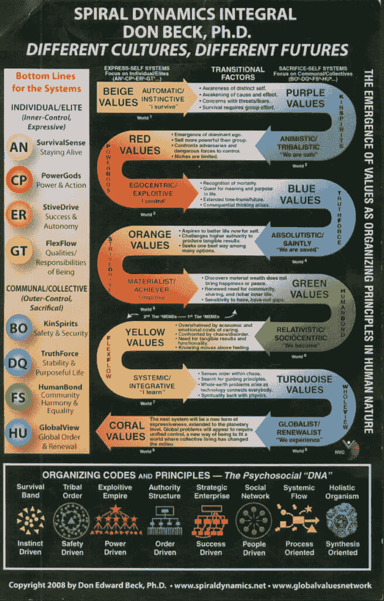

# 成为你人生的主角：理解现状与困境

在本节课中，我们将要学习如何摆脱机械、被动的生存状态，成为自己人生的主导者。我们将首先探讨为何大多数人会陷入“非玩家角色”的困境，并理解其背后的深层原因。

> 有自主权就是成为句子的主语，而不是直接宾语。这是行动的倾向，而不是等待被行动。
> 
> – 德文·埃里克森

世界常常显得过于机械化。人们遵循着固定的模式：醒来、拖延、通勤、为不关心的工作忙碌、应付社交、回家、娱乐、入睡，然后重复。这种生活令人恐惧，仿佛被一股无形的力量推着，走向一条与周围人无异、陈旧且缺乏自主的道路。

社会不断灌输着相似的指令：存钱、好好学习、找份高薪工作。这就像在扮演一个视频游戏中的**NPC**。NPC是非玩家角色，它们行为可预测，遵循预设的、狭窄的行为模式，缺乏自主权。它们存在于游戏中，但真正的主角是玩家，是掌握自己命运的人。

许多人羡慕那些看似拥有**主角能量**的人：他们不在乎他人看法，能随心所欲地行动，并最终过上充实而有趣的冒险人生。

## 为什么有这么多 NPC？

上一节我们描述了NPC般的生存状态，本节中我们来看看为何这种状态如此普遍。将大多数人贬低为被操纵的木偶并非答案，同样，将自恋者奉若神明也无济于事。关键在于，我们不应仅仅“认为”自己是主角，而应努力“成为”主角。

在这个世界上，高度的尊重往往只留给那些具有高度自主性的人，例如企业家、运动员和知识分子。他们开辟自己的道路，克服逆境，创造出令人惊叹的人生故事。其余的人则常被贴上普通、平凡的标签。

那么，为什么只有少数人能脱颖而出？为什么我们把大部分精力投入他人的梦想，而非自己的？答案涉及三个重叠的部分：**条件反射**、**工业化**和**第一层次思维**。

我们出生时，思维如同一台没有操作系统的电脑。在渴望学习的大脑和渴望塑造孩子的父母面前，这存在风险。如果父母的“编程”复制了他们自己父母的模式，且他们未曾学习或实践自主性，孩子很可能得到相同的结果。

将这种家庭环境与**工业化社会**结合——一个旨在培养有用工人的系统——就形成了“上学、找工作、65岁退休”的美国梦模式。

人类心理学研究表明，我们的思维（包括价值观、信仰和世界观）会随时间经历可预测的阶段进化，可分为**第一层次意识**和**第二层次意识**。



**第一层次思维者**的关键特征是无法同时持有多个观点。他们认为自己的信仰绝对正确，而不同者则是错误的，甚至是敌人。

超过95%的西方人口处于第一层次思维的三个阵营中：


以下是第一层次思维的三个主要阵营：

*   **秩序**：重视由外部全能统治者（如宗教权威）分配的规则、角色和纪律。
*   **成就**：重视理性、科学、冒险和自力更生，常见于自助或企业晋升文化。
*   **平等主义**：价值观相对主义和平等，认为没有绝对真理，但常陷入“没有真理是更好的”这一自相矛盾的信仰中，常见于某些身份政治讨论。

当父母、老师、权威人物都持有这些主导价值观，并直接接触我们年轻、易受影响的大脑时，写入我们思维的“代码”就类似于NPC的代码：做被告知的事、遵从权威、跟随群体。

生存成为基础原则。如果违背部落（家庭、社群）的信仰，就可能面临被排斥的风险，因此服从成了自然选择。这就是世界感觉如此机械化的原因，也是为什么许多人只关注AI会取代工作，而非其他可能性。

我们被训练去**缩小注意力**，即使用“聚光灯意识”，一次只聚焦一件事，听从权威，执行任务。恐惧反应驱使我们追求本不属于自己的目标。有些人无法承受，便陷入抑郁和焦虑。

我们通过“应该实现的目标”来过滤世界，只能看到程序允许我们看到的东西。除非反抗，否则大多数关于意义、满足和真正成功的机会都会溜走。

## 反抗默认路径


上一节我们分析了陷入默认路径的原因，本节我们将探讨如何反抗它。**失败是生活的默认状态**。如果不主动创造道路，就会被分配一条道路。即使按社会标准取得了成功，那也从来不是真正属于你的目标、信念和行动，你只是在运行被设定的程序。

但人类的神奇之处在于，我们可以重写自己的“代码”。要改变生活方向，需要三个核心要素：

以下是成为人生主角所需的三个核心要素：


1.  **意识**：拓宽视野、发现机会的能力。
2.  **获取**：利用那些机会所需的资源（知识、工具等）。
3.  **能动性**：在没有外部许可的情况下，主动抓住机会并采取行动的能力。

许多人拥有意识，也能获取知识，但**很少有人真正采取行动**。因此，所有特质的培养都依赖于最后一个要素：**能动性**。

智力并非成功的决定性因素，能动性才是。其关系可以概括为：

```
高智商 + 高能动性 = 取得突破性成就（如建造火箭）。
低智商 + 高能动性 = 可能通过果断行动创业成功。
高智商 + 低能动性 = 可能拥有高学历但抱怨不断，难以突破。
低智商 + 低能动性 = 跟随他人计划，成为环境的受害者。
```

关键在于，只要有适当的能动性，智商高低并不重要。好消息是，**能动性是一种可以培养的习惯**。

### 意识：拓宽视野

上一部分我们提到了意识的重要性，现在我们来深入探讨如何拓宽它。可以把成功想象成一张大部分空白的地图。成功就像麦堆里的一根针，而地图上唯一被“聚光灯”照亮的部分，是你已知的领域（来自童年、教育、职业培训等）。你当前认可的成功版本，只是这个已知区域里一根**可见**的针。

你很少思考“生活可能是什么样子”，因为对未知的恐惧会迅速扼杀这些想法。你一生都在接受方向指引，因此认为成功也需要方向。但事实并非如此。

那么，如何在麦堆中找到那根针？

首先，你需要一个深刻的内在理由，推动你向未知飞跃。你必须残酷地认识到，你不愿过那种机械的、预设的生活，因为你能观察到大众的生活并非你所愿。你需要每天认真思考生活的走向，诚实面对自己，意识到当前的不适是无法长期忍受的。

一旦对现状产生不满，下一步就是进入**不一致性**阶段——当前生活与潜在生活开始角力。这为**洞察力**的出现做好了准备。对负面现状的认识，就像拉紧弹弓，为瞄准积极方向积蓄力量。

其次，你需要对如何取得非传统进步有一个概括性理解。你不遵循那些导致普通结果的常规规则。如果你想要非凡的结果，你需要：
1.  基于现有信息做出一个猜测（假设）。
2.  根据这个猜测采取行动。
3.  你很可能会失败。将失败视为一个需要纠正的数据点。
4.  从更 informed 的位置再次做出猜测。
5.  不断重复，逐渐将未知变为已知，通过排除无效方法，最终找到有效途径。

这个过程就是**创造知识**和**深化意识**的方式，它能帮助你从单一、狭隘的第一层次视角中解脱出来，扩展你自身的复杂性。

### 获取：利用资源与机会

有了探索新领域的意识，接下来需要获得进入这些领域的“权限”。你需要大致知道机会存在于何处，并了解接近它的步骤。

在信息时代，资历、地理位置和金钱不再是不可逾越的障碍。以下是你可以利用的资源：

以下是探索新机会可以借助的现代资源：

*   通过互联网学习任何知识。
*   关注各领域的专家。
*   在社交媒体上精心筛选，构建高价值信息流。
*   通过分享你的知识或作品，让世界看到你。
*   利用技术创业、提升精神境界、连接他人、改善思维或健康。

然而，大多数人像使用娱乐毒品一样使用互联网，因为他们仍处于“聚光灯意识”中。但你已经超越了那个阶段。

步骤很简单但执行渐难：关注那些致力于创造**有用**内容的人，无情地筛选进入你思维的信息源，让自己每天都有意地去接触那些曾经被忽略的机会。

### 能动性：所有问题都是可解决的

我们已讨论了意识和获取资源，现在来到最关键的部分：能动性。在20世纪60年代，马丁·塞利格曼的“习得性无助”实验揭示了关键一点：对厌恶事件**感知到**缺乏控制，会导致被动和忍受痛苦，即使逃脱实际上是可能的。

实验表明，之前无法控制电击的狗，后来即使有机会逃脱，多数也会放弃尝试。我认为，由于成长环境，相当一部分人已经**学会了无助**。

**能动性与无助的关键区别在于信念**。你无法控制出生、智商或某些早期灌输的信念，但**能动性是一种可以学会的习惯**。

拥有能动性，意味着选择对你重要的目标，决定推动你向目标前进的行动，然后**执行**。

但目标的选择很重要。心理学研究发现，最佳体验（心流）发生在挑战与技能平衡的区域——既不太难（导致焦虑），也不太易（导致无聊）。因此，目标可分为三类：

以下是三种类型的目标：

*   **容易的目标**：可用现有技能和资源实现。
*   **不可能的目标**：超出物理定律，或未通过实现“困难目标”而变得可能。
*   **困难的目标**：当前无法完成，但通过成长、学习技能和收集资源，最终可以完成。这可能会失败，但坚持迭代就能成功。

**能动性，以及美好的生活，是对“困难”的信念。** 能动性是相信所有问题都是可解决的。能动性是进行 **“好科学”** 的过程。

“好科学”包含四个循环部分：


以下是“好科学”的四个循环步骤：

1.  **目标**：承诺一个重要的目标，通常源于生活中的问题或不满。
2.  **实验**：对如何推进目标做出猜测（假设），并在现实世界中采取行动。
3.  **体验**：行动带来与世界的互动，产生直接体验（数据）。
4.  **确认**：观察数据（结果），判断实验是让你接近还是远离目标。

这就像在暴风雨中驶向灯塔：你设定航向（目标），启航（实验），根据风浪调整（体验），观察位置（确认），不断纠正，直到抵达。

**这就是在未知领域导航的方法。这就是培养主角能量的方式。** 你在地图上放下自己的指南针，**创造**方向。通过这个过程，你不仅能实现个人目标，你的经验和贡献也将为他人带来价值，为自己带来更深层的快乐。

## 总结与启程

本节课中，我们一起学习了如何从NPC般的被动生存状态，转变为自己人生的主角。我们剖析了陷入默认路径的原因（条件反射、工业化、第一层次思维），并找到了破局所需的三个核心要素：**意识**、**获取**和**能动性**。

关键在于认识到：失败是默认状态，但**能动性是一种可以培养的习惯**。通过拓宽意识发现机会，利用现代资源获取工具，并运用“好科学”的方法（目标-实验-体验-确认）在困难目标上持续行动，你就能在空白的人生地图上创造属于自己的方向。

你拥有实现生活中任何目标所需的一切。如果仍在寻找捷径或技巧，不妨重新审视这些原则。旅程始于你自身，这是一个强大而令人兴奋的认知。

旅途愉快。

– 丹

**本周注意事项：**
“60天内建立盈利个人品牌”挑战赛将于6月16日开始。如果你将追求自己的商业或创意事业视为一个重要目标，并希望获得指导，[可考虑在开课前报名](https://stan.store/thedankoe/p/mini-course-how-i-systemize-my-life-with-ai)。课程将提供每日一课和一个30-60分钟的可操作步骤，帮助你解决盈利、引流和建立信任等核心商业难题。