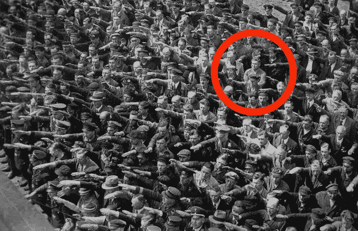

# 个人成长：如何变得更加“不同意”（创造一个现实扭曲场）

在本节课中，我们将学习如何通过有意识地坚持自我、明确目标并有效沟通，来构建一个强大的“现实扭曲场”，从而更坚定地追求自己想要的生活，而非被动地迎合他人。

---

我们常常被教导要友善、随和，避免冲突。然而，过度追求和谐有时会让我们牺牲自己的价值观和目标。经过反思，我发现，适度的“不同意”反而是走在正确道路上的标志。当你明确知道自己想要什么，并为之坚持时，周围的人可能会感到不适，但这恰恰是你信念坚定的表现。事实上，这种坚定最终会赢得他人的信任和尊重。

## 过于和善的陷阱

上一节我们提到了“不同意”的价值，本节中我们来看看其反面——过于和善可能带来的问题。

非常和善的人通常厌恶冲突，会为了维持表面和平而妥协。核心问题在于：**他们会为了不伤害他人的感情而牺牲自己的价值观、目标和愿景**。许多人之所以显得随和，是因为他们并没有强烈到必须去反对的目标。

例如，是否每个周末都同意外出聚会，对他们而言并不重要，因为这不会影响他们（可能并不存在的）重要目标。然而，如果你对自己在收入或人际关系中的待遇不满意，却选择沉默，就会导致以下三个后果：

以下是过于和善可能引发的三个问题：

*   **问题无声地积累成环境焦虑**：未解决的矛盾会持续酝酿，直到你不得不进行一场更艰难的对话。
*   **别人的梦想优先于你自己的梦想**：你总是将他人的需求置于自身之上，导致生活充满不满足感和凄凉。
*   **你无法从生活中得到你想要的东西**：长期妥协的结果，往往是带着遗憾生活。

幸运的是，你不需要变成一个讨厌的人才能改变这一切。

## 如何构建“不同意”的能力

那么，如何有建设性地变得“难以相处”，并围绕自己创造一个积极的“现实扭曲场”呢？高自主性的人往往显得难以相处，因为他们必须对社会的默认路径说“不”，并对所有干扰说“不”，以专注于自己的目标。

史蒂夫·乔布斯就是一个典型例子。他拥有强烈的愿景，并以不妥协的方式去实现，这常常表现为极致的完美主义和直接的诚实。我们无需模仿他所有的行为，但可以借鉴“现实扭曲场”这个概念：即一种说服自己和他人深信某个愿景的强大魅力。



虽然不能也不应进行明显的操纵，但每个人都可以培养一种令人信服的魅力，帮助自己更快地实现愿景。

### 对你想要的东西着迷

构建“现实扭曲场”的第一步，是彻底弄清楚你想要什么。

答案总是青睐那些对问题着迷的人。你需要与“我想要什么”这个问题朝夕相处，不断思考、挣扎、尝试。你生活中最重要的任务就是弄清楚这一点。否则，你很容易在不知不觉中被他人影响和利用。

人类是目标导向的生物。我们追求的目标塑造了我们自身。当别人为我们设定目标时，如果我们不加思考地接受，就会慢慢活成他人的副本。因此，你需要对你理想的生活和目标着迷，每天思考它。这个过程会重新连接你的思维，让你更清晰地看到自己想要什么，而**不愿意妥协正是你知道自己想要什么的表现**。

### 相信你比大多数人更优秀

这听起来可能不太谦虚，但你需要培养一种信念：相信自己能在某些方面做得比大多数人更好。

这种信念并非源于人格的优越感，而是源于你能创造出足够好的作品或价值，从而具备竞争力。事实上，世界上绝大多数人是消费者，只有少数人是创造者。创造者并无神奇之处，他们只是深知必须通过创造来获取所需，并拒绝过一种麻木的生活。

如果你认为现有的产品、设计或思想已完美无缺，无需改进，那可能是在自我欺骗。**当你相信某件事可以改进并据此行动时，你就有潜力为世界贡献有价值的东西**。而提供价值，正是获得回报、支持与追随的基础。

### 制定一个超越可能的计划

有了明确的目标和创造的信念，接下来你需要一个能点燃激情、看似“超越可能”的计划。

一个卓越的计划不仅能为你带来清晰度，也能为你需要说服的人（如投资者、伙伴）带来清晰度。**成功是衡量那些关心你所做事情的人的标准**。一个平庸的计划无法打动任何人。

史蒂夫·乔布斯常设定看似不可能的最后期限，这带来了多重好处：

以下是“超越可能”的计划带来的积极影响：

*   **增加心流状态的可能性**：当任务难度处于能力极限边缘时，人更容易全身心投入，进入心流状态。
*   **强迫创造性思维**：紧迫的时间压力常常能激发意想不到的解决方案和高效的工作方法。
*   **要求无情的优先级排序**：压力迫使你剥离所有“想要”，只专注于最“必要”的事情。

这是一个需要坚定信念的配方。如果你的愿景与你的身份深度交织，你就会自然而然地拒绝任何可能使其分心的事物。

### 掌握说服性沟通

最后，要实现愿景，你几乎不可能独自完成。你需要借助他人的力量，这就需要掌握说服性沟通的艺术。

首先要区分说服与操纵：
*   **说服**：激励人们采取对双方都有益的行动。
*   **操纵**：误导人们采取仅对操纵者有利的行动。

我们每天都处在被说服与被操纵的环境中。因此，有意识地学习互利共赢的说服技巧至关重要。有效的说服需要两大支柱：

以下是进行说服性沟通的两个关键要素：

*   **足够的研究来阐述你的论点**：你必须能用逻辑和证据支撑你的观点，说明为什么你的方式更好。
    ```python
    # 例如，通过数据展示改进
    current_satisfaction_rate = 65  # 当前满意度
    projected_satisfaction_rate = 90  # 改进后预期满意度
    improvement = projected_satisfaction_rate - current_satisfaction_rate
    print(f"实施该计划预计可将满意度提升 {improvement}%。")
    ```
*   **一个展示变革的引人入胜的故事**：大脑通过故事理解世界。一个关于变革的好故事能让人们从情感上认同你的事业。

---

## 总结

本节课中，我们一起学习了如何构建个人“现实扭曲场”的完整框架。

首先，我们剖析了过度和善的陷阱，认识到无原则的妥协会牺牲自我。接着，我们探讨了构建“不同意”能力的四个核心步骤：**对你想要的东西着迷**以明确方向；**相信你比大多数人更优秀**以建立创造价值的信心；**制定一个超越可能的计划**以激发极致潜能；最后，**掌握说服性沟通**以汇聚实现愿景所需的资源。

将这一切结合起来，你的“现实扭曲场”就形成了：你明确知道自己要什么且绝不妥协；你相信有亟待改进的问题并乐于创造；你拥有清晰而雄心勃勃的计划；并且你能说服他人共同助力。

你不需要创办下一个苹果公司来应用这些。关键在于，无论是在健康、职业还是人际关系中，找到一个对你意义重大、无法割舍的目标，然后运用这些知识，坚定不移地朝它前进。很多时候，我们得不到想要的，根本原因在于我们为了避免冲突，而没有设定让这场冲突值得去面对的条件。

– 丹

---

**附言：**

“30天内建立盈利的个人品牌”挑战赛将于6月16日开始。如果你的目标包括分享兴趣、构建受众，或为业务吸引客户，[请在开始日期前点击此处报名。](https://stan.store/thedankoe/p/build-a-profitable-personal-brand-in-30-days)