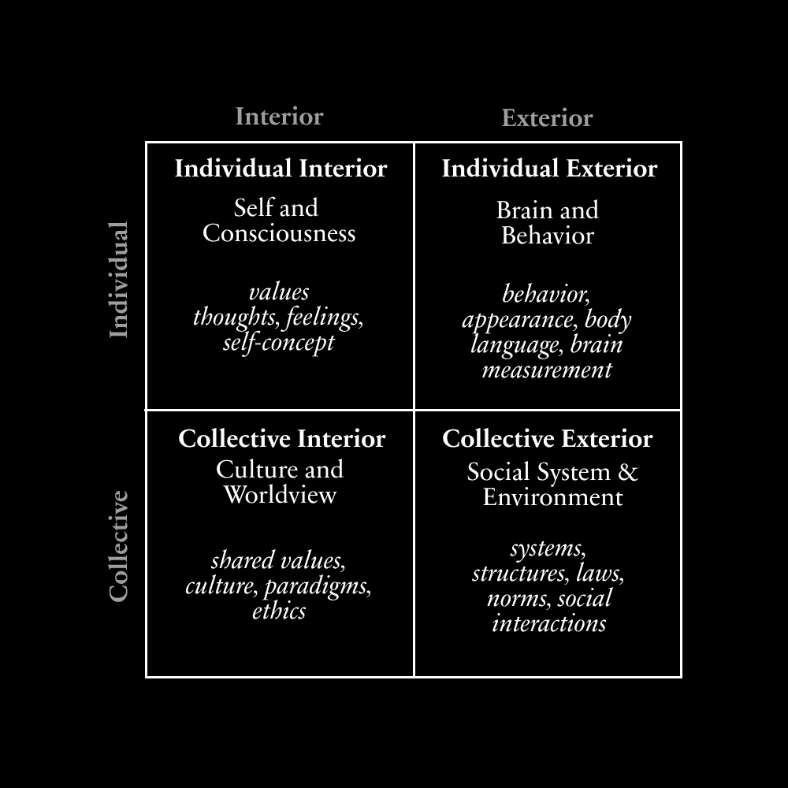
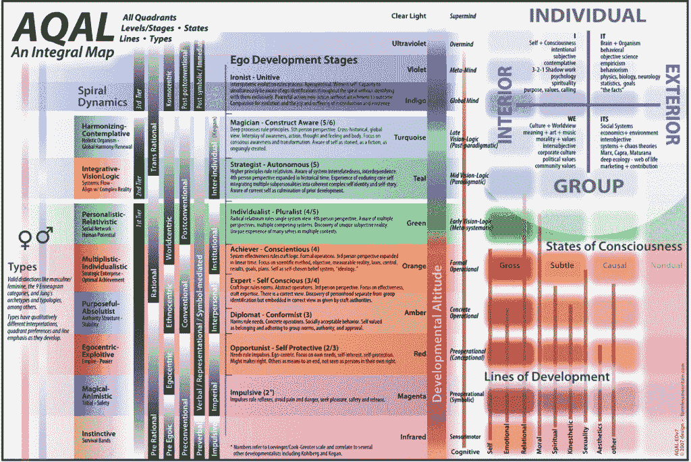
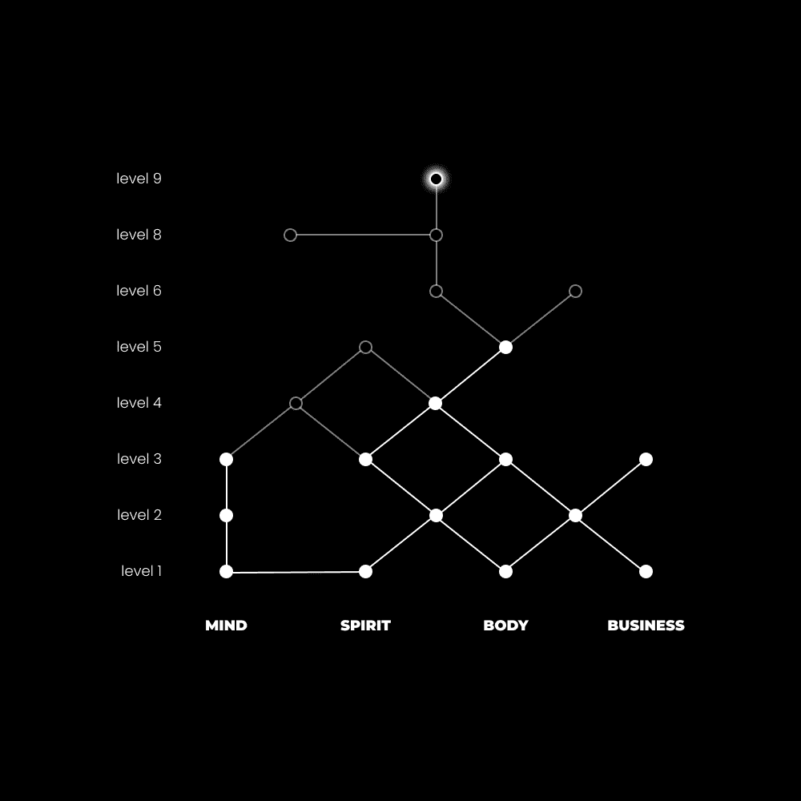

# 成为失败者：重新定义成功与快乐 🎯

在本节课中，我们将要学习如何通过重新定义“成功”与“快乐”的概念，来构建一种更令人满意的生活。我们将探讨为什么传统的成功观念可能存在问题，并引入一个结合东西方智慧的新框架。

## 概述

快乐是一个令人困惑的术语。每个人都有自己的解释和定义。坦白说，永远不会有你能够维持幸福巅峰状态的时候。这不是大脑的工作方式。快乐只有在与悲伤的参照点相比较时才能存在。快乐是一种**意识状态**。状态不是永恒的。

因此，让我们使用“成功”这个术语，并以一种最终允许你开始朝着更好的生活行动的方式来定义它。

---

## 成功的新范式 🔄

上一节我们提到了快乐的不稳定性，本节中我们来看看如何构建一个更稳定、更实用的“成功”定义。

成功的词典定义是循环的：“成功的程度或衡量标准。”或者，“有利或期望的结果。”这对于在微观尺度上实现某些目标是有意义的，比如实现$1,000这个具体目标。但当我们将其应用于宏观尺度时会发生什么呢？

当你寻找成功的进一步定义时，你会得到一堆博客文章，它们都涉及以下内容：*挑战自己，学习，成长，总是尽力而为，并有一个你可以称之为家的地方。* 但当我们深入挖掘现实的四个维度时，我们发现了一个更有用的应用。

### 现实的四个维度

现实性的四个维度或视角是：

+   **内部个体（主观）** – 我们的感受、思想和经历。
+   **外部个体（客观）** – 我们如何衡量我们的大脑或身体的行为，这通常与我们的经验相关（例如，多巴胺信号表示动机感）。
+   **内部集体（主观）** – 一个群体共享的价值、道德或信仰。在某种意义上，文化是一种共享的思维方式。
+   **外部集体（客观）** – 维持文明存在的经济、政治和社会体系。

我将这些称为“维度”，因为它们各自都按照自然发展的复杂性和深度层次递增。

西方思想倾向于重视客观、科学和物质主义，这影响了主观——我们成长的文化，它影响我们对世界的看法。我们将世界简化为原子，追求物质成功。

东方思想倾向于重视相反的东西。掌握内部世界，培养社区，顺应外部世界。

这两个问题在于，它们往往倾向于拒绝任何一方的有效性，而不是从所有有用的方面取其精华，以有意义的方式引导我们的生活。

如果我们参考心理学、神经科学、永恒哲学和现代生活的当前状态——涵盖所有维度——我们会发现，幸福的一个潜在定义是进步的取得、对超越自我的贡献以及管理情绪动荡的能力。

完成目标带来的多巴胺，帮助他人带来的满足感，以及掌握如何对外部触发和内部沉思做出反应，这些都是关于生活中应该包含的内容的相当有力的论据。

这既提出了一个问题，也带来了一种困境：首先，社会是以一种方式构建的，到你成年时，你的思想已经被成功的信念所条件化。这种成功版本来自于接受教育，被训练在社会中扮演一个特定的角色，直到你“完成了你的时间”并能够停止工作。第二，我们如何追求一种新的成功版本？一个能阻止我们带着遗憾回顾我们的选择的习惯？

---

## 成功的关键是成为一个有用的失败者 🧠

要改变世界，我们必须从自己开始；而在自己开始时重要的是意图。意图必须是理解自己，而不是让别人去改变自己。

如果你想要控制你的幸福，你必须控制你的生活。虽然完全的控制并不总是可能的，但至少你必须接受，你可以通过审查你做出的选择来影响你的成功程度。

所有选择的选择是拒绝你出生时为你铺就的道路。有意为之。产生目标而不是接受它们。将别人可能投射在你身上的建议、意见和信念视为地图上的一个小部分，而不是领土，更不是法律。

但当你完成这个生活任务的框框时，其他人不会高兴，因为他们没有做同样的事情。他们没有控制自己思想的任何迹象。他们会尽其所能让你感觉你错了，愚蠢，被误导。即使他们默默地渴望加入你，他们也会把你视为失败者。

以下是实现这种新成功范式的四个核心步骤。

### 1) 掌控自己

几乎没有人练习那个能带来所有差别的习惯：自我反思。我可以建议如何提高自己，但没有任何东西能超越对过去错误的清晰认识。因为一旦你意识到——残酷地意识到——错误，它就不会再次发生。你意识到的错误越多，你就越朝着你注定要走的方向前进。

掌控你的*个人、内部*世界是你如何与外部世界互动的基础。如果你想有钱，你必须发展自己，成为一个对社区、系统或组织有用的足够的人。如果你不想孤独，你必须做同样的事情来找到值得的朋友和伙伴。

你如何追求自我掌控？你升级了。“发展线”就像视频游戏中技能树上的能力。一旦你达到一定水平的经验，你可以选择为像智力、耐力这样的特质添加“点”。这样做会解锁更多的机会。它通过用深层问题替换浅层问题来使生活变得更简单。

以下是发展心理学中一些可以发展的“线”：

**核心线：**
+   **认知线** – 心理推理、逻辑和概念性思维
+   **道德线** – 道德推理和关怀/正义取向
+   **情感线** – 情绪智力和成熟度
+   **精神线** – 精神智慧和超个人发展
+   **人际线** – 社交技能和关系智慧
+   **性心理线** – 性和亲密关系发展
+   **自我认同线** – 自我意识和自我发展

**附加线**：
+   **审美线** – 艺术欣赏和创造性表达
+   **身体线** – 身体意识和身体智慧
+   **价值观线** – 个人认为重要或有意义的事物
+   **需求线** – 人类需求层次和动机
+   **世界观线** – 如何看待和解释现实
+   **数学线** – 数量和空间推理
+   **音乐线** – 音乐智慧和欣赏
+   **动觉线** – 身体运动智慧

这里有一个我想强调的关键点：许多人将过去的思想家和大师置于神坛之上。问题是，他们中的许多人只达到了一条线——精神或沉思线——而忽略了其他方面。在当今世界，平均水平以上的人有潜力比历史上任何其他生物都更加发达。不要把它视为理所当然。

### 2) 真正的教育

真正的教育不是记忆，而是发现。当你意识到当你被告知要学习什么时，你实际上什么也没学到，所以你亲自掌握事情，成为自己的老师，真正的教育就发生了。

当你在系统中研究给你提供的信息时，信息会偏袒该系统的结果。你没有创造课程。你没有资助课程。无论你如何试图为之辩护，建立在工业价值观基础上的现行教育体系的目的在于创造有用的工人。如果你不以兴趣为指南进行自我教育，默认选项就是将注意力集中在那个最终目标上。你错过了为你量身定制的机会。

真正的教育是追求真理。真理不在他人之口中说出的言语中。虽然没有一种**正确**的学习方式，但遵循自然的指南针不会出错：

以下是自我教育的步骤：
+   追求一个自我生成的目标（兴趣和意义高）
+   将其分解为实现它所需的核心技能
+   将其分解为基本要素
+   用 40 小时以上的时间进行**技术**实验
+   注意哪些对你的情况有效，注意哪些无效
+   经常反思你的进步，完善你的目标，继续学习

知识是假设，实践是实验，结果是数据。外部的研究通过内部得到巩固。你必须学习足够多的知识，以便对猜测的结果有信心，然后意识到技能获取实际上是*技术堆叠*。你不是“学习”Photoshop、AI 或写作。你有一个目标。你找到一个尝试的技术。你看看它是否适合你独特的思维和情境。你将这项技术添加到你的工具箱中，并继续前进，直到你能够创造足够的价值，以实现你的职业目标。

### 3) 现代归属

孤独有其位置。短暂的隔离和专注对于培养独立思考非常有帮助。但这并不改变我们都是社会性生物的事实。我想现在没有人会否认，归属感是仅次于食物、水、住所和稳定环境的基本需求。

信息时代的一个弊端是，世界如此碎片化。很难找到与你兴趣和目标相似的人在你的物理位置，因为我们很少能通过我们所接触到的信息发现这样的兴趣。

现在，尽管渴望过去的一代人似乎很有吸引力，但这实际上是不可能实现的。你在这里。你身处这个美丽的技术和互联的世界。你只需要学会如何使用它，而不会让你变成一个被多巴胺 IV 连接的流口水的骨架。

尽管社交媒体有其弊端，但它弥补了我们筛选信息来源和与几乎任何有互联网连接的人建立关系的能力。解决方案很简单：减少随机性。为了吸引你的注意力而不惜一切代价构建的“为你推荐”页面应该被谨慎使用，以发现与你兴趣相投的人。一旦找到他们，就与他们建立联系。在安全的地方保存他们的信息流。更深入地了解他们所教授的内容。

就像自我管理所展示的那样，人际关系是一条发展线。成为一个能和任何人交谈的人没有捷径。

### 4) 贡献于社会

你正在提升自己（个体内在）。你正在追求真理（个体外在）。你正在培养社区（集体内在）。所有这些都以各种方式融合在一起，带来深刻的满足感。

但还有另一个部分。每个人都为之奋斗的部分。系统。游戏。企业职业。被过度谈论到令人厌烦的事实，即“每个人”都讨厌他们的工作。“我该做什么？”

让我们把这个说得几乎太简单：*找到你关心的事情和他人关心的事情的交集。*

创造的行为。这是将一切联系在一起的东西。变得有价值。用你的思想塑造它，使其值得与世界分享。不是被分配要创造什么，而是选择要创造什么。

但再次强调，如果我们犯了一个关键的错误，即优先考虑一个维度而不是另一个维度，我们最终会变成一个挨饿的艺术家。我们为了取悦自己的虚荣心而创作。我们用关于真实和创造你想要的东西的想法来合理化我们的创造欲望。再次，通过这样做，你无意识地选择了给自己增加更多问题，并放弃了解决它们的能力。

一个更有价值的目的是通过做自己来获得报酬。这包括两个部分：
+   成为足够有价值的人，值得为之付费
+   理解他人创造他们愿意为之付费的产品的欲望

在大多数情况下，这需要创业。在你找到一个能给你自主权——这是一种记录在案的心理需求——让你创造你想要的工作之前，我对攀登梯子没有任何怨言。

但如果你对这个世界进行批判性的审视，你会发现，当我提到“机会从未如此之高”时，这并不仅仅是一些不了解你情况的人随口说出的陈词滥调。每个阅读这篇文章的人都有互联网连接。因此，每个阅读这篇文章的人都有能力将他们的知识、兴趣和创作带入世界。从那里，你所需要做的就是回顾自我教育的过程。互联网是一个巨大的反馈循环。如果人们不关心你提供的东西，那只是一个可以识别、假设、变成实验并解决的问题。

---

## 总结

本节课中我们一起学习了如何重新定义成功与快乐。我们探讨了传统东西方成功观念的局限性，并引入了结合“内部个体”、“外部个体”、“内部集体”和“外部集体”四个维度的新范式。成功的关键在于成为一个“有用的失败者”，这要求我们：1) 通过自我反思和技能发展来掌控自己；2) 进行以兴趣和真理为导向的自我教育；3) 在碎片化的现代世界中主动建立有意义的归属感；4) 最终通过创造对他人有价值的事物来贡献社会，并以此获得回报。这条路始于拒绝被预设的道路，并有意识地选择成为自己生活的创造者。