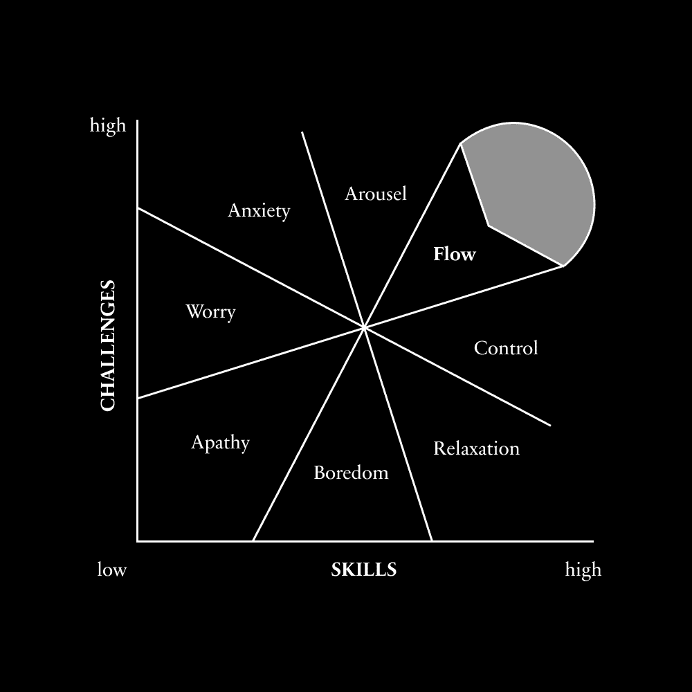

# 致富之路：三个关键决策

在本节课中，我们将要学习决定个人能否实现财富积累的三个核心决策。这些决策并非关于具体的赚钱技巧，而是关于如何从根本上重塑你的思维方式和行为模式，为创造财富铺平道路。

## 概述

许多人渴望财富，但往往不得其法。真正的致富之路始于内心的转变和一系列关键决策。本节将深入探讨这三个决策：设定一个理想的时薪、将致富作为压倒一切的优先事项，以及切断所有退路。掌握它们，你将为自己创造前所未有的致富条件。

---

## 设定你的理想时薪 💰

上一节我们概述了致富需要思维转变，本节中我们来看看第一个具体决策：为你的时间设定一个理想的价值。

发财的唯一途径之一是：将你的时间价值评估为一个幻想的美元数额。

这会让你的思维注意到那些能让你处于更高杠杆位置的机会。其核心目的是迫使你做出更好的日常决策，避免在低价值事务上浪费精力。

### 核心概念：理想时薪

这个概念由纳瓦尔·拉维坎特提出：
> 制定并执行一个理想的时薪。如果解决问题将节省的金额少于你的时薪，就忽略它。如果外包一项任务的成本低于你的时薪，就外包它……我的理想时薪是每小时 5000 美元。

**公式**：`理想时薪 = 一个远高于你当前收入的、具有挑战性的数值`

例如，假设你购买了一件价值50美元的破损商品。你是否会花一个小时去退货？如果会，这意味着你默认自己一小时的价值等于或低于50美元。这个决策本身没有对错，但它揭示了一个问题：你可能没有意识到，存在另一个能在同一小时内为你创造500美元甚至5000美元价值的问题等待解决。

如果你的理想时薪感觉很容易实现，那就说明它设定得太低了。一个看似“幻想”的高目标能有效地重新连接你的大脑。神经科学表明，当你专注地想象一个更好的未来时，激活的脑网络与你实际经历时相似。每一次专注的想象，都是在重塑大脑，使其与你渴望成为的人对齐。

然而，仅仅想象是不够的。你需要将这种想象与现实的挑战相结合。研究表明，学习与成长发生在“挑战的黄金区域”，即任务难度大约在85%左右——既不会因太简单而无聊，也不会因太困难而焦虑。这种适度的压力能释放去甲肾上腺素，增强学习效果。

因此，你不能只是空想你的理想时薪。你必须用它来指导每一个艰难的决定。

以下是应用理想时薪的起点：

从不花费时间处理低于时薪价值的小事开始，例如退货琐事。

---

## 力量的集中是致富的唯一途径 🎯

设定时薪帮助我们优化决策，但要实现财富的质变，我们需要更强大的驱动力。本节我们将探讨第二个关键决策：将创造财富作为你压倒一切的首要目标。

如果你想要致富，这需要成为你生命中压倒一切的第一大愿望。

这适用于任何你想取得重大成就的领域：力量的集中是成为顶尖人物的唯一途径。你需要着迷，需要将尽可能多的能量投入到那个单一目标中。

有人可能会问，那生活、社交和享受呢？将致富作为优先事项，是否意味着牺牲幸福？

答案是：不将其作为优先事项，你就不可能“意外”致富。长期投资股市或许能带来晚年安稳，但谁不想在更早的年纪就掌握并实现财务自由呢？

事实上，将致富作为优先事项并不会让生活变糟，反而可能让它变得无限精彩。试想职业运动员，他们大多数时间都在从事热爱的事业并追求卓越。为什么不能将同样的逻辑应用于商业？在所选领域努力攀登顶峰的人，同样可以拥有丰富而充实的生活。

幸福通常源于进步感以及对自身之外事业的贡献。当你不再被琐事分心，专注于大规模解决有价值的问题（这正是创业的本质）时，生活将比平均水平有趣得多。

为了使这一点具体化，你需要明确行为的边界。

首先，列出你**绝不**做的事情。

以下是可能不值得你花费时间的事项示例：
*   无实质内容的咖啡会议。
*   退回低价值商品。
*   因无聊而刷手机。
*   因缺乏激情而参加的社交聚会。
*   要求自己即时回复所有信息。
*   一切可以外包或忽略的琐碎任务。

当面临这些选择时，坚定地告诉自己：“我不会做那件事。”

然后，列出你**必须**做的事情。

这些事情能将你的实际收入潜力向理想时薪靠拢：
*   学习能大幅提升收入潜力的知识。
*   练习能让你自给自足的技能。
*   尝试创业。
*   加入有潜力的初创公司。
*   争取企业中的高管职位。
*   持续学习与构建。

你越是深入审视自己的行为模式，就越容易理解为何尚未达到理想的财富状态。

---

## 只给自己一个成功的选择 🔥

我们探讨了设定高标准和集中力量的重要性，但有时温和的推动并不足够。本节我们将学习第三个，也可能是最有力的决策：主动切断所有退路，背水一战。

发财的唯一途径之三是：给自己没有其他选择，只能发财。

作者分享的最佳决策往往涉及利用金钱作为推动力，投资于当时负担不起但能创造更大价值的事物，从而迫使自己快速成长。

例如，作者曾花费1500美元（当时是一笔巨款）购买一款电子邮件营销软件。点击“购买”时的焦虑和痛苦，驱使他必须像生命依赖于此一样，尽快学会如何利用该软件赚钱。这直接指明了他需要学习的高价值技能：营销、文案和销售漏斗构建。

同样，持续搬进更昂贵的公寓也是一种策略。这表面上像是生活方式的膨胀，实则是给自己设定现实的挑战和截止日期，将自己置于“未来的自我”应有的环境中，从而消除停留在不满意生活中的选项。

这三个决策——设定理想的时薪、集中全部力量、切断所有退路——共同创造了远超个人初期想象的致富条件。

值得注意的是，这些决策都没有具体规定“学习什么技能”或“选择什么商业模式”。当正确的心理条件设立后，学习具体技能变得紧迫而自然。虽然过程中必然包含失败和迭代，但如果你设定了正确的内在条件，积累财富的速度可能会快得出乎意料。

---

## 总结

本节课中我们一起学习了决定能否致富的三个核心心理决策：
1.  **设定一个理想的时薪**：用一个高远的价值标准衡量你的时间，以此过滤低价值活动，聚焦高杠杆机会。
2.  **集中力量**：将致富作为压倒一切的优先事项，明确拒绝分散精力的行为，并全力投入能提升价值的事务。
3.  **切断退路**：通过投资未来或制造紧迫感，让自己没有回头路可走，从而激发出最大的潜力和行动力。

财富的积累始于思维的重塑和坚定的决策。掌握这三条原则，你就为开启个人的财富创造之旅奠定了最坚实的基础。