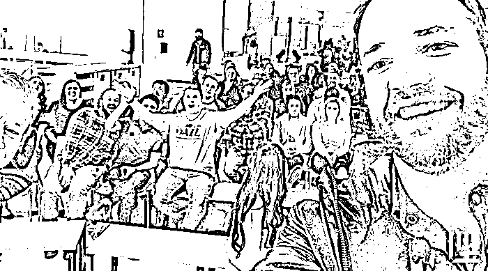

# 红杉合伙人 Bryan Schreier 最新预测：独角兽将出现在这三大领域

> 原文：[`mp.weixin.qq.com/s?__biz=MzAwODE5NDg3NQ==&mid=2651222876&idx=1&sn=a56fec9858eb572d62caf0ce34558a0d&chksm=80804d08b7f7c41e674a7967dc1caa43b1d38db2e065d71b50cf5e12240dd6a682ebd7550e1d&scene=21#wechat_redirect`](http://mp.weixin.qq.com/s?__biz=MzAwODE5NDg3NQ==&mid=2651222876&idx=1&sn=a56fec9858eb572d62caf0ce34558a0d&chksm=80804d08b7f7c41e674a7967dc1caa43b1d38db2e065d71b50cf5e12240dd6a682ebd7550e1d&scene=21#wechat_redirect)

布莱恩·施莱尔(Bryan Schreier)是红杉资本合伙人，在过去的 9 年多时间里，他投资了包括 Dropbox、Qualtrics、Inkling、Thumbtack 等明星公司。他的投资秘诀是什么？施莱尔曾表示，他努力让自己做到“不专注”，保持开放的视野，只有这样才能捕获那些具有创新与颠覆精神的公司。

上个月，在 Qualtrics 举办的 Insight Summit 大会上，施莱尔分享了他对未来的看法，并对可能出现独角兽的领域做出了预测。以下为部分内容摘录：

*   下一个估值 500 亿美元的大企业将会诞生于“混合”行业，也就是将科技与人力结合的业务，正如 Airbnb 和 Thumbtack。这样的企业将比纯科技企业拥有更大前景。

*   随着待处理的数据量愈来愈大，为 Qualtrics、Salesforce.com、Workday 等“记录公司”提供 B2B 系统，这一市场也潜力巨大。

*   最终赢得自动驾驶大战的企业必然是拥有数据最多的企业。

*   当你拥有一个控制器，你便可以与任何环境互动，这才是 VR 真正取得突破的地方。

*   对于 AR/VR 的未来，绝不只像 Pokemen Go 那么简单，有许多有趣的垂直领域值得与之结合。

***

**【每日金句】**

当你拥有一个控制器，

你便可以与任何环境互动，

这才是 VR 真正取得突破的地方。

***

**实现技术与人力混合**

施莱尔指出：“在消费层面，有一点很清楚，下一个估值 500 亿美元的大企业将会诞生于‘混合’行业，也就是将科技与人力结合的业务。”他举了一些例子，比如 Uber、Airbnb、Thumbtack。红杉投资的 Thumbtack 是将消费者与特定服务者联系起来，比如保姆、园艺师、木匠。 

“我认为，在 Snap 之后，接下来的三家或者四家巨型消费 IPO 企业将是混合企业。”施莱尔表示，“在一定程度上技术已经成熟了，到目前为止移动平台已经诞生 10 年了。”Facebook 和 Snap 等企业专注于社交媒体领域，谷歌和微软专注于平台拓展，它们已经在市场上占据了很大的份额。施莱尔说：“许多空白地带已经被企业瓜分了。” 

尽管如此，技术成熟也创造了其它一些不同的机会。施莱尔认为：“有一些新的大市场至今还没有被人掌控，那就是原来属于线下，现在转为线上的市场。这种情况的出现，主要是因为互联网技术的发展，但有时也会因为其它原因。Uber 就是一个好例子，它可以颠覆的士产业，一旦所有司机都有了手机，手机支持 GPS，就会颠覆出租车产业。” 

**混合产业的发展潜力比纯粹的科技企业更大**。施莱尔指出：“就核心科技而言，如果市场规模达到 500 亿美元，我们就会感到兴奋了。而 Uber 所在的市场规模达到了 600-700 亿美元。Airbnb 面向的市场规模约为 1000-2000 亿美元，Thumbtack 则是 5000 亿美元。”

“**在未来，你需要安置大量的人力资源，并让它们与技术共存。**” 

**为「记录公司」提供 B2B 系统**

“记录公司”成为所谓的“单一可信源”，也就是说，它收集与某一特殊功能相关的所有数据，然后通过同一界面接入用户。Salesforce.com（CRM 解决方案领域的提供商）、Workday（知名的 HR 和 ERP 公司）、ServiceNow（ITSM 领域的服务商，目前全球排名第三的 SaaS 公司）都是好例子。Qualtrics 也属于此类企业。 

为这样的“记录公司”提供系统，通过这些系统，公司可以帮助企业客户训练数据，这也是未来的一个机会。

施莱尔说道：“企业有太多的数据要处理，但是大多企业找不到合适的工具。大量数据涌入企业，而企业却在思考一个问题：‘它对我而言有何意义？’所以你需要寻找可以处理的企业。” 

施莱尔相信科学、AI 代表着未来趋势，现在 AI 已经非常精准，通过它，用户可以与住宅、汽车交流。对于自动驾驶领域，他认为最终赢得自动驾驶大战的企业必然是拥有数据最多的企业，“Google 与微软已经有了庞大的数据，与它们竞争很难”。 

**AR/VR：与垂直领域结合**

施莱尔同时看好 VR 与 AR 技术的前景。VR 技术让人进入一个虚拟世界，许多时候需要通过 Google Cardboard、Oculus 这样的硬件设备实现。而至于 AR，数字图像、文本、声音将叠加在真实世界之上，正如去年大为流行的《Pokemen Go》一样。 

对于 VR，媒体态度不一，有的喜欢有的讨厌，不过施莱尔认为 VR 技术才刚刚出现，“**当你的手上拿着控制器，可以与任何环境互动，这才是 VR 真正取得突破的地方**”，他说道。

因为最新的 VR 眼镜可以提供类似的功能，所以施莱尔预测这一市场将会快速增长。尽管如此，创业公司的机会有限，至少在硬件方面机会有限，因为三星、HTC 等公司在设备方面已经掌握了大部分市场。他还说：“Oculus 是一个异类。” 

从另一方面来看，AR 带来了许多机会，不只是《Pokemen Go》那么简单。AR 可以让专业人士开发汽车引擎，可以告诉建筑员工墙壁之内有什么，可以让仓库员工掌握库存情况，它还可以用在其它许多地方。

对于这一领域，施莱尔指出：“有许多有趣的垂直软件市场值得追逐。”

来源 / 36 氪

作者/小兵手

