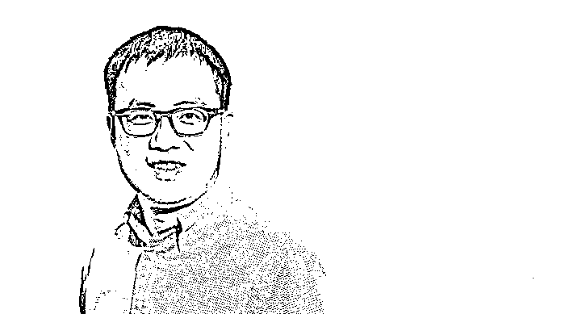

# 刘星：中国消费升级的本质与趋势

> 原文：[`mp.weixin.qq.com/s?__biz=MzAwODE5NDg3NQ==&mid=2651222056&idx=1&sn=6403787d06202188c7d73fc900e30029&chksm=80804e7cb7f7c76afd546c8c81e801263becc7f8bc9afe113f332067b99d08db1e7075fe9530&scene=21#wechat_redirect`](http://mp.weixin.qq.com/s?__biz=MzAwODE5NDg3NQ==&mid=2651222056&idx=1&sn=6403787d06202188c7d73fc900e30029&chksm=80804e7cb7f7c76afd546c8c81e801263becc7f8bc9afe113f332067b99d08db1e7075fe9530&scene=21#wechat_redirect)

2015 年我国的宏观经济数据显示，我国国内个人消费增幅达到了 8.4%，而当年 GDP 的增幅为 6.9%，这说明了消费占整个经济的比例的提升。而如果对比美国消费产业历史上相似的发展时期，会发现服务类消费增速又远远快于商品类的增速。

红杉资本中国基金合伙人刘星在近日接受《中国企业家》采访时，表达了他对中国当下消费升级的看法。消费变得越来越重要，各年龄层消费者的消费认识都在持续提高，人们的消费需求也更加多样化、细分化，而这些都将为中国创造更多的市场与投资机会。

***

【每日金句】

如果说在过去十年，

中国消费者从温饱生活步入小康生活，

那么未来十年，

中国消费者将逐步迈向健康生活和品质生活。

***

**中**国正在经历着消费升级的变迁。回顾美国消费产业演变的过程，其实经历了不同阶段的发展，消费的重要性不断增加，与此同时，消费结构也在变化，服务类消费占比在不断增加。而现在，中国也正经历着这样一种变化。

这是社会自然演化的过程。这种变化的前提，一方面是消费能力的提升，人均可支配收入增长，中产阶级崛起。最近《经济学人》智库报告预测，**未来 15 年将有四分之三的中国人成为中产阶级，个人消费年均增速为 5.5%**。另一方面，人们的消费认识也提升了。

以前我们不知道有什么东西可以消费，而现在由于移动互联网的渗透，信息传播速度和覆盖范围有了很大进步，消费者视野更宽阔，带动了消费意愿的提升。值得一提的是，**各个年龄段的消费都在升级**。今天年轻人的消费意识和 10 年前的年轻人相比，或拿现在 45 岁的人跟过去 45 岁的人相比都有一定程度上的消费升级。

**从单一向多样**

消费者从原来追求单一功能性需求向更加多样化诉求转变。消费者从热衷于大品牌，到现在追求个性化、小众品牌，这说明他们对于名牌所带来的外在的虚荣满足感已经不再像以前那么强烈了，而是更在乎品质，甚至文化内涵。

**垂直与细分化**

从追求一般功能性商品向追求更加细分和垂直的功能性商品转变。

比如一些人会按照不同使用领域购买高尔夫球鞋、登山运动鞋。此外，**人们对于体验式消费更加重视**。5 年前只有少数人会请外教学英语，而现在大家对此有了更广的接受程度。这背后的逻辑是，现在很多学员不仅是为了考托福或者 GRE 而学习英语，很多人是为了更好地体验生活、享受生活。

电商方面的数据变化或许更能说明这种趋势的变化。作为在线折扣零售商，唯品会最早是从处理品牌尾货起步的，那时候消费者青睐于追求熟知的名牌，而现在该平台上小众品牌的份额在提升，这表明消费者不再只是追求满大街的名牌，很多在传统线下不是很知名的品牌，在线上售卖也有很好的效果。

**新型沟通方式**

商家与消费者的沟通方式也在发生变化。从最初的电视广告投入，到现在直播的引入，聘请明星为首席惊喜官。**客户变为了粉丝，在平台与明星直接互动**。从 2015 年开始，平台开始以更为创新的方式与年轻消费群体沟通。

**个性化定制**

个性化诉求也推动了电商内容呈现的变化。电商平台目前开始对不同用户推送符合其喜好的商品，每个人在同一个平台上看到的内容都是不一样的，就像今日头条针对读者推送个性化信息一样，以前是报纸印刷什么我读什么，后来获取信息方式变化了，“我搜即我得”。现在在此基础上有了智能化升级，“我想即我得”，平台根据数据自动推送“我”想看的东西。

目前来看，现在整个中国经济增速在放缓，但 2015 年国内个人消费增幅为 8.4%，远高于国内 GDP6.9%的增幅，这说明消费占整个经济的比例正在提升，其中一些增长较快的细分领域仍蕴藏很多投资机会。

对比美国市场，从 1975 年到 1985 年的 10 年内，服务类消费增速远远快于商品类的增速，我认为现在的国内市场也进入到这个阶段。**旅游、教育、文体、娱乐和健康等方面的消费增速将会远高于商品消费增速**。如果说在过去十年，中国消费者是从温饱生活步入小康生活，那么未来十年，中国消费者将逐步迈向健康生活和品质生活，这正是我理解的消费升级。

来源：公众号“中国企业家杂志”（ID:iceo-com-cn）

**【每日一题】**

| 创业辞典 | 

创业者之间有哪些暗语、行话？你是不是弄错了它的意思从而用错场合？

我们以「每日一题」的方式，来考考你的创业装腔程度——

 /mp/newappmsgvote?action=show&__biz=MzAwODE5NDg3NQ==&supervoteid=448328764#wechat_redirect 

回复关键词“MVP”获取正确答案

