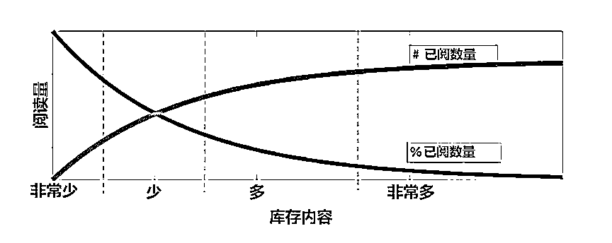

# 让人欲罢不能的产品：数据探索与优化利用之间的权衡 | 投资人说

> 原文：[`mp.weixin.qq.com/s?__biz=MzAwODE5NDg3NQ==&mid=2651226169&idx=1&sn=9427ab83620b576244e2905e9288d68a&chksm=8080be6db7f7377ba03f0cfddc7509a68db81a22ab1a87e938da4c04da32121449a33ee4d993&scene=21#wechat_redirect`](http://mp.weixin.qq.com/s?__biz=MzAwODE5NDg3NQ==&mid=2651226169&idx=1&sn=9427ab83620b576244e2905e9288d68a&chksm=8080be6db7f7377ba03f0cfddc7509a68db81a22ab1a87e938da4c04da32121449a33ee4d993&scene=21#wechat_redirect)

在[“让人欲罢不能的产品”系列上一期](http://mp.weixin.qq.com/s?__biz=MzAwODE5NDg3NQ==&mid=2651225795&idx=1&sn=c3122f5ea139d3e435da3fb18caaacea&chksm=80804097b7f7c98133bf8edd39058a7e0a7dd8f2df2d8f33b1b52eaac3b54c518af28234eafc&scene=21#wechat_redirect)我们介绍了参与度的基本概念，以及 News Feeds 和 Content Production 背后的魔力。本文将继续围绕参与度讨论用户连接的重要性，分析各个内容库存级别的含义，以及介绍即时动态排序的考虑因素和关键指标。

本文研究成果来自红杉美国数据科学团队，Jamie Cuffe、Avanika Narayan、Chandra Narayanan、Hem Wadhar 和 Jenny Wang 对本文亦有贡献。以下是部分要点摘要：

▨ 增加恰当的用户连接有助于提高参与度。

▨ 识别“需要关注”的用户、确保他们的使用体验，有助于软件获得长期成功。

▨ 了解不同用户库存内容的阅读量和可见性，有助于为用户提供更好的服务，进而改善产品整体质量。

▨ 库存、信号、预测能力越强大，平台上帖子的相关性就越强。

▨ 要模拟的不是数据，而是人们在数据中表现出来的行为。

**用户连接与库存**

发展一批内容创作者后的下一步是要确保他们能够吸引粉丝。和粉丝的连接性越强，能提供的粉丝库存内容就越多。这种联系不局限于亲朋好友，与名人、新闻栏目、社群等可以创造、分享内容的群体联系，也能增加库存内容。

因此，产品团队应将连接性较低的用户标记为“需要关注”，鼓励他们与其他用户互粉、关注名人和新闻栏目以及加入社群。辨别“临界点”也很重要，只有加深了解，用户才更有可能继续使用产品。比如，Facebook 就努力确保新用户在十天内至少能与七名用户产生联系。当然，只有这七名用户平常发布的内容有意义、有吸引力，这一点才能实现。

刚开始使用软件的 10 天里，关注的数量很重要：如果一开始，用户的关注数量没有达到最低值，他们就很有可能卸载软件。

连接性需要关注一些关键指标：

▨ **好友比例 VS 社群联系 VS 发帖数量：**在不同阶段，各种类型的联系对不同的人来说十分宝贵。要了解这一点，就要结合他们使用软件的时长和登录频率。

▨ **参与联系的数量：**不是所有联系的意义都相同。和亲密朋友间的交流，与很少使用的社群联系相比，可能更珍贵。

▨ **活跃联系用户组数（比例）：**了解特别的活跃联系数量和其发展形势也很重要。

每位用户和发布动态的朋友、名人、新闻相关联时，他们的库存内容也会相应增加。库存的重要性可见一斑，因为它直接影响了用户可消费的内容数量，从而影响了软件使用时长。在即时动态的环境里，所有用户的内容库存就是这些用户发布的内容，以及这些内容所产生的与其他用户的联系，这对阅读体验（见下图）和广告收益产生了影响。

如果用户的动态仅他们可见，大多数情况下，他们就是自己的读者。所以，库存内容少的用户阅读比例就大，但绝对阅读量维系在较低状态。另一方面，如果用户能看到的内容过多，他们就没有时间阅读所有内容。接下来我们讨论四种主页类型——库存内容非常少、库存内容少、库存内容多、库存内容非常多。

▨ **库存内容非常少**

如果用户库存内容非常少（每日更新内容少于 10 条），他们上线之后很可能会阅读所有可见内容。这也是大多数用户首次使用产品、连接性较低时会遇到的场景。如上所述，产品团队会将这样的用户标记为“需要关注”，向他们推送相关联系人和有趣的内容。在这种情况下，内容评级显得没有意义。随着时间的推移，如果他们主页更新的内容仍旧很少，这些用户基本上就不会再使用这款软件。

▨ **库存内容少**

用户库存内容少（每日更新内容少于 50 条）的原因有很多：同样使用这款软件的好友不多、系统推送了错误的关联用户。如果吸引用户的内容少，参与度可能也会受到影响。如果这样的用户能够阅读大部分可见内容，系统就可以把握这个机会，向他们推送更多的类似内容。相反，如果库存内容少的用户没有阅读所有可见内容，反映的则可能就是他们对软件本身的参与态度。

▨ **库存内容多**

通常情况下，库存内容多（即每日更新内容超过 50 条）的用户与朋友、新闻、群组的关联程度更高。他们往往阅读更多的库存内容、登录软件更频繁、使用软件的时间更长。这些用户的日活跃参数或月活跃参数值也相对较高，能够定期使用产品。等级算法能够有效提高这组用户的参与度，因为他们不会阅读主页中所有的可见内容。还有很重要的一点，是要深入了解他们喜欢的内容，推送比例准确的社交、娱乐、资讯文章。

▨ **库存内容非常多**

属于这个类别的用户，他们的库存内容比其他用户都多（每日更新超过 200 条），他们通常会阅读更多的内容，但是阅读的主页可见内容比例相对较少；他们能够接触到的内容比实际会阅读的内容量要来得多。和主页多内容的用户一样，评级对维系、提高他们的参与度来说是十分重要的。

**库存需要关注的关键指标： **

▨ 库存可见内容数量

▨ 连接数

▨ 对可见内容的阅读量

▨ 阅读的推送数量

▨ 受库存内容限制的用户比例

关注库存指标时，根据国籍、性别、连接类型（朋友、名人、工作伙伴、社群）、内容类别（文本、视频、照片等）、发布系统（iOS、安卓、电脑桌面）来给数据进行分类，可以清晰地表现库存的运行模式。

**即时动态排序**

即时动态的目的是突出显示用户认为相关性最高的帖子。这主要是通过调整帖子出现的顺序来实现的，而这种排序又至少会在一定程度上受到公司战略和使命的影响。想要正确运行即时动态排序系统，必须了解每个用户可用的帖子总量（库存），收集与用户及其发布内容相关的信息（信号），然后使用这些信号去预测用户行为（预测），并确定每个帖子对每个用户的重要性（相关性）。帖子的相关性得分将决定其在具体用户的即时动态中的显示位置。

因此，有效的排序系统必须包括可以为每个用户进行相关性评分的预测算法。例如，用户是更容易对其童年时期相关的帖子产生关联，还是更喜欢看关注的大 V 发布的内容。 

**—**

**库存**

用户的库存包括了他们能够从关注的好友和博主看到的所有帖子。对于“库存受限”或库存非常少的用户，排序就不太必要，因为他们有机会消费所有可用内容（无论他们会不会真的看完）。而关注了大量好友、大 V 和其他博主的用户将拥有更大的库存，可能每天几千个帖子，并且可能无法全部消费。对于这些用户，相关性的评分排序至关重要。

**—**

**信号**

信号包含用户的所有可用信息及其在内容方面的偏好，可帮助预测用户是否将参与特定帖子。下面列出的问题举例说明了什么是信号。但请注意，这只是一部分，每一类信号底下还有数百个信号。产品团队应该研究可以为产品提升参与度的所有信号。

**—**

**是谁****发布的内容？**

其中一组信号与内容制作者的信息相关。以 Facebook 为例，这条动态是来自用户的好友、主页还是群组？用户之前和帖子作者互动的次数越多（进行点赞、评论、标签、点击、访问个人资料或主页等操作），就越有可能参与这篇帖子的互动。

▨ **好友**

好友的亲密程度如何？他们最近是如何成为好友的？好友是否属于连接数量很少的“有需要”用户？

▨ **粉丝主页**

用户对粉丝主页内容的兴趣如何？用户最近对粉丝主页的关注和/或点赞情况如何？用户是否将该粉丝主页设为“优先查看”或“获取通知”？如果主页由新闻机构运营，是否为用户所在地的机构？

▨ **群组**

用户对该群组的参与度如何？最后一次互动是什么时候，采取了什么行动？

**—**

**是什么类型的内容？**

Facebook 的排序算法向用户展示更多他们经常参与的内容类型。例如，如果你更喜欢对照片进行点赞、评论，不怎么关注状态更新，那么你会更经常看到照片的更新。

▨ **原创与非原创**

内容是来自用户的好友或家人的个人帖子，还是链接或重新分享？在 Facebook 的即时动态上，原始内容更有可能出现在顶部或顶部附近。

▨ **格式**

帖子是视频、文字、图片还是组合？文字有多长？图片有多大？视频有多长？

▨ **分类**

内容是社交类、资讯类、娱乐类、交际类，还是协作类？内容的趣味性和价值往往因人而异。

▨ **其他分类**

内容是不是标题党或者假新闻？是不是“垃圾消息”？在 Facebook 上，这类帖子可能会被排在后面，不太容易被用户看见。

**—**

**内容何时发布？**

发布时间越近，用户就越有可能看到它，特别是如果他们经常与你的产品互动。对于访问频率较低的用户，即时动态可以优先考虑突出“重点内容”，例如重大生活事件和重大新闻报道，而不是最新帖子。 

▨ 帖子是什么时候发布的？

▨ 是重复（或真实）的帖子吗？

**—**

**内容得到了什么样的用户参与？**

用户参与帖子的次数越多，无论是隐性参与（比如，花费时间）还是显性参与（比如，点赞和评论等操作），就越有可能认为它有价值，而其他用户也就越有可能认为它有价值。因此，即时动态排序通常会优先考虑具备“爆红特质”或高参与度的帖子。

▨ 帖子的参与度如何？是得到某种反馈（点赞、评论、反应、认同等），还是在帖子上花费或停留的时间？如果是评论，那么评论需要多长时间，这种参与是否构成真正的对话？

▨ 帖子的参与增长有多快？

▨ 哪些用户参与这个帖子，是否会刺激这些用户去生产内容（例如，转发分享）？

▨ 哪种类型的参与以及哪些用户会激励制作人再次发布内容？

▨ 这份帖子的参与度是否高于其他帖子（考虑所有其他变量）？

**—**

**我们对用户了解多少？**

每个用户根据性别、年龄、设备类型、网络连接状况等因素有着不同的参与度。因而用户信息对于向特定用户推荐合适的帖子来说极具参考价值。例如，对于一个使用旧手机接收即时动态、网络条件不好的用户来说，提供高清视频不太可能带来良好的体验。

▨ 用户的个人统计信息是什么？

▨ 他们的网络连接状况如何？

▨ 用户拥有哪些设备？这些设备有何特征（内存、存储、速度）？

**预测是艺术，也是科学**

一旦获取信号数据，就可以更好地预测用户可能会采取的行动。用户过去的行为可用于预测未来的行为，因此机器学习模型不仅可以确定用户是否喜欢帖子，还可以确定他们是否会点击、评论、分享、隐藏或甚至将其标记为垃圾。综合这些评估数据，就可以根据帖子/用户的匹配单独生成一个相关性得分，表示用户可能对帖子感兴趣的程度。平台库存中的每个帖子都有了分数后，排序算法就可以按照得分顺序排列对该用户显示的内容。

由于多种原因，这种预测有一定难度。像点赞和评论等参与行为只能粗略地代表用户的真实感受，例如，用户可能会点赞自己并不真正“喜欢”的帖子（例如某人死亡的消息），可能在点击后才发现不满意，可能隐藏帖子纯粹是为了“管理收件箱”。同样，遵循某些信号可能会让你提高内容的病毒性而不是质量，就像在不断给用户投喂“裹着糖衣的毒药”，最终可能会使他们抛弃你的产品。

因此，重要的是要注意确定哪些预测能够告诉你相关性得分，以及在多大程度上能够做到这点。选择正确的数据信号组合既是艺术，也是科学。

**—**

**相关性**

每个帖子/用户匹配的相关性得分不仅应该反映从信号中获得的预测信息，还应该反映即时动态的优化功能。你可以根据公司的目标和使命，优化任意数量的指标，例如花费的时间、会话数量或点击率。例如，Facebook 根据即时动态的价值进行排序，将好友和家人的动态摆在大 V 和主页动态的前面。你还可以通过优化来支持某种策略；例如，选择突出新产品而不是旧产品，以鼓励新产品的成长。

优化函数应为每个预测分配权重。在下面的示例中，P（赞）表示某一用户点赞某个帖子的可能性，a、b、c、d、e 则是分配给每个可能性的权重： 

可以使用测试、试探、定性等方法等确定每个想要调整的指标（如，花费的时间）的权重。你还可以为某一特定类型的用户使用不同权重。

**—**

**产品考虑因素**

即时动态是一种权衡。是否应该展示更多视频而不是文字？评论是否比点赞更有价值？内容制作是否比内容消费更重要？了解和计算这些权衡的比率能提供不少帮助（例如，观看 Y 个视频的用户生产自己内容的可能性降低 X％）。

**—**

**探索与利用**

你应该对已经了解的用户行为进行优化（利用），还是去尝试了解更多你不知道的内容（探索）？也就是说，用户可能会重视的帖子应该占多大比重，而他们没有尝试过的帖子又该占多少？这是所有排序算法的基本问题，并没有简单的答案。在大量库存的情况下，探索与利用之间的权衡尤其具有挑战性，尤其是在库存过多，但却没有足够的信号来对帖子进行排序的时候。在这种情况下，利用可能会带来长期问题。必须定下一个标准；否则可能会去优化一些不能真正最大化参与度的因素。例如，可以通过用户体验调查来了解用户是否逐渐对目前展示的内容感到厌倦，以把握好用户层面的利用和探索之间的平衡。

**—**

**没有足够的数据**

无论你如何精心构建算法，总会存在你没有的数据。用户对早餐的选择是怎样影响他们想要阅读的内容？用户隐藏帖子是因为不喜欢，还是只是因为已经看完了？用户积极评论帖子是因为喜欢还是生气？算法的目的不是单纯地去对数据进行建模，而是要用数据来模拟人们的行为，而人类又太过于复杂，以至于任何算法都难以进行全面综合的建模。产品团队应该尝试获取其他相关数据来推断人们的兴趣。

**—**

**没有完美的优化**

类似地，预测算法被设计为对给定的一个或多个指标进行优化。但是，这些指标永远无法完全捕捉到公司目标和使命的精神。因此预测和相关性得分是远远不够的。预测算法可以用来预测美网，计算每位选手的获胜概率，但在即时动态环境中，“胜利”不是一个离散的、可测量的结果。排序算法可以帮助预测用户是否以及如何与帖子进行互动，但不能预测这种互动是否真正为你的使命服务。

**—**

**病毒性传播和标题党**

即时动态环境通常有利于任何类型的交互，特别是高速交互。因此，“标题党”帖子通常比其他帖子获得更多传播。产品团队应该寻找创造性的方法来抑制这种影响。例如，你可以去识别只有标题党常用的关键词。也可以去寻找同一内容创作者频繁使用的关键词，然后采取适当纠偏措施。

**—**

**长期与短期**

理想情况下，你的产品应该作长期优化，但大多数算法的优化只有短期效果。例如，通知提醒可能在一开始会让用户更频繁地回到即时动态，但最终它会让用户厌烦并使他们不太愿意回到你的产品。虽然长期指标通常更难以衡量和优化，但它们对于理解产品决策的最终影响非常有用。应当了解这类信息，找出参与度可带来长期利益的帖子并扩大其影响（例如，用户好友的婚礼照片）。

**—**

**用户体验指标**

满意度调查、净推荐值和定性反馈对于制定策略很有帮助，但难以优化。主要原因是这些数据通常很零散，无法实时获取用于产品优化，也无法代表整个用户群（并需要进一步的偏差校正等）。因此，你需要寻找与产品中的调查类型指标相关的可测量的替代指标。

**—**

**排序内容类型**

对某些指标进行优化将有利于某些类型的内容，例如，对花费的时间进行优化会有利于视频内容的显示，因为观看视频往往比浏览文本内容消耗更长时间。相反，优化所查看的帖子数量将会突出文本内容。要解决这个问题，你需要寻找有效的方法来规范数据以纠正偏差。此外，还要从战略角度看待你的产品——你希望产品未来发展方向是视频还是文本？** **

** 推荐阅读**

壹

[红杉中国郑庆生：严守边界才是跨界之本 | 投资人说](http://mp.weixin.qq.com/s?__biz=MzAwODE5NDg3NQ==&mid=2651225888&idx=1&sn=399a6e617432398a328231076f1d8cf2&chksm=80804174b7f7c862e8a59dbb47ec8e47da2215c377af47cedc1f0328915703617eb897967612&scene=21#wechat_redirect)

贰

[让人欲罢不能的产品：News Feeds 和 Content Production 的背后魔力 | 投资](http://mp.weixin.qq.com/s?__biz=MzAwODE5NDg3NQ==&mid=2651225795&idx=1&sn=c3122f5ea139d3e435da3fb18caaacea&chksm=80804097b7f7c98133bf8edd39058a7e0a7dd8f2df2d8f33b1b52eaac3b54c518af28234eafc&scene=21#wechat_redirect)人说

叁

[红杉中国周逵：什么才是企业穿越周期的生存之道？ | 投资人说](http://mp.weixin.qq.com/s?__biz=MzAwODE5NDg3NQ==&mid=2651225572&idx=1&sn=155f2aa228a813456d46ad1e386ad881&chksm=808043b0b7f7caa6ba872b302817c359880b048ef9293f230e22f6d3ef95aebc7bf8e6c01023&scene=21#wechat_redirect)

肆

[爆款的诞生：看重数据质量，看懂指标变化，产品成功的必备 DNA | 投资人说](http://mp.weixin.qq.com/s?__biz=MzAwODE5NDg3NQ==&mid=2651225474&idx=1&sn=1f7f9a6a8001136c617b25bd11e55ff5&chksm=808043d6b7f7cac0f4279bcee54de46cc67d188327016b3e352eaa38ebdd0bc4fb0bc0b21cce&scene=21#wechat_redirect)

伍

[爆款的诞生：打造成功产品的必备 DNA——指标变化分析 | 投资人说](http://mp.weixin.qq.com/s?__biz=MzAwODE5NDg3NQ==&mid=2651225412&idx=1&sn=194cb57cc1babad917b7cbd8dbed14b1&chksm=80804310b7f7ca068c3f2a958017855a98ab3c3964ea8455147596cd9790c0f320a102b0e3d0&scene=21#wechat_redirect)

