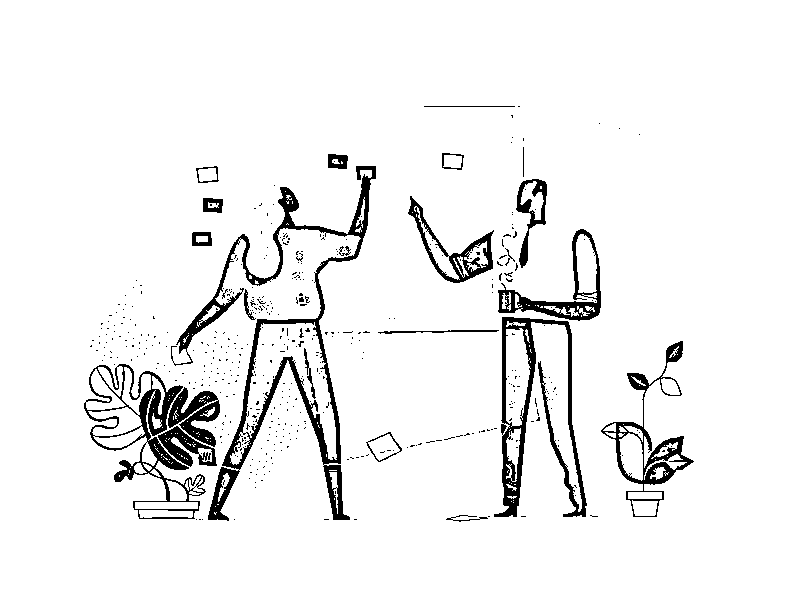

# 创业者必读：打造企业协作文化的完整攻略 | 首席人才官

> 原文：[`mp.weixin.qq.com/s?__biz=MzAwODE5NDg3NQ==&mid=2651226249&idx=1&sn=38ea18a30938b2e4e33a777aba0428e9&chksm=8080beddb7f737cbb71a5bb815169c57f5520740cfcdd0317dc0e266f5ac57699f643806a018&scene=21#wechat_redirect`](http://mp.weixin.qq.com/s?__biz=MzAwODE5NDg3NQ==&mid=2651226249&idx=1&sn=38ea18a30938b2e4e33a777aba0428e9&chksm=8080beddb7f737cbb71a5bb815169c57f5520740cfcdd0317dc0e266f5ac57699f643806a018&scene=21#wechat_redirect)

创业者通常都是充满动力、高绩效的人，但如果在创业的过程中困在“自我”的概念里，忘记投资核心团队有多么重要的话，那么公司最终将笼罩在个人崇拜的氛围中。只围绕一两个鼓舞人心的个体运作会让团队的其他成员变得黯然失色，逐渐失去热情，这就埋下企业失败的种子。

本文的作者 Claire Millard 是一名领导力导师，帮助企业家把他们的个人成就变成企业的成功，并让企业的每位员工都参与其中。她认为，打造企业协作文化能够为公司发展奠定基础，赋予员工权利，让他们变得更有热情，创造良性循环。

文章中她介绍了如何有效地召开以文化建设为主题的会议，并列出了文化建设会议的关键步骤和思路，让更多的创业者拥有一份打造企业协作文化的完整攻略。

对于创业者来说，找到时间与团队一起专注思考企业文化可能是件棘手的事。投资者往往把赌注压在骑师而非马匹上，所以大多数情况下，他们最关心的是：作为企业家，你的可信度高吗？是否有能力以及能不能振奋人心？这就很容易让你在募集资金、发展企业时，更多想到和提到自己，而不是你拥有或希望拥有的团队。

但当你在运营自己创立的企业时，之前让你取得成功的因素可能成为绊脚石。如何把初创公司从“个人崇拜”提升至更高水平？

事实上，只要成立了团队，工作文化就会开始成形，存在于日常用语、工作模式、办公氛围、开会时沟通的方式中，并且持续不断地影响企业和团队里的每个人。

要想提高企业未来发展的竞争力，就需要打造强大的内部品牌和企业文化。文化主要由规则构成，有机地不断发展。与团队共同开展积极的企业文化会议可以让每个员工都能融入企业文化，并且推动企业文化的发展。

下面，我将介绍一些方法帮助大家更有效地召开以文化建设为主题的会议，以获得整个团队的理解与支持。

**定义团队“单位”**

5 到 10 人的团队，可以选择与整个团队进行讨论。但是，如果规模更大，这个方法可能不总是适用。可以采取主要负责人一起交流讨论、个别相关团队之间单独沟通、每个团队派代表讨论协调等方式。

关键是要确保每个人，包括初级员工、管理人员、远程工作者，在交流中都能有发言权。

**指定引导者**

想确保会议进展顺利，需要指定一个引导者。

引导者的任务很艰巨，他们要控制讨论的节奏，保证团队能够按计划行事、达成目标，他们还要记录会议重点、确保传达到位。

好的引导者必须对讨论的话题保持中立态度。个人观点非常强烈就会有意无意间产生偏见，很难确保公平地让每个人表达自己的意见。

什么样的人才能成为会议的引导者呢？理想的情况是选择团队以外的人担任，但也可在团队内部选择。引导者不一定要是老板（很多情况下，让老板担任引导者是一件很可怕的事），也不一定要是高层，但引导者要自信、表达清晰，并且能掌控会议节奏和气氛。

**文化建设会议的发布和宣传**

文化建设会议应该是十分有趣、充满活力和创造力的。所以要提前发出邀请并告诉大家会议计划，这样才能真正激励他们，让他们在会议开始前就活跃起来。

比如，可以把下面这些问题提前抛给大家，让他们开始思考关于文化建设会议的问题。

▨ **什么是企业文化建设会议?**

▨ **我们为什么要这样做?**

▨ **到底什么是企业文化?**

▨ **我可以提前准备些什么?**

同时，密切关注会议消息传播后的进展情况也很重要。比如，当发现一些新成员对此次会议并不关心的时候，可以在相对随意的环境中和他们聊聊是为什么。如果是因为怕自己的意见“没有分量”，则需要给他们充分的鼓励，并且保证即使从“局外人”的角度提供独特的观点和意见也被欢迎。还可以将新成员的担忧告知会议引导者，这样他能让这些同事充分融入整个会议。

**会议伊始**

首先会议引导者简单介绍一下会议的目标和议程，会议议程应该贴在某个显眼的位置供小组成员遵守。

会议引导者可以这样开场：

“欢迎大家来到我们的企业文化建设会议！今天我们来到这里，旨在讨论我们公司所面临的一些最重要的问题，希望能在大家的帮助下形成和发展我们想要的企业文化。每个人的观点都很重要，所以我们要确保团队里的每一个人都有发言权，都能和大家分享自己想法和担忧。接下来我们将会详细讨论三个关键性问题：

我们想要什么样的企业文化?

我们现在在这方面做得怎么样?

今天我们能采取什么样的行动来实现我们所渴望的企业文化?

这次会议的目的是要描绘一下我们在未来 1 年甚至 5 年的理想工作场景，同时我们公司的业务无疑是增长、变化的。我们正努力明确公司的定位，这样我们才能确保公司的定位不会改变而且会继续发展。而作为会议引导者，我的任务就是确保每个人都能表达自己的看法，都能听到彼此的想法。我们希望能在会议结束前就一些问题达成共识，像我们可以采取哪些行动着手建立我们想要的企业文化，以及哪些想法能让建设企业文化这项工作更上一层楼。” 

如果顺利，在这一环节，你的团队会开始摆脱紧张的状态，变得兴奋起来。而进行一两个破冰活动可以让每个人都参与进来。我最喜欢的破冰活动是“甩包袱”——只需要给每个人发一两张便利贴，让他们写下自己脑海里随意出现的东西：需要完成的项目、晚饭吃什么、孩子做作业了吗，等等。然后将这些便签贴在门后，在离开时再带走。这是在开重要会议前的一个很好的宣泄、放松的方式。

破冰活动可以让引导者以外的人来主持进行，这样也能让更多人积极参与进来。

最后，作为开场的一部分，需要为这次会议制定一些基本规则。也可以询问团队成员：一个健康的会议应该有哪些原则？然后收集各种各样的想法，例如：

▨ 欢迎每个人的意见——我们所有人都带着好奇心真诚地提问，努力让整个团队参与到对话中。

▨ 如果需要休息——最好是站起来走走，而不是让心离开会议。

▨ 在批评时，我们对事不对人。

▨ 每个人都加入讨论，去聆听和理解反对意见。

▨ 如果我们都认为某个话题在今天无法达成一致或取得进展，应将其搁置，清空大脑，然后进入下一个话题。搁置的事项随后将由相关人员跟进。

▨ 我们的目标是创造行动，共同谋划我们的下一步动作。

**围绕两个问题的讨论**

问题一：**我们想要什么样的企业文化?**

这个问题没有标准答案，希望每个人都能思考并分享他们的看法。面对面交流可以使用便利贴来协助，不同的团队对此会有不同反应，因此你需要为你的团队量身定制。以下是一些可以开拓思路的问题：

▨ 在未来的这一年里，你希望在周一上班时有什么感觉？

▨ 当你在吃饭时被人问起你的工作环境，你希望自己用什么词语来形容？

▨ 想象一年后的自己。你和你的团队如何设定目标？你是如何解决问题的？你怎么知道自己做得好？当出现问题时会发生什么？

可以给每个人一点安静时间来思考，一般几分钟就可以。然后让他们两两讨论，再在小组内分享，或者直接跳到小组讨论。

也可以采用轮流回答的方式，让每个人快速回答。这种方式能够确保传达每一个人的声音，而不仅仅是那些声音最大的人。

引导者要努力引出主题：例如，大家是否都赞同工作场所是能够自由提供和接收反馈的地方？大家是否都希望在这个环境中，每个人都能自由选择项目，或是好好工作会得到公开认可？

通常，人们会用略微不同的词表达相似的内容，而一个好的引导者会突出并捕捉这些共同的想法，或者提及其中一个成员分享的想法，说“所以，我认为你说的是……”然后进行总结，确认是否理解准确，并将其写在共享的公告栏上。然后让其他人围绕这个观点，继续探讨。

这种做法为其他团队成员创建了添加自己想法的空间，因此公告栏上贴出的成果不是某一个团队成员的产物，而是真正来自整个团队的观点。这种方法让大家感到舒适、有协作，而不是力争让“自己的”观点成为最终定音。

问题二：**我们现在在这些方面做得怎么样？**

在完成了第一个问题后你可以休息一下，告诉大家接下来是我们要一起解决的下一个问题。在这一环节，你将讨论如何达成在问题一中所提到的企业文化。

引导者也可以在与小组分享之前，给大家一些时间思考，或者让大家根据不同的理想标准来评价当前的水平，比如按照 1 分到 5 分来打分。如果平均值是 4 分到 5 分，说明你做得很好，但如果分数较低，那么这可能是下一步要解决的问题之一。这时可以过一遍问题一中大家希望达成的企业文化清单，然后再对每一项的完成情况进行评分。

**如何处理分歧**

引导者需要处理会议上的某些分歧或冲突，这些分歧可能让人不舒服，但却很有必要及时处理。

比如，有人正在进行人身攻击，引导者应当立即干预。提醒小组注意基本规则，并指出哪些是不适当的措辞。

发现有人开小会，引导者也要尽快阻止。因为开小会让人分心，还会让气氛变得十分消极。你可以用一种相对轻松的方式去提醒，比如询问那些开小会的人他们对讨论主题的意见。

总的来说，团队中出现一些分歧再正常不过了，这也不是什么大问题。引导者可以试着将引起争论的观点重新表达，看看其他人是否能够理解他们的观点（即便不同意）。有时候，识别并捕获引起冲突的观点，将其置于一旁稍后处理，是引导者所能做的最佳之事。要是引导者能让所有切实的观点都被尊重、被理解，那么即便无法达成一致，也已经做得十分出色了。

**就待办事项达成一致**

这一步至关重要，因为会议若演变成“闲聊”就难以促其进展，反而可能会更糟糕。你需要制定一些积极行动策略，以帮助公司文化朝着希望的方向前进。

会议可以将讨论的重点放在一到两个主要问题上，会议也可以将注意力转向如何加强已经做得很出色的文化元素上。比如，如何让企业中的这些重要特征永不过时？ 

这里有一些待办事项的例子，你和你的团队都应慎重考虑：

▨ 为新员工制定一个入职计划，其中包含关于公司文化的信息。

▨ 打造一个核心价值声明。

▨ 创造一个员工奖励和认可的内部流程，以为你渴望创造的文化提供支撑。

▨ 为团队安排一个固定的时间，让他们重新审视已达成一致的文化价值观，并检查进度。

每个待办事项应当由一人负责，他来确保每项任务都顺利完成。这个人可以给别人分配任务、创建工作团队，或者自己去做，总之他有责任确保任务顺利完成。

待办事项清单应当包括所提及的任何特定需求。比如，如果一种大家认同的文化价值观是员工想要继续学习、快速发展，那么就要为他们创造机会，让他们能够接手新项目、学习与他们专业相关的在线课程，或者与拥有他们想要学习的技能之人交友，这些都是有效的方法。

**总结并跟进**

会议应该尽可能给成员提问和表达的机会，如果在之前的会议中并未完全实现，那么作为领导者或引导者，在会议做总结时，也可以留部分时间给想要表达观点的成员。

此外，总结时一定要感谢每一位成员的贡献，因为这次会议对团队的某些成员来说可能是一次全新的经历，可能会让他们觉得有一些孤立无援。

在会议结束之后，也要尽快给与会者发送一份书面总结，囊括会议的主要内容，以及接下来要全身心投入去践行的行动步骤，并且进行跟进。还可以在一两个月后开展一项参与度调查，看看人们对于团队制定的文化标准有何意见和建议。

创业是一次激动人心的经历。如果你是一位拥有初创公司或中型企业的新兴领导者，那么你拥有创造工作经验的绝佳机会，可以帮助人们蓬勃发展。这可能会让你觉得是一项重大的责任——你不仅要为经营企业、照顾团队所需担忧，还要确保工作环境能够吸引人、具有激励性、鼓励开放和协作。

但是，你并不是孤身一人。通过这种以文化为背景的会议，公开讨论文化和环境等有助于团队成长，你是在赋予他们自我控制的权利。

让每个人都朝同一个方向努力，可以形成一个良性循环，当整个团队都能推动你认同的文化价值观时，你的责任就会开始提升。** **

** 推荐阅读**

壹

[用 3 个数字化新工具，衡量人才潜力 | 首席人才官](http://mp.weixin.qq.com/s?__biz=MzAwODE5NDg3NQ==&mid=2651226170&idx=1&sn=e20f3412c89a13997c81eb8956410d42&chksm=8080be6eb7f737785f9d832362c5a7dde98f6dd65bf73e46e2a45c38478b284be89a4c4a7c9a&scene=21#wechat_redirect)

贰

[越来越热的 to B 企业，需要什么样的“武林高手”？| 首席人才官](http://mp.weixin.qq.com/s?__biz=MzAwODE5NDg3NQ==&mid=2651226115&idx=1&sn=7ff7edb66373164927fb8dbf991b1bbb&chksm=8080be57b7f737415184f3d2c913f80647bc4e4909562c21a236d6ed0560cc4efa4d314177ad&scene=21#wechat_redirect)

叁

[绩效考核前，管理者需要向员工讲明 7 件事 | 首席人才官](http://mp.weixin.qq.com/s?__biz=MzAwODE5NDg3NQ==&mid=2651226054&idx=1&sn=d749c185096d02d2ac3f85e28b17eb36&chksm=80804192b7f7c884a759377054f7fac249c6671a0f24914df4caaee1049a778d100ed5e29356&scene=21#wechat_redirect)

肆

[红杉清华行：同学你好，欢迎成为独角兽企业的“缔造者” | 首席人才官](http://mp.weixin.qq.com/s?__biz=MzAwODE5NDg3NQ==&mid=2651225997&idx=1&sn=19d266956f1cc49201c66f324821df7e&chksm=808041d9b7f7c8cf6d6ca4f033cea94868fc3b9625d511a53d354b16aacd0cacdf106c791c82&scene=21#wechat_redirect)

伍

[比起“志同道合”，“可培养性”在招聘时更关键 | 首席人才官](http://mp.weixin.qq.com/s?__biz=MzAwODE5NDg3NQ==&mid=2651225914&idx=1&sn=6128d178e9ec02a4f917dbc5276e41b1&chksm=8080416eb7f7c878f9cab0059a45c760db18379dac96786f3358dc11167aae8d60ace05e39da&scene=21#wechat_redirect)

