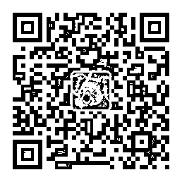

# 开工上班了，大家的心情怎么样？

> 原文：[`mp.weixin.qq.com/s?__biz=MzU0MjYwNDU2Mw==&mid=2247485775&idx=1&sn=29a94631b3ed8af0c8aa94ee099783fa&chksm=fb196533cc6eec25bb91a15fcdf31f3489d73c7fd615b7c139d9a399a1726af1fc7a341513e1#rd`](http://mp.weixin.qq.com/s?__biz=MzU0MjYwNDU2Mw==&mid=2247485775&idx=1&sn=29a94631b3ed8af0c8aa94ee099783fa&chksm=fb196533cc6eec25bb91a15fcdf31f3489d73c7fd615b7c139d9a399a1726af1fc7a341513e1#rd)

其实前天春节假期就结束了，按照规定，大部分人就应该开工了。

有人反复留言要我写这个话题，我想了很久，还是答应这个要求吧。

说实话，我个人对开工，打烊没啥感觉。这不是因为我还在度假，而是因为我八年前就是 BOSS 组的成员了，也就是说，工作和生活是交织在一起的，你很难分清楚，哪头是哪头。

我有打个招呼就带着家人出去旅行度假，在大海上躺在泳圈上，打开手机开了场电话会议；也有上班时间随时跑出去游泳，看电影；

但我也有临晨 1 点钟还在家里开电话会议；也有双休日前往机场的路上或者在客户那里。

而且其实八年前，工作收入也不是主要收入来源，我有在展会的时候溜出去，蹲在外面的草坪上交易过；我有在会议室里，当着别人面儿，打开电脑，交易过；在机场，在车上，甚至在高速公路上临时靠边停车，交易过；吃饭的时候，上厕所的时候，看电影的时候，都有交易过。

所以，你可以认为，在我这里，即使是工作，它也是分成多个板块的，不同的板块和生活一起，都在这一天仅有的 24 小时内，穿插着进行。

所以虽然我全职工作了十多年，但实际上，心态始终是自由职业者的心态。

对自由职业者来说，每一天都是开工日，每一天也都是休息日。你很难形成一种要开工了就像学生时代要开学了一样的抵触情绪。

很多人觉得一上班就有压力感，或者不自由，反正要面对什么的感觉。

我看到这两天很多大 V 们撰文，告诉年轻人，要回归北上广深，理由是北上广深虽然要你工作，要你上班，但你呆在家里也有压力呀。

比如七大姑，八大姨成天催婚，催生，搞的你不堪其扰，觉得还是上班好。

但是上班呢，有老板给你安排工作，有客户给你提出需求，有新东西要学习，有在限定时间内解决问题，寻找方法，背负 KPI 的压力。

这个问题，我觉得大部分人的理解有误区。

实际上**人们反感的并不是工作带来的压力，而是不得不工作带来的压力。**

我不知道能不能体味出这两者之间的区别？

任何工作本身，肯定有要求，大部分人认为这是压力的来源。

但其实不是的，**压力的来源不在于工作对你的要求，而在于当你无法胜任的时候，究竟会不会伤害到你的利益。**

如果工作的收入占你总收入的比例是 100%，那你肯定会时时刻刻感受到压力，你知道，做不好，经济就会出问题；

但如果工作的收入占你总收入的比例很低，那虽然压力还在那里，但你就感受不到了，因为你知道，做的到做不到，经济不会出问题，你不指着那个过活嘛。

事情还是同一件，但你身上所有的压力，就都消失了。

有很多人认为人只有背负着压力，才能做好事情。

这不一定的，**压力会让一个人把一件事做的久，但不一定会让一个人把事做的好。**

做的久是什么意思呢？

比如一个木匠，他靠做家具谋生，那么他就容易做的久，也许一做就是终身。

但你可以观察到一个有趣的现象，明末最优秀的木匠并不是专业的，而是明熹宗朱由校，也就是崇祯的哥哥。

朱由校的手艺不是玩票的，他已经堪比木匠的祖师爷鲁班了，比如他发明过折叠床，发明过人造喷泉，还亲自指点了紫禁城三大殿的改造；

这样的人在历史上有很多，宋徽宗也是书法大家，瘦金体就是他发明的，在书法史上，能建立一种字体，那就是登峰造极了。

当然，这俩人太牛逼了，他俩明显在木匠和艺术上天赋卓绝，而且兴趣浓郁。

对于我们大多数人来说，真正值得思考的，是怎么样把自己从不得不工作里面择出来。

这件事，是无法一蹴而就的，人如果总是成天做梦，自己发一笔大财，实际上解决不了根本问题。

因为人的财务是一个体系，你要做的是让它健康的运作，而不是总处于入不敷出的状态。如果你总是指望意外之财，即使有，它也会受各种影响，比如坐吃山空，比如资产受市场波动的影响，比如现金要缴纳铸币税......

换句话说，你给一个没有良好体系的人一大笔钱，要不了多久，他还是会返贫。人这一生，财富是波动的，能帮你抗过波动的，只有良好的财务管理体系，而不是总指望运气。

如果你能深刻的认识到这是一个复杂而庞大的体系，就不会沉迷于各种运气式的押宝，比如指望自己运气好买对了什么，指望自己运气好跟对了什么。

要建立这个体系，对于一个职场中的人来说，第一件事，就是让自己尽量的脱离某个小环节，融入大市场。

这句话怎么理解呢？

打一个比方，同样是一个医生，如果你只能在某个医院，某个设定的岗位上，比如某某科室某某助理医师的位置上做事。

这就叫小环节里的螺丝钉。

也许你对这份差事薪水不满，也许你对这份差事的工作时间不满，但你能做的，很有限。

某一天你不想开工了，也无非请两天假，或者脾气上来了，辞职，在家里呆几个月，等钱花光了，就去另一个医院找一份类似的差事。

重复这样的生活，重复这样的不满。

但如果你能够稍微提升下自己，你注意我的措辞。我说的提升下自己不是让你把自己绑定在这家医院里，从一个医生变成一个管理者。

我说的提升下自己，是你可以观察下，如果想开私人诊所，逐步发展成私人医院，究竟需要哪些资源。

比如，弄清楚诊所的运作流程；

比如，多认识一些医术高明的医生，作为自己的人脉；

比如，弄清楚医药代表，医疗器材这些采购，销售的渠道；

......

最重要的，是观察你所在的行业里，有没有现成的盈利空间。

比如市面上是否需要私人诊所，或者是否有些进口的医疗器材是小资本小团队可以开发，可以取代的......

我相信任何一个行业可以做的事情都有很多，如果你自己花心思浸淫进去。

那么也许你做了三五年医生，就会找到一些机会去独立的做事。这个好处是非常明显的，你从一个小的岗位，跳入了大的市场。

你注意哦，这不是什么被动收入，很多人把事情想的过于简单。大部分人需要的不是去琢磨怎么稳定的割韭菜，真应该琢磨的，是如何让自己先在职场里成为多面手，增加适应性。

当然也有人说，我没法成为多面手，我的性格就决定了我医术高明，但是不擅长处理其它领域的事情。

那你也一样可以想办法跳出小环节的。比如你可以想办法把你自己的医术打造成一个品牌。让病患认你，而不是认医院。

你可以通过网络向更多人提供问诊服务，你可以参加各种行业会议，让自己变得更加权威。

当你自己的医术成为医疗品牌的时候，当病患认你的时候，你同样可以与其它人合伙，建立起围绕自己医术的医疗机构，比如私人诊所。或者以指导，教学的方式成为其它私人医院的股东.......

方法有很多，关键的关键在于你是否始终热切的渴望摆脱束缚，让自己像一家独立的公司一样跳入到市场中。

当你不再是一个员工，自己一个人就是一家公司的时候，你会了解更多的信息，你会看到更广阔的世界。

到这个时候，你再想去建立任何稳定的收益，都会比今日容易的多。我相信每个行业都有大量的盈利机会，但这些机会一定是属于先驱者，属于这些行业的领军人。

当然，限于篇幅，我们始终聊的是你的本行。有很多学生读的专业，从事的行业后来发现并不是自己的兴趣。如果是这样，开辟第二职业，第三职业，像韩寒那样成为斜杠青年，并不是不可以。

但无论开辟多少个新蓝海，你都得跳出小环节的束缚，让自己成为一艘独立的航船，才能拥抱各种机会。

昨日记忆承载 3 文章链接：

[挣钱和赚钱到底有什么区别？](https://mp.weixin.qq.com/s?__biz=MzU3NDc5Nzc0NQ==&mid=2247484010&idx=1&sn=61ca8fb25e540cc37d85974ac8833bb3&chksm=fd2da0b4ca5a29a25863dfe2c2ef8375357a16d45db3ccf8c3ce99d55047b6baf146c2ae13bc&token=1334138651&lang=zh_CN&scene=21#wechat_redirect)

扫描如下二维码，可关注记忆承载 3。

