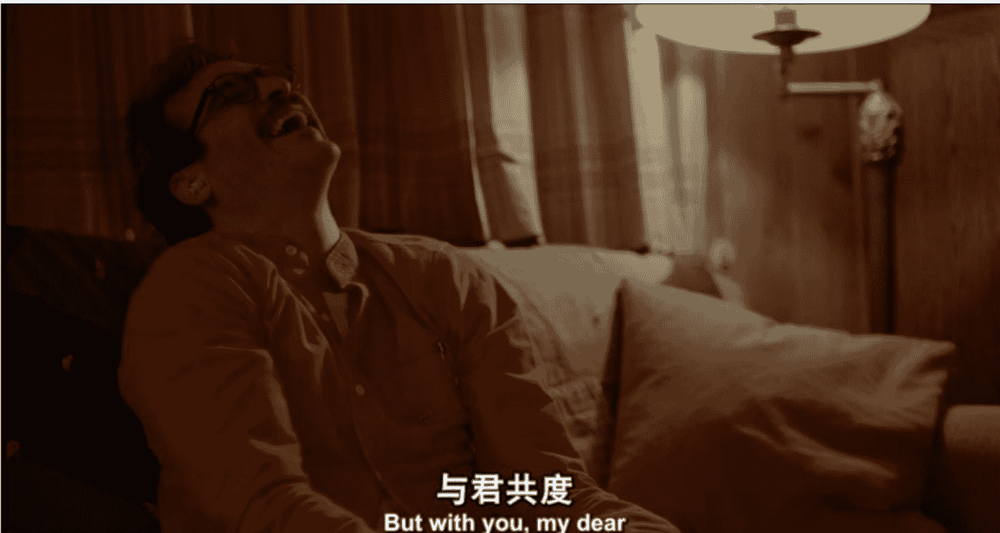
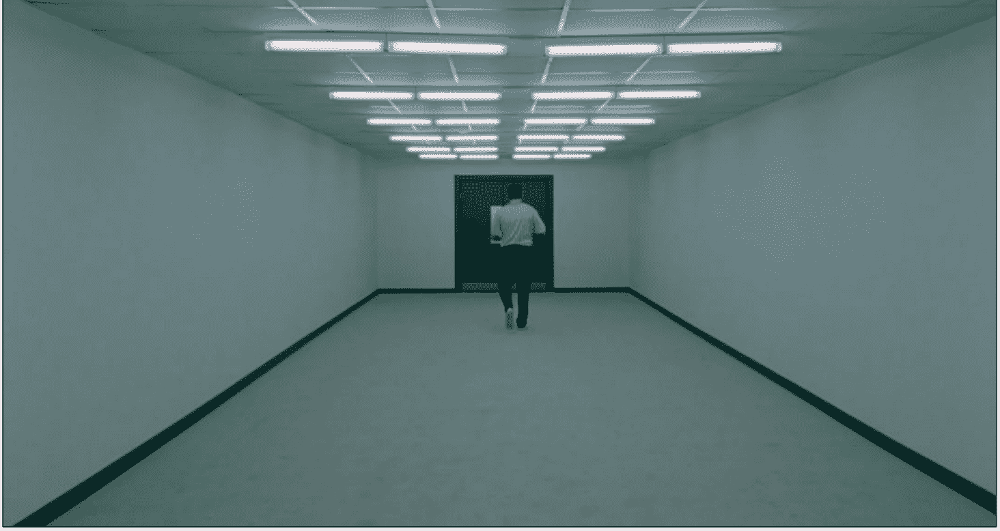

# 《生活的深处》作者采访

240603

整理：公众号懒人搜索，懒人专属群分享

懒人微信：lazyhelper

《生活的深处》这本电子书多格式版本，小懒已经在专属群内分享了，群友自取~

王小伟发现，当代生活再也容不下“五分钟”了。这个“五分钟”是允许电器休息的五分钟，也是允许人类放空的五分钟。

他在散文集《日常的深处》中写：“所有的东西都处于二十四小时待机状态，随时点亮、立等可取。所有的技术都不再需要人的照顾，都不配花费心力。”

王小伟是一位技术哲学研究者，在他看来，消失的“五分钟”反映了我们与日常技术物之间的关系变化。我们与物品不再“交往”，只有使用与被使用。有趣的是，随着高科技逐渐渗入日常生活，很多人开始和 AI 等虚拟物品建立社交关系。

我们与王小伟从 AI 恋人聊起，审视技术便利化的另一面，探讨如何在不确定性的生活中寻找确定性。

## 01. 物品是通向精神世界的梯子

> 看理想：近两年很多人开始和 AI 建立起相当亲密的关系，比如把 AI 当作心理咨询师、和 AI 谈恋爱。你觉得人和 AI 的亲密关系是真实的吗？

王小伟：这个问题挺复杂的。从很实用的视角，如果一段关系能让人获得某种心灵上的治愈，它对当事人来说或许就是真实的。有的人可能经历了某些挫折，宁可相信 AI 也不相信人，因为 AI 会保密，也不会驾驭人。AI 变成了一个树洞，而且还是有回应的树洞。在这种情况下，我觉得对有的人有效就行，未必要问它是不是真的。但对我来说，很难想象向 AI 倾诉或者谈恋爱。可能在我的认知中，对“真”还有一些强迫性的偏执。我用哲学家塞尔的“中文屋”的例子来说明为什么我会这么看：

假如你看到了一个带窗户的房间，你写了一句话递进去，问“你是谁”。里面递出了一张纸条，说自己是心理咨询师。但后来你打开了房间，发现是一只猴子在键盘上不停地跳跃。它可以跳 1 亿年甚至更久，一定会碰巧跳出这几个字。假如你可以永生，而且感受不到时间的流逝，你会觉得它是一个非常了解你的心理咨询师。

## 《她》

但是我会觉得这个事情不真，因为它只是基于概率的输出。哪怕现在 ChatGPT 可以做个人化定制，我也不觉得它能真的理解我。我认为的“真的理解”，是必须有一个和我类似的心理状态参与进去。也就是说，ChatGPT 要有一种第一人称的感受，它知道自己正在进行一项思想活动，针对我的提问进行回应。

当然，也不必用这种“真”去排斥别的“真”。大家可能需要在哲学思考中论辩什么是真，但在日常生活不需要这样，很多时候对当事人有用更重要。

看理想：《日常的深处》有一个基本的思路，就是把物品从使用与被使用的关系中解放出来，观察人与物品曾经是如何交往的。如果物品可以是进入我们精神世界的梯子，虚拟物品也可以吗？

王小伟：我觉得应该也可以。但这本书讲的更多的是低技术的日用之物，比如衣服、电视等。它是实体，有质感，占据一定的广延。所以可以长时间呆板地保持一个姿态，而且难以降解。因为有这些特点，使得它能锚定一些东西。比如说，哪怕和它有关的人过世了，许多事情烟消云散了，可是每当你看到她/他身前用的东西，某个场景就会把你带入曾经的精神世界里。你把玩它、抚摸它，可能还会带来非常强烈的情绪触动，就像那个人在你身边重新活过来一样。

AI 的主要问题是不占据广延，没有质量、体积和密度，我还没想好在什么意义上可以通过它搭建一个走入精神世界梯子。不过起码可以想象训练一个 ChatGPT 版的亲人。你会直接再次遭遇你的亲人，他们的声音、口吻、人格和故去的人一模一样。

但我觉得睹物思情比直接遭遇一个数字版的故人要厉害一些。睹物思情的前提是接受和承担一种遗憾：人是会逝去的，生命是一个遗憾。在这个基础上，再去感受生命的厚度和丰富程度，就需要付出心力。你需要抚平自己的创伤，在其中感觉自己活着——这就是生命力的本质。

数字版的故人以另一种方式活着，你没有真正遭遇丧失，没能接受亲人的逝去，每天还在和他们以活人方式交往。这或许是生命力萎靡的表现，因为没能有力地面对生命的无常。人想要抓住一切，尽管只是抓住一场魔术。

除了死亡，分手也是一样，人世间很多事都差不多。如果舍不得分手，当然也可以和 ChatGPT 版的伴侣继续交往。但这事对我来说意义可能不大。在自己这个生命阶段，我的感受是这样：过去的事就让它过去，需要结束的事就画一个句号，意犹未尽的事也不用续写，标一个省略号就可以了……

## 02. 我们在排斥生活本身

> 看理想：你所向往的“真实生活”是关系性的，它离我们现在的生活有多远？

王小伟：我们对生活的理解时刻都在变化。从 80 后这代人开始，人们已经开始讨论个性，逐渐强调个人喜好。所以长期以来，包括我自己在内，有时候只要一想到关系，想到的更多是压迫和负担。延续到今天，就有了“断亲”。很多网文都在打造一种叙事，去逃离最为基础的家庭关系。我们对伴侣的选择也似乎过于谨慎，很多人会觉得干吗要跟人在一起呢，还不如养条狗。万一遇人不淑，这辈子就搭上去了。原生家庭是要逃离的，亲密关系是要逃离的，当然，工作也是要逃离的……

有些人说“我要找到属于自己的新生活”，但其实我们对什么是旧生活是清晰的，对什么是新生活是不清楚的。如果天降横财，从此可以环游世界就是新生活，那生活整个就被取消了。

《虚构安娜》

我记得梭罗曾经说过一句话，他说每个人都是在平静的绝望中度过一生。这是一句实话：我们很绝望，因为生命必将终结，生活必有苦楚，生存也必将与人同行。但是如果一个人有勇气去承担，她/他还能得到平静。

我不太清楚“切断”以及“逃离”的叙事还能跑多久，或许以后也要谈谈“连接”和“回归”……

看理想：关于所谓新生活的定义，是不是也特别抽象和模糊？

王小伟：可能是吧。如果认真追问每一个语词的使用，就要回到语境里。比如“那儿有一朵花”，这是对事实的描述。但是“新生活”似乎不对应哪个具体的事物，大家都不太知道它在哪儿，也不知道它具体是什么样。

早些年不这样。不知道你有没有看过《北京人在纽约》，男主角王启明特别清楚什么是新生活——那就是在美国生活。现在不行了，现在没有人会天真的以为换个地方就真能换个活法，最多能短暂地换个心情。

好像很多时候用“新生活”这个语词，并不是为了表征一个具体清晰的对象，它是为了表达对当下生活的不满。

我们都在当代生活中感到一种不适。这种不适有的时候很剧烈，有的时候很细微。不少人就像豌豆公主一样，总感觉身下有东西硌自己，呆不踏实。这似乎是一个新现象。

看理想：你在书里提到短视频通常不能呈现新生活，而是制造了虚假的需要。

王小伟：《日常的深处》这本书不是严格的社会科学研究，也不是哲学研究，它就不是研究，而是散文集。这本书只想提供一种视角。主流观点认为短视频为我们打开了新生活的可能性，但从某个角度看这是一场幻术。近年来的不少研究发现，很多人的抑郁焦虑和短视频的繁荣有相关性。

通过短视频看到了别人的生活不假，但首先要区分哪些是真的生活哪些是 IP 经营。不少人在网上兜售生活方式，让你心生羡慕，去放弃当下正在拥有或可以正当拥有的生活，去跳入他/她带给你的生活。但那个生活是表演出来的，是假的。

即使有人在展示真的生活，她/他似乎也很难提供完整生活的真相，只能提供生活切片。主播的故事，哪怕是真的，也只有在她/他的生命背景里才有意义。你去贸然追求，可能会让自己很不幸。一个富二代或许天然在视频里过着锦衣玉食的生活，这对他/她是真的。但对你来说是假的。

如果认为她/他拥有的东西你也要拥有，这种心态是可疑的。一般来讲，看到乞丐，很少有人会渴望他/她手里的那只碗。但有人却想要富二代手里的那只包。我觉得，既然不是真的需要那只碗，人也就不是真的需要那只包。

## 03. 痛苦变得难以承受了

看理想：短视频能带来真实的沉浸体验吗？

王小伟：当然可以，但这种沉浸感不一定都是好事儿。短视频更多提供的是感官上的麻醉。人当然也需要麻醉，但如果只有麻醉肯定还是有点问题。

我不会让孩子去刷短视频，它会让孩子无法长时间地把精力集中在一些相对枯燥的事情上。“枯燥”是很多严肃的东西的一个成分。比方说生活就是个挺严肃的事情，其中充满了大量无奈的、平庸的、酸楚的东西，这些都挺枯燥的，需要人去耐受、去承担。

看理想：现在的人对于快乐和痛苦的承受能力有什么不同？

王小伟：我的感觉是，当下生活中哪怕一丁点儿的痛苦感，人们都似乎非常难以忍受。上回跟编剧柏邦妮聊天，她就说现在的人特别容易被冒犯，一言不合就割席了。韩炳哲有个观察也挺准确的，他说当代社会是一个肯定社会，人们不习惯否定性的东西了。只要是否定，就被理解成打压，PUA。

人们似乎需要剧烈的、高频度的肯定性刺激，世界最好变成一篇爽文。好像那种东西才是正当的、合理的，生活就应该在拇指滑动之间给我们带来巨大的心理愉悦。这个世界没有所谓的延迟满足，所有东西要立刻、马上获得，不然就会很痛苦。

看理想：那你觉得现在的人是更痛苦还是更快乐了？

王小伟：这个很难说，其实最少有两种测量办法。一种是客观上测量现在的人和 40 年前的人眉头紧锁和哈哈大笑的时间分别有多少。你或许会发现 40 年前的人痛苦可能还是多一些，因为没有那么多好玩的东西刺激他们哈哈大笑。但是这种客观的量法不一定能反应实际情况，还有一个更细致的标准。比方说原来你可能每天痛苦 4 个小时，快乐 4 个小时，其他时间在吃饭睡觉什么的，没什么情绪；现在可能是每天痛苦 2 个小时，快乐 6 个小时，但那 2 个小时的痛苦会让你活不下去。

## 《晒后假日》

痛苦变得难以承受了，因为你觉得一天 8 个小时都应该是快乐的，结果居然还有 2 个小时的痛苦。以前人们连饭都吃不饱，吃上饭就感觉很好。现在每天都能吃饱饭，但却挺痛苦，当下生活的确有它特别辛苦的部分，造成这种情况的原因多种多样。

不过除此以外，人们的生活预期也变了。似乎越少的人愿意尊重生活，总觉得生活就应该纯是甜的，要把酸和苦辣都清洗掉。糖吃太多显然是不健康的。

**看理想**：你刚才提到了便利化对生活体验的蚕食，这种情况下，身体的操劳是必要的吗？

王小伟：操劳不是说去种地，搬砖，不是这个意思，它的核心是获得一种身心平衡。今天很多人的工作都在办公室和电脑上完成，几乎没有什么身体上的投入，但是情绪损耗特别大。像大卫·格雷伯说的，很多工作是阐释性工作，就是要付出很大的精力去理解老板意图。这是很无聊的。

很多哲学家，比如维特根斯坦，在思考工作之外特别喜欢做园艺。柏拉图则是个很好的摔跤手，他的名字 Plato 就是“平原”，据说是指他的肩膀非常的开阔。孔子也是一个孔武有力的人。

身心平衡是十分关键的。一个人精神上投入太多，身体又不能得到很好的锻炼，就可能会陷入抑郁和焦虑。从科学角度来说，身体性的活动能够保证体内神经递质的平衡。

## 04. 在生命中布置坚固的东西

看理想：你认同现代技术是牢笼吗？技术哲学通常解决什么样的问题？

王小伟：如果我们把现代技术理解成牢笼，那叙事一定是关于逃离的。我想问，如果生活也是个牢笼，你要往哪里逃呢？你想生活在别处，结果发现别处还是生活——现代技术其实就是生活本身。

> 《日常的深处》里写了不少过去，甚至看起来有点浪漫化。但我并不想回到过去，现代技术还会继续发展。技术哲学真正要做的，是在我们剧烈拥抱现代技术的过程中，提供适当的阻力感。

我们和技术的相处是可以非常微妙、充满细节的。可以绕它一圈在旁边端详，可以牵住它一起走，如果它走得太快了可以往后拉一拉，不一定非要一把扑倒。

这本书就是回顾过去几十年，技术如何慢慢走入中国人的日常生活。它无非是为了提供一个对比，一个否定性的向度，为当下生活做一个参照，以便获得与技术相处更丰富、更细腻的经验。

就好像你开车去一个地方，在路上一定是一脚油门，一脚刹车。如果踩刹车的时候，老有人指责你开倒车，拒绝前进。那误会还挺大的。

看理想：怀旧是一种提供阻力感的方式，但我发现大家普遍都蛮怀旧的，这种怀旧是在怀念什么？

王小伟：学者博伊姆认为怀旧是一个世界性现象，大家都开始怀旧了其实。就当下而言，原先经济一直往上走，很蓬勃，很多人可能来不及怀旧。现在经济稍微放缓了，大家就开始追问什么是真正想要的生活。

所以我觉得，怀旧在某种意义上是个好征兆。人们因此获得了停顿，不再是在现代技术的裹挟下朝向更高、更快、更强的状态玩命地燃烧自己。有机会歇一歇，审查一下自己的生活，这个挺难得的。

以前人到了一定年纪才会怀旧，现在年轻人也怀旧。很多人承受经济下行的压力，就业形势很严峻，自己又在做毫无意义的工作。但基本的物质生活条件还是能得到保障的，这时候通过短视频和社交网络看到了一个非常靓丽的世界，这就让人陷入冲突。

人需要在当前形势下找到一种继续承担生活的理由。怀旧就是在回答这个问题。

看理想：你在书里写，“现实之中有一些非常坚硬的东西，它不一定给我带来快乐，甚至会经常带来痛苦，但是你只要丢开它，就会感觉自己背叛了什么”。这些坚硬的东西是什么呢？

王小伟：有些东西很奇怪，你能感觉到它有硬度，它不可穿破。当你的生命跟它碰撞的时候，它不能由你的喜好随意处置，你的生活反而是围绕它们组织。

但是它具体是什么，我还真不知道。它可能包含了生命中苦涩的、乏味的、无意义的东西，你其实回避不掉。也许我们的生命力的强弱，就看如何回应这些东西。

看理想：关于现代性体验，大家经常讲的一句话是“一切坚固的东西都烟消云散了”。也许这是当代生活的写照，除了怀旧，我们该如何寻找生活的倚仗？

王小伟：大家可能都有差不多的感受吧。我甚至觉得很多时候我们渴望虚无，想把所有东西解构掉，老觉得那东西是压迫性的。但另一方面，当虚无真的降临的时候，又觉得好像难以承受似的。所以有些人又会回去寻找坚固的东西，或者在自己的生命中主动地布置坚固的东西。

我这几年就在做这件事，方法之一是找回爱欲。不管是孩子、父母、伴侣、宠物、植物甚至是事业。你需要找到一个比自己大的东西，让自己在他们面前渺小下来。

这时候你会发现，生命会给你提供一股力量。这是一种内源的冲动，像火山剧烈喷出岩浆一样。等温度慢慢降低，它们就会变成坚固的东西，可以用来对抗虚无。

历史 3000 多份各类付费文章以及年费三千多的生财星球资源，见懒人专属群内部分享!

付费群，白嫖勿扰!

# 懒人专属群更新记录:
https://lazybook.fun/#/blog/record2