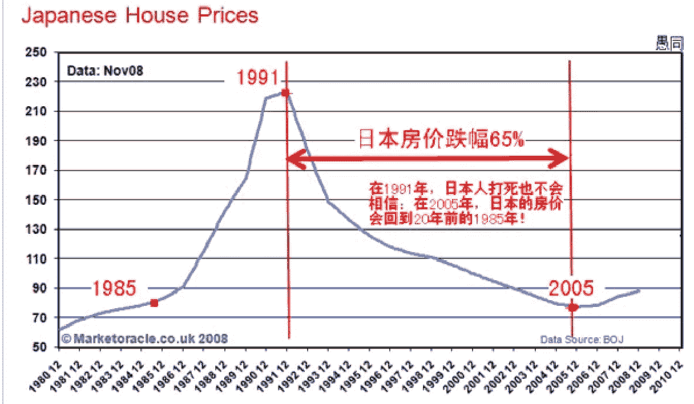
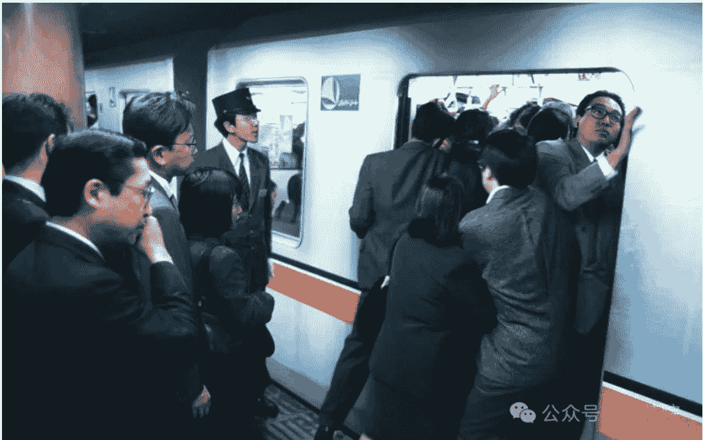
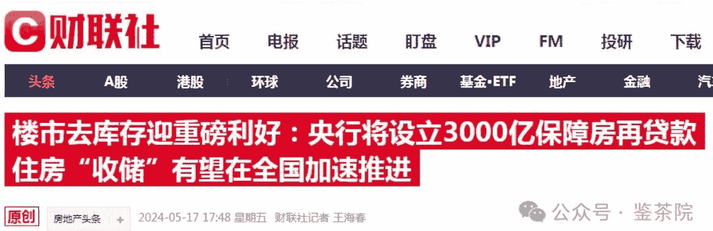
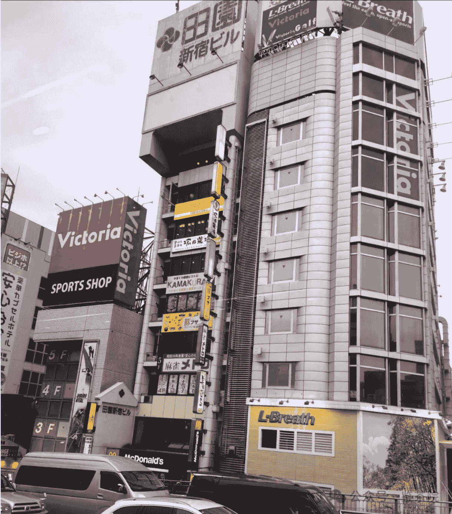
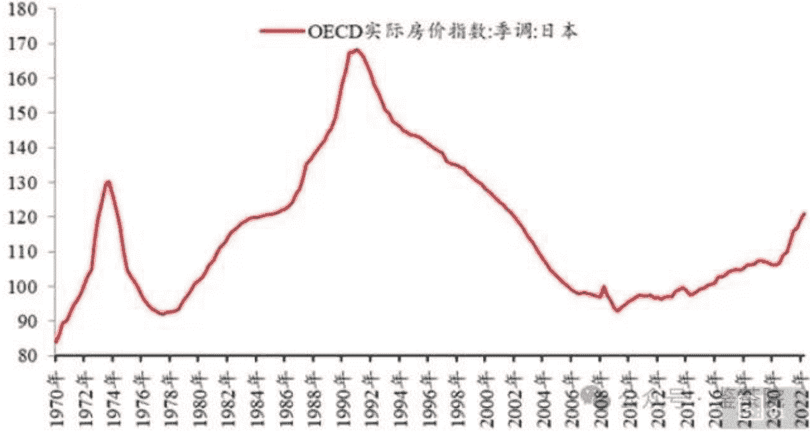
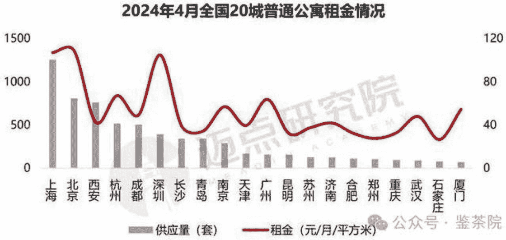
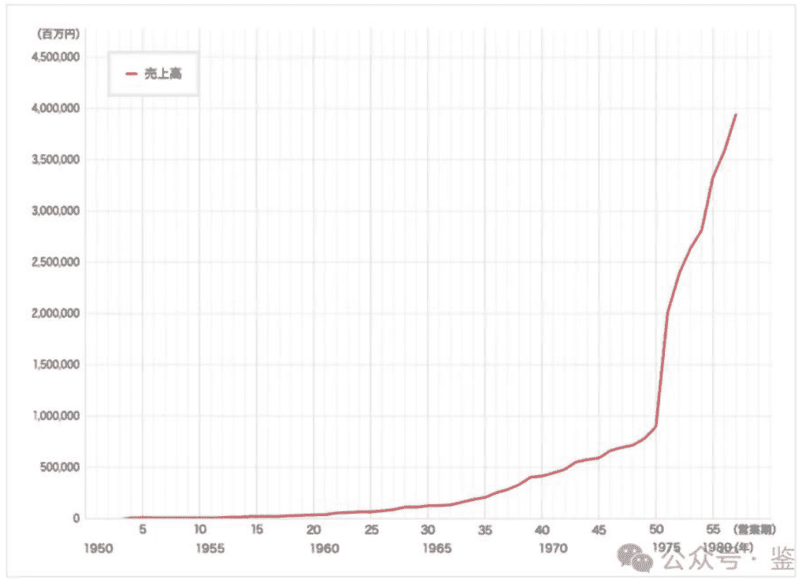

# 日本失去的30年和中国的大救市

已付费

原创 南苑大王 鉴茶院 2024-05-23 04:53 日本

## 01

朋友，当你在一条道路上走过时，你没有想过，这条路上曾经有很多人走过，他们和你有过一样的喜怒哀乐，他们的明天，是我们很多人要走的路，他们的故事，充满了对我们的借鉴。

克罗齐曾经说，一切历史都是当代史。

如果你想知道历经高速发展后，转型换挡期的经济和生活是什么样子，日本是最好的老师，它曾经高速发展，烈火烹油。1955年后，日本打出“贸易立国”的旗号，快速成为世界工厂，出口年均增长率达到了惊人的16.9%，小商品横扫全球，GDP年均增长9.8%，中小企业大量兴起，无数年轻人进城落户，买车买房。

随着央行的放水和“永远涨”的预期，日本的资产价格一路飙升，仅1985年到1991年的6年间，东京、大阪等六大城市的房价平均增长了300%，人们的身价也水涨船高，本子在世界各地狂买奢侈品，人均库里南。

# 公众号懒人搜索，懒人专属群分享

然而好景不长，随着广场协议的签署、日元的被迫升值、新一轮科技革命被美国刻意甩下，日本陷入了痛苦的去杠杆和去过剩的过程。1991年以后，仿佛是一夜之间，日本的资产泡沫就破灭了，那些曾经非常值钱的各种奢侈品收藏品无人问津，房产和股票一路暴跌，无数人还不起债务破产和变成老赖，企业不再扩产，转向一心还债，居民工作困难，只能用力攒钱。

“不景气”这三个字，贯穿了日本过去的30年，让很多人被迫选择了“不拥有”和“低欲望”的生活，在起伏的国运和喧嚣中耗尽了最精华的一生。从比较经济学的角度，如果你把今天的东方某大国和日本做一个比较，会发现与它的1990年代略有相似之处。

公众号懒人搜索，懒人专属群分享

日本曾经有持续了40年的高速发展，东大也有过40年的GDP增长7%以上；
日本因为广场协议的被美国刻意打压外贸，东大也面临校园高墙的风险；
日本的资产房产价格历经了惨烈的回归，东大在P2P、恒大之后，也历经了痛苦的去杠杆；
日本的老龄化饱受诟病，东大的人口生育率也大幅下降；
日本的GDP曾达到美国的72%，东大曾达到美国的77%；
日本在安倍时期，进行了扒开水库的大救市，甚至搞出了0利率，而东大，在上周末，刚刚出台了堪称建国以来最大的一轮刺激计划。

3000亿元的再贷款、7倍杠杆的房贷、低至2.85%的利率、国家队和地方平台公司亲自下场充当买家...

那么，东方某大国的刺激能不能起效，会不会步日本的后尘，普通人应该怎么办？对房产、股票、职业选择、创业发展上来说，如何才能够选择K型上沿的趋势和方向，而不是成为紧缩和去杠杆的牺牲品呢？

这篇文章，是大王团队经过多年研究考察后，在日本东京完稿，对我们和个人投资，财富管理，股票配置、房产布局、个人发展等方面进行深度解读建议。

公众号懒人搜索，懒人专属群分享

文章的一些观点会比较冷静、深刻甚至颠覆，它是基础底线的察于未萌，提前布局，迎接不确定性中的确定性。

没有布局未来5-10年的耐心的、觉得我们真不一样可以人为影响规律的、自觉得“岁月静好”和“可以永远赢下去的”一提欧美日就嗤之以鼻的，请不要购买本文，这是一篇不带情绪的成熟思维作品。

## 03

然后谈股票和投资。

日本的地产在1991年之前非常好，只要是涨的，人们就有预期。但一旦预期没了，价格就如海边的沙堡。

1992年，日本六大主要城市地价下跌了15.5%，当时人们认为只是开始，但当等到2000年，回头发现跌幅达到55%。而日本的全国平均房价跌了多久呢？从1992年一路下跌至2009年，下跌周期整整持续了18年，全国的跌幅为43.6%，核心圈东京的价格跌去了55%。

几十年后，经过日本无限量开动QE救市和人们辛苦还债之后，日本的房价才重新涨回了1989年的水平。然而，所谓的涨只针对东京、大阪等少数核心城市，绝大多数日本地级市和县城级别的地区，房价仿佛永远锁死，价格在那边挂着，但是无人问津，你可以说这个房子值得1000万日元，但也可以说不值钱。

大城市能涨回来，小城市涨不回来。

## 日本房地产泡沫破灭后，房价至今尚未恢复

原因很简单，小城市原本就是依靠大城市的溢出效应而活着的，当机会非常有限后，年轻人只能去大城市才能实现梦想。

房地产，价格反应的是稀缺资源对人的吸引，短期看货币，中期看政策，长期看人口。所以对东大来说，

- 1，北上广深等一线的房产依然是投资机会，他们的具体体现是跌的慢，涨的快，率先走出盘整期。
- 2，如果去不了一线城市，那么本省的可选择范围就是强省会或者区域中心城市。

强省会可以理解，比如辽宁最差也要去沈阳，区域中心城市呢？你在甘肃，不要去兰州，努力一下去西北五省的核心西安。

- 3，在产品选择上，一定要避免刚需型产品，而且是那种小区定位不高、业主质量不高、容积率太高，比如大于2.5的小区。

所有上述城市可以选择的产品最好是两种，一种是改善户型，最少不能低于120平米，中产阶级社区往上，产品的设计者真正考虑到了功能和人居的需求，是真正的房子，而不是建筑。另一种是公寓类产品，很多地方的酒店公寓类产品的房租已经达到4%左右，25年回本的产品算是优质，但要注意使用年限，酒店公寓之外，有房产投资眼光的可以去看当地的老破小，装修改造之后用来出租。

日本、韩国和全世界的经验是，在资产波动周期的大城市，房价是跌的，但房租是持续上涨的，很多购买人群被迫选择租房。

房地产整体的选择公式是1+1+1。第一个1，是全国一线城市，他们即将全面放开限购；第二个1，是你省最大的一个省会城市，或者强地级市（如山东的青岛、江苏的苏州、福建的厦门、浙江的宁波）；第三个1，是这个城市财政实力最强的一个区，房地产“地段”在经济学的语境，是“每亩地投资强度”，房产价格最终靠政府可以持续投入公建配套、公共服务来维持价格。

如果你手中除了自住，还有刚需，那么，在今年房产反弹的周期中，反而是出手的时机。

公众号懒人搜索，懒人专属群分享

有条件的，甚至可以将自住“以旧换新”，腾挪往更高段位的区域和产品。

## 已有超50城宣布！加大住房“以旧换新”推广力度

中国青年网 2024-05-15 16:26 公众号·鉴茶院

而你如果是刚需就另当别论，在哪里上车都是应该的。但请注意，房产投资和购买的一个必要原则是不要硬上，现金流至关重要，做出动作要考虑，如果家庭收入来源断绝，储备能否保证5年内的开支，且不影响现有生活质量？

## 04

然后我们谈到股票。

在中国高速发展的时期，房地产提供了一个100万亿左右的蓄水池。既然要转型升级到产业，那么下一个选择的方向，只有80万亿的股市，别无选择。无论三年五年，这个工具必然被拿出来。

1989年底，日本的股市见顶，在泡沫破灭以后，此前与经济高速增长密切相关的周期、金融板块开始淡出视野，取而代之的是消费、医疗、科技等经济转型方向。这些领域冒出了一大批牛股。它们在过去的30年中，即便在最难的2014到2022年，表现依然出色：

| 医药 | 涨跌% | 同期日经 225 涨跌幅% |
| :--- | :--- | :--- |
| 泰尔茂株式会社 | 75.54 | |
| 大日本住友制药 | 61.20 | |
| 卫材株式会社 | 60.89 | |
| 协和麒麟株式会社 | 46.28 | |
| 安斯泰来制药株式会社 | 43.97 | -10.04 |
| 第一制药 | 31.23 | |
| 武田药品工业 | 19.13 | |

1，日本低速增长后，应酬和交际大幅度减少，可选消费的酒类在1996年见顶，取而代之的，是酸奶、饮料等功能性饮品。这个趋势在东大同样适用，激进的投资者，可以卖出所有含有白酒的股票和基金了，如果只买一个，那就是茅台。

## 日本酒水消费量于1996年见顶

2，必选消费是人类必须，但因经济萎靡，客单价严重下降，中小竞争者因为实力不足纷纷退出该领域，衣食住行等领域反而出现了寡头垄断的趋势，如7-Eleven、永旺、花王、优衣库等。中国的优衣库是谁？目前在A股就是海澜之家，在海外是拼多多。

3，截止2023年，日本60岁以上的老年人占总人口的比例已经达到了34%，而新生儿数量连续17年低于死亡人数。而东大在2023年末，60岁及以上人口超2.9亿人，占比达到了21.1%。从全世界的角度来看，一旦老龄化开始，它就会加速，一旦生育率降低，它就会持续降低。

60岁以上的老人虽然退休但远未进入“失能”时期，保健和维持状态就成了必须，日本在这方面的超级牛股是第一三共、武田药品、日本卫材等，汉方药品做到了全球第一。

公众号懒人搜索，懒人专属群分享

而中国特色的保健产品就是中药，几年前的传统是男性补肾，女性补血，这两个方面的对照是广誉远和东阿阿胶。

4，在国内严重内卷和被美国封堵的情况下，日本企业被迫从1990年代大面积出海，到2017年，日本海外资产超过1000万亿日元，连续27年世界第一。中国企业出海的趋势也是必然的，2024年是“出海元年”，软件专门有一个板块是“同花顺出海50”。我们目前看好的以宇通为代表的客车，以及是财经院谈的电摩。请注意，目前出海板块正在高位，处于调整之中，观望20%左右的调整后再入手也不迟。

5，日本卷到极致，最终是高科技企业脱颖而出。日本的优势是信息技术和汽车，那些最终涨上来的是罗姆半导体、村田制造所、基恩士、丰田等，自己本来就有基础的产业，虽然经历美国打压和市场波动，但最终还是靠技术、人才和规模优势站住了脚。对东大来说，目前最优势的领域是新能源，在发力的领域是人工智能。新能源的代表是宁德时代，人工智能方面真正有些技术和自主产权的，是中科院的头牌上市企业。

6，贸易和制造立国，意味着必须“集中力量办大事”，日本一样干预市场，各种资源和财政给了那些垄断企业巨量优惠和补贴，代表就是伊藤忠、丸红等，也即巴菲特早就建仓的日本五大商社。东大的代表作，是坐地收钱但确有技术含量的中国移动、另一个高利润但需要波动操作的副部级能源企业的详细分析在星球。

综上，结合未来5-10年的趋势，我们布局出了大致的标的池：

- 消费降级（海澜之家、拼多多，备选略）
- 人口老龄化（东阿阿胶、广誉远）
- 出海外卷（宇通客车，备选略）
- 高新技术（宁德时代、中科院头牌，备选略）
- 巨头企业（中国移动，备选略）
- 奶头乐（略）

通过较长的时间3-5年慢慢买入，建仓这些标的，每6个月左右调整仓位和配比，基本能应付较长时间的各种冲击和波动，这些同时覆盖了K型分化的上沿和下沿。

# 公众号懒人搜索,懒人专属群分享

而建仓的时间，5月25号以后将迎来一轮调整期，可以慢慢看。我们并不建议大家在高点买入，也不建议一把梭哈式的一劳永逸，而要学会分批次分波段或者定投的方式。比如，每次只买入10%，分5-N次在1年/半年内分批买入。

这些长期趋势股一样存在波动震荡，一般来说，你有20%的收益左右就应该卖出止盈然后再看机会了。根据有关要求，我们必须声明，上述的股票并不形成最终的购买建议，我们并不建议没有任何股市经验的人上来就大笔买股，可以先进星球学习，未来几十年有的是机会，不要在乎一城一地的得失。上述文章更像一个思路和示范，告诉大家总体的架构和思维模型，无论是你的投资，配置，个人发展，应该向这个方向深化。

消费降级一个赛道，自主创新/出海一个赛道，医疗保健一个赛道，公共服务一个赛道。在每个领域择龙头而从之，根据现实不断替换，趋势不会错过。

当然，如果你是短期型选手又喜欢操作的，那不能错过这段时间中式MMT、大救市和资产修复的机会。我们要在五一后多次讲过的地产，地方城投的预期差，正在不断兑现，还将要兑现。

2024/5/16 12:16
大王点过的票在哪里可以看到呢
100课程大法师回复：A股明天要大涨了大国博弈并不放...这里就有，后来的几次在跟同学们的评论区
2024/5/16 13:14 江苏
回复1：我就是评论区看到的今天收获30%+的收益，清仓了
2024/5/16 19:23 江苏
回复：三亿新市民和合格贷款人
2024/5/17 15:33 北京
公众号·鉴茶院

因为这些风格切换太快，变化瞬息万变，包括那些略去的部分，因为需要更多波段操作和逻辑，想要搞弹性的只能去星球中了解。愿意为智慧付费的，一定是这个时代最为敏锐和具备先锋精神的人群，对我们来说，洞悉未来比立刻买什么重要，成竹在胸比计较一时一地的得失重要。

鉴茶财经院
微信扫码加入星球
知识星球

公众号·鉴茶院
公众号懒人搜索，懒人专属群分享

对比日本如今的金领富豪和所谓“社畜”阶层，我们不难看出，在过去30年未受影响反而脱颖而出的，都是具备技术含量或者稀缺的产业。对我们来说，要积极靠拢的就是这方面的产业、公司、人脉。而他们一言蔽之，就是“新质生产力”，到2025年，我国战略性新兴行业占GDP比重将上升至17%，2030年，整个新质生产力将占到30%。

## 加速形成新质生产力

| 发展战略性新兴产业 | | 积极培育未来产业 | |
| :--- | :--- | :--- | :--- |
| 新一代信息技术产业 | 新材料产业 | 6G网络 | 可控核聚变 |
| 高端装备制造产业 | 生物产业 | 类脑智能 | 量子信息 |
| 新能源汽车产业 | 新能源产业 | 基因技术 | 深海空天开发 |

如果是考大学、找工作，就在上述的表格里，找行业龙头的企业，去数一数二的公司，将来一个中产的身价的是有的。

有些人可能还会说，没技术，跟他们不搭边啊，公司的组成都是人，他们也要吃饭，也要团建，也要买A4纸办公用品，总之，只要搭上关系，有的是空间和未来。你看看丰田的走势就知道，它和它的供应商，在过去30年是得到还是失去呢？

## 丰田近30年的销售数量轨迹

前段时间看到一段话，我仍在自己的生活中生活，干必需的活，赚必需的钱。生活平静繁忙。但是我知道这平静和这繁忙之中深深忍抑着什么。每当我平静地穿针引线时，每当我不厌其烦地和顾客讨价还价，为一毛钱和对方争吵半天时，会有那么一下子也突然惊觉，我这样的身体里是有舞蹈的；每当我熬到深夜，活还远远没有干完，疲倦得手指头都不听使唤了，瞌睡得恨不得在上下眼皮之间撑一根火柴棍时......我也会惊觉，这样的身体里是有舞蹈的呀！我想要在每一分钟里都展开四肢，都进入音乐之中——这样的身体，不是为着疲惫、为着衰老、为着躲藏的呀！这正是最近流行的李娟《我的阿勒泰》。

美好的世界是什么呢？

作者说，“每一个的眼睛都是温暖的，是新鲜喜悦的”。

我们过去几十年受到的教育，要出人头地，要呼风唤雨，在经济上行的周期还用武之地，而当增速放缓，回归常态，人们的生活必然要从“物质富足”走向“精神富足”。

真正的富足是什么？

用自己喜欢的方式过完一生。

我们的财经院就是这个样子，除了股票、经济、创业、管理的拿手曲目，我们更有命理、国学、教育、人性的各种解读和探讨，是我们发现更好自我的智慧后方和资源人脉圈层。3000多名高质量和高能量人士组成的圈子吸引你来。

鉴茶财经院
微信扫码加入星球
知识星球

公众号懒人搜索，懒人专属群分享

1959年4月20日，泗洋发生风暴事故，国务院副总理李先念就救援工作给教员做了报告，教员引用刘禹锡的诗作了批复## 诗词与寄语
沉舟侧畔千帆过，病树前头万木春。
今日听君歌一曲，暂凭杯酒长精神。

悲观者正确，乐观者成功，与诸君共勉！

11 人付费
鉴茶院

## 分享此内容的人还喜欢
- 你们都不信的时候，我们讲大国牛缓缓走来
- 我们现在相当于日本哪个年代?
- 郭有才爆火10天，畸形流量反噬开始了

## 留言区（21条留言）
- **博雅13419**（山东，10小时前）
  醍醐灌顶
  取势明道！🌹

- **王珝颖**（山东，14小时前）
  非常开心自己是3000人中的一员。跟随大王几年了，个中收获只有入局方识妙味

- 🔝 **杨 Silent mode**（广西，15小时前）[置顶] [作者赞过]
  在坠落的时代，抓住向上的热气球。
  在千帆逆流的水面上，扬起一面迎风帆。
  15

- **农民工**（四川，17小时前）
  必须第一时间支持，感恩大王
  18

- **金钢**（陕西，15小时前）
  在路上了
  16

- **鉴茶院**（作者，15小时前）
  不可说，不可说
  14

- **leo**（新疆，13小时前）
  在新疆伊犁看到此文，更加坚定决心卷出中亚！
  13

- **鉴茶院**（作者，13小时前）
  汉家儿郎出西域
  13

- **阿荣 ~ Mannis香港韩国物流**（中国香港，15小时前）
  这篇文章太值了！未来的代码院长都毫无保留，直接倾囊而出
  12
  - **鉴茶院**（作者，15小时前）
    现在韩国的业务也开起来了啊
    [作者赞过]
    回复鉴茶院：相当可以，给你上个墙，有需要香港韩国物流的找阿荣，人品保证
    11
    1条回复

- **骑牛侠客**（广东，13小时前）
  大王出品，必是精品
  11 [作者赞过]
  - **鉴茶院**（作者，13小时前）
    一路有你
    7

- **冰糖葫芦**（河北，16小时前）
  锂电回收有没有前景？
  11
  - **鉴茶院**（作者，15小时前）
    有龙头企业资源的话，实业可以做，上市公司不是缺乏前排。
    11

- **禾急**（陕西，13小时前）
  九运离火年，吃饱喝足了，我们心理咨询跟上了
  8

- **好运(郝克明)**（北京，15小时前）
  坚决支持，已购买
  8
  - **鉴茶院**（作者，14小时前）
    一路有你，物超所值
    8

- **柳磊**（重庆，4小时前）
  白嫖几年了第一次付费购买，感谢指导。
  中年创业失败负债累累正在找新方向重新开始，望自己早日通过奋斗成为会员！
  - **鉴茶院**（作者，4小时前）
    男人可以被打败但不能被征服，心若在梦就在，加油！
    [作者赞过]